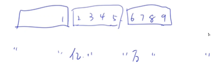

<!-- @import "[TOC]" {cmd="toc" depthFrom=3 depthTo=3 orderedList=false} -->

<!-- code_chunk_output -->

- [它们是否相等 1060 Are They Equal (25 point(s))](#它们是否相等-1060-are-they-equal-25-points)
- [科学计数法 1073 Scientific Notation (20 point(s))](#科学计数法-1073-scientific-notation-20-points)
- [Kuchiguse 1077 Kuchiguse (20 point(s))](#kuchiguse-1077-kuchiguse-20-points)
- [中文读数字 1082 Read Number in Chinese (25 point(s))](#中文读数字-1082-read-number-in-chinese-25-points)

<!-- /code_chunk_output -->

### 它们是否相等 1060 Are They Equal (25 point(s))

如果机器只能保存 $3$ 个有效数字，则将浮点数 $12300$ 和 $12358.9$ 视为相等（多余位数直接舍弃，不进行四舍五入），因为它们都保存为 $0.123 × 10^5$。

<p>现在给定一个机器能够保存的有效数字位数，以及两个浮点数，请你判断两个数在该机器上是否相等。</p>

<p><strong>注意</strong>：</p>

- 数字不一定标准，可能有前导 $0$。
- 如果数值是0，则指数规定为0。

<h4>输入格式</h4>

共一行，包含三个数 $N,A,B$，分别表示有效位数，以及两个用来比较的浮点数。

<h4>输出格式</h4>

共一行，如果两个数相等，则先输出 <code>YES</code>，然后输出它们共同的保存方法，格式为 <code>0.d[1]...d[N]*10^k</code>（<code>d[1]</code> > 0，除非数字为 $0$）。

<p>如果两个数不相等，则先输出 <code>NO</code>，然后分别输出两个数的保存方法，格式同上。</p>

<h4>数据范围</h4>

- $1 \le N < 100$,
- $A$ 和 $B$ 都不大于 $10^{100}$，且总位数不超过 $100$。

<h4>输入样例1：</h4>

<pre><code>
3 12300 12358.9
</code></pre>

<h4>输出样例1：</h4>

<pre><code>
YES 0.123*10^5
</code></pre>

<h4>输入样例2：</h4>

<pre><code>
3 120 128
</code></pre>

<h4>输出样例2：</h4>

<pre><code>
NO 0.120*10^3 0.128*10^3
</code></pre>

#### 1060 Are They Equal (25 point(s))
If a machine can save only 3 significant digits, the float numbers 12300 and 12358.9 are considered equal since they are both saved as $0.123×10^5$ with simple chopping. Now given the number of significant digits on a machine and two float numbers, you are supposed to tell if they are treated equal in that machine.

#### Input Specification:
Each input file contains one test case which gives three numbers N, A and B, where N (<100) is the number of significant digits, and A and B are the two float numbers to be compared. Each float number is non-negative, no greater than $10^{100}$, and that its total digit number is less than 100.

#### Output Specification:
For each test case, print in a line YES if the two numbers are treated equal, and then the number in the standard form `0.d[1]...d[N]*10^k` (`d[1]>0` unless the number is 0); or NO if they are not treated equal, and then the two numbers in their standard form. All the terms must be separated by a space, with no extra space at the end of a line.

Note: Simple chopping is assumed without rounding.

```cpp
// 确定 k
// 将小数点移到最前面
// 移除前导 0 ，右移小数点则 k --
// 将有效数字补足 n 位
#include <iostream>
#include <cstring>

using namespace std;

string change(string a, int n)
{
    int k = a.find(".");  // string find
    if (k == -1) a += '.', k = a.find(".");  // 没有 . 则加上 .

    string s = a.substr(0, k) + a.substr(k + 1);  // 移到了最前面（此时相当于没有小数点）
    while (s.size() && s[0] == '0') s = s.substr(1), k -- ;  // 移除了前导 0 （k --）

    if (s.empty()) k = 0;
    if (s.size() > n) s = s.substr(0, n);
    else s += string(n - s.size(), '0');  // 用 0 补足 n 位

    return "0." + s + "*10^" + to_string(k);
}

int main()
{
    int n;
    string a, b;
    cin >> n >> a >> b;

    a = change(a, n);
    b = change(b, n);

    if (a == b) cout << "YES " << a << endl;
    else cout << "NO " << a << ' ' << b << endl;

    return 0;
}
```

### 科学计数法 1073 Scientific Notation (20 point(s))

<p>科学计数法是科学家轻松处理非常大或非常小的数字的方式。</p>

这种表示法与正则表达式 `[+-][1-9].[0-9]+E[+-][0-9]+` 相匹配。

整数部分恰好一位，小数部分至少一位，数字以及指数的正负必须给出，即使均为正，也要给出 <code>+</code>。

现在给定科学计数法表示的实数 $A$，请你在<strong>保留所有有效数字</strong>的情况下以常规计数法输出 $A$。

<h4>输入格式</h4>

共一行，包含科学计数法表示的实数 $A$。

<h4>输出格式</h4>

输出常规计数法表示的 $A$，注意保留所有有效数字，包括尾部 $0$。

<h4>数据范围</h4>

输入数字的长度不超过 $9999$ 字节，指数的绝对值不超过 $9999$。

<h4>输入样例1：</h4>

<pre><code>
+1.23400E-03
</code></pre>

<h4>输出样例1：</h4>

<pre><code>
0.00123400
</code></pre>

<h4>输入样例2：</h4>

<pre><code>
-1.2E+10
</code></pre>

<h4>输出样例2：</h4>

<pre><code>
-12000000000
</code></pre>

#### 1073 Scientific Notation (20 point(s))
Scientific notation is the way that scientists easily handle very large numbers or very small numbers. The notation matches the regular expression `[+-][1-9].[0-9]+E[+-][0-9]+` which means that the integer portion has exactly one digit, there is at least one digit in the fractional portion, and the number and its exponent's signs are always provided even when they are positive.

Now given a real number A in scientific notation, you are supposed to print A in the conventional notation while keeping all the significant figures.

#### Input Specification:
Each input contains one test case. For each case, there is one line containing the real number A in scientific notation. The number is no more than 9999 bytes in length and the exponent's absolute value is no more than 9999.

#### Output Specification:
For each test case, print in one line the input number A in the conventional notation, with all the significant figures kept, including trailing zeros.

```cpp
#include <iostream>

using namespace std;

int main()
{
    string s;
    cin >> s;

    if (s[0] == '-') cout << '-';

    int k = s.find("E");
    string a = s[1] + s.substr(3, k - 3);  // 去掉小数点，把数值部分合并
    int b = stoi(s.substr(k + 1));
    b ++ ;

    if (b <= 0) a = "0." + string(-b, '0') + a;
    else if (b >= a.size()) a += string(b - a.size(), '0');
    else a = a.substr(0, b) + '.' + a.substr(b);

    cout << a << endl;

    return 0;
}
```

### Kuchiguse 1077 Kuchiguse (20 point(s))

<p>日语以其句尾助词而臭名昭著。</p>

<p>这种助词的个人偏爱可以被认为是说话人个性的反映。</p>

<p>这种偏好被称为 “Kuchiguse”，在动画和漫画中经常被艺术地夸大。</p>

<p>例如，“nyan〜”（喵~） 通常用于具有猫式个性的角色：</p>

- Itai nyan~（好痛啊，喵~）
- Ninjin wa iyada nyan~（人家不喜欢胡萝卜，喵~）

<p>现在给定同一个人物说的几句话，你能找到她的 Kuchiguse 吗？</p>

<h4>输入格式</h4>

第一行包含整数 $N$，表示共有 $N$ 句话。

接下来 $N$ 行，每行包含一个长度范围在 [0,256] 的字符串，表示一句话，注意<strong>区分大小写</strong>。

<h4>输出格式</h4>

输出找到的 kuchiguse，即所有 $N$ 行字符串的最长公共后缀。

<p>如果不存在公共后缀，则输出 <code>nai</code>。</p>

<h4>数据范围</h4>

$2 \le N \le 100$

<h4>输入样例1：</h4>

<pre><code>
3
Itai nyan~
Ninjin wa iyadanyan~
uhhh nyan~
</code></pre>

<h4>输出样例1：</h4>

<pre><code>
nyan~
</code></pre>

<h4>输入样例2：</h4>

<pre><code>
3
Itai!
Ninjinnwaiyada T_T
T_T
</code></pre>

<h4>输出样例2：</h4>

<pre><code>
nai
</code></pre>

#### 1077 Kuchiguse (20 point(s))
The Japanese language is notorious for its sentence ending particles. Personal preference of such particles can be considered as a reflection of the speaker's personality. Such a preference is called "Kuchiguse" and is often exaggerated artistically in Anime and Manga. For example, the artificial sentence ending particle "nyan~" is often used as a stereotype for characters with a cat-like personality:

```
Itai nyan~ (It hurts, nyan~)
Ninjin wa iyada nyan~ (I hate carrots, nyan~)
```

Now given a few lines spoken by the same character, can you find her Kuchiguse?

#### Input Specification:
Each input file contains one test case. For each case, the first line is an integer N (2≤N≤100). Following are N file lines of 0~256 (inclusive) characters in length, each representing a character's spoken line. The spoken lines are case sensitive.

#### Output Specification:
For each test case, print in one line the kuchiguse of the character, i.e., the longest common suffix of all N lines. If there is no such suffix, write nai.

```cpp
#include <iostream>
#include <string>

using namespace std;

int n;
string s, p;

int main()
{
    cin >> n;
    getchar();
    getline(cin, s);
    for (int i = 1; i < n; ++ i)
    {
        getline(cin, p);
        int k = s.size() - 1;
        for (int i = p.size() - 1; i >= 0 && k >= 0; -- i, -- k)
        {
            if (s[k] != p[i]) break;
        }
        s = s.substr(k + 1);
    }
    
    if (!s.size()) cout << "nai" << endl;
    else cout << s << endl;
}
```

**经验：**
- `string s;` 长度是 `n` ，则 `s.substr(i)` 中 `i` 可以取值 `[0, n]`

下面是 y 总代码。

```cpp
#include <iostream>

using namespace std;

const int N = 110;

int n;
string s[N];

int main()
{
    cin >> n;
    getchar();
    for (int i = 0; i < n; i ++ ) getline(cin, s[i]);

    for (int k = s[0].size(); k; k -- )
    {
        string sf = s[0].substr(s[0].size() - k);
        bool is_matched = true;

        // 每后进一个字符，就检查一轮
        for (int i = 1; i < n; i ++ )
            if (k > s[i].size() || s[i].substr(s[i].size() - k) != sf)
            {
                is_matched = false;
                break;
            }

        if (is_matched)
        {
            cout << sf << endl;
            return 0;
        }
    }

    puts("nai");

    return 0;
}
```

### 中文读数字 1082 Read Number in Chinese (25 point(s))

给定一个不超过 $9$ 位的整数，你应该用传统的中文方式阅读它.

<p>如果是负数，则先输出 <code>Fu</code>。</p>

<p>例如，<code>-123456789</code> 读作 <code>Fu yi Yi er Qian san Bai si Shi wu Wan liu Qian qi Bai ba Shi jiu</code>。</p>

<p>注意：零（ling）必须按照中国传统正确处理。</p>

<p>例如，<code>100800</code> 读作 <code>yi Shi Wan ling ba Bai</code>。</p>

<h4>输入格式</h4>

共一行，包含一个不超过 $9$ 位的整数.

<h4>输出格式</h4>

<p>输出给定数字的中文读法，注意结尾不能有多余空格。</p>

<h4>输入样例1：</h4>

<pre><code>
-123456789
</code></pre>

<h4>输出样例1：</h4>

<pre><code>
Fu yi Yi er Qian san Bai si Shi wu Wan liu Qian qi Bai ba Shi jiu
</code></pre>

<h4>输入样例2：</h4>

<pre><code>
100800
</code></pre>

<h4>输出样例2：</h4>

<pre><code>
yi Shi Wan ling ba Bai
</code></pre>

#### 1082 Read Number in Chinese (25 point(s))
Given an integer with no more than 9 digits, you are supposed to read it in the traditional Chinese way. Output Fu first if it is negative. For example, -123456789 is read as Fu yi Yi er Qian san Bai si Shi wu Wan liu Qian qi Bai ba Shi jiu. Note: zero (ling) must be handled correctly according to the Chinese tradition. For example, 100800 is yi Shi Wan ling ba Bai.

#### Input Specification:
Each input file contains one test case, which gives an integer with no more than 9 digits.

#### Output Specification:
For each test case, print in a line the Chinese way of reading the number. The characters are separated by a space and there must be no extra space at the end of the line.



- 大体思路：四位四位处理
- 特殊注意1：无论中间空几个零，都是一个零
- 特殊注意2：末尾不含零

```cpp
#include <iostream>
#include <vector>

using namespace std;

string num1[] = {
    "ling", "yi", "er", "san", "si",
    "wu", "liu", "qi", "ba", "jiu"
};

bool check(string s)  // 判断末尾是否是 "ling "
{
    return s.size() >= 5 && s.substr(s.size() - 5) == "ling ";
}

string work(int n)
{
    vector<int> nums;
    while (n) nums.push_back(n % 10), n /= 10;

    string num2[] = {"", "Shi", "Bai", "Qian"};
    string res;

    for (int i = nums.size() - 1; i >= 0; i -- )
    {
        int t = nums[i];
        if (t) res += num1[t] + ' ';
        else if (!check(res)) res += "ling "; // 末尾没有零则删去
        if (t && i) res += num2[i] + ' ';
    }

    if (check(res)) res = res.substr(0, res.size() - 5);

    return res;
}

int main()
{
    int n;
    cin >> n;

    if (!n) puts("ling");
    else
    {
        if (n < 0) cout << "Fu ", n = -n;

        vector<int> nums;

        string num3[] = {"", "Wan", "Yi"};
        while (n) nums.push_back(n % 10000), n /= 10000;  // 四位四位处理

        string res;
        for (int i = nums.size() - 1; i >= 0; i -- )
        {
            int t = nums[i];
            // 防止 800000008 中间少 0
            if (res.size() && t < 1000 && !(res.size() >= 5 && res.substr(res.size() - 5) == "ling ")) res += "ling ";
            if (t) res += work(t);
            if (t && i) res += num3[i] + ' ';
        }

        while (check(res)) res = res.substr(0, res.size() - 5);  // 注意用 while

        res.pop_back();  // 末尾 0 去掉
        cout << res << endl;
    }

    return 0;
}
```
