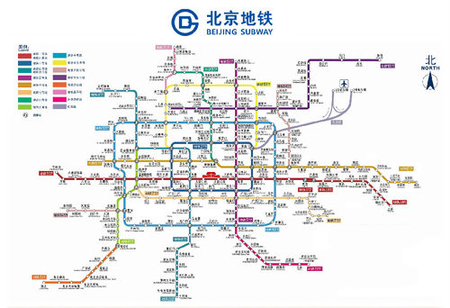
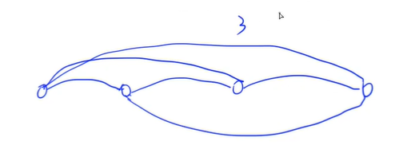
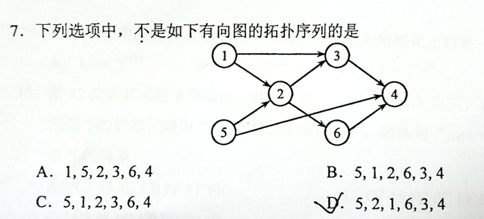

<!-- @import "[TOC]" {cmd="toc" depthFrom=3 depthTo=3 orderedList=false} -->

<!-- code_chunk_output -->

- [欧拉路径 1126 Eulerian Path (25 point(s))](#欧拉路径-1126-eulerian-path-25-points)
- [地铁地图 1131 Subway Map (30 point(s))](#地铁地图-1131-subway-map-30-points)
- [顶点覆盖 1134 Vertex Cover (25 point(s))](#顶点覆盖-1134-vertex-cover-25-points)
- [第一次接触 1139 First Contact (30 point(s))](#第一次接触-1139-first-contact-30-points)
- [最大集团 1142 Maximal Clique (25 point(s))](#最大集团-1142-maximal-clique-25-points)
- [拓扑顺序 1146 Topological Order (25 point(s))](#拓扑顺序-1146-topological-order-25-points)
- [旅行商问题 1150 Travelling Salesman Problem (25 point(s))](#旅行商问题-1150-travelling-salesman-problem-25-points)
- [顶点着色 1154 Vertex Coloring (25 point(s))](#顶点着色-1154-vertex-coloring-25-points)

<!-- /code_chunk_output -->

### 欧拉路径 1126 Eulerian Path (25 point(s))

<p>在图论中，欧拉路径是图中的一条路径，该路径满足恰好访问每个边一次。 </p>

<p>而欧拉回路是一条在同一顶点处开始和结束的欧拉路径。</p>

它们最早由欧拉于 $1736$ 年解决著名的哥尼斯堡七桥问题时提出。

<p>事实证明，如果一个连通图的所有顶点的度数都为偶数，那么这个连通图具有欧拉回路，且这个图被称为欧拉图。</p>

<p>如果一个连通图中有两个顶点的度数为奇数，其他顶点的度数为偶数，那么所有欧拉路径都从其中一个度数为奇数的顶点开始，并在另一个度数为奇数的顶点结束。</p>

<p>具有欧拉路径但不具有欧拉回路的图被称为半欧拉图。</p>

<p>现在，给定一个<strong>无向</strong>图，请你判断它是欧拉图、半欧拉图还是非欧拉图。</p>

<h4>输入格式</h4>

第一行包含两个整数 $N$ 和 $M$，表示无向图的点和边的数量。

接下来 $M$ 行，每行包含两个整数 $a,b$，表示点 $a$ 和 $b$ 之间存在一条边。

所有点的编号从 $1 \sim N$。

<h4>输出格式</h4>

首先，在第一行按顺序输出点 $1 \sim N$ 中每个点的度数。

<p>第二行输出对该图的判断，<code>Eulerian</code>（欧拉图），<code>Semi-Eulerian</code>（半欧拉图），<code>Non-Eulerian</code>（非欧拉图）。</p>

<p>行尾不得有多余空格。</p>

<h4>数据范围</h4>

- $1 \le N \le 500$,
- $1 \le M \le \frac{N(N-1)}{2}$

<h4>输入样例1：</h4>

<pre><code>
7 12
5 7
1 2
1 3
2 3
2 4
3 4
5 2
7 6
6 3
4 5
6 4
5 6
</code></pre>

<h4>输出样例1：</h4>

<pre><code>
2 4 4 4 4 4 2
Eulerian
</code></pre>

<h4>输入样例2：</h4>

<pre><code>
6 10
1 2
1 3
2 3
2 4
3 4
5 2
6 3
4 5
6 4
5 6
</code></pre>

<h4>输出样例2：</h4>

<pre><code>
2 4 4 4 3 3
Semi-Eulerian
</code></pre>

<h4>输入样例3：</h4>

<pre><code>
5 8
1 2
2 5
5 4
4 1
1 3
3 2
3 4
5 3
</code></pre>

<h4>输出样例3：</h4>

<pre><code>
3 3 4 3 3
Non-Eulerian
</code></pre>

#### 1126 Eulerian Path (25 point(s))

In graph theory, an Eulerian path is a path in a graph which visits every edge exactly once. Similarly, an Eulerian circuit is an Eulerian path which starts and ends on the same vertex. They were first discussed by Leonhard Euler while solving the famous Seven Bridges of Konigsberg problem in 1736. It has been proven that connected graphs with all vertices of even degree have an Eulerian circuit, and such graphs are called Eulerian. If there are exactly two vertices of odd degree, all Eulerian paths start at one of them and end at the other. A graph that has an Eulerian path but not an Eulerian circuit is called semi-Eulerian. (Cited from https://en.wikipedia.org/wiki/Eulerian_path)

Given an undirected graph, you are supposed to tell if it is Eulerian, semi-Eulerian, or non-Eulerian.

#### Input Specification:
Each input file contains one test case. Each case starts with a line containing 2 numbers N (≤ 500), and M, which are the total number of vertices, and the number of edges, respectively. Then M lines follow, each describes an edge by giving the two ends of the edge (the vertices are numbered from 1 to N).

#### Output Specification:
For each test case, first print in a line the degrees of the vertices in ascending order of their indices. Then in the next line print your conclusion about the graph -- either `Eulerian`, `Semi-Eulerian`, or `Non-Eulerian`. Note that all the numbers in the first line must be separated by exactly 1 space, and there must be no extra space at the beginning or the end of the line.

```cpp
// 是否连通
// 根据度数判断

#include <cstring>
#include <iostream>

using namespace std;

const int N = 510;

int n, m;
bool g[N][N], st[N];
int d[N];

int dfs(int u)
{
    st[u] = true;

    int res = 1;
    for (int i = 1; i <= n; i ++ )
        if (!st[i] && g[u][i])
            res += dfs(i);

    return res;
}

int main()
{
    cin >> n >> m;
    for (int i = 0; i < m; i ++ )
    {
        int a, b;
        cin >> a >> b;
        g[a][b] = g[b][a] = true;
        d[a] ++, d[b] ++ ;
    }

    int cnt = dfs(1);

    cout << d[1];  // 度数
    for (int i = 2; i <= n; i ++ ) cout << ' ' << d[i];
    cout << endl;
    if (cnt == n)
    {
        int s = 0;
        for (int i = 1; i <= n; i ++ )
            if (d[i] % 2)  // 奇数度数的个数
                s ++ ;

        if (s == 0) puts("Eulerian");
        else if (s == 2) puts("Semi-Eulerian");
        else puts("Non-Eulerian");
    }
    else puts("Non-Eulerian");

    return 0;
}
```

### 地铁地图 1131 Subway Map (30 point(s))

<p>在大城市，地铁系统对于游客来说总是看起来如此复杂。 </p>

<p>为了使你对此有所了解，下图显示了北京地铁的地图。 </p>

<p>现在，请你帮助编写一个程序，给定用户的起始位置，找到到达其目的地的最快方法。</p>



<h4>输入格式</h4>

第一行包含一个正整数 $N$，表示地铁线路的数量。

接下来 $N$ 行，第 $i$ 行以下列格式描述第 $i$ 条线路（地铁线路都是<strong>双向</strong>的）：

```
M S[1] S[2] ... S[M]
```

其中 $M$ 是站点数量，$S[i]$ 是沿线站点的编号（站点编号是从 $0000$ 到 $9999$ 的 $4$ 位数字）。

确保这些站点是按照地铁行进顺序给出的，即地铁会从 $S[i]$ 直接开到 $S[i+1]$。

注意，可能会存在回路，但不存在自环（即地铁从 $S$ 出发，直接开向 $S$，中途不经过任何站点）。

<p>每个车站间隔都只属于一条唯一线路。</p>

一些线路可能会在某些站点（中转站）彼此交叉，但是不能有任何站点作为中转站时，有超过 $5$ 条线路在该站点交汇。

描述完地铁线路信息后，包含一行整数 $K$，表示询问次数。

接下来 $K$ 行，每行描述一个询问，包含两个站点编号分别表示始发站和目的地。

<p>下面是示例图：</p>


<p>保证所有站点都能到达，询问站点编号合法。</p>

<h4>输出格式</h4>

<p>对于每个询问，首先输出最少需要停靠的站点数量，然后以如下格式输出最佳线路：</p>

<pre><code>
Take Line#X1 from S1 to S2.
Take Line#X2 from S2 to S3.
......
</code></pre>

<p>其中 <code>Xi</code> 是线路编号，<code>Si</code> 是站点编号，除始发站和终点站外，只输出中转站。</p>

<p>如果最快线路不唯一，则输出换乘次数最少的线路，保证唯一。</p>

<h4>数据范围</h4>

- $1 \le N \le 100$,
- $1 \le M \le 100$,
- $1 \le K \le 10$

<h4>输入样例：</h4>

<pre><code>
4
7 1001 3212 1003 1204 1005 1306 7797
9 9988 2333 1204 2006 2005 2004 2003 2302 2001
13 3011 3812 3013 3001 1306 3003 2333 3066 3212 3008 2302 3010 3011
4 6666 8432 4011 1306
3
3011 3013
6666 2001
2004 3001
</code></pre>

<h4>输出样例：</h4>

<pre><code>
2
Take Line#3 from 3011 to 3013.
10
Take Line#4 from 6666 to 1306.
Take Line#3 from 1306 to 2302.
Take Line#2 from 2302 to 2001.
6
Take Line#2 from 2004 to 1204.
Take Line#1 from 1204 to 1306.
Take Line#3 from 1306 to 3001.
</code></pre>

#### 1131 Subway Map (30 point(s))
In the big cities, the subway systems always look so complex to the visitors. To give you some sense, the following figure shows the map of Beijing subway. Now you are supposed to help people with your computer skills! Given the starting position of your user, your task is to find the quickest way to his/her destination.


#### Input Specification:
Each input file contains one test case. For each case, the first line contains a positive integer N (≤ 100), the number of subway lines. Then N lines follow, with the i-th (i=1,⋯,N) line describes the i-th subway line in the format:

```
M S[1] S[2] ... S[M]
```

where M (≤ 100) is the number of stops, and S[i]'s (i=1,⋯,M) are the indices of the stations (the indices are 4-digit numbers from 0000 to 9999) along the line. It is guaranteed that the stations are given in the correct order -- that is, the train travels between S[i] and S[i+1] (i=1,⋯,M−1) without any stop.

Note: It is possible to have loops, but not self-loop (no train starts from S and stops at S without passing through another station). Each station interval belongs to a unique subway line. Although the lines may cross each other at some stations (so called "transfer stations"), no station can be the conjunction of more than 5 lines.

After the description of the subway, another positive integer K (≤ 10) is given. Then K lines follow, each gives a query from your user: the two indices as the starting station and the destination, respectively.

The following figure shows the sample map.


Note: It is guaranteed that all the stations are reachable, and all the queries consist of legal station numbers.

#### Output Specification:
For each query, first print in a line the minimum number of stops. Then you are supposed to show the optimal path in a friendly format as the following:
```
Take Line#X1 from S1 to S2.
Take Line#X2 from S2 to S3.
......
```

where Xi's are the line numbers and Si's are the station indices. Note: Besides the starting and ending stations, only the transfer stations shall be printed.

If the quickest path is not unique, output the one with the minimum number of transfers, which is guaranteed to be unique.



如上，如果我们仅仅建立站点间邻接关系，无法判断是否换乘。因此，我们对于同一线路的站点（共 $n$ 站）各点间建立带权的临界关系（$n^2$）。

由此，我们找边数最少的路径，就是找到了换乘次数最少的路径。

```cpp
// 难点一：建图
// 难点二：堆优化 dijkstra + 维护信息
#include <iostream>
#include <cstring>
#include <queue>

#define x first
#define y second

using namespace std;

typedef pair<int, int> PII;

const int N = 10010, M = 1000010;

int n;
int h[N], e[M], w[M], line[M], ne[M], idx;
int dist[N], cnt[N], pre[N];
int stops[N];
string info[N];
bool st[N];

string get_number(int x)  // 注意站点一定为四位整数
{
    char res[5];
    sprintf(res, "%04d", x);
    return res;
}

void add(int a, int b, int c, int id)
{
    e[idx] = b, w[idx] = c, line[idx] = id, ne[idx] = h[a], h[a] = idx ++ ;
}

void dijkstra(int start, int end)
{
    memset(dist, 0x3f, sizeof dist);
    memset(cnt, 0x3f, sizeof cnt);
    memset(st, 0, sizeof st);

    priority_queue<PII, vector<PII>, greater<PII>> heap;
    heap.push({0, start});
    dist[start] = cnt[start] = 0;

    while (heap.size())
    {
        auto t = heap.top();
        heap.pop();

        int ver = t.y;
        if (ver == end) break;
        if (st[ver]) continue;
        st[ver] = true;

        for (int i = h[ver]; ~i; i = ne[i])
        {
            int j = e[i];
            if (dist[j] > dist[ver] + w[i])
            {
                dist[j] = dist[ver] + w[i];
                cnt[j] = cnt[ver] + 1;
                pre[j] = ver;
                info[j] = "Take Line#" + to_string(line[i]) + " from " + 
                    get_number(ver) + " to " + get_number(j) + ".";
                heap.push({dist[j], j});
            }
            else if (dist[j] == dist[ver] + w[i])
            {
                if (cnt[j] > cnt[ver] + 1)  // 如果距离相等，取边少的路径
                {
                    cnt[j] = cnt[ver] + 1;
                    pre[j] = ver;
                    info[j] = "Take Line#" + to_string(line[i]) + " from " + 
                        get_number(ver) + " to " + get_number(j) + ".";
                }
            }
        }
    }

    cout << dist[end] << endl;
    vector<string> path;
    for (int i = end; i != start; i = pre[i])
        path.push_back(info[i]);

    for (int i = path.size() - 1; ~i; i -- )
        cout << path[i] << endl;
}

int main()
{
    cin >> n;
    memset(h, -1, sizeof h);
    for (int i = 1; i <= n; i ++ )
    {
        int m;
        cin >> m;
        for (int j = 0; j < m; j ++ ) cin >> stops[j];
        
        // 建图
        for (int j = 0; j < m; j ++ )
            for (int k = 0; k < j; k ++ )
            {
                int len;
                if (stops[0] != stops[m - 1]) len = j - k;  // 如果不是环路
                else len = min(j - k, m - 1 - j + k);  // 如果是环路，取最短方向长度

                add(stops[j], stops[k], len, i);
                add(stops[k], stops[j], len, i);
            }
    }

    int k;
    cin >> k;
    while (k -- )
    {
        int start, end;
        cin >> start >> end;
        dijkstra(start, end);
    }

    return 0;
}
```

### 顶点覆盖 1134 Vertex Cover (25 point(s))

<p>如果图中的一个顶点集合能够满足图中的每一条边都至少有一个端点在该集合内，那么这个顶点集合就是图的顶点覆盖。</p>

<p>现在给定一张图，以及若干个顶点集合，请你判断这些顶点集合是否是图的顶点覆盖。</p>

<h4>输入格式</h4>

第一行包含两个整数 $N$ 和 $M$，表示图中点和边的数量。

接下来 $M$ 行，每行包含两个整数 $a,b$，表示点 $a$ 和点 $b$ 之间存在一条边。

点编号 $0 \sim N-1$。

然后包含一个整数 $K$，表示询问的顶点集合数量。

接下来 $K$ 行，每行描述一组询问顶点集合，格式如下：

$N_v$ $V[1]$ $V[2]$ ... $V[N_v]$

$N_v$ 是集合中点的数量，$V[i]$ 是点的编号。

<h4>输出格式</h4>

<p>每组询问输出一行结果，如果是顶点覆盖则输出 <code>Yes</code>，否则输出 <code>No</code>。</p>

<h4>数据范围</h4>

- $1 \le N,M \le 10^4$,
- $1 \le K \le 100$,
- $1 \le N_v \le N$

<h4>输入样例：</h4>

<pre><code>
10 11
8 7
6 8
4 5
8 4
8 1
1 2
1 4
9 8
9 1
1 0
2 4
5
4 0 3 8 4
6 6 1 7 5 4 9
3 1 8 4
2 2 8
7 9 8 7 6 5 4 2
</code></pre>

<h4>输出样例：</h4>

<pre><code>
No
Yes
Yes
No
No
</code></pre>

#### 1134 Vertex Cover (25 point(s))
A vertex cover of a graph is a set of vertices such that each edge of the graph is incident to at least one vertex of the set. Now given a graph with several vertex sets, you are supposed to tell if each of them is a vertex cover or not.

#### Input Specification:
Each input file contains one test case. For each case, the first line gives two positive integers N and M (both no more than $10^4$), being the total numbers of vertices and the edges, respectively. Then M lines follow, each describes an edge by giving the indices (from 0 to N−1) of the two ends of the edge.

After the graph, a positive integer K (≤ 100) is given, which is the number of queries. Then K lines of queries follow, each in the format:

$N_v$ $V[1]$ $V[2]$ ... $V[N_v]$

where $N_v$ is the number of vertices in the set, and v[i]'s are the indices of the vertices.

#### Output Specification:
For each query, print in a line Yes if the set is a vertex cover, or No if not.

```cpp
#include <iostream>
#include <cstring>

using namespace std;

const int N = 10010;

int n, m;
struct Edge
{
    int a, b;
}e[N];
bool st[N];

int main()
{
    cin >> n >> m;
    for (int i = 0; i < m; i ++ ) cin >> e[i].a >> e[i].b;

    int k;
    cin >> k;
    while (k -- )
    {
        int cnt;
        cin >> cnt;

        memset(st, 0, sizeof st);
        while (cnt -- )
        {
            int x;
            cin >> x;
            st[x] = true;
        }

        int i;  // 遍历每条边，如果任意一条边两端顶点都没有在点集里，则不合题意
        for (i = 0; i < m; i ++ )
            if (!st[e[i].a] && !st[e[i].b])
                break;

        if (i == m) puts("Yes");
        else puts("No");
    }

    return 0;
}
```

### 第一次接触 1139 First Contact (30 point(s))

<p>与如今不同，早年男孩和女孩表达爱情的方式相当微妙。</p>

当男孩 $A$ 暗恋着女孩 $B$ 的时候，他通常不会直接与她联系。

取而代之的是，他可能会去找另一个男孩 $C$（他的好朋友）去拜托女孩 $D$（她是 $B$ 和 $C$ 的朋友）将女孩 $B$ 约出来。

<p>这实在是麻烦不是吗？</p>

<p>女孩也会做类似的事情。</p>

<p>在给定的友谊关系网络中，请你帮助一些男孩和女孩列出所有可能会帮助他们进行第一次联系的朋友。</p>

<h4>输入格式</h4>

第一行包含两个整数 $N$ 和 $M$，分别表示总人数以及友好关系的数量。

接下来 $M$ 行，每行给出一对朋友关系。

每个人都用一个 $4$ 位数字表示，为了区分性别，我们在女生的编号前加了负号。

再一行包含一个整数 $K$，表示询问数量。

接下来 $K$ 行，每行包含一对暗恋关系，假设第一个人暗恋着第二个人。

<h4>输出格式</h4>

<p>对于每组询问，第一行输出一个整数，表示可以找到的帮忙牵线的不同朋友对的数量。</p>

<p>然后，在每行输出一对帮忙的朋友的编号。</p>

如果 $A$ 和 $B$ 的性别不同，则先输出与 $A$ 性别相同的朋友，再输出与 $B$ 性别相同的朋友。

如果 $A$ 和 $B$ 的性别相同，则两个朋友的性别必须也和他们相同。

<p>保证每个人只有一种性别。</p>

<p>一组询问内，朋友对按第一个朋友的编号从小到大进行排序，第一个朋友的编号相同时，按第二个朋友的编号从小到大进行排序。</p>

<h4>数据范围</h4>

- $1 < N \le 300$,
- $1 \le M \le 15000$,
- $1 \le K \le 100$

<h4>输入样例：</h4>

<pre><code>
10 18
-2001 1001
-2002 -2001
1004 1001
-2004 -2001
-2003 1005
1005 -2001
1001 -2003
1002 1001
1002 -2004
-2004 1001
1003 -2002
-2003 1003
1004 -2002
-2001 -2003
1001 1003
1003 -2001
1002 -2001
-2002 -2003
5
1001 -2001
-2003 1001
1005 -2001
-2002 -2004
1111 -2003
</code></pre>

<h4>输出样例：</h4>

<pre><code>
4
1002 2004
1003 2002
1003 2003
1004 2002
4
2001 1002
2001 1003
2002 1003
2002 1004
0
1
2003 2001
0
</code></pre>

#### 1139 First Contact (30 point(s))
Unlike in nowadays, the way that boys and girls expressing their feelings of love was quite subtle in the early years. When a boy A had a crush on a girl B, he would usually not contact her directly in the first place. Instead, he might ask another boy C, one of his close friends, to ask another girl D, who was a friend of both B and C, to send a message to B -- quite a long shot, isn't it? Girls would do analogously.

Here given a network of friendship relations, you are supposed to help a boy or a girl to list all their friends who can possibly help them making the first contact.

#### Input Specification:
Each input file contains one test case. For each case, the first line gives two positive integers N (1 < N ≤ 300) and M, being the total number of people and the number of friendship relations, respectively. Then M lines follow, each gives a pair of friends. Here a person is represented by a 4-digit ID. To tell their genders, we use a negative sign to represent girls.

After the relations, a positive integer K (≤ 100) is given, which is the number of queries. Then K lines of queries follow, each gives a pair of lovers, separated by a space. It is assumed that the first one is having a crush on the second one.

#### Output Specification:
For each query, first print in a line the number of different pairs of friends they can find to help them, then in each line print the IDs of a pair of friends.

If the lovers A and B are of opposite genders, you must first print the friend of A who is of the same gender of A, then the friend of B, who is of the same gender of B. If they are of the same gender, then both friends must be in the same gender as theirs. It is guaranteed that each person has only one gender.

The friends must be printed in non-decreasing order of the first IDs, and for the same first ones, in increasing order of the seconds ones.

```cpp
// 暴搜
// 处理输入很恶心
#include <iostream>
#include <cstring>
#include <unordered_map>
#include <vector>
#include <algorithm>

using namespace std;

const int N = 310;

int n, m;
unordered_map<string, int> mp;
string num[N];
int id;
bool g[N][N];
vector<int> boys, girls;

int main()
{
    scanf("%d%d", &n, &m);
    char as[N], bs[N];
    while (m -- )
    {
        string a, b;
        scanf("%s%s", as, bs);
        a = as, b = bs;
        string x = a, y = b;
        if (x.size() == 5) x = x.substr(1);
        if (y.size() == 5) y = y.substr(1);
        if (mp.count(x) == 0) mp[x] = ++ id, num[id] = x;
        if (mp.count(y) == 0) mp[y] = ++ id, num[id] = y;

        int px = mp[x], py = mp[y];
        g[px][py] = g[py][px] = true;

        if (a[0] != '-') boys.push_back(px);
        else girls.push_back(px);
        if (b[0] != '-') boys.push_back(py);
        else girls.push_back(py);
    }

    sort(boys.begin(), boys.end());
    boys.erase(unique(boys.begin(), boys.end()), boys.end());
    sort(girls.begin(), girls.end());
    girls.erase(unique(girls.begin(), girls.end()), girls.end());

    int k;
    scanf("%d", &k);

    while (k -- )
    {
        vector<pair<string, string>> res;
        string x, y;
        scanf("%s%s", as, bs);
        x = as, y = bs;

        vector<int> p = boys, q = boys;
        if (x[0] == '-') p = girls, x = x.substr(1);
        if (y[0] == '-') q = girls, y = y.substr(1);

        int a = mp[x], b = mp[y];

        for (int c : p)
            for (int d : q)
            {
                if (c != a && c != b && d != a && d != b && g[a][c] && g[c][d] && g[d][b])
                    res.push_back({num[c], num[d]});
            }

        sort(res.begin(), res.end());
        printf("%d\n", res.size());
        for (auto p : res)
            printf("%s %s\n", p.first.c_str(), p.second.c_str());
    }

    return 0;
}
```

### 最大集团 1142 Maximal Clique (25 point(s))

<p>在一个无向图中，如果一个顶点子集满足子集内的任意两个不同顶点之间都是相连的，那么这个顶点子集就被称为一个团。</p>

<p>如果一个团不能通过加入某个新的顶点来扩展成一个更大的团，那么该团就被称为最大团。</p>

<p>现在，你需要判断给定顶点子集能否构成一个最大团。</p>

<h4>输入格式</h4>

第一行包含两个整数 $N_v$ 和 $N_e$，分别表示无向图中点和边的数量。

接下来 $N_e$ 行，每行包含两个整数 $a,b$，表示点 $a$ 和点 $b$ 之间存在一条边。

所有点的编号从 $1$ 到 $N_v$。

再一行，包含整数 $M$，表示询问次数。

接下来 $M$ 行，每行描述一个询问顶点子集，首先包含一个整数 $K$，表示子集包含点的数量，然后包含 $K$ 个整数，表示 $K$ 个不同顶点的编号。

一行中所有数字之间用一个空格隔开。

<h4>输出格式</h4>

<p>每组询问在一行中输出一个结论。</p>

<p>如果给定子集是最大团，则输出 <code>Yes</code>，如果是一个团，但不是最大团，则输出 <code>Not Maximal</code>，如果根本不是团，则输出 <code>Not a Clique</code>。</p>

<h4>数据范围</h4>

- $1 \le N_v \le 200$,
- $1 \le N_e \le \frac{N_v(N_v-1)}{2}$,
- $1 \le M \le 100$,
- $1 \le K \le N_v$

<h4>输入样例：</h4>

<pre><code>
8 10
5 6
7 8
6 4
3 6
4 5
2 3
8 2
2 7
5 3
3 4
6
4 5 4 3 6
3 2 8 7
2 2 3
1 1
3 4 3 6
3 3 2 1
</code></pre>

<h4>输出样例：</h4>

<pre><code>
Yes
Yes
Yes
Yes
Not Maximal
Not a Clique
</code></pre>

#### 1142 Maximal Clique (25 point(s))
A clique is a subset of vertices of an undirected graph such that every two distinct vertices in the clique are adjacent. A maximal clique is a clique that cannot be extended by including one more adjacent vertex. (Quoted from https://en.wikipedia.org/wiki/Clique_(graph_theory))

Now it is your job to judge if a given subset of vertices can form a maximal clique.

#### Input Specification:
Each input file contains one test case. For each case, the first line gives two positive integers Nv (≤ 200), the number of vertices in the graph, and Ne, the number of undirected edges. Then Ne lines follow, each gives a pair of vertices of an edge. The vertices are numbered from 1 to Nv.

After the graph, there is another positive integer M (≤ 100). Then M lines of query follow, each first gives a positive number K (≤ Nv), then followed by a sequence of K distinct vertices. All the numbers in a line are separated by a space.

#### Output Specification:
For each of the M queries, print in a line Yes if the given subset of vertices can form a maximal clique; or if it is a clique but not a maximal clique, print Not Maximal; or if it is not a clique at all, print Not a Clique.

```cpp
#include <iostream>
#include <cstring>

using namespace std;

const int N = 210;

int n, m;
bool g[N][N], st[N];
int vers[N];

bool check_clique(int cnt)
{
    for (int i = 0; i < cnt; i ++ )
        for (int j = 0; j < i; j ++ )
            if (!g[vers[i]][vers[j]])  // 任意两点间没有连接，不是团
                return false;
    return true;
}

bool check_maximum(int cnt)
{
    memset(st, 0, sizeof st);
    for (int i = 0; i < cnt; i ++ )
        st[vers[i]] = true;

    for (int i = 1; i <= n; i ++ )
        if (!st[i])
        {
            bool success = true;
            for (int j = 0; j < cnt; j ++ )
                if (!g[i][vers[j]])
                {
                    success = false;  // 外部任一点与内部没有连接，是最大团，此外部点通过检验
                    break;
                }

            if (success) return false;
        }

    return true;
}

int main()
{
    cin >> n >> m;
    while (m -- )
    {
        int a, b;
        cin >> a >> b;
        g[a][b] = g[b][a] = true;
    }

    int k;
    cin >> k;
    while (k -- )
    {
        int cnt;
        cin >> cnt;
        for (int i = 0; i < cnt; i ++ ) cin >> vers[i];
        if (check_clique(cnt))
        {
            if (check_maximum(cnt)) puts("Yes");
            else puts("Not Maximal");
        }
        else puts("Not a Clique");
    }

    return 0;
}
```

### 拓扑顺序 1146 Topological Order (25 point(s))

这是 $2018$ 年研究生入学考试中给出的一个问题：

<p>以下哪个选项不是从给定的有向图中获得的拓扑序列？</p>

<p>现在，请你编写一个程序来测试每个选项。</p>



<h4>输入格式</h4>

第一行包含两个整数 $N$ 和 $M$，分别表示有向图的点和边的数量。

接下来 $M$ 行，每行给出一条边的起点和终点。

点的编号从 $1$ 到 $N$。

再一行包含一个整数 $K$，表示询问次数。

接下来 $K$ 行，每行包含一个所有点的排列。

<p>一行中的数字用空格隔开。</p>

<h4>输出格式</h4>

<p>在一行中输出所有不是拓扑序列的询问序列的编号。</p>

询问序列编号从 $0$ 开始。

<p>行首和行尾不得有多余空格，保证存在至少一个解。</p>

<h4>数据范围</h4>

- $1 \le N \le 1000$,
- $1 \le M \le 10000$,
- $1 \le K \le 100$

<h4>输入样例：</h4>

<pre><code>
6 8
1 2
1 3
5 2
5 4
2 3
2 6
3 4
6 4
5
1 5 2 3 6 4
5 1 2 6 3 4
5 1 2 3 6 4
5 2 1 6 3 4
1 2 3 4 5 6
</code></pre>

<h4>输出样例：</h4>

<pre><code>
3 4
</code></pre>

#### 1146 Topological Order (25 point(s))
This is a problem given in the Graduate Entrance Exam in 2018: Which of the following is NOT a topological order obtained from the given directed graph? Now you are supposed to write a program to test each of the options.


#### Input Specification:
Each input file contains one test case. For each case, the first line gives two positive integers N (≤ 1,000), the number of vertices in the graph, and M (≤ 10,000), the number of directed edges. Then M lines follow, each gives the start and the end vertices of an edge. The vertices are numbered from 1 to N. After the graph, there is another positive integer K (≤ 100). Then K lines of query follow, each gives a permutation of all the vertices. All the numbers in a line are separated by a space.

#### Output Specification:
Print in a line all the indices of queries which correspond to "NOT a topological order". The indices start from zero. All the numbers are separated by a space, and there must no extra space at the beginning or the end of the line. It is graranteed that there is at least one answer.

```cpp
#include <iostream>
#include <cstring>

using namespace std;

const int N = 1010, M = 10010;

int n, m;
struct Edge
{
    int a, b;
}e[M];     // 因为本题是遍历边不是遍历图，所以用 struct 存就行
int p[N];  // 存储每个节点在给定拓扑排序中的下标

int main()
{
    cin >> n >> m;
    for (int i = 0; i < m; i ++ ) cin >> e[i].a >> e[i].b;

    int k;
    cin >> k;

    bool is_first = true;
    for (int i = 0; i < k; i ++ )
    {
        for (int j = 1; j <= n; j ++ )
        {
            int x;
            cin >> x;
            p[x] = j;
        }

        bool success = true;
        for (int j = 0; j < m; j ++ )
            if (p[e[j].a] > p[e[j].b])  // 如果拓扑排序中尾比头靠前
            {
                success = false;
                break;
            }

        if (!success)
        {
            if (is_first) is_first = false;
            else cout << ' ';
            cout << i;
        }
    }

    cout << endl;

    return 0;
}
```

### 旅行商问题 1150 Travelling Salesman Problem (25 point(s))

<p>“旅行商问题”是这样一个问题：“给出一个城市列表以及每对城市之间的距离，访问每个城市并返回原城市的最短路线是什么？”</p>

<p>这是组合优化中的一个 NP 难题，在运筹学和理论计算机科学中十分重要。</p>

<p>在此问题中，请你从给定的路径列表中找到最接近旅行商问题的解的路径。</p>

<h4>输入格式</h4>

第一行包含两个整数 $N$ 和 $M$，分别表示城市数量以及 <strong>无向图</strong> 中边的数量。

接下来 $M$ 行，每行以 <code>City1 City2 Dist</code> 格式描述一条边，其中城市编号从 $1$ 到 $N$，<code>Dist</code> 为正且不超过 $100$。

再一行包含一个整数 $K$，表示给定路径的数量。

接下来 $K$ 行描述路径，格式为：

$n$ $C_1$ $C_2$ ... $C_n$

$n$ 表示给定路径经过的城市的数目，$C_i$ 是路径中经过的城市的编号。

<h4>输出格式</h4>

对于每个路径，在一行中输出 <code>Path X: TotalDist (Description)</code>。

其中 <code>X</code> 是路径编号（从 $1$ 开始），<code>TotalDist</code> 表示路径总距离（如果距离不存在，则输出 <code>NA</code>），<code>Description</code> 是下列中的一项：

- <code>TS simple cycle</code>，如果这是一个访问每个城市的简单回路。
- <code>TS cycle</code>，如果这是一个访问每个城市的回路，但不是简单回路。
- <code>Not a TS cycle</code>，如果这不是一个访问了每个城市的回路。

<p>最后一行，输出 <code>Shortest Dist(X) = TotalDist</code>，<code>X</code> 是最接近旅行商问题解决方案的回路编号，<code>TotalDist</code> 是其总距离。</p>

<p>保证有唯一解。</p>

<h4>数据范围</h4>

- $2 < N \le 200$,
- $N-1 \le M \le \frac{N(N-1)}{2}$,
- $1 \le K \le 1000$,
- $1 \le n \le 300$

<h4>输入样例：</h4>

<pre><code>
6 10
6 2 1
3 4 1
1 5 1
2 5 1
3 1 8
4 1 6
1 6 1
6 3 1
1 2 1
4 5 1
7
7 5 1 4 3 6 2 5
7 6 1 3 4 5 2 6
6 5 1 4 3 6 2
9 6 2 1 6 3 4 5 2 6
4 1 2 5 1
7 6 1 2 5 4 3 1
7 6 3 2 5 4 1 6
</code></pre>

<h4>输出样例：</h4>

<pre><code>
Path 1: 11 (TS simple cycle)
Path 2: 13 (TS simple cycle)
Path 3: 10 (Not a TS cycle)
Path 4: 8 (TS cycle)
Path 5: 3 (Not a TS cycle)
Path 6: 13 (Not a TS cycle)
Path 7: NA (Not a TS cycle)
Shortest Dist(4) = 8
</code></pre>

#### 1150 Travelling Salesman Problem (25 point(s))
The "travelling salesman problem" asks the following question: "Given a list of cities and the distances between each pair of cities, what is the shortest possible route that visits each city and returns to the origin city?" It is an NP-hard problem in combinatorial optimization, important in operations research and theoretical computer science. (Quoted from "https://en.wikipedia.org/wiki/Travelling_salesman_problem".)

In this problem, you are supposed to find, from a given list of cycles, the one that is the closest to the solution of a travelling salesman problem.

#### Input Specification:
Each input file contains one test case. For each case, the first line contains 2 positive integers $N (2<N≤200)$, the number of cities, and M, the number of edges in an undirected graph. Then M lines follow, each describes an edge in the format City1 City2 Dist, where the cities are numbered from 1 to N and the distance Dist is positive and is no more than 100. The next line gives a positive integer K which is the number of paths, followed by K lines of paths, each in the format:

$n$ $C_1$ $C_2$ ... $C_n$

where n is the number of cities in the list, and $C_i$'s are the cities on a path.

#### Output Specification:
For each path, print in a line Path X: TotalDist (Description) where X is the index (starting from 1) of that path, TotalDist its total distance (if this distance does not exist, output NA instead), and Description is one of the following:

- `TS simple cycle` if it is a simple cycle that visits every city;
- `TS cycle` if it is a cycle that visits every city, but not a simple cycle;
- `Not a TS cycle` if it is NOT a cycle that visits every city.

Finally print in a line `Shortest Dist(X) = TotalDist` where X is the index of the cycle that is the closest to the solution of a travelling salesman problem, and TotalDist is its total distance. It is guaranteed that such a solution is unique.

```cpp
#include <iostream>
#include <cstring>
#include <unordered_set>

using namespace std;

const int N = 10010;

int n, m;
struct Edge
{
    int a, b;
}e[N];  // 本题只遍历边
int color[N];

int main()
{
    cin >> n >> m;
    for (int i = 0; i < m; i ++ ) cin >> e[i].a >> e[i].b;

    int k;
    cin >> k;
    while (k -- )
    {
        for (int i = 0; i < n; i ++ ) cin >> color[i];

        bool success = true;
        for (int i = 0; i < m; i ++ )
            if (color[e[i].a] == color[e[i].b])
            {
                success = false;
                break;
            }

        if (success)
        {
            unordered_set<int> S;
            for (int i = 0; i < n; i ++ ) S.insert(color[i]);
            printf("%d-coloring\n", S.size());
        }
        else puts("No");
    }

    return 0;
}
```

### 顶点着色 1154 Vertex Coloring (25 point(s))

<p>一个合适的顶点着色是指用各种颜色标记图中各个顶点，使得每条边的两个端点的颜色都不相同。</p>

如果一种合适的顶点着色方案使用了一共 $k$ 种不同的颜色，则称其为合适的 $k$ 着色（<code>k-coloring</code>）。

现在，你需要判断给定的着色方案是否是合适的 $k$ 着色方案。

<h4>输入格式</h4>

第一行包含两个整数 $N$ 和 $M$，分别表示点和边的数量。

接下来 $M$ 行，每行包含两个整数 $a,b$，表示点 $a$ 和点 $b$ 之间存在一条边。

所有点的编号从 $0$ 到 $N-1$。

再一行包含一个整数 $K$，表示你需要判断的着色方案。

接下来 $K$ 行，每行包含 $N$ 个颜色，其中第 $i$ 个颜色表示第 $i$ 个点的颜色。

颜色用非负整数表示，不超过 <strong>int</strong> 范围。

<h4>输出格式</h4>

对于每种着色方案，如果是一种合适的 $k$ 着色方案，则输出一行 <code>k-coloring</code>。
如果不是合适的着色方案，则输出一行 <code>No</code>。

<h4>数据范围</h4>

- $1 \le N,M \le 10^4$,
- $1 \le K \le 100$

<h4>输入样例：</h4>

<pre><code>
10 11
8 7
6 8
4 5
8 4
8 1
1 2
1 4
9 8
9 1
1 0
2 4
4
0 1 0 1 4 1 0 1 3 0
0 1 0 1 4 1 0 1 0 0
8 1 0 1 4 1 0 5 3 0
1 2 3 4 5 6 7 8 8 9
</code></pre>

<h4>输出样例：</h4>

<pre><code>
4-coloring
No
6-coloring
No
</code></pre>

#### 1154 Vertex Coloring (25 point(s))
A proper vertex coloring is a labeling of the graph's vertices with colors such that no two vertices sharing the same edge have the same color. A coloring using at most k colors is called a (proper) k-coloring.

Now you are supposed to tell if a given coloring is a proper k-coloring.

#### Input Specification:
Each input file contains one test case. For each case, the first line gives two positive integers N and M (both no more than %10^4%), being the total numbers of vertices and edges, respectively. Then M lines follow, each describes an edge by giving the indices (from 0 to N−1) of the two ends of the edge.

After the graph, a positive integer K (≤ 100) is given, which is the number of colorings you are supposed to check. Then K lines follow, each contains N colors which are represented by non-negative integers in the range of int. The i-th color is the color of the i-th vertex.

#### Output Specification:
For each coloring, print in a line k-coloring if it is a proper k-coloring for some positive k, or No if not.

```cpp
#include <iostream>
#include <cstring>
#include <unordered_set>

using namespace std;

const int N = 10010;

int n, m;
struct Edge
{
    int a, b;
}e[N];  // 本题只遍历边
int color[N];

int main()
{
    cin >> n >> m;
    for (int i = 0; i < m; i ++ ) cin >> e[i].a >> e[i].b;

    int k;
    cin >> k;
    while (k -- )
    {
        for (int i = 0; i < n; i ++ ) cin >> color[i];

        bool success = true;
        for (int i = 0; i < m; i ++ )
            if (color[e[i].a] == color[e[i].b])
            {
                success = false;
                break;
            }

        if (success)
        {
            unordered_set<int> S;
            for (int i = 0; i < n; i ++ ) S.insert(color[i]);
            printf("%d-coloring\n", S.size());
        }
        else puts("No");
    }

    return 0;
}
```
