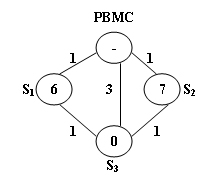

<!-- @import "[TOC]" {cmd="toc" depthFrom=3 depthTo=3 orderedList=false} -->

<!-- code_chunk_output -->

- [公共自行车管理 1018 Public Bike Management (30 point(s))](#公共自行车管理-1018-public-bike-management-30-points)
- [加油站 1072 Gas Station (30 point(s))](#加油站-1072-gas-station-30-points)

<!-- /code_chunk_output -->

### 公共自行车管理 1018 Public Bike Management (30 point(s))

<p>杭州市设有公共自行车服务，为来自世界各地的游客提供了极大的便利。 </p>

<p>游客可以在任何车站租用一辆自行车，然后可在城市中的任意其他车站将其归还。</p>

公共自行车管理中心（$PBMC$）不断监测所有站点的实时容量。

如果一个车站自行车存量刚满一半，则称其处于理想状态。

如果一个车站已满或空了，$PBMC$ 会收集或派送自行车以将该车站的状况调整到最佳状态。

而且，途中的所有车站也会调整至最佳。

当出现需要调整的车站时，$PBMC$ 将始终选择到达该站点的最短路径，前去该站点进行车辆调整。

如果最短路径多于一条，则将选择需要从 $PBMC$ 发送的自行车数量最少的那条路径。



上图给出了一个示例，车站以及 $PBMC$ 由点表示，道路由边表示。

<p>边上的数字是从一个站点到达另一个站点所花费的时间。</p>

<p>点内的数字是车站目前的自行车存量。</p>

假设每个站点最多存 $10$ 辆车。

我们现在要给车站 $S_3$ 送自行车，共有两条最短路径可选：

- $PBMC \to S_1 \to S_3$，这种路线需要从 $PBMC$ 发送 $4$ 辆自行车，因为我们可以从 $S_1$ 收集 $1$ 辆车，并需要给 $S_3$ 派送 $5$ 辆车，这样两个站点就都调整到最佳状态了。
- $PBMC \to S_2 \to S_3$，这种路线与上一条路线距离相同，但是只需要从 $PBMC$ 发送 $3$ 辆自行车，因此<strong>这条路径应该被选择</strong>。

<h4>输入格式</h4>

第一行包含四个整数，$C_{max}$，表示每个车站的最大存车量；$N$，表示车站总数；$S_p$，表示需要处理站点的编号（所有站点编号 $1 \sim N$，$PBMC$ 编号为 $0$)；$M$，表示道路数量。

第二行包含 $N$ 个非负整数 $C_i$，其中第 $i$ 个数表示编号为 $i$ 的站点的现存车辆。

接下来 $M$ 行，每行包含三个整数 $S_i,S_j,T_{ij}$，表示站点 $S_i$ 与站点 $S_j$ 之间存在一条 <strong>双向</strong> 道路，行走时长为 $T_{ij}$。

<h4>输出格式</h4>

输出共一行，首先输出需要从 $PBMC$ 发送的自行车数量，然后输出发送路径，格式为 <code>0->;2->;3</code>，最后输出当 $S_p$ 站点调整至最佳后，需要带回至 $PBMC$ 的自行车数量。

三个输出部分之间用空格隔开。

注意，如果按照上述规则，仍然无法选出最优选择，那么选择需要带回车辆最少的路线。

<h4>数据范围</h4>

- $1 \le C_{max} \le 100$,
- $1 \le N \le 500$,
- $1 \le S_p \le N$,
- $1 \le M \le 2000$,
- $1 \le T_{ij} \le 500$

<h4>输入样例：</h4>

<pre><code>
10 3 3 5
6 7 0
0 1 1
0 2 1
0 3 3
1 3 1
2 3 1
</code></pre>

<h4>输出样例：</h4>

<pre><code>
3 0->2->3 0
</code></pre>

#### 1018 Public Bike Management (30 point(s))
There is a public bike service in Hangzhou City which provides great convenience to the tourists from all over the world. One may rent a bike at any station and return it to any other stations in the city.

The Public Bike Management Center (PBMC) keeps monitoring the real-time capacity of all the stations. A station is said to be in perfect condition if it is exactly half-full. If a station is full or empty, PBMC will collect or send bikes to adjust the condition of that station to perfect. And more, all the stations on the way will be adjusted as well.

When a problem station is reported, PBMC will always choose the shortest path to reach that station. If there are more than one shortest path, the one that requires the least number of bikes sent from PBMC will be chosen.


The above figure illustrates an example. The stations are represented by vertices and the roads correspond to the edges. The number on an edge is the time taken to reach one end station from another. The number written inside a vertex S is the current number of bikes stored at S. Given that the maximum capacity of each station is 10. To solve the problem at $S_3$, we have 2 different shortest paths:
- $PBMC -> S_1 ​ -> S_3$​. In this case, 4 bikes must be sent from PBMC, because we can collect 1 bike from $S_1$ and then take 5 bikes to $S_3$, so that both stations will be in perfect conditions.
- $PBMC -> S_2 -> S_3$. This path requires the same time as path 1, but only 3 bikes sent from PBMC and hence is the one that will be chosen.

#### Input Specification:
Each input file contains one test case. For each case, the first line contains 4 numbers: $C_{max} (≤100)$, always an even number, is the maximum capacity of each station; N (≤500), the total number of stations; $S_p$, the index of the problem station (the stations are numbered from 1 to N, and PBMC is represented by the vertex 0); and M, the number of roads. The second line contains N non-negative numbers $C_i (i=1,⋯,N)$ where each $C_i$ is the current number of bikes at $S_i$ respectively. Then M lines follow, each contains 3 numbers: $S_i$, $S_j$ , and $T_{ij}$ which describe the time $T_{ij}$ ​taken to move betwen stations $S_i$ and $S_j$. All the numbers in a line are separated by a space.

#### Output Specification:
For each test case, print your results in one line. First output the number of bikes that PBMC must send. Then after one space, output the path in the format: $0−>S_1−>⋯−>S_p$. Finally after another space, output the number of bikes that we must take back to PBMC after the condition of $S_p$ is adjusted to perfect.

Note that if such a path is not unique, output the one that requires minimum number of bikes that we must take back to PBMC. The judge's data guarantee that such a path is unique.

```cpp
// 题目中说明只会沿着最短路从起点走到终点，然后就不能进行其他操作了。
// 目标： - 距离最短
//        - 最初带去的数量越少越好
//        - 最终带回的数量越少越好
// dijkstra 是用与 dfs 剪枝的，保证 dfs 总是沿着最短路

#include <iostream>
#include <cstring>
#include <algorithm>
#include <vector>

using namespace std;

const int N = 510, INF = 0x3f3f3f3f;

int C, n, S, m;
int c[N];
int g[N][N];
int dist[N];
bool st[N];

vector<int> path, ans;
int send = INF, bring = INF;

void dijkstra()
{
    memset(dist, 0x3f, sizeof dist);
    dist[S] = 0;

    for (int i = 0; i < n; i ++ )
    {
        int t = -1;
        for (int j = 0; j <= n; j ++ )
            if (!st[j] && (t == -1 || dist[j] < dist[t]))
                t = j;

        st[t] = true;
        for (int j = 0; j <= n; j ++ )
            dist[j] = min(dist[j], dist[t] + g[t][j]);
    }
}

void dfs(int u, int s, int mins)
{
    if (u)
    {
        s -= (C + 1) / 2 - c[u];  // 向上取整，累计本点缺的/多的自行车数量
        mins = min(mins, s);  // mins 记录 s 出现过的最小值，以保证中途各个点都能补至 perfect 状态
    }

    if (u == S)
    {
        int sd = abs(min(mins, 0));  // mins 是正数则 sd 是 0
        int bg = s + sd;  // 最终带走的自行车数量：最终带着的车+这条边总的缺/多

        if (sd < send) ans = path, send = sd, bring = bg;  // 如果这条路带的车更少，更新 send
        else if (sd == send && bg < bring) ans = path, bring = bg;  // 如果这条路带的车同样少，更新 send

        return;
    }

    for (int i = 1; i <= n; i ++ )
        if (dist[u] == g[u][i] + dist[i])  // 最短路的下一点
        {
            path.push_back(i);
            dfs(i, s, mins);
            path.pop_back();
        }
}

int main()
{
    cin >> C >> n >> S >> m;
    for (int i = 1; i <= n; i ++ ) cin >> c[i];

    memset(g, 0x3f, sizeof g);
    for (int i = 0; i < m; i ++ )
    {
        int x, y, z;
        cin >> x >> y >> z;
        g[x][y] = g[y][x] = min(g[x][y], z);
    }

    dijkstra();

    path.push_back(0);   
    dfs(0, 0, 0);

    cout << send << ' ' << 0;
    for (int i = 1; i < ans.size(); i ++ )
        cout << "->" << ans[i];
    cout << " " << bring << endl;

    return 0;
}
```

### 加油站 1072 Gas Station (30 point(s))

<p>加油站的建造位置必须使加油站与距离它最近的房屋的距离尽可能远。 </p>

<p>与此同时，它还必须保证所有房屋都在其服务范围内。</p>

<p>现在，给出了城市地图和加油站的几个候选位置，请你提供最佳建议。 </p>

<p>如果有多个解决方案，请输出选取位置与所有房屋的平均距离最小的解决方案。 </p>

<p>如果这样的解决方案仍然不是唯一的，请输出选取位置编号最小的解决方案。</p>

<h4>输入格式</h4>

第一行包含四个整数 $N$，房屋总数，$M$，加油站的候选位置总数，$K$，连接房屋或加油站的道路总数，$D_s$ 加油站的最大服务范围。

所有房屋的编号从 $1$ 到 $N$，所有加油站侯选位置编号从 <code>G1</code> 到 <code>GM</code>。

接下来 $K$ 行，每行格式如下：

<pre><code>
P1 P2 Dist
</code></pre>

<p>其中，<code>P1</code> 和 <code>P2</code> 表示一条 <strong>无向</strong> 道路连接的两个房屋或加油站侯选位置的编号，<code>Dist</code> 是道路长度，这是一个整数。</p>

<h4>输出格式</h4>

<p>第一行输出所选位置的编号。</p>

<p>第二行输出加油站与距离其最近的房屋之间的距离以及与所有房屋之间的平均距离，<strong>精确到小数后一位</strong>。</p>

<p>如果解决方案不存在，则输出 <code>No Solution</code>。</p>

<h4>数据范围</h4>

- $1 \le N \le 10^3$,
- $1 \le M \le 10$,
- $1 \le K \le 10^4$,
- $1 \le D_s \le 200$,
- $1 \le Dist \le 5000$

<h4>输入样例1：</h4>

<pre><code>
4 3 11 5
1 2 2
1 4 2
1 G1 4
1 G2 3
2 3 2
2 G2 1
3 4 2
3 G3 2
4 G1 3
G2 G1 1
G3 G2 2
</code></pre>

<h4>输出样例1：</h4>

<pre><code>
G1
2.0 3.3
</code></pre>

<h4>输入样例2：</h4>

<pre><code>
2 1 2 10
1 G1 9
2 G1 20
</code></pre>

<h4>输出样例2：</h4>

<pre><code>
No Solution
</code></pre>

#### 1072 Gas Station (30 point(s))
A gas station has to be built at such a location that the minimum distance between the station and any of the residential housing is as far away as possible. However it must guarantee that all the houses are in its service range.

Now given the map of the city and several candidate locations for the gas station, you are supposed to give the best recommendation. If there are more than one solution, output the one with the smallest average distance to all the houses. If such a solution is still not unique, output the one with the smallest index number.

Input Specification:
Each input file contains one test case. For each case, the first line contains 4 positive integers: $N (≤10^3)$, the total number of houses; M (≤10), the total number of the candidate locations for the gas stations; $K (≤10^4)$, the number of roads connecting the houses and the gas stations; and $D_S$, the maximum service range of the gas station. It is hence assumed that all the houses are numbered from 1 to N, and all the candidate locations are numbered from `G`1 to `G`M.

Then K lines follow, each describes a road in the format
```
P1 P2 Dist
```
where P1 and P2 are the two ends of a road which can be either house numbers or gas station numbers, and Dist is the integer length of the road.

#### Output Specification:
For each test case, print in the first line the index number of the best location. In the next line, print the minimum and the average distances between the solution and all the houses. The numbers in a line must be separated by a space and be accurate up to 1 decimal place. If the solution does not exist, simply output No Solution.

```cpp
#include <iostream>
#include <cstring>
#include <algorithm>

using namespace std;

const int N = 1020, INF = 0x3f3f3f3f;

int n, m, k, D;
int g[N][N];
int dist[N];
bool st[N];

int get(string s)
{
    if (s[0] == 'G') return n + stoi(s.substr(1));
    return stoi(s);
}

void dijkstra(int start, int &mind, int &sumd)
{
    memset(dist, 0x3f, sizeof dist);
    memset(st, 0, sizeof st);

    dist[start] = 0;
    for (int i = 0; i < n + m; i ++ )
    {
        int t = -1;
        for (int j = 1; j <= n + m; j ++ )
            if (!st[j] && (t == -1 || dist[j] < dist[t]))
                t = j;

        st[t] = true;

        for (int j = 1; j <= n + m; j ++ )
            dist[j] = min(dist[j], dist[t] + g[t][j]);
    }

    for (int i = 1; i <= n; i ++ )
        if (dist[i] > D)
        {
            mind = -INF;  // 令此加油站无效
            return;
        }

    mind = INF, sumd = 0;
    for (int i = 1; i <= n; i ++ )
    {
        mind = min(mind, dist[i]);
        sumd += dist[i];
    }
}

int main()
{
    cin >> n >> m >> k >> D;

    memset(g, 0x3f, sizeof g);
    while (k -- )
    {
        string a, b;
        int z;
        cin >> a >> b >> z;
        int x = get(a), y = get(b);

        g[x][y] = g[y][x] = min(g[x][y], z);
    }

    int res = -1, mind = 0, sumd = INF;
    for (int i = n + 1; i <= n + m; i ++ )  // 枚举各个加油站
    {
        int d1, d2;  // 最短距离、总距离
        dijkstra(i, d1, d2);

        if (d1 > mind) res = i, mind = d1, sumd = d2;
        else if (d1 == mind && d2 < sumd) res = i, sumd = d2;
    }

    if (res == -1) puts("No Solution");
    else printf("G%d\n%.1lf %.1lf\n", res - n, (double)mind, (double)sumd / n + 1e-8);
    // 有时双浮点数 double 输出 3.249999999 （数学上值是 3.25）我们希望数学上表达争取则加上 `1e+8` 比如 `(double)sumd / n + 1e-8`

    return 0;
}
```

**经验：**
- 有时双浮点数 double 输出 3.249999999 （数学上值是 3.25）我们希望数学上表达争取则加上 `1e+8` 比如 `(double)sumd / n + 1e-8`
