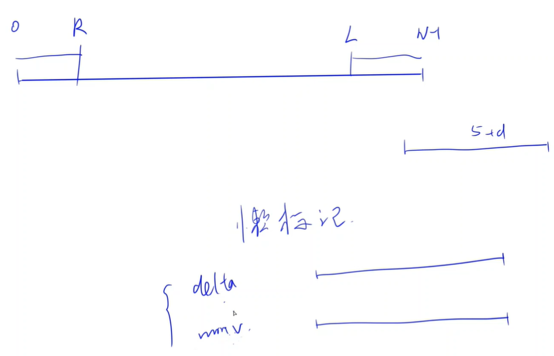

<!-- @import "[TOC]" {cmd="toc" depthFrom=1 depthTo=6 orderedList=false} -->

<!-- code_chunk_output -->

- [数组去重](#数组去重)
- [构造字符串](#构造字符串)
- [环形数组（线段树模板题）](#环形数组线段树模板题)

<!-- /code_chunk_output -->

没参加。

### 数组去重

给定一个长度为 $n$ 的整数数组 $a_1,a_2,...,a_n$。

<p>现在要进行数组去重。</p>

<p>对于数值相同的元素，只保留位于数组最右边的那个。</p>

<p>去重完成后，剩余所有元素的相对位置应保持不变。</p>

<p>输出去重后的数组。</p>

<h4>输入格式</h4>

第一行包含整数 $T$，表示共有 $T$ 组测试数据。

每组数据第一行包含整数 $n$。

第二行包含 $n$ 个整数 $a_1,a_2,...,a_n$。

<h4>输出格式</h4>

<p>每组数据输出占两行，第一行输出去重后的数组长度，第二行输出去重后的数组。</p>

<p>整数之间单个空格隔开。</p>

<h4>数据范围</h4>

- 前三个测试点满足 $1 \le n \le 6$。
- 所有测试点满足 $1 \le T \le 20$，$1 \le n \le 50$，$1 \le a_i \le 1000$。

<h4>输入样例1：</h4>

<pre><code>
1
6
1 5 5 1 6 1
</code></pre>

<h4>输出样例1：</h4>

<pre><code>
3
5 6 1 
</code></pre>

<h4>输入样例2：</h4>

<pre><code>
1
5
2 4 2 4 4
</code></pre>

<h4>输出样例2：</h4>

<pre><code>
2
2 4 
</code></pre>

<h4>输入样例3：</h4>

<pre><code>
1
5
6 6 6 6 6
</code></pre>

<h4>输出样例3：</h4>

<pre><code>
1
6
</code></pre>

```cpp
#include <iostream>
#include <cstring>
#include <algorithm>
#include <unordered_set>
#include <vector>
using namespace std;

const int N = 1010;
int a[N];

int main()
{
    int T;
    cin >> T;
    while (T --)
    {
        int n;
        cin >> n;
        for (int i = 0; i < n; ++ i) scanf("%d", &a[i]);
        unordered_set<int> hash;
        vector<int> res;
        for (int i = n - 1; i >= 0; -- i)
        {
            if (!hash.count(a[i]))
            {
                res.push_back(a[i]);
                hash.insert(a[i]);
            }
        }
        reverse(res.begin(), res.end());
        printf("%d\n", res.size());
        for (int i = 0; i < res.size(); i ++ )
            printf("%d ", res[i]);
        puts("");
    }
}
```

我用了一些数据结构，如上。而 y 总的代码使用了两层 `for` 循环（可能是考虑到 $n$ 不是很大），当 `w[i] == w[j]` 时，就把 `w[i]` 置为 `-1` 。而我是直接从右往左遍历的，时间复杂度更低。

### 构造字符串

给定一个长度为 $n$ 的由小写字母构成的字符串 $s$。

请你构造一个长度为 $k$ 的由小写字母构成的字符串 $t$。

要求，字符串 $t$ 需满足：
- 字符串 $t$ 在字典序上大于字符串 $s$。
- 字符串 $t$ 的字母集是字符串 $s$ 的字母集的子集。一个字符串的字母集是指该字符串包含的所有不同字母的集合，例如 <code>abadaba</code> 的字母集为 $\{a,b,d\}$。
- 字符串 $t$ 在字典序上尽可能小。

<p>保证答案存在。</p>

<h4>输入格式</h4>

第一行包含整数 $T$，表示共有 $T$ 组测试数据。

每组数据第一行包含两个整数 $n$ 和 $k$。

第二行包含一个长度为 $n$ 的字符串表示 $s$。

<h4>输出格式</h4>

每组数据输出一行满足所有条件的字符串 $t$。

<h4>数据范围</h4>

- 前三个测试点满足 $1 \le n,k \le 3$。
- 所有测试点满足 $1 \le T \le 10$，$1 \le n,k \le 10^5$。
- 同一测试点内，所有 $n$ 的和不超过 $10^5$，所有 $k$ 的和不超过 $10^5$。

<h4>输入样例：</h4>

<pre><code>
4
3 3
abc
3 2
abc
3 3
ayy
2 3
ba
</code></pre>

<h4>输出样例：</h4>

<pre><code>
aca
ac
yaa
baa
</code></pre>

思路：分情况讨论
- 当 k 大于 n 时，前 n 位不变，我们让 n 位开始填补出现过的最小字符就行
- 当 k 小于等于 n 时，我们从原字符串 k - 1 位开始往前找，如果当前字符还有变小的可能，那么就让其变小，寻找停止，输出新字符串

```cpp
#include <iostream>
#include <cstring>
#include <algorithm>
using namespace std;

int n, k;
bool used[26];
string s, t;

string tail()
{
    int i = 0;
    for (; i < 26; ++ i)
        if (used[i]) break;
    char a = 'a' + i;
    string res(k - n, a);
    return res;
}

string get()
{
    char max_char;
    for (int i = 25; i >= 0; -- i)
    {
        if (used[i])
        {
            max_char = 'a' + i;
            break;
        }
    }
    char min_char;
    for (int i = 0; i < 26; ++ i)
    {
        if (used[i])
        {
            min_char = 'a' + i;
            break;
        }
    }
    
    int i = k - 1;
    for (; i >= 0; -- i)
    {
        if (s[i] != max_char) break;
    }
    
    string res1 = s.substr(0, i);
    string res2;
    for (int j = s[i] - 'a' + 1; j < 26; ++ j)
    {
        if (used[j])
        {
            res2 = (char) 'a' + j;
            break;
        }
    }
    string res3(k - i - 1, min_char);

    return res1 + res2 + res3;
}

int main()
{
    int T;
    cin >> T;
    while (T --)
    {
        cin >> n >> k;
        cin >> s;
        memset(used, 0, sizeof used);
        for (int i = 0; i < s.size(); ++ i) used[s[i] - 'a'] = true;
        if (k > n)
        {
            t = s + tail();
        }
        else
        {
            t = get();
        }
        cout << t << endl;
    }
}
```

可以看出我的代码思路很清晰，但是写得有一点冗余。

看看 y 总的代码。

```cpp
#include <iostream>
#include <cstring>
#include <algorithm>

using namespace std;

const int N = 100010;

int n, k;
char s1[N], s2[N];
bool st[26];

char get_min()
{
    for (int i = 0; i < 26; i ++ )
        if (st[i])
            return i + 'a';
    return -1;
}

char get_next(int t)
{
    for (int i = t + 1; i < 26; i ++ )
        if (st[i])
            return i + 'a';
    return -1;
}

int main()
{
    int T;
    scanf("%d", &T);
    while (T -- )
    {
        scanf("%d%d", &n, &k);
        scanf("%s", s1);
        memset(st, 0, sizeof st);
        for (int i = 0; i < n; i ++ ) st[s1[i] - 'a'] = true;
        if (k > n)
        {
            printf("%s", s1);
            char c = get_min();
            for (int i = n; i < k; i ++ ) printf("%c", c);
            puts("");
        }
        else
        {
            s2[k] = 0;
            for (int i = k - 1; i >= 0; i -- )
            {
                char c = get_next(s1[i] - 'a');
                if (c != -1)
                {
                    s2[i] = c;
                    for (int j = 0; j < i; j ++ ) s2[j] = s1[j];
                    break;
                }
                s2[i] = get_min();
            }
            puts(s2);
        }
    }

    return 0;
}

// 作者：yxc
// 链接：https://www.acwing.com/activity/content/code/content/1634481/
// 来源：AcWing
// 著作权归作者所有。商业转载请联系作者获得授权，非商业转载请注明出处。
```

很简洁。

**经验：**
- `char s[]; puts(s);` 中， `puts` 遇到 `\0` 注意是 `char s[k] = 0` 而不是 `char s[k] = '0'` 字符串停止输出。

### 环形数组（线段树模板题）

给定一个长度为 $n$ 的<strong>环形数组</strong> $a_0,a_1,...,a_{n-1}$。

现在要对该数组进行 $m$ 次操作。

操作分为以下两种：
- 增值操作 <code>l r d</code>，将区间 $[l,r]$ 上的每个元素都增加 $d$。
- 求最小值操作 <code>l r</code>，输出区间 $[l,r]$ 内的所有元素的最小值。

注意，数组是环形的，所以当 $n=5$ 时，区间 $[3,1]$ 内的所有元素依次为 $a_3,a_4,a_0,a_1$。

<h4>输入格式</h4>

第一行包含整数 $n$，表示数组长度。

第二行包含 $n$ 个整数，表示 $a_0,a_1,...,a_{n-1}$。

第三行包含整数 $m$，表示操作数。

接下来 $m$ 行，每行描述一个操作，对于第 $i$ 行，如果包含两个整数 $l,r$，则表示第 $i$ 个操作为求最小值操作；如果包含三个整数 $l,r,d$，则表示第 $i$ 个操作为增值操作。

<h4>输出格式</h4>

<p>每个求最小值操作输出一行结果。</p>

<h4>数据范围</h4>

- 前三个测试点满足 $1 \le n,m \le 10$。
- 所有测试点满足 $1 \le n \le 2 \times 10^5$，$0 \le m \le 2 \times 10^5$，$-10^6 \le a_i \le 10^6$，$0 \le l,r \le n-1$，$-10^6 \le d \le 10^6$。

<h4>输入样例：</h4>

<pre><code>
4
1 2 3 4
4
3 0
3 0 -1
0 1
2 1
</code></pre>

<h4>输出样例：</h4>

<pre><code>
1
0
0
</code></pre>



线段树模板题。遇到 `L > R` 则分成两个区间操作就行。

注意懒标记的规定。

提高课还没学到线段树，这题先跳过。

```cpp
#include <iostream>
#include <cstring>
#include <algorithm>

using namespace std;

typedef long long LL;
const int N = 200010;
const LL INF = 1e18;

int n, m;
int w[N];

struct Node
{
    int l, r;
    LL dt, mn;
}tr[N * 4];

void pushup(int u)
{
    tr[u].mn = min(tr[u << 1].mn, tr[u << 1 | 1].mn);
}

void pushdown(int u)
{
    auto &root = tr[u], &l = tr[u << 1], &r = tr[u << 1 | 1];
    l.dt += root.dt, l.mn += root.dt;
    r.dt += root.dt, r.mn += root.dt;
    root.dt = 0;
}

void build(int u, int l, int r)
{
    if (l == r) tr[u] = {l, r, 0, w[l]};
    else
    {
        tr[u] = {l, r};
        int mid = l + r >> 1;
        build(u << 1, l, mid), build(u << 1 | 1, mid + 1, r);
        pushup(u);
    }
}

void update(int u, int l, int r, int d)
{
    if (tr[u].l >= l && tr[u].r <= r)
    {
        tr[u].dt += d, tr[u].mn += d;
    }
    else
    {
        pushdown(u);
        int mid = tr[u].l + tr[u].r >> 1;
        if (l <= mid) update(u << 1, l, r, d);
        if (r > mid) update(u << 1 | 1, l, r, d);
        pushup(u);
    }
}

LL query(int u, int l, int r)
{
    if (tr[u].l >= l && tr[u].r <= r)
    {
        return tr[u].mn;
    }
    else
    {
        pushdown(u);
        int mid = tr[u].l + tr[u].r >> 1;
        LL res = INF;
        if (l <= mid ) res = query(u << 1, l, r);
        if (r > mid) res = min(res, query(u << 1 | 1, l, r));
        return res;
    }
}

int main()
{
    scanf("%d", &n);
    for (int i = 0; i < n; i ++ ) scanf("%d", &w[i]);
    build(1, 0, n - 1);
    scanf("%d", &m);
    while (m -- )
    {
        int l, r, d;
        char c;
        scanf("%d %d%c", &l, &r, &c);
        if (c == '\n')
        {
            if (l <= r) printf("%lld\n", query(1, l, r));
            else printf("%lld\n", min(query(1, l, n - 1), query(1, 0, r)));
        }
        else
        {
            scanf("%d", &d);
            if (l <= r) update(1, l, r, d);
            else update(1, l, n - 1, d), update(1, 0, r, d);
        }
    }

    return 0;
}

// 作者：yxc
// 链接：https://www.acwing.com/activity/content/code/content/1634560/
// 来源：AcWing
// 著作权归作者所有。商业转载请联系作者获得授权，非商业转载请注明出处。
```

**经验：**
- 使用 `%c` 读入字符来判断是不是 `'\n'` 。这个适于数据规整的适于数据规整的 OJ 。
