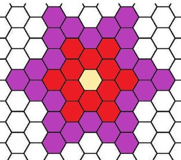

<!-- @import "[TOC]" {cmd="toc" depthFrom=1 depthTo=6 orderedList=false} -->

<!-- code_chunk_output -->

- [不同的数](#不同的数)
- [看图做题](#看图做题)
- [砍树（思维题）](#砍树思维题)

<!-- /code_chunk_output -->

没提交。前两题简单。

### 不同的数

给定一个包含 $n$ 个整数的数组 $a_1,a_2,...,a_n$。

请你从中找出 $k$ 个元素，并要求找出的元素值两两不同。

<h4>输入格式</h4>

第一行包含两个整数 $n,k$。

第二行包含 $n$ 个整数 $a_1,a_2,...,a_n$。

<h4>输出格式</h4>

如果无法找出满足条件的 $k$ 个数，则输出一行 `NO`。

否则，第一行输出 `YES`，第二行输出范围在 $[1,n]$ 的 $k$ 个不同的数，表示你找出的 $k$ 个元素的<strong>下标</strong>。

元素下标 $1 \sim n$。

输出下标顺序随意，任意合理方案均可。

<h4>数据范围</h4>

- 前三个测试点满足，$1 \le k \le n \le 5$。
- 所有测试点满足，$1 \le k \le n \le 100$，$1 \le a_i \le 100$。

<h4>输入样例：</h4>

```
5 3
15 13 15 15 12
```

<h4>输出样例：</h4>

```
YES
1 2 5
```

```cpp
#include <iostream>
using namespace std;

const int N = 110;
bool a[N];
int ans[N];

int main()
{
    int n, k;
    int cnt = 0;
    cin >> n >> k;
    
    for (int i = 1; i <= n; ++ i)
    {
        int b;
        cin >> b;
        if (!a[b])
        {
            a[b] = true;
            ans[cnt ++] = i;
        }
    }
    
    if (cnt < k) cout << "NO" << endl;
    else
    {
        cout << "YES" << endl;
        for (int i = 0; i < k; ++ i) cout << ans[i] << ' ';
    }
}
```

### 看图做题



<h4>输入格式</h4>

一个整数 $n$。

<h4>输出格式</h4>

一个整数 $m$。

<h4>数据范围</h4>

- 前三个测试点满足 $1 \le n \le 3$。
- 所有测试点满足 $1 \le n \le 18257$，$1 \le m \le 2 \times 10^9$。

<h4>输入样例1：</h4>

```
1
```

<h4>输出样例1：</h4>

```
1
```

<h4>输入样例2：</h4>

```
2
```

<h4>输出样例2：</h4>

```
13
```

<h4>输入样例3：</h4>

```
3
```

<h4>输出样例3：</h4>

```
37
```

<h4>输入样例4：</h4>

```
100
```

<h4>输出样例4：</h4>

```
59401
```

```cpp
// 1 12 24 36
// 12/6 = 2 24/6 = 4 36/6=6
#include <iostream>
#include <cstring>
#include <algorithm>
using namespace std;

int dfs(int n)
{
    if (n == 1) return 1;
    return dfs(n-1) + 2 * (n - 1) * 6;
}

int main()
{
    int n;
    cin >> n;
    cout << dfs(n);
}
```

### 砍树（思维题）

给定一棵包含 $n$ 个节点的树。

你的任务是从树中删除<strong>尽可能多</strong>的边，使得剩余图形的所有连通分量都具有偶数个节点。

<h4>输入格式</h4>

第一行包含整数 $n$。

接下来 $n-1$ 行，每行包含两个整数 $a,b$，表示节点 $a$ 和 $b$ 之间存在一条边。

节点编号 $1 \sim n$。

保证给出图形是一棵树。

<h4>输出格式</h4>

输出一个整数表示可以删除的最大可能边数。

如果无论如何都不可能使得剩余图形的所有连通分量都具有偶数个节点，则输出 $-1$。

<h4>数据范围</h4>

- 前六个测试点满足，$1 \le n \le 10$。
- 所有测试点满足，$1 \le n \le 10^5$，$1 \le a,b \le n$。

<h4>输入样例1：</h4>

```
4
2 4
4 1
3 1
```

<h4>输出样例1：</h4>

```
1
```

<h4>输入样例2：</h4>

```
3
1 2
1 3
```

<h4>输出样例2：</h4>

```
-1
```

```cpp
// 对于一条边，两边都是奇数个，则一定不可以删（奇数个数的连通分量无法通过划分满足要求）
// 对于一条边，两边都是偶数个，则一定要删（无论你删不删，该边两侧的点最终都会处于一个偶数连通分量中）

#include <iostream>
#include <cstring>
#include <algorithm>

using namespace std;

const int N = 100010, M = N * 2;

int n;
int h[N], e[M], ne[M], idx;
int ans;

void add(int a, int b)  // 添加一条边a->b
{
    e[idx] = b, ne[idx] = h[a], h[a] = idx ++ ;
}

int dfs(int u, int father)
{
    int sz = 1;  // 子树个数（包括本点 u）
    for (int i = h[u]; ~i; i = ne[i])
    {
        int j = e[i];
        if (j == father) continue;
        int s = dfs(j, u);
        if (s % 2 == 0) ans ++ ;  // 如果子树节点个数为为偶数，删除该边
        sz += s;
    }
    return sz;
}

int main()
{
    scanf("%d", &n);

    if (n % 2)
    {
        puts("-1");
        return 0;
    }

    memset(h, -1, sizeof h);

    for (int i = 0; i < n - 1; i ++ )
    {
        int a, b;
        scanf("%d%d", &a, &b);
        add(a, b), add(b, a);
    }

    dfs(1, -1);

    printf("%d\n", ans);
    return 0;
}
```
