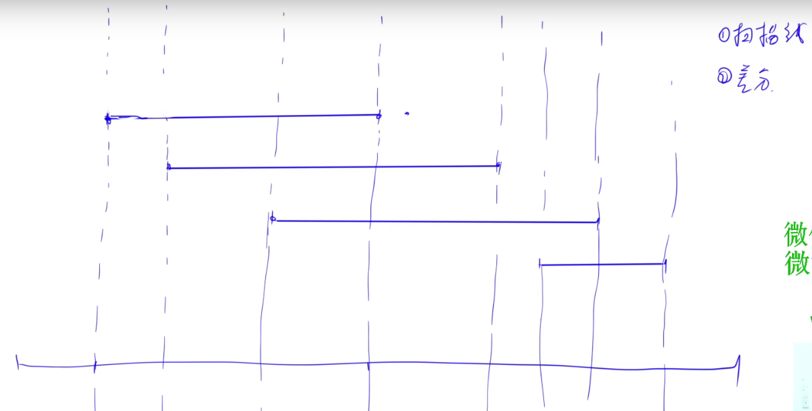

<!-- @import "[TOC]" {cmd="toc" depthFrom=1 depthTo=6 orderedList=false} -->

<!-- code_chunk_output -->

- [4194. Pow](#4194-pow)
- [4195. 线段覆盖（优化读入/扫描线/差分）](#4195-线段覆盖优化读入扫描线差分)
- [4196. 最短路径（记得开long long）](#4196-最短路径记得开long-long)

<!-- /code_chunk_output -->

没参加。

### 4194. Pow

给定两个整数 $n$ 和 $t$，请你计算 $n \times (1.00011^t)$ 的值。

结果保留 $6$ 位小数。

<h4>输入格式</h4>

一行，两个整数 $n$ 和 $t$。

<h4>输出格式</h4>

一个实数，表示答案。

注意，答案保留 $6$ 位小数。

<h4>数据范围</h4>

所有测试点满足 $1000 \le n \le 10000$，$0 \le t \le 10000$。

<h4>输入样例：</h4>

```
1000 100
```

<h4>输出样例：</h4>

```
1011.060111
```

```cpp
#include <iostream>
using namespace std;

int n, t;

int main()
{
    cin >> n >> t;
    double res = n;
    for (int i = 0; i < t; ++ i) res *= 1.00011;
    // 用 n * pow(1.00011, t) 也行
    printf("%.6lf\n", res);
}
```

### 4195. 线段覆盖（优化读入/扫描线/差分）

在一个坐标轴上有 $n$ 条线段。

每条线段的每个端点的坐标都为整数。

可能存在退化成点的线段。

线段之间可以相互交叉、嵌套甚至重合。

请你计算，对于每个 $k \in \lbrace 1, 2, ..., n \rbrace $，坐标轴中共有多少个<strong>整数坐标</strong>的点满足恰好被 $k$ 条线段覆盖。

注意，左右端点分别为 $l_i,r_i$ 的线段覆盖点 $x$ 当且仅当 $l_i \le x \le r_i$。

<h4>输入格式</h4>

第一行包含整数 $n$。

接下来 $n$ 行，每行包含两个整数 $l_i,r_i$，表示一条线段的左右端点。

<h4>输出格式</h4>

一行 $n$ 个整数，其中第 $i$ 个整数表示坐标轴中满足恰好被 $i$ 条线段覆盖的<strong>整数坐标</strong>的点的数量。

<h4>数据范围</h4>

- 前三个测试点满足 $1 \le n \le 3$。
- 所有测试点满足 $1 \le n \le 2 \times 10^5$，$0 \le l_i \le r_i \le 10^{18}$。

<h4>输入样例1：</h4>

```
3
0 3
1 3
3 8
```

<h4>输出样例1：</h4>

```
6 2 1
```

<h4>输入样例2：</h4>

```
3
1 3
2 4
5 7
```

<h4>输出样例2：</h4>

```
5 2 0
```



这题有两种思路，最后的代码都是一样的。

一个是计算几何中的`扫描线`的概念：
- 想象把线段从左往右排序，如上图，遇到左端端点 `l` 则 `hash[l] += 1` ，表示这个端点 `l` 右边的点（含 `l`） 所有点都被覆盖了一次
- 接着遇到某个线段的右端点 `r` ，则 `hash[r + 1] -= 1` 表示端点 `r + 1` 右边的点覆盖次数都减少一次
- 如此，最后从左往右遍历 `hash` 对 `key` 累加求线段长度就好

一个是差分思想：
- 遇到左端点，则相当于之后的所有值 `+1`
- 遇到右端点，则相当于右端点之后（不含右端点）的所有值 `-1`
- 差分注意要累加变成原序列

```cpp
// 注意读入规模有 20 万
#include <iostream>
#include <cstring>
#include <algorithm>
#include <map>

using namespace std;

typedef long long LL;

const int N = 200010;

map<LL, int> b;
LL ans[N];

int main()
{
    int n;
    scanf("%d", &n);
    for (int i = 0; i < n; i ++ )
    {
        LL l, r;
        scanf("%lld%lld", &l, &r);
        b[l] ++, b[r + 1] -- ;
    }

    LL sum = 0, last = -1;
    for (auto&& [k, v]: b)  // 经验：对于哈希可以 auto&& [k, v] : hash
    {
        if (last != -1) ans[sum] += k - last;
        // 累加端点带来的出现次数
        sum += v;
        last = k;
    }

    for (int i = 1; i <= n; i ++ )
        printf("%lld ", ans[i]);

    return 0;
}
```

**经验：**
- C++ 中对于哈希求迭代可以 `auto&& [t, v]: hash`

### 4196. 最短路径（记得开long long）

给定一个 $n$ 个点 $m$ 条边的的无向图。

点的编号从 $1$ 到 $n$。

图中可能包含重边和自环。

请你找到并输出一条从点 $1$ 到点 $n$ 的最短路径。

<h4>输入格式</h4>

第一行包含两个整数 $n,m$。

接下来 $m$ 行，每行包含三个整数 $a,b,w$，表示点 $a$ 和点 $b$ 之间存在一条无向边，边长为 $w$。

<h4>输出格式</h4>

如果最短路径不存在，则输出 $-1$。

否则，在一行内输出从点 $1$ 到点 $n$ 的最短路径中依次包含的点的编号，各点编号之间用空格隔开。

如果答案不唯一，输出任意合理方案均可。

<h4>数据范围</h4>

- 前六个测试点满足 $2 \le n \le 10$，$1 \le m \le 10$。
- 所有测试点满足 $2 \le n \le 10^5$，$1 \le m \le 10^5$，$1 \le a,b \le n$，$1 \le w \le 10^6$。

<h4>输入样例：</h4>

```
5 6
1 2 2
2 5 5
2 3 4
1 4 1
4 3 3
3 5 1
```

<h4>输出样例：</h4>

```
1 4 3 5
```

```cpp
// spfa
#include <iostream>
#include <cstring>
#include <algorithm>

using namespace std;

typedef long long LL;

const int N = 100010, M = 200010;

int n, m;
int h[N], e[M], w[M], ne[M], idx;
int q[N], pre[N];
LL dist[N];
bool st[N];
int path[N];

void add(int a, int b, int c)  // 添加一条边a->b，边权为c
{
    e[idx] = b, w[idx] = c, ne[idx] = h[a], h[a] = idx ++ ;
}

void spfa()  // 求1号点到n号点的最短路距离
{
    int hh = 0, tt = 0;
    memset(dist, 0x3f, sizeof dist);
    memset(pre, -1, sizeof pre);
    dist[1] = 0;
    q[tt ++ ] = 1;
    st[1] = true;

    while (hh != tt)
    {
        int t = q[hh ++ ];
        if (hh == N) hh = 0;
        st[t] = false;

        for (int i = h[t]; i != -1; i = ne[i])
        {
            int j = e[i];
            if (dist[j] > dist[t] + w[i])
            {
                dist[j] = dist[t] + w[i];
                pre[j] = t;
                if (!st[j])     // 如果队列中已存在j，则不需要将j重复插入
                {
                    q[tt ++ ] = j;
                    if (tt == N) tt = 0;
                    st[j] = true;
                }
            }
        }
    }
}


int main()
{
    scanf("%d%d", &n, &m);
    memset(h, -1, sizeof h);

    while (m -- )
    {
        int a, b, c;
        scanf("%d%d%d", &a, &b, &c);
        add(a, b, c), add(b, a, c);
    }

    spfa();

    if (pre[n] == -1) puts("-1");
    else
    {
        int cnt = 0;
        for (int i = n; i != -1; i = pre[i])
            path[cnt ++ ] = i;

        for (int i = cnt - 1; i >= 0; i -- )
            printf("%d ", path[i]);
    }

    return 0;
}
```

```cpp
#include <iostream>
#include <cstring>
#include <algorithm>
#include <queue>

#define x first
#define y second


using namespace std;

typedef long long LL;
typedef pair<int, int> PII;

const int N = 100010, M = 200010;
const LL INF = 0x3f3f3f3f3f3f3f3fll;

int n, m;
int h[N], e[M], w[M], ne[M], idx;
LL dist[N];
int pre[N], path[N];
bool st[N];

void add(int a, int b, int c)  // 添加一条边a->b，边权为c
{
    e[idx] = b, w[idx] = c, ne[idx] = h[a], h[a] = idx ++ ;
}

void dijkstra()  // 求1号点到n号点的最短路距离
{
    memset(dist, 0x3f, sizeof dist);
    memset(pre, -1, sizeof pre);
    dist[1] = 0;
    priority_queue<PII, vector<PII>, greater<PII>> heap;
    heap.push({0, 1});

    while (heap.size())
    {
        auto t = heap.top();
        heap.pop();

        int ver = t.second, distance = t.first;

        if (st[ver]) continue;
        st[ver] = true;

        for (int i = h[ver]; i != -1; i = ne[i])
        {
            int j = e[i];
            if (dist[j] > dist[ver] + w[i])
            {
                pre[j] = ver;
                dist[j] = dist[ver] + w[i];
                heap.push({dist[j], j});
            }
        }
    }
}


int main()
{
    scanf("%d%d", &n, &m);
    memset(h, -1, sizeof h);

    while (m -- )
    {
        int a, b, c;
        scanf("%d%d%d", &a, &b, &c);
        add(a, b, c), add(b, a, c);
    }

    dijkstra();

    if (dist[n] == INF) puts("-1");
    else
    {
        int cnt = 0;
        for (int i = n; i != -1; i = pre[i])
            path[cnt ++ ] = i;

        for (int i = cnt - 1; i >= 0; i -- )
            printf("%d ", path[i]);
    }

    return 0;
}
```
