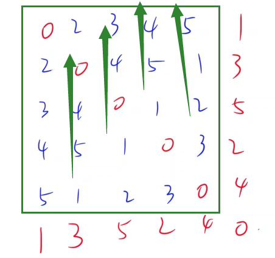

<!-- @import "[TOC]" {cmd="toc" depthFrom=1 depthTo=6 orderedList=false} -->

<!-- code_chunk_output -->

- [4203. 寻找子串（妙用 `string.find`）](#4203-寻找子串妙用-stringfind)
- [4204. 构造矩阵（找规律/构造：大胆假设，小心论证）](#4204-构造矩阵找规律构造大胆假设小心论证)
- [4205. 树的增边（二分图染色）](#4205-树的增边二分图染色)

<!-- /code_chunk_output -->

没参加。

### 4203. 寻找子串（妙用 `string.find`）

给定一个长度为 $n$ 的 $01$ 字符串。

请你判断，其中是否存在子串 $1111111$ 或 $0000000$。

<h4>输入格式</h4>

一行，一个 $01$ 字符串。

<h4>输出格式</h4>

如果存在子串 $1111111$ 或 $0000000$，则输出 `YES`，否则输出 `NO`。

<h4>数据范围</h4>

所有测试点满足 $1 \le n \le 100$。

<h4>输入样例1：</h4>

```
001001
```

<h4>输出样例1：</h4>

```
NO
```

<h4>输入样例2：</h4>

```
1000000001
```

<h4>输出样例2：</h4>

```
YES
```

```cpp
#include <iostream>
#include <cstring>
#include <algorithm>

using namespace std;

int main()
{
    string str;
    cin >> str;

    if (str.find("1111111") != -1 || str.find("0000000") != -1)
        puts("YES");
    else
        puts("NO");

    return 0;
}
```

### 4204. 构造矩阵（找规律/构造：大胆假设，小心论证）

请你构造一个 $n \times n$ 的整数矩阵。

要求，矩阵满足下列所有条件：

<ol>
<li>矩阵中的所有元素的取值范围为 $[0,n-1]$。</li>
<li>矩阵主对角线上的所有元素都为 $0$。主对角线是指从左上角到右下角这一斜线方向的对角线。</li>
<li>该矩阵是对称矩阵。对称矩阵是指以主对角线为对称轴，各元素对应相等的矩阵。</li>
<li>同一行上的所有元素两两不同。</li>
<li>同一列上的所有元素两两不同。</li>
</ol>
<h4>输入格式</h4>

一个整数 $n$。

<h4>输出格式</h4>

共 $n$ 行，每行 $n$ 个空格隔开的整数，表示整个矩阵。

如果方案不唯一，输出任意合理方案均可。

<h4>数据范围</h4>

- 前三个测试点满足 $2 \le n \le 10$。
- 所有测试点满足 $2 \le n \le 1000$，$n$ 保证是偶数。

<h4>输入样例1：</h4>

```
2
```

<h4>输出样例1：</h4>

```
0 1
1 0
```

<h4>输入样例2：</h4>

```
4
```

<h4>输出样例2：</h4>

```
0 1 3 2
1 0 2 3
3 2 0 1
2 3 1 0
```



如上，对于 `n = 6` ，首先将 `1 2 3 4 5` 分别按照列列出来，并且每次向上走一格，然后把对角线抠出来。

```cpp
#include <iostream>
#include <cstring>
#include <algorithm>

using namespace std;

const int N = 1010;

int n;
int a[N][N];

int main()
{
    scanf("%d", &n);

    for (int i = 0; i < n - 1; i ++ )
        for (int j = 0; j < n - 1; j ++ )
            a[i][j] = (i + j) % (n - 1) + 1;

    for (int i = 0; i < n - 1; i ++ )
    {
        a[i][n - 1] = a[n - 1][i] = a[i][i];
        a[i][i] = 0;
    }

    for (int i = 0; i < n; i ++ )
    {
        for (int j = 0; j < n; j ++ )
            printf("%d ", a[i][j]);
        puts("");
    }

    return 0;
}
```

### 4205. 树的增边（二分图染色）

- 二分图又称作二部图，是图论中的一种特殊模型。
- 设 $G=(V,E)$ 是一个无向图，如果顶点 $V$ 可分割为两个互不相交的子集 $(A,B)$，并且图中的每条边 $(i,j)$ 所关联的两个顶点 $i$ 和 $j$ 分别属于这两个不同的顶点集 $(i \in A,j \in B)$，则称图 $G$ 为一个二分图。 
- 所有的树都是二分图。

给定一个 $n$ 个节点的树。

树的节点编号为 $1 \sim n$。

请你为这棵树增加一些边，要求增边后的图形仍是二分图，并且不含重边和自环。

请问，最多可以增加多少条边。

<h4>输入格式</h4>

第一行包含整数 $n$，表示树的节点数量。

接下来 $n-1$ 行，每行包含两个整数 $a,b$，表示节点 $a$ 和节点 $b$ 之间存在一条边。

<h4>输出格式</h4>

一个整数，表示可以增加的边的最大数量。

<h4>数据范围</h4>

- 前三个测试点满足 $1 \le n \le 10$。
- 所有测试点满足 $1 \le n \le 10^5$，$1 \le a,b \le n$。

<h4>输入样例1：</h4>

```
3
1 2
1 3
```

<h4>输出样例1：</h4>

```
0
```

<h4>输入样例2：</h4>

```
5
1 2
2 3
3 4
4 5
```

<h4>输出样例2：</h4>

```
2
```

**二分图等价于二染色，等价于不存在奇环。**

```cpp
#include <iostream>
#include <cstring>
#include <algorithm>

using namespace std;

typedef long long LL;

const int N = 100010, M = N * 2;

int n, m;
int h[N], e[M], ne[M], idx;

void add(int a, int b)
{
    e[idx] = b, ne[idx] = h[a], h[a] = idx ++ ;
}

void dfs(int u, int c, int fa)
{
    if (!c) m ++ ;  // 颜色为 0 的节点数量 + 1

    for (int i = h[u]; ~i; i = ne[i])
    {
        int j = e[i];
        if (j == fa) continue;
        dfs(j, !c, u);
    }
}

int main()
{
    scanf("%d", &n);
    memset(h, -1, sizeof h);

    for (int i = 0; i < n - 1; i ++ )
    {
        int a, b;
        scanf("%d%d", &a, &b);
        add(a, b), add(b, a);
    }

    dfs(1, 0, 0);  // 节点，颜色，父节点

    printf("%lld\n", (LL)m * (n - m) - (n - 1));  // 全连接 - 已有连接

    return 0;
}
```
