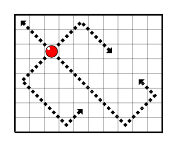

<!-- @import "[TOC]" {cmd="toc" depthFrom=1 depthTo=6 orderedList=false} -->

<!-- code_chunk_output -->

- [4718. 摆放棋子（并查集/找规律）](#4718-摆放棋子并查集找规律)

<!-- /code_chunk_output -->

T3 自己的思路有点怪，但总觉得其实没错。考完继续做了很久，都没 debug 出来。算了还是看看“正确”的思路吧。

### 4718. 摆放棋子（并查集/找规律）

给定一个 $n \times m$ 的国际象棋棋盘（即一个 $n \times m$ 的方格矩阵）。

我们知道传统国际象棋中，主教（象）的行走规则是只能斜走，格数不限，但不可转向。

现在，我们对主教进行了修改，不妨称加强后的主教为大主教。

大主教仍然只能斜走，格数不限，但是当其走到棋盘边缘的方格时，它可以发生反射并继续移动，<strong>注意，如果没有走到棋盘边缘，则不能自行改变移动方向。</strong>

更具体地说，当它到达棋盘边（但并非角）上的方格时，它可以将移动方向改变 $90$ 度并继续移动，当它到达棋盘角上的方格时，它可以将移动方向改变 $180$ 度并继续移动。



请你计算，棋盘中共有多少种不同的移动轨迹。

<h4>输入格式</h4>

共一行，包含两个整数 $n,m$。

<h4>输出格式</h4>

一个整数，表示棋盘中移动轨迹的数量。

<h4>数据范围</h4>

前 $6$ 个测试点满足 $2 \le n,m \le 4$。

所有测试点满足 $2 \le n,m \le 10^6$。

<h4>输入样例1：</h4>
<pre><code>3 4
</code></pre>

<h4>输出样例1：</h4>
<pre><code>2
</code></pre>

<h4>输入样例2：</h4>
<pre><code>3 3
</code></pre>

<h4>输出样例2：</h4>
<pre><code>3
</code></pre>

这题是有规律的，是 CF 原题（https://codeforces.com/blog/entry/1731），但是出题人都说 But this formula is difficult for prove.

```cpp
#include <iostream>
#include <cstring>
#include <algorithm>
using namespace std;

int main()
{
    int n, m;
    scanf("%d%d", &n, &m);
    printf("%d", __gcd(n - 1, m - 1) + 1);
}
```

好了，来看看 y 总的“正确”做法。我错在哪呢？我想复杂了，我让一个点不断去“碰撞模拟”所有路径，实际上，将所有边界点放入并查集是同理的。

```cpp
// 把边界上的点并查集合并就可以
#include <iostream>
#include <cstring>
#include <algorithm>

using namespace std;

const int N = 4000010;

int n, m;
int p[N];

// 获取边界点对应的 p[index] index
int get(int x, int y)
{
    if (x == 1) return y;
    if (y == m) return m + x - 1;
    if (x == n) return m + n - 1 + m - y;
    if (y == 1) return m + n - 1 + m - 1 + n - x;
    return 0;
}

int find(int x)
{
    if (p[x] != x) p[x] = find(p[x]);
    return p[x];
}

int merge(int x, int y)
{
    x = find(x), y = find(y);
    p[x] = y;
}

int main()
{
    cin >> n >> m;
    for (int i = 1; i <= 2 * (n + m) - 4; i ++ ) p[i] = i;

    if (n > m) swap(n, m);

    for (int i = 1; i <= m; i ++ )
    {
        if (i <= n)
        {
            merge(get(1, i), get(i, 1));
            merge(get(n, i), get(n - i + 1, 1));
        }
        else
        {
            merge(get(1, i), get(n, i - n + 1));
            merge(get(n, i), get(1, i - n + 1));
        }

        if (m - i + 1 <= n)
        {
            merge(get(1, i), get(m - i + 1, m));
            merge(get(n, i), get(n - m + i, m));
        }
        else
        {
            merge(get(1, i), get(n, i + n - 1));
            merge(get(n, i), get(1, i + n - 1));
        }
    }

    int res = 0;
    for (int i = 1; i <= 2 * (n + m) - 4; i ++ )
        if (p[i] == i)
            res ++ ;

    cout << res << endl;
    return 0;
}
```
