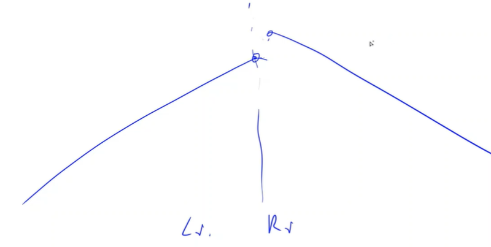
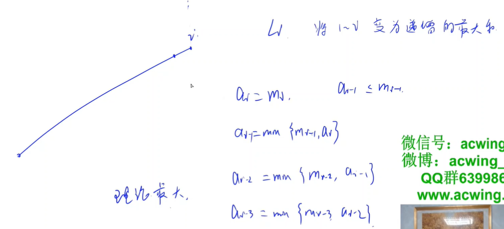
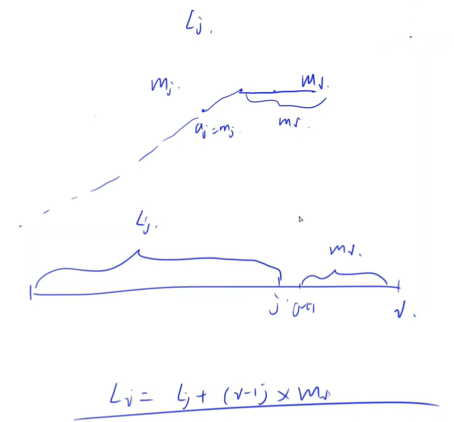

<!-- @import "[TOC]" {cmd="toc" depthFrom=1 depthTo=6 orderedList=false} -->

<!-- code_chunk_output -->

- [平衡数组（别被样例骗到）](#平衡数组别被样例骗到)
- [相等的和（想目标然后哈希）](#相等的和想目标然后哈希)
- [构造数组（单调栈）](#构造数组单调栈)

<!-- /code_chunk_output -->

### 平衡数组（别被样例骗到）

给定一个长度为 $n$ 的数组 $a_1,a_2,...,a_n$，其中 $a_i = i$。

现在，请你选择一个整数 $m$，并对该数组进行 $m$ 次操作。

对于第 $i$ 次操作（$i$ 从 $1$ 开始计数），你需要选定其中一个元素，并将选定元素以外的其他所有元素都增加 $i$。

你的目标是在 $m$ 次操作结束后，数组中各个元素的值都相等。

$m$ 不得超过 $1000$。

<p>请你输出具体合理方案。</p>

<h4>输入格式</h4>

第一行包含整数 $T$，表示共有 $T$ 组测试数据。

每组数据占一行，包含一个整数 $n$。

<h4>输出格式</h4>

<p>每组数据输出占两行。</p>

第一行输出操作次数 $m$。

第二行输出 $m$ 个整数 $p_1,p_2,...,p_n$，其中 $p_i$ 表示第 $i$ 次操作选中的元素的编号。

<p>保证一定有解。</p>

<p>输出任意合理方案均可。</p>

<h4>数据范围</h4>

本题共两个测试点。

小测试点，如样例所示。

大测试点满足：$1 \le T \le 100$，$2 \le n \le 100$。

<h4>输入样例：</h4>

<pre><code>
2
2
3
</code></pre>

<h4>输出样例：</h4>

<pre><code>
1
2
5
3 3 3 1 2
</code></pre>

**分析：**
- 我是伞兵😀
- 被样例骗了
- 第 i 从操作就是将这个数减 i
- 因此将第 i 个数减 i 不就行了

```cpp
#include <iostream>
#include <cstring>
#include <algorithm>
using namespace std;

const int N = 110;
int a[N];
int n;

int main()
{
    int T;
    cin >> T;
    while (T --)
    {
        cin >> n;
        printf("%d\n", n);
        for (int i = 1; i <= n; ++ i) printf("%d ", i);
        puts("");
    }
}
```

### 相等的和（想目标然后哈希）

给定 $k$ 个整数序列，其中第 $i$ 个序列的长度为 $l_i$。

<p>现在，请你进行以下操作：</p>

- 从 $k$ 个序列中，选出两个序列 $i,j(i \neq j)$。
- 删掉序列 $i$ 中的一个元素。
- 删掉序列 $j$ 中的一个元素。

要求：操作完成后，序列 $i$ 中的各元素之和等于序列 $j$ 中的各元素之和。

<p>输出合理操作方案。</p>

我们规定，空序列的各元素之和为 $0$。

<h4>输入格式</h4>

第一行包含整数 $k$，表示共有 $k$ 个序列。

每个序列的输入占两行。

第一行包含整数 $l_i$，表示序列长度。

第二行包含 $l_i$ 个整数 $a_1,a_2,...,a_{l_i}$，表示序列中各元素的值。

<h4>输出格式</h4>

<p>如果不存在合理方案，则输出一行 <code>NO</code>。</p>

<p>否则首先输出一行 <code>YES</code>。</p>

随后，第二行输出整数 $i$ 和 $x$，第三行输出整数 $j$ 和 $y$，表示选择序列 $i$ 和 $j$，删除序列 $i$ 中的第 $x$ 个元素以及序列 $j$ 中的第 $y$ 个元素。

序列和元素下标都从 $1$ 开始。

<p>输出任意合理方案即可。</p>

<h4>数据范围</h4>

- 前三个测试点满足 $2 \le k \le 5$，$1 \le l_i \le 10$。
- 全部测试点满足 $2 \le k \le 2 \times 10^5$，$1 \le l_i \le 2 \times 10^5$，$-10^4 \le a_i \le 10^4$
- 同一测试点内所有 $l_i$ 之和不超过 $2 \times 10^5$。

<h4>输入样例1：</h4>

<pre><code>
2
5
2 3 1 3 2
6
1 1 2 2 2 1
</code></pre>

<h4>输出样例1：</h4>

<pre><code>
YES
2 6
1 2
</code></pre>

<h4>输入样例2：</h4>

<pre><code>
3
1
5
5
1 1 1 1 1
2
2 3
</code></pre>

<h4>输出样例2：</h4>

<pre><code>
NO
</code></pre>

<h4>输入样例3：</h4>

<pre><code>
4
6
2 2 2 2 2 2
5
2 2 2 2 2
3
2 2 2
5
2 2 2 2 2
</code></pre>

<h4>输出样例3：</h4>

<pre><code>
YES
2 2
4 1
</code></pre>

**分析：**
- 我们想要减去一个数，然后让序列的和相等
- 因此对于某一个序列 $\{ a_i \}$ ，通过其和 $sum$ 构造新序列 $\{ sum - a_i \}$
- 如果其他序列对应的新序列与我这个序列的新序列元素有相等的，则说明这两个序列可以通过各减去其中一个元素，使得二者和相等

```cpp
#include <iostream>
#include <cstring>
#include <algorithm>
#include <unordered_map>
using namespace std;

const int N = 2e5 + 10;
int a[N];

typedef pair<int, int> PII;
#define x first
#define y second

int main()
{
    int m;
    cin >> m;
    
    unordered_map<int, PII> S;
    for (int i = 1; i <= m; ++ i)
    {
        int n;
        scanf("%d", &n);
        int sum = 0;
        for (int j = 1; j <= n; ++j)
        {
            scanf("%d", &a[j]);
            sum += a[j];
        }
        for (int j = 1; j <= n; ++ j)
        {
            int t = sum - a[j];
            if (S.count(t) && S[t].x != i)  // 还不是同一行
            {
                printf("YES\n");
                printf("%d %d\n", S[t].x, S[t].y);
                printf("%d %d\n", i, j);
                return 0;
            }
            S[t] = {i, j};
        }
    }
    printf("NO");
    return 0;
}
```

**经验：**
- 用 `return 0` 退出 `main` 里的双重循环

### 构造数组（单调栈）

给定一个长度为 $n$ 的整数数组 $m_1,m_2,...,m_n$。

现在，请你构造一个数组 $a_1,a_2,...,a_n$。

<p>对于构造的数组，有以下三点要求：</p>

- $\forall i \in [1,n]$，$1 \le a_i \le m_i$ 成立。
- $\forall i \in [1,n]$, 不存在数对 $j,k$ 同时满足 $j < i < k$ 且 $a_j > a _i < a_k$。
- 数组中所有元素之和尽可能大。

<p>请输出任意合理方案。</p>

<h4>输入格式</h4>

第一行包含整数 $n$。

第二行包含 $n$ 个整数 $m_1,m_2,...,m_n$。

<h4>输出格式</h4>

输出 $n$ 个整数，表示你构造出的数组 $a_1,a_2,...,a_n$。

<p>如果答案不唯一， 输出任意合理方案均可。</p>

<h4>数据范围</h4>

前三个测试点满足 $1 \le n \le 10$。<br />
全部测试点满足 $1 \le n \le 5 \times 10^5$，$1 \le m_i \le 10^9$。

<h4>输入样例1：</h4>

<pre><code>
5
1 2 3 2 1
</code></pre>

<h4>输出样例1：</h4>

<pre><code>
1 2 3 2 1
</code></pre>

<h4>输入样例2：</h4>

<pre><code>
3
10 6 8
</code></pre>

<h4>输出样例2：</h4>

<pre><code>
10 6 6
</code></pre>



如上，根据题目第二条要求，我们的序列一定 **没有凹的部分** 。因此我们的一定是构造两个子序列，一支子序列是左半部分，是递增的；一支子序列是右半部分，是递减的。

然后我们考虑朴素、暴力做法。



如上，我们可以把原序列的每一个点都视为分界点，然后按照题目要求，分别构造左右子序列，最后看哪个点作为分界点，构造出的序列和最大。但是这样时间复杂度是 $O(n^2)$ 不行。

我们的左右子序列是有递推关系的。可以分别用两个 $O(n)$ 求出 $l_i$ 和 $r_i$ 。



对于 i 点，我们只需要找到其左边第一个比它小的元素就行。因为我们的递推关系是 $l_i = l_j + (i - j) \times m_i$ 。

如何找到左边第一个比它小的元素？用单调栈。

```cpp
#include <iostream>
#include <cstring>
#include <algorithm>

using namespace std;

typedef long long LL;

const int N = 500010;

int n;
int w[N];
LL l[N], r[N];
int stk[N];

int main()
{
    scanf("%d", &n);
    // 从 1 开始索引
    for (int i = 1; i <= n; i ++ ) scanf("%d", &w[i]);
    // 求 l_i， 自己 + i 左边小于自己的元素 & 递推关系
    // 单调栈构造的是左侧的递增序列
    int tt = 0;
    for (int i = 1; i <= n; i ++ )
    {
        while (tt && w[stk[tt]] >= w[i]) tt -- ;
        l[i] = l[stk[tt]] + (LL)(i - stk[tt]) * w[i];
        stk[ ++ tt] = i;
    }

    // 求 r_i， 自己 + i 右边小于自己的元素 & 递推关系
    // 单调栈构造的是右侧的递减序列
    tt = 0;
    stk[0] = n + 1;
    for (int i = n; i; i -- )
    {
        while (tt && w[stk[tt]] >= w[i]) tt -- ;
        r[i] = r[stk[tt]] + (LL)(stk[tt] - i) * w[i];
        stk[ ++ tt] = i;
    }

    // 看每个点作为分界点时的值
    LL res = 0, k = 0;
    for (int i = 1; i <= n; i ++ )
    {
        LL t = l[i] + r[i + 1];
        if (t > res) res = t, k = i;
    }

    // 按照题目要求构造新序列， k 和 k + 1 不用动
    for (int i = k - 1; i; i -- )
        w[i] = min(w[i], w[i + 1]);
    for (int i = k + 2; i <= n; i ++ )
        w[i] = min(w[i], w[i - 1]);

    for (int i = 1; i <= n; i ++ )
        printf("%d ", w[i]);
    return 0;
}

// 作者：yxc
// 链接：https://www.acwing.com/activity/content/code/content/1510129/
```
