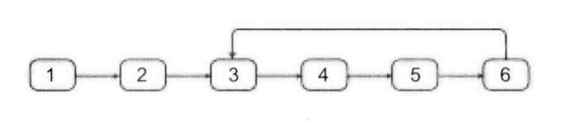
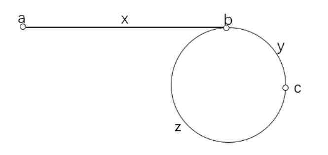

<!-- @import "[TOC]" {cmd="toc" depthFrom=1 depthTo=6 orderedList=false} -->

<!-- code_chunk_output -->

- [17. 从尾到头打印链表](#17-从尾到头打印链表)
- [28. 在O(1)时间删除链表结点（很经典的思维题）](#28-在o1时间删除链表结点很经典的思维题)
- [29. 删除链表中重复的节点](#29-删除链表中重复的节点)
- [33. 链表中倒数第k个节点](#33-链表中倒数第k个节点)
- [34. 链表中环的入口结点（快慢指针）](#34-链表中环的入口结点快慢指针)

<!-- /code_chunk_output -->

### 17. 从尾到头打印链表

输入一个链表的头结点，按照 **从尾到头** 的顺序返回节点的值。

返回的结果用数组存储。

样例
```
输入：[2, 3, 5]
返回：[5, 3, 2]
```

```cpp
/**
 * Definition for singly-linked list.
 * struct ListNode {
 *     int val;
 *     ListNode *next;
 *     ListNode(int x) : val(x), next(NULL) {}
 * };
 */
class Solution {
public:
    vector<int> printListReversingly(ListNode* head) {
        vector<int> res;
        while (head)
        {
            res.push_back(head->val);
            head = head->next;
        }
        return vector<int>(res.rbegin(), res.rend());
    }
};
```

### 28. 在O(1)时间删除链表结点（很经典的思维题）

给定单向链表的一个节点指针，定义一个函数在O(1)时间删除该结点。

假设链表一定存在，并且该节点一定不是尾节点。

样例
```
输入：链表 1->4->6->8
      删掉节点：第2个节点即6（头节点为第0个节点）

输出：新链表 1->4->8
```

分析：
- 由于是单链表，我们不能找到前驱节点，所以我们不能按常规方法将该节点删除
- 我们可以换一种思路，将下一个节点的值复制到当前节点，然后将下一个节点删除即可

```cpp
/**
 * Definition for singly-linked list.
 * struct ListNode {
 *     int val;
 *     ListNode *next;
 *     ListNode(int x) : val(x), next(NULL) {}
 * };
 */
class Solution {
public:
    void deleteNode(ListNode* node) {
        // 下面这么写不对
        // 没法获取被跳过的下一结点
        // 就无法是否这个空间
        // node->val = node->next->val;
        // node->next = node->next->next;
        
        auto p = node->next;
        *node = *(node->next);  // *为指针指向的内容
        delete p;
    }
};
```

### 29. 删除链表中重复的节点

在一个排序的链表中，存在重复的节点，请删除该链表中重复的节点，重复的节点不保留。

样例1
```
输入：1->2->3->3->4->4->5

输出：1->2->5
```

样例2
```
输入：1->1->1->2->3

输出：2->3
```

数据范围
- 链表中节点 `val` 值取值范围 `[0,100]`。

分析：
- 为了方便处理边界情况，我们定义一个虚拟元素 `dummy` 指向链表头节点。
- 然后从前往后扫描整个链表，每次扫描元素相同的一段，如果这段中的元素个数多于1个，则将整段元素直接删除。

```cpp
/**
 * Definition for singly-linked list.
 * struct ListNode {
 *     int val;
 *     ListNode *next;
 *     ListNode(int x) : val(x), next(NULL) {}
 * };
 */
class Solution {
public:
    ListNode* deleteDuplication(ListNode* head) {
        auto dummy = new ListNode(-1);  // 哑节点（因为头节点也可能被删掉）
        dummy->next = head;
        
        auto p = dummy;
        while (p->next)  // 还有往下搜索的必要
        {
            auto q = p->next;  // p 记录当前值，用 q 往下搜值相同的
            while (q && p->next->val == q->val) q = q->next;
            // 注意上面用 p->next-val 因为这里 p 还停留在上一段或者哑节点上
            
            if (p->next->next == q) p = p->next;  // 没有重复不删除
            else
            {
                // 这里可以只写 p->next = q;
                // 但是这么删除让内存很危险，咱们还是 delete 一下
                auto t1 = p->next;  // 把 t1 到 q 前一个都删除
                p->next = q;
                int v = t1->val;
                while (t1 && t1->val == v)
                {
                    auto t2 = t1;
                    t1 = t1->next;
                    delete t2;
                }
            }
        }
        
        return dummy->next;
    }
};
```

**经验：**
- 链表中头节点也可能被删掉或者被操作，则用哑节点`dummy`处理边界情况会比较优雅
- 删除链表中的结点，最好 `delete` 掉把空间释放了

### 33. 链表中倒数第k个节点

输入一个链表，输出该链表中倒数第 `k` 个结点。

注意：
- `k >= 1`;
- 如果 `k` 大于链表长度，则返回 `NULL`;

样例
```
输入：链表：1->2->3->4->5 ，k=2

输出：4
```

```cpp
/**
 * Definition for singly-linked list.
 * struct ListNode {
 *     int val;
 *     ListNode *next;
 *     ListNode(int x) : val(x), next(NULL) {}
 * };
 */
class Solution {
public:
    ListNode* findKthToTail(ListNode* pListHead, int k) {
        int n = 0;
        for (auto p = pListHead; p; p=p->next) ++ n;
        if (k > n) return NULL;
        auto p = pListHead;
        for (int i = 0; i < n - k; ++ i) p = p->next;
        return p;
    }
};
```

### 34. 链表中环的入口结点（快慢指针）

给定一个链表，若其中包含环，则输出环的入口节点。

若其中不包含环，则输出`null`。

样例



```
给定如上所示的链表：
[1, 2, 3, 4, 5, 6]
2
注意，这里的2表示编号是2的节点，节点编号从0开始。所以编号是2的节点就是val等于3的节点。

则输出环的入口节点3.
```

数据范围
- 节点 `val` 值取值范围 $[1,1000]$。

分析：

本题的做法比较巧妙。

用两个指针 `first`, `second` 分别从起点开始走， `first` 每次走一步， `second` 每次走两步。
如果过程中 `second` 走到 `null` ，则说明不存在环。否则当 `first` 和 `second` 相遇后，让 `first` 返回起点， `second` 待在原地不动，然后两个指针每次分别走一步，当相遇时，相遇点就是环的入口。



可以用公式来说明：$a$ 是起点，$b$ 是环的入口，$c$ 是两个指针的第一次相遇点，$ab$ 之间的距离是 $x$ ，$bc$ 之间的距离是 $y$ 。我们用 $z$ 表示从 $c$ 点顺时针走到 $b$ 的距离。则第一次相遇时 $second$ 所走的距离是 $x+(y+z)∗n+y$ , $n$ 表示圈数，同时 `second` 走过的距离是 `first` 的两倍，也就是 $2(x+y)$，所以我们有 $x+(y+z)∗n+y=2(x+y)$，所以 $x=(n−1)×(y+z)+z$。那么我们让 `second` 从 $c$ 点开始走，走 $x$ 步，会恰好走到 $b$ 点；而让 `first` 从 $a$ 点开始走，走 $x$ 步，根据定义正好不就是 $b$ 点嘛。因此让 `first` 退到起点后，再让 `first` 和 `second` 一起往前一步一步走，二者相遇这个点就是 `b` 。

```cpp
/**
 * Definition for singly-linked list.
 * struct ListNode {
 *     int val;
 *     ListNode *next;
 *     ListNode(int x) : val(x), next(NULL) {}
 * };
 */
class Solution {
public:
    ListNode *entryNodeOfLoop(ListNode *head) {
        if (!head || !head->next) return NULL;  // 处理边界情况
        ListNode *fi = head, *se = head;
        
        while (fi && se)
        {
            fi = fi->next;
            se = se->next;
            if (se) se = se->next;
            else return NULL;

            if (fi == se)
            {
                fi = head;
                while (fi != se)
                {
                    fi = fi->next;
                    se = se->next;
                }
                return fi;
            }
        }
        
        return NULL;
    }
};
```
