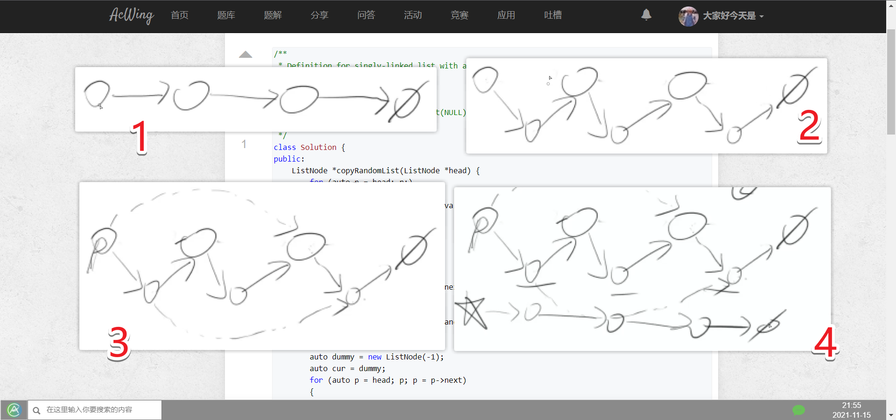
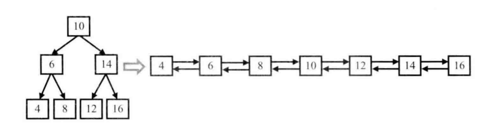

<!-- @import "[TOC]" {cmd="toc" depthFrom=1 depthTo=6 orderedList=false} -->

<!-- code_chunk_output -->

- [66. 两个链表的第一个公共结点（简单动脑数学推导）](#66-两个链表的第一个公共结点简单动脑数学推导)
- [48. 复杂链表的复刻（不用哈希表可以节省空间）](#48-复杂链表的复刻不用哈希表可以节省空间)
- [49. 二叉搜索树与双向链表（递归/不能创建新节点）](#49-二叉搜索树与双向链表递归不能创建新节点)
- [35. 反转链表（模板）](#35-反转链表模板)
- [36. 合并两个排序的链表（二路归并）](#36-合并两个排序的链表二路归并)

<!-- /code_chunk_output -->

### 66. 两个链表的第一个公共结点（简单动脑数学推导）

输入两个链表，找出它们的第一个公共结点。

当不存在公共节点时，返回空节点。

样例
```
给出两个链表如下所示：
A：        a1 → a2
                   ↘
                     c1 → c2 → c3
                   ↗            
B:     b1 → b2 → b3

输出第一个公共节点c1
```

参考[邓泽军](https://www.acwing.com/solution/content/1773/)：
- 如果有公共结点肯定是在后面重叠，且后面部分都是共同的。
- 方法1：先计算出两个链表的长度，可以让比较长的先走两个链表长度之差的步数，两个再一起走。
- 方法2：不同部分为`a` 和 `b`，公共部分为`c`；`a + c + b = b + c + a`；让两个一起走，a走到头就转向`b`，`b`走到头转向`a`，则在公共部分相遇。如果两个链表没有公共节点，则这里最后一个指向的 `null` 就是二者的公共结点。

```cpp
/**
 * Definition for singly-linked list.
 * struct ListNode {
 *     int val;
 *     ListNode *next;
 *     ListNode(int x) : val(x), next(NULL) {}
 * };
 */
class Solution {
public:
    ListNode *findFirstCommonNode(ListNode *headA, ListNode *headB) {
        auto p1 = headA, p2 = headB;
        while (p1 != p2)
        {
            if (p1) p1 = p1->next;
            else p1 = headB;
            if (p2) p2 = p2->next;
            else p2 = headA;
        }
        return p1;
    }
};
```

```go
/**
 * Definition for singly-linked list.
 * type ListNode struct {
 *     Val int
 *     Next *ListNode
 * }
 */
func findFirstCommonNode(headA *ListNode, headB *ListNode) *ListNode {
    p1, p2 := headA, headB
    for p1 != p2 {
        if p1 == nil {
            p1 = headB
        } else {
            p1 = p1.Next
        }
        if p2 == nil {
            p2 = headA
        } else {
            p2 = p2.Next
        }
    }
    return p1
}
```

### 48. 复杂链表的复刻（不用哈希表可以节省空间）

请实现一个函数可以复制一个复杂链表。

在复杂链表中，每个结点除了有一个指针指向下一个结点外，还有一个额外的指针指向链表中的任意结点或者`null`。

注意：
- 函数结束后原链表要与输入时保持一致。

**方法一：不用哈希表，好处是节省哈希表所占空间**



如上，我们先把原链表改变，在每个结点后插入一个相同的结点。

然后对于 `random` 指针，每个`原节点->新节点`对中，`新节点->random = 原节点->random->next`即可。

最后我们进行整理，把原结点复原，新节点形成自己的链。

```cpp
/**
 * Definition for singly-linked list with a random pointer.
 * struct ListNode {
 *     int val;
 *     ListNode *next, *random;
 *     ListNode(int x) : val(x), next(NULL), random(NULL) {}
 * };
 */
class Solution {
public:
    ListNode *copyRandomList(ListNode *head) {
        for (auto p = head; p; )
        {
            ListNode *np = new ListNode(p->val);
            auto next = p->next;
            p->next = np;
            np->next = next;
            p = next;
        }
        
        for (auto p = head; p; p = p->next)
        {
            if (p->random)
                p->next->random = p->random->next;
            p = p->next;
        }
        
        auto dummy = new ListNode(-1);
        auto cur = dummy;
        for (auto p = head; p; p = p->next)
        {
            cur->next = p->next;
            cur = cur->next;  // 建立（剥离出）新链表
            p->next = p->next->next;  // 恢复原链表
        }
        return dummy->next;  // 这里的 dummy 应该内存泄露了
    }
};
```

```go
/**
 * Definition for singly-linked list with a random pointer.
 * type ListNode struct {
 *     Val int
 *     Next *ListNode
 *     Random *ListNode
 * }
 */
func copyRandomList(head *ListNode) *ListNode {
    for p := head; p != nil; {
        np := &ListNode{
            Val: p.Val,
            Next: nil,
            Random: nil,
        }
        next := p.Next
        p.Next = np
        np.Next = next
        p = next
    }
    
    for p := head; p != nil; p = p.Next {
        if p.Random != nil {
            p.Next.Random = p.Random.Next
        }
        p = p.Next
    }
    
    dummy := &ListNode{}
    cur := dummy
    for p := head; p != nil; p = p.Next {
        cur.Next = p.Next
        cur = cur.Next
        p.Next = p.Next.Next
    }
    return dummy.Next
}
```

**方法二：用哈希表更直观方便**

`hash[源链表节点] = 新链表节点`，遍历源链表，判断每个节点和`random`节点是否在`hash`表中，如果不存在则创建。

```cpp
/**
 * Definition for singly-linked list with a random pointer.
 * struct ListNode {
 *     int val;
 *     ListNode *next, *random;
 *     ListNode(int x) : val(x), next(NULL), random(NULL) {}
 * };
 */
class Solution {
public:
    ListNode *copyRandomList(ListNode *head) {
        unordered_map<ListNode*, ListNode*> hash;
        hash[NULL] = NULL;
        ListNode *dummy = new ListNode(-1);
        auto cur = dummy;
        
        while (head)
        {
            if (!hash.count(head)) hash[head] = new ListNode(head->val);
            if (!hash.count(head->random)) hash[head->random] = new ListNode(head->random->val);
            
            cur->next = hash[head];
            cur->next->random = hash[head->random];
            
            cur = cur->next;
            head = head->next;
        }
        return dummy->next;
    }
};
```

**经验：**
- 建立新链表，为了保证循环操作的一般性，一般用哑节点 `dummy` 作为头节点开始，则新链表的真正头节点即为 `dummy->next`

```go
/**
 * Definition for singly-linked list with a random pointer.
 * type ListNode struct {
 *     Val int
 *     Next *ListNode
 *     Random *ListNode
 * }
 */
func copyRandomList(head *ListNode) *ListNode {
    mp := map[*ListNode]*ListNode{}
    mp[nil] = nil
    dummy := &ListNode{}
    cur := dummy
    
    for head != nil {
        _, ok := mp[head]
        if !ok {
            mp[head] = &ListNode{ Val: head.Val, Next: nil, Random: nil }
        }
        _, ok = mp[head.Random]
        if !ok {  // head.Random is not nil
            mp[head.Random] = &ListNode { Val: head.Random.Val, Next: nil, Random: nil }
        }
        
        cur.Next = mp[head]
        cur.Next.Random = mp[head.Random]
        
        cur = cur.Next
        head = head.Next
    }
    return dummy.Next
}
```

### 49. 二叉搜索树与双向链表（递归/不能创建新节点）

输入一棵二叉搜索树，将该二叉搜索树转换成一个排序的双向链表。

要求不能创建任何新的结点，只能调整树中结点指针的指向。

注意：
- 需要返回双向链表最左侧的节点。

例如，输入下图中左边的二叉搜索树，则输出右边的排序双向链表。



递归，对于根节点，连接左子树的最右节点，连接右子树的最左节点。`dfs`返回树的最左节点与最右节点。

```cpp
/**
 * Definition for a binary tree node.
 * struct TreeNode {
 *     int val;
 *     TreeNode *left;
 *     TreeNode *right;
 *     TreeNode(int x) : val(x), left(NULL), right(NULL) {}
 * };
 */
class Solution {
public:
    TreeNode* convert(TreeNode* root) {

        function<pair<TreeNode*, TreeNode*>(TreeNode* u)> dfs = [&](TreeNode* u) -> pair<TreeNode*, TreeNode*>
        {
            if (u->left && u->right)
            {
                auto lside = dfs(u->left);
                auto rside = dfs(u->right);
                lside.second->right = u, u->left = lside.second;
                u->right = rside.first, rside.first->left = u;
                return {lside.first, rside.second};
            }
            else if (u->left)
            {
                auto lside = dfs(u->left);
                lside.second->right = u, u->left = lside.second;
                return {lside.first, u};
            }
            else if (u->right)
            {
                auto rside = dfs(u->right);
                u->right = rside.first, rside.first->left = u;
                return {u, rside.second};
            }
            return {u, u};
        };
        
        if (!root) return NULL;
        auto lr = dfs(root);
        return lr.first;
    }
};
```

```go
/**
 * Definition for a binary tree node.
 * type TreeNode struct {
 *     Val int
 *     Left *TreeNode
 *     Right *TreeNode
 * }
 */
func convert(root *TreeNode) *TreeNode {
    var dfs func(u *TreeNode) (*TreeNode, *TreeNode)
    dfs = func(u *TreeNode) (*TreeNode, *TreeNode) {
        if u.Left != nil && u.Right != nil {
            ll, lr := dfs(u.Left)
            rl, rr := dfs(u.Right)
            lr.Right = u
            u.Left = lr
            rl.Left = u
            u.Right = rl
            return ll, rr
        }
        if u.Left != nil {
            ll, lr := dfs(u.Left)
            lr.Right = u
            u.Left = lr
            return ll, u
        }
        if u.Right != nil {
            rl, rr := dfs(u.Right)
            rl.Left = u
            u.Right = rl
            return u, rr
        }
        return u, u
    }
    if root == nil {
        return nil
    }
    ul, _ := dfs(root)
    return ul
}
```

### 35. 反转链表（模板）

定义一个函数，输入一个链表的头结点，反转该链表并输出反转后链表的头结点。

思考题：
- 请同时实现迭代版本和递归版本。

样例
```
输入:1->2->3->4->5->NULL

输出:5->4->3->2->1->NULL
```

翻转即将所有节点的`next`指针指向前驱节点。

由于是单链表，我们在迭代时不能直接找到前驱节点，所以我们需要一个额外的指针保存前驱节点。同时在改变当前节点的`next`指针前，不要忘记保存它的后继节点。

- 空间复杂度分析：遍历时只有 $3$ 个额外变量，所以额外的空间复杂度是 $O(1)$ 。
- 时间复杂度分析：只遍历一次链表，时间复杂度是 $O(n)$ 。

```cpp
/**
 * Definition for singly-linked list.
 * struct ListNode {
 *     int val;
 *     ListNode *next;
 *     ListNode(int x) : val(x), next(NULL) {}
 * };
 */
class Solution {
public:
    ListNode* reverseList(ListNode* head) {
        ListNode* prev = NULL;
        ListNode* curr = head;
        while (curr)
        {
            ListNode* next = curr->next;
            curr->next = prev;  // 把 next 记录了才能再改变
            prev = curr, curr = next;
        }
        return prev;
    }
};
```

```go
/**
 * Definition for singly-linked list.
 * type ListNode struct {
 *     Val int
 *     Next *ListNode
 * }
 */
func reverseList(head *ListNode) *ListNode {
    if head == nil {
        return nil
    }
    var pre, cur *ListNode = nil, head
    for cur != nil {
        nxt := cur.Next
        cur.Next = pre
        pre, cur = cur, nxt
    }
    return pre
}
```

### 36. 合并两个排序的链表（二路归并）

输入两个递增排序的链表，合并这两个链表并使新链表中的结点仍然是按照递增排序的。

样例
```
输入：1->3->5 , 2->4->5

输出：1->2->3->4->5->5
```

二路归并 $O(n)$ ：
- 新建头部的保护结点`dummy`，设置`cur`指针指向`dummy`。
- 若当前`l1`指针指向的结点的值`val`比`l2`指针指向的结点的值`val`小，则令`cur`的`next`指针指向`l1`，且`l1`后移；否则指向`l2`，且`l2`后移。
- 然后cur指针按照上一步设置好的位置后移。
- 循环以上步骤直到l1或l2为空。
- 将剩余的l1或l2接到cur指针后边。

时间复杂度
- 两个链表各遍历一次，所以时间复杂度为$O(n)$

```cpp
/**
 * Definition for singly-linked list.
 * struct ListNode {
 *     int val;
 *     ListNode *next;
 *     ListNode(int x) : val(x), next(NULL) {}
 * };
 */
class Solution {
public:
    ListNode* merge(ListNode* l1, ListNode* l2) {
        ListNode* dummy = new ListNode(-1);
        ListNode* cur = dummy;
        while (l1 && l2)
        {
            if (l1->val < l2->val)
            {
                cur->next = l1;
                l1 = l1->next;
            }
            else
            {
                cur->next = l2;
                l2 = l2->next;
            }
            cur = cur->next;
        }
        cur->next = (l1 ? l1 : l2);
        return dummy->next;
    }
};
```

```go
/**
 * Definition for singly-linked list.
 * type ListNode struct {
 *     Val int
 *     Next *ListNode
 * }
 */
func merge(l1 *ListNode, l2 *ListNode) *ListNode {
    dummy := &ListNode{}
    p1, p2 := l1, l2
    p := dummy
    for p1 != nil && p2 != nil {
        if p1.Val < p2.Val {
            p.Next = p1
            p1 = p1.Next
        } else {
            p.Next = p2
            p2 = p2.Next
        }
        p = p.Next
    }
    // fmt.Println(p, p1, p2)
    if p1 != nil {
        p.Next = p1
    }
    if p2 != nil {
        p.Next = p2
    }
    return dummy.Next
}
```
