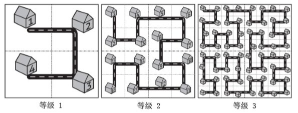
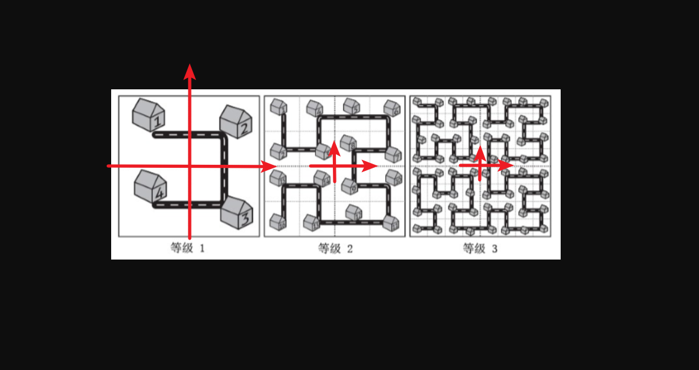
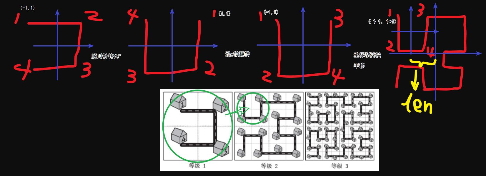

# 递推与递归

<!-- @import "[TOC]" {cmd="toc" depthFrom=3 depthTo=6 orderedList=false} -->

<!-- code_chunk_output -->

- [费解的开关](#费解的开关)
- [约数之和](#约数之和)
- [分形之城](#分形之城)

<!-- /code_chunk_output -->

### 费解的开关

<p>你玩过“拉灯”游戏吗？</p>

$25$ 盏灯排成一个 $5 \times 5$ 的方形。

<p>每一个灯都有一个开关，游戏者可以改变它的状态。</p>

每一步，游戏者可以改变某一个灯的状态。

<p>游戏者改变一个灯的状态会产生连锁反应：和这个灯上下左右相邻的灯也要相应地改变其状态。</p>

我们用数字 $1$ 表示一盏开着的灯，用数字 $0$ 表示关着的灯。

<p>下面这种状态</p>
<pre><code>10111
01101
10111
10000
11011
</code></pre>

<p>在改变了最左上角的灯的状态后将变成：</p>
<pre><code>01111
11101
10111
10000
11011
</code></pre>

<p>再改变它正中间的灯后状态将变成：</p>
<pre><code>01111
11001
11001
10100
11011
</code></pre>


给定一些游戏的初始状态，编写程序判断游戏者是否可能在 $6$ 步以内使所有的灯都变亮。

<h4>输入格式</h4>

第一行输入正整数 $n$，代表数据中共有 $n$ 个待解决的游戏初始状态。

以下若干行数据分为 $n$ 组，每组数据有 $5$ 行，每行 $5$ 个字符。

<p>每组数据描述了一个游戏的初始状态。</p>

<p>各组数据间用一个空行分隔。</p>

<h4>输出格式</h4>

一共输出 $n$ 行数据，每行有一个小于等于 $6$ 的整数，它表示对于输入数据中对应的游戏状态最少需要几步才能使所有灯变亮。

对于某一个游戏初始状态，若 $6$ 步以内无法使所有灯变亮，则输出 $-1$。

<h4>数据范围</h4>

- $0 \le n \le 500$

<h4>输入样例：</h4>

```
3
00111
01011
10001
11010
11100

11101
11101
11110
11111
11111

01111
11111
11111
11111
11111
```

<p>输出样例：</p>

```
3
2
-1
```

```cpp
#include <iostream>
#include <cstring>
#include <algorithm>
using namespace std;

const int N = 5 + 5;   // 加上 5 更保险
// 注意接收时用字符串更方便，因为输入流每行没有空格
char g[N][N];  // 记录灯目前的情况

// 上右下左中
int dx[5] = {0, 1, 0, -1, 0};
int dy[5] = {1, 0, -1, 0, 0};

// 按第 x 行第 y 列，本身和上下左右五个灯都取反
void turn(int x, int y)
{
    for (int i = 0; i < 5; ++ i)
    {
        int a = x + dx[i], b = y + dy[i];
        if (0 <= a && a < 5 && 0 <= b && b < 5)
            g[a][b] = g[a][b] == '1' ? '0': '1';
    }
}

int work()
{
    int ans = 2e9;
    // 第一层循环，把所有第一行按的情况都遍历
    // k 是被压缩了的状态，最小 0b00000 代表都不按，
    // 最大 0b11111 代表都按
    
    // 备份，因为下面的操作会改变 g
    char backup[N][N];
    memcpy(backup, g, sizeof g);

    for (int k = 0; k < (1 << 5); ++ k)
    {
        // 确保我们的 g 是输入的 g
        memcpy(g, backup, sizeof backup);

        // 当第一行为 k 时，总操作次数是..
        int res = 0;  // 用 res 来记录

        // 执行 k （根据 k 把第一行按了）
        for (int j = 0; j < 5; ++ j)
        {
            if (k >> j & 1)
            {
                res ++;
                turn(0, j);
            }
        }
        
        // 第一行确定了，第二行就确定了
        // 因为只有合理操作第二行
        // 才能把第一行全部点亮
        // 以此类推，第二行定了后，第三行就被第二行决定了
        for (int i = 0; i < 4; ++ i)
        {
            for (int j = 0; j < 5; ++ j)
            {
                if (g[i][j] == '0')
                {
                    res ++;
                    turn(i + 1, j);
                }
            }
        }

        // 上面的操作一定能保证前 4 行全亮
        // 但是第 5 行不一定全亮，第 5 行全亮，才是真正有效的操作
        bool success = true;
        for (int j = 0; j < 5; ++ j)
        {
            if (g[4][j] == '0')
            {
                success = false;
                break;
            }
        }
        
        // 如果是有效的操作，咱看看一共按了几次开关
        if (success) ans = min(res, ans);
    }
    
    // 根据题意返回输出值
    if (ans > 6) return -1;
    return ans;
}

int main()
{
    int n;
    cin >> n;
    while (n -- )
    {
        for (int i = 0; i < 5; ++ i) cin >> g[i];
        printf("%d\n", work());
    }
}
```

**首先有三点很重要的性质需要说明：**
- 如果按哪些灯确定了，那么按这些灯的顺序不重要，无论什么顺序，结果都是相同的
- 我们没有必要按一盏灯两次及以上，因为，按两次，相当于没按，按三次，相当于按两次+一次（也就是一次）

因此：
- 因为按灯的顺序不重要，我们可以先把第一行的灯都按了
- 我们发现，第一行想按的灯都按过之后，如果想要让第一行全亮，那么我第二行只能有一种按法，就是按第一行不亮的灯的下面的灯（下面是例子）

```
第一行状态 10011 （1代表亮的灯）
第二行动作 01100 （1代表按按钮）
```

那么，我们怎么保证第二行全亮呢？只能用第三行来解决！

那么，我们怎么保证最后一行（第五行）全亮呢？没法保证！

我们发现，如果第一行按法确定了，那么接下来二三四五行的按法和能不能全亮就确定了。

因此，对于任意一种输入状态，我们把第一行 32 种按法全部遍历一遍，看看哪些可以全亮（通过检测第五行状态），这些全亮的种有没有操作次数小于等于 6 的。有的话，就返回这个操作数，否则就返回 `-1` 呗。

### 约数之和

假设现在有两个自然数 $A$ 和 $B$，$S$ 是 $A^B$ 的所有约数之和。

请你求出 $S \bmod 9901$ 的值是多少。

<h4>输入格式</h4>

在一行中输入用空格隔开的两个整数 $A$ 和 $B$。

<h4>输出格式</h4>

输出一个整数，代表 $S \bmod 9901$ 的值。

<h4>数据范围</h4>

$0 \le A,B \le 5 \times 10^7$

<h4>输入样例：</h4>
<pre><code>2 3
</code></pre>

<h4>输出样例：</h4>
<pre><code>15
</code></pre>

<strong>注意</strong>: $A$ 和 $B$ 不会同时为 $0$。

```cpp
#include <iostream>
#include <cstring>
#include <algorithm>

using namespace std;
typedef long long LL;

const int mod = 9901;

int qmi(int a, int k)
{
    int res = 1 % mod;
    while (k)
    {
        if (k & 1) res = (LL)res * a % mod;
        a = (LL)a * a % mod;
        k >>= 1;
    }
    return res;
}

// 这里的 k 与题解的略有不同
// 这里是 0, ..., k
// 题解是 0, ..., k - 1
int sum(int p, int k)
{
    if (k == 0) return 1;
    // 0 到 k 有偶数项个（即 k 是奇数）
    if (k % 2 == 0) return (p % mod * sum(p, k - 1) % mod + 1) % mod;
    // k 是偶数
    return (qmi(p, k / 2 + 1) + 1) % mod * sum(p, k / 2) % mod;
}

int main()
{
    int A, B;
    cin >> A >> B;
    int res = 1;
    // 注意这里是 i <= A ，而非 i <= A / i
    // 因为这里包含了 A 本身是质数（为2）的情况
    for (int i = 2; i <= A; ++ i)
    {
        int s = 0;
        while (A % i == 0)
        {
            s ++;
            A /= i;
        }
        if (s) res = res * sum(i, s * B) % mod;
    }
    if (!A) res = 0;
    printf("%d", res);
}
```

对于数字 $N$ ，可以因式分解如下：
$$N = p_1^{\alpha_1} p_2^{\alpha_2} ... p_k^{\alpha_k}$$

其约数总可以唯一地分解为：
$$d = p_1^{\beta_1} p_2^{\beta_2} ... p_k^{\beta_k}$$

且 $0 \le \beta_i \le \alpha_i$

因此，对于每一个 $\beta_i$ ，其取值范围为 $[0, \alpha_i]$ 共 $\alpha_i + 1$ 个。

$N$ 的约数个数为 $(\alpha_1 + 1)(\alpha_2 + 1)...(\alpha_k + 1)$ 。

$N$ 的约数之和为 $(p_1^0 + p_1^1 + ... + p_1^{\alpha_1})...(p_k^0 + p_k^1 + ... + p_k^{\alpha_k})$ 。把公式展开，其意自现。

有了约数和的知识背景基础，下面就来介绍<strong>分治法求$p^0 + p^1 + \ldots + p^{k-1}$</strong>

<h2>思路</h2>

参考[抽象带师](https://www.acwing.com/solution/content/30343/)：

这里实现一个sum函数，sum(p, k)表示$p^0 + p^1 + \ldots + p^{k-1}$

<p>思路，当k为偶数时，sum(p, k)可以拆解成</p>

$$p^0 + p^1 + \ldots + p^{k/2-1} + p^{k/2} +p^{k/2 + 1} + \ldots + p^{k-1}$$
即
$$p^0 + p^1 + \ldots + p^{k/2-1} + p^{k/2} * (p^0 + p^1 + \ldots + p^{k/2-1})$$
也就是
$$sum(p, k / 2) + p^{k/2} * sum(p, k / 2)$$

<p>进一步化简</p>

$$(p^{k/2} + 1) * sum(p, k / 2)$$
当k为奇数时，为了更方便调用我们写的偶数项情况，可以单独拿出最后一项，把剩下的项转化为求偶数项的情况来考虑，再加上最后一项，就是奇数项的情况了。也即$sum(p, k - 1)+p^{k-1}$
<p>这样这个代码就写完了</p>

```cpp
//p0 + .. + pk-1
int sum(int p, int k) {
    if(k == 1) return 1;  //边界
    if(k % 2 == 0) {  
        return (LL)(qmid(p, k / 2) + 1) * sum(p, k / 2) % mod;
    }
    return (qmid(p, k - 1) + sum(p, k - 1)) % mod;
}
```

### 分形之城

<p>城市的规划在城市建设中是个大问题。</p>
<p>不幸的是，很多城市在开始建设的时候并没有很好的规划，城市规模扩大之后规划不合理的问题就开始显现。</p>
<p>而这座名为 Fractal 的城市设想了这样的一个规划方案，如下图所示： </p>



<p>当城区规模扩大之后，Fractal 的解决方案是把和原来城区结构一样的区域按照图中的方式建设在城市周围，提升城市的等级。</p>
<p>对于任意等级的城市，我们把正方形街区从左上角开始按照道路标号。</p>

虽然这个方案很烂，Fractal 规划部门的人员还是想知道，如果城市发展到了等级 $N$，编号为 $A$ 和 $B$ 的两个街区的直线距离是多少。

街区的距离指的是街区的中心点之间的距离，每个街区都是边长为 $10$ 米的正方形。

<h4>输入格式</h4>
第一行输入正整数 $n$，表示测试数据的数目。

以下 $n$ 行，输入 $n$ 组测试数据，每组一行。

每组数据包括三个整数 $N, A, B$，表示城市等级以及两个街区的编号，整数之间用空格隔开。

<h4>输出格式</h4>

一共输出 $n$ 行数据，每行对应一组测试数据的输出结果，结果四舍五入到整数。

<h4>数据范围</h4>

- $1 \le N \le 31$
- $1 \le A,B \le 2^{2N}$
- $1 \le n \le 1000$

<h4>输入样例：</h4>

```
3 
1 1 2 
2 16 1 
3 4 33 
```

<h4>输出样例：</h4>

```
10 
30 
50 
```

```cpp
#include <iostream>
#include <cstring>
#include <cmath>  // sqrt
#include <algorithm>

using namespace std;

typedef long long LL;
typedef pair<LL, LL> PLL;

PLL calc(LL n, LL m)
{
    /*
    * n: 等级
    * m: 坐标，从0开始计数
    */
    if (n == 0) return {0, 0};
    LL len = 1ll << (n - 1);  // 2^{n-1} 本等级内象限的边长/2
    LL cnt = 1ll << (2 * n - 2);  // 4^{n-1} 本等级内象限容量
    PLL pos = calc(n - 1, m % cnt);  // 上一等级的坐标信息
    LL x = pos.first, y = pos.second;
    int z = m / cnt;  // 处于哪个象限
    // 左上象限顺转90°（y,-x）沿y对称（-y,-x）更换原点（-y-len,-x+len）
    if (z == 0)
        return { - y - len, - x + len };
    // 右上象限更换原点（x+len,y+len）
    else if (z == 1)
        return { x + len, y + len };
    // 右下象限更换原点（x+len,y-len）
    else if (z == 2)
        return { x + len, y - len };
    // 左下象限逆转90°（-y,x）沿y对称（y,x）更换原点（y-len,x-len）
    return { y - len, x - len };
}

int main()
{
    int N;
    cin >> N;
    while (N --)
    {
        LL n, m1, m2;
        cin >> n >> m1 >> m2;
        PLL pos1 = calc(n, m1 - 1);
        PLL pos2 = calc(n, m2 - 1);

        double delta_x = (double) (pos1.first - pos2.first);
        double delta_y = (double) (pos1.second - pos2.second);
        // 等级1中 len 是单位长度，且表示象限的一半长即为 10 / 2 = 5
        printf("%.0lf\n", sqrt(delta_x * delta_x + delta_y * delta_y) * 5);
    }
}
```

这有啥不明白的，手把手画出来！

首先明确，为啥能用递归：
- 我们想计算 `n` 等级的坐标，知道 `n-1` 等级的坐标就行

然后思考怎么递归？

咱们首先规定，每个等级的坐标系原点是独特的，如下图。



然后我们从特殊到一般，归纳推规律：
- 等级1这个块块，如果放到等级2里，有四种情况要讨论
- 等级1放到等级2的左上象限，则相当于顺时针旋转了 90° ，并且还要沿 y 轴翻转（为什么要沿 y 轴翻转呢？因为你注意每个编号的位置，不翻转，形状虽然对上了，但是编号顺序没对上）
- 等级1放到等级2的右上象限，则不用转
- 等级1放到等级2的右下象限，则不用转
- 等级1放到等级2的左下象限，则相当于逆时针旋转了 90° ，并且还要沿 y 轴翻转

转完了，因为我们现在从等级1到等级2了，因此坐标系原点也移动了，所以要在等级1的原有坐标基础上进行平移。

好了，我给你画个图，你就懂了。



然后你再去看代码。

这里补充一点数学知识：
- 对于点 `(x, y)` ，沿原点顺时针旋转 90° ，将变为 `(y, -x)`
- 对于点 `(x, y)` ，沿原点逆时针旋转 90° ，将变为 `(-y, x)`
- 对于点 `(x, y)` ，以 y 轴为对称轴翻转将变为 `(-x, y)`
