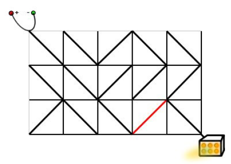

# 广搜变形

<!-- @import "[TOC]" {cmd="toc" depthFrom=3 depthTo=6 orderedList=false} -->

<!-- code_chunk_output -->

- [电路维修（双端队列deque）](#电路维修双端队列deque)

<!-- /code_chunk_output -->

### 电路维修（双端队列deque）

<p>达达是来自异世界的魔女，她在漫无目的地四处漂流的时候，遇到了善良的少女翰翰，从而被收留在地球上。</p>

<p>翰翰的家里有一辆飞行车。</p>

<p>有一天飞行车的电路板突然出现了故障，导致无法启动。</p>

电路板的整体结构是一个 $R$ 行 $C$ 列的网格（$R,C≤500$），如下图所示。


<p>每个格点都是电线的接点，每个格子都包含一个电子元件。</p>

<p>电子元件的主要部分是一个可旋转的、连接一条对角线上的两个接点的短电缆。</p>

<p>在旋转之后，它就可以连接另一条对角线的两个接点。</p>

<p>电路板左上角的接点接入直流电源，右下角的接点接入飞行车的发动装置。</p>

<p>达达发现因为某些元件的方向不小心发生了改变，电路板可能处于断路的状态。</p>

<p>她准备通过计算，旋转最少数量的元件，使电源与发动装置通过若干条短缆相连。</p>

<p>不过，电路的规模实在是太大了，达达并不擅长编程，希望你能够帮她解决这个问题。</p>

<p><strong>注意</strong>：只能走斜向的线段，水平和竖直线段不能走。</p>

<h4>输入格式</h4>

<p>输入文件包含多组测试数据。</p>

第一行包含一个整数 $T$，表示测试数据的数目。

对于每组测试数据，第一行包含正整数 $R$ 和 $C$，表示电路板的行数和列数。

之后 $R$ 行，每行 $C$ 个字符，字符是<code>"/"</code>和<code>"\"</code>中的一个，表示标准件的方向。

<h4>输出格式</h4>

<p>对于每组测试数据，在单独的一行输出一个正整数，表示所需的缩小旋转次数。</p>

<p>如果无论怎样都不能使得电源和发动机之间连通，输出 <code>NO SOLUTION</code>。</p>

<h4>数据范围</h4>

- $1 \le R,C \le 500$,
- $1 \le T \le 5$

<h4>输入样例：</h4>

<pre><code>
1
3 5
\\/\\
\\///
/\\\\
</code></pre>

<h4>输出样例：</h4>

<pre><code>
1
</code></pre>

<h4>样例解释</h4>

<p>样例的输入对应于题目描述中的情况。</p>

<p>只需要按照下面的方式旋转标准件，就可以使得电源和发动机之间连通。</p>



```cpp
/*
* 建模：以网格中节点为搜索节点
*       顺着走，则成本是 0 ，否则是 1
*       如例题中图，有 3 * 5 个格子，则有 4 * 6 个节点
* 双端队列，我们不一定把新节点放到队尾，
*       如果到新节点成本是 0 ，那就放到队头，
*       反正走了和没走一样（成本不会增加），
*       因此要比成本是 1 的节点优先级高，要先走，
*       这样得到的才是各个节点的最短路径
*/

#include <iostream>
#include <cstring>
#include <algorithm>
#include <deque>
using namespace std;

typedef pair<int, int> PII;

const int N = 510;

int n, m;
char g[N][N];  // 格子信息
int d[N][N];  // 节点距离
bool st[N][N];  // 是否以该节点为中心搜索过四周

int bfs()
{
    memset(st, 0, sizeof st);
    memset(d, 0x3f, sizeof d);
    
    deque<PII> q;
    q.push_back({0, 0});
    d[0][0] = 0;

    // 依次顺时针枚举左上、右上、右下、左下四个方向的路径方向，
    // 即：'\', '/', '\', '/'
    // 左上，右上，右下，左下 的节点（注意原点在左上而非左下！！）
    int dx[4] = {-1, 1, 1, -1}, dy[4] = {-1, -1, 1, 1};
    // 左上，右上，右下，左下 的格子
    int ix[4] = {-1, 0, 0, -1}, iy[4] = {-1, -1, 0, 0};
    char cs[] = "\\/\\/";

    while (q.size())
    {
        auto t = q.front();
        q.pop_front();

        int x = t.first, y = t.second;
        // 由于每个点可能会入队多次，
        // 但第一次出来的时候就已经取到最小值了（dijkstra算法的性质），
        // 因此后面重复出队的点应该直接忽略。当忽略重复出队的点后，
        // 就能保证每个点只会更新其他点一次，从而总共更新的次数等于总边数，
        // 这样时间复杂度就能保证是 O(RC) 了。
        if (st[x][y]) continue;
        st[x][y] = true;

        for (int i = 0; i < 4; ++ i)
        {
            int a = x + dx[i], b = y + dy[i];
            int j = x + ix[i], k = y + iy[i];
            if (a >= 0 && a <= n && b >= 0 && b <= m)
            {
                int w = 0;
                if (g[j][k] != cs[i]) w = 1;
                if (d[a][b] > d[x][y] + w)
                {
                    d[a][b] = d[x][y] + w;
                    if (w) q.push_back({a, b});
                    else q.push_front({a, b});
                }
            }
        }
    }
    
    if (d[n][m] == 0x3f3f3f3f) return -1;
    return d[n][m];
    
}

int main()
{
    int T;
    cin >> T;
    while (T --)
    {
        scanf("%d%d", &n, &m);
        for (int i = 0; i < n; ++ i) scanf("%s", g[i]);
        
        int t = bfs();
        
        if (t == -1) printf("NO SOLUTION\n");
        else printf("%d\n", t);
    }
}
```

有这么几点需要注意：
- 以往的 bfs 遍历到终点就退出循环，但是这里不是，因为这里路权不同，有些路成本是 1 ，有些则是 0
- 双端队列，我们不一定把新节点放到队尾，如果到新节点成本是 0 ，那就放到队头，反正走了和没走一样（成本不会增加），因此要比成本是 1 的节点优先级高，要先走，这样得到的才是各个节点的最短路径
- 这里是把队头吐出来
