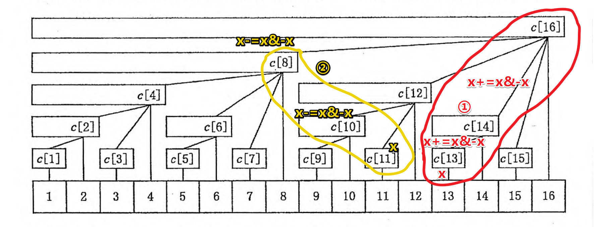

# 树状数组

<!-- @import "[TOC]" {cmd="toc" depthFrom=3 depthTo=6 orderedList=false} -->

<!-- code_chunk_output -->

- [本质就是一种巧妙的分桶方法](#本质就是一种巧妙的分桶方法)
  - [更新](#更新)
  - [查询](#查询)
- [241. 楼兰图腾](#241-楼兰图腾)
- [242. 一个简单的整数问题（差分维护区间更新的数组）](#242-一个简单的整数问题差分维护区间更新的数组)
- [243. 一个简单的整数问题2（双重树状数组+差分求前缀和进阶）](#243-一个简单的整数问题2双重树状数组差分求前缀和进阶)
- [244. 谜一样的牛（树状数组+二分+从倒序分析）](#244-谜一样的牛树状数组二分从倒序分析)

<!-- /code_chunk_output -->

### 本质就是一种巧妙的分桶方法



如上，本质上，树状数组把下标为 1~n 的信息分成了 n 个不同层次的桶，可以在 $log_2 N$ 的时间内 **记录某个值发生的变化** ， **查询当前前缀和** 。

看上图举例。

#### 更新

更新如①，我想把第 13 个数加上 y ；首先把 13 这个桶加 y ；然后把 `13+=13&-13` （就是把 13 的 lowbit 取出来加上）也就是 14 加 y ；接着把更高层次的桶 16 加 y 。

对应代码如下。

```cpp
void add(int x, int y) {
    for (; x <= N; x += x & -x) c[x] += y;
}
```

结合查询，就会明白这样再查询大于等于 13 的下标的前缀和时，都会是加上了 y 的。

#### 查询

如上面的 ② ，如果想查询 11 的前缀和，首先把 11 那个桶的东西拿进来；然后把 10 （`11 -= 11&-11`）桶里的东西加上；最后是 8 的。

代码如下：

```cpp
int ask(int x) {
    int ans = 0;
    for (; x; x -= x & -x) ans += c[x];
    return ans;
}
```

### 241. 楼兰图腾

在完成了分配任务之后，西部 $314$ 来到了楼兰古城的西部。

相传很久以前这片土地上(比楼兰古城还早)生活着两个部落，一个部落崇拜尖刀(`V`)，一个部落崇拜铁锹(`∧`)，他们分别用 `V` 和 `∧` 的形状来代表各自部落的图腾。

西部 $314$ 在楼兰古城的下面发现了一幅巨大的壁画，壁画上被标记出了 $n$ 个点，经测量发现这 $n$ 个点的水平位置和竖直位置是两两不同的。

西部 $314$ 认为这幅壁画所包含的信息与这 $n$ 个点的相对位置有关，因此不妨设坐标分别为 $(1,y_1),(2,y_2),…,(n,y_n)$，其中 $y_1 \sim y_n$ 是 $1$ 到 $n$ 的一个排列。

西部 $314$ 打算研究这幅壁画中包含着多少个图腾。

如果三个点 $(i,y_i),(j,y_j),(k,y_k)$ 满足 $1 \le i < j < k \le n$ 且 $y_i > y_j, y_j < y_k$，则称这三个点构成 `V` 图腾;

如果三个点 $(i,y_i),(j,y_j),(k,y_k)$ 满足 $1 \le i < j< k \le n$ 且 $y_i < y_j, y_j > y_k$，则称这三个点构成 `∧` 图腾;

西部 $314$ 想知道，这 $n$ 个点中两个部落图腾的数目。

因此，你需要编写一个程序来求出 `V` 的个数和 `∧` 的个数。

<h4>输入格式</h4>

第一行一个数 $n$。

第二行是 $n$ 个数，分别代表 $y_1，y_2,...,y_n$。

<h4>输出格式</h4>

两个数，中间用空格隔开，依次为 `V` 的个数和 `∧` 的个数。

<h4>数据范围</h4>

- 对于所有数据，$n \le 200000$，且输出答案不会超过 $int64$。
- $y_1 \sim y_n$ 是 $1$ 到 $n$ 的一个排列。

<h4>输入样例：</h4>

```
5
1 5 3 2 4
```

<h4>输出样例：</h4>

```
3 4
```

```cpp
#include <iostream>
#include <cstring>
#include <algorithm>
using namespace std;

const int N = 2e5 + 10;
int a[N], up[N], down[N], p[N];
int n;

int ask(int t)
{
    int ans = 0;
    for (int i = t; i >= 1; i -= i & -i)
        ans += p[i];
    return ans;
}

void add(int t, int b)
{
    for (int i = t; i < N; i += i & -i)
        p[i] += b;
}

int main()
{
    scanf("%d", &n);
    for (int i = 0; i < n; ++ i) scanf("%d", &a[i]);
    
    for (int i = 0; i < n; ++ i)
    {
        up[i] = ask(a[i] - 1);  // 比 a[i] 小的数已经出现多少个了
        down[i] = ask(n) - up[i];  // 比 a[i] 大的数已经出现多少个了
        add(a[i], 1);  // 小于等于 a[i] 的桶都加一（表示出现次数加一）
    }
    
    long ans1 = 0, ans2 = 0;
    
    memset(p, 0, sizeof p);  // 倒着收集一遍
    for (int i = n - 1; i >= 0; -- i)
    {
        ans2 += (long) up[i] * ask(a[i] - 1);
        ans1 += (long) down[i] * (ask(n) - ask(a[i]));  // 这里写成 ask(a[i] - 1) 也行，因为竖直位置是两两不同的
        add(a[i], 1);
    }
    
    printf("%ld %ld", ans1, ans2);
}
```

### 242. 一个简单的整数问题（差分维护区间更新的数组）

给定长度为 $N$ 的数列 $A$，然后输入 $M$ 行操作指令。

第一类指令形如 `C l r d`，表示把数列中第 $l \sim r$ 个数都加 $d$。

第二类指令形如 `Q x`，表示询问数列中第 $x$ 个数的值。

对于每个询问，输出一个整数表示答案。

<h4>输入格式</h4>

第一行包含两个整数 $N$ 和 $M$。

第二行包含 $N$ 个整数 $A[i]$。

接下来 $M$ 行表示 $M$ 条指令，每条指令的格式如题目描述所示。

<h4>输出格式</h4>

对于每个询问，输出一个整数表示答案。

每个答案占一行。

<h4>数据范围</h4>

- $1 \le N,M \le 10^5$,
- $|d| \le 10000$,
- $|A[i]| \le 10^9$

<h4>输入样例：</h4>

```
10 5
1 2 3 4 5 6 7 8 9 10
Q 4
Q 1
Q 2
C 1 6 3
Q 2
```

<h4>输出样例：</h4>

```
4
1
2
5
```

```cpp
#include <iostream>
#include <cstring>
#include <algorithm>
using namespace std;

const int N = 1e5 + 10;
int p[N], tr[N];
int n, m;
char op;

void add(int x, int y)
{
    for (int i = x; i < N; i += i & -i)
        tr[i] += y;
}

int ask(int x)
{
    int res = 0;
    for (int i = x; i > 0; i -= i & -i)
        res += tr[i];
    return res;
}

int main()
{
    scanf("%d %d", &n, &m);
    // 树状数组下标从 1 开始
    for (int i = 1; i <= n; ++ i) scanf("%d", &p[i]);
    
    // 转换为差分
    for (int i = 1; i <= n; ++ i) add(i, p[i] - p[i - 1]);

    while (m -- )
    {
        scanf("%s", &op);
        if (op == 'Q')
        {
            int x;
            scanf("%d", &x);
            printf("%d\n", ask(x));
        }
        else
        {
            int x, y, z;
            scanf("%d %d %d", &x, &y, &z);
            add(x, z);
            add(y + 1, - z);
        }
    }
}
```

### 243. 一个简单的整数问题2（双重树状数组+差分求前缀和进阶）

给定一个长度为 $N$ 的数列 $A$，以及 $M$ 条指令，每条指令可能是以下两种之一：

- <code>C l r d</code>，表示把 $A[l],A[l+1],…,A[r]$ 都加上 $d$。</li>
- <code>Q l r</code>，表示询问数列中第 $l \sim r$ 个数的和。</li>

对于每个询问，输出一个整数表示答案。

<h4>输入格式</h4>

第一行两个整数 $N,M$。

第二行 $N$ 个整数 $A[i]$。

接下来 $M$ 行表示 $M$ 条指令，每条指令的格式如题目描述所示。

<h4>输出格式</h4>

对于每个询问，输出一个整数表示答案。

每个答案占一行。

<h4>数据范围</h4>

- $1 \le N,M \le 10^5$,
- $|d| \le 10000$,
- $|A[i]| \le 10^9$

<h4>输入样例：</h4>

```
10 5
1 2 3 4 5 6 7 8 9 10
Q 4 4
Q 1 10
Q 2 4
C 3 6 3
Q 2 4
```

<h4>输出样例：</h4>

```
4
55
9
15
```

```cpp
#include <iostream>
#include <cstring>
#include <algorithm>

using namespace std;

typedef long long LL;

const int N = 1e5 + 10;
int n, m;
LL tr1[N], tr2[N], a[N];
char op;

void add(LL tr[], int x, LL y)
{
    // 给 tr 的 x 之后的数字所在的桶加 y
    for (int i = x; i <= n; i += i&-i)
        tr[i] += y;
}

LL ask(LL tr[], int x)
{
    LL res = 0;
    for (int i = x; i > 0; i -= i&-i)
        res += tr[i];
    return res;
}

LL prefix_sum(int x)
{
    // 根据 tr2 和 t1 在 O(1) 时间求前缀和
    return ask(tr1, x) * (x + 1) - ask(tr2, x);
}

int main()
{
    scanf("%d%d", &n, &m);
    for (int i = 1; i <= n; ++ i) scanf("%lld", &a[i]);

    // tr1 树状数组，保存差分
    for (int i = 1; i <= n; ++ i) add(tr1, i, a[i] - a[i - 1]);
    // tr2 树状数组，保存差分 * i ，方便在 O(1) 时间求出原数组
    for (int i = 1; i <= n; ++ i) add(tr2, i, i * (a[i] - a[i - 1]));
    
    while (m -- )
    {
        scanf("%s", &op);
        if (op == 'Q')
        {
            int l, r;
            scanf("%d%d", &l, &r);
            printf("%lld\n", prefix_sum(r) - prefix_sum(l - 1));
        }
        else
        {
            int l, r, d;
            scanf("%d%d%d", &l, &r, &d);
            add(tr1, l, d); add(tr1, r + 1, -d);
            add(tr2, l, (LL)l * d); add(tr2, r + 1, (LL)(r + 1) * -d);
        }
    }
}
```

### 244. 谜一样的牛（树状数组+二分+从倒序分析）

有 $n$ 头奶牛，已知它们的身高为 $1 \sim n$ 且各不相同，但不知道每头奶牛的具体身高。

现在这 $n$ 头奶牛站成一列，已知第 $i$ 头牛前面有 $A_i$ 头牛比它低，求每头奶牛的身高。

<h4>输入格式</h4>

第 $1$ 行：输入整数 $n$。

- 第 $2..n$ 行：每行输入一个整数 $A_i$，第 $i$ 行表示第 $i$ 头牛前面有 $A_i$ 头牛比它低。
- （注意：因为第 $1$ 头牛前面没有牛，所以并没有将它列出）

<h4>输出格式</h4>

输出包含 $n$ 行，每行输出一个整数表示牛的身高。

第 $i$ 行输出第 $i$ 头牛的身高。

<h4>数据范围</h4>

$1 \le n \le 10^5$

<h4>输入样例：</h4>

```
5
1
2
1
0
```

<h4>输出样例：</h4>

```
2
4
5
3
1
```

参考[小呆呆](https://www.acwing.com/solution/content/24500/)，很清晰的题解：

题目描述：给定`n`头牛，且`h[i]`表示第`i`头牛前面有`h[i]`头牛比它低，求每头牛的身高。

思路：需要从最后一头牛作为突破口，因为最后一头牛的`h[n]`表示，在前面的牛中，有`h[n]`头牛比它矮，即在所有的牛中，有`h[n]`头牛比他矮，因此最后一牛的高度在所有牛中排第`h[n] + 1`小。拿第`n`头牛作为信息点，去掉第`n`头牛，继续计算第`n - 1`头牛的高度，再去掉第`n - 1`头牛，依次类推… 当枚举到第`i`头牛时，在剩下的牛中高度中排第`h[i] + 1`小的高度，即是第`i`头牛的高度。（例如去掉某些牛后，剩下的高度有`1,3,5,6`，排第`3`小，即第`i`投牛的高度是`5`）

方法：
- 方法1、可以使用两重循环枚举，先从后往前枚举每头牛，当枚举到第`i`头牛时，再从`1`枚举到`n`，找到第`h[i] + 1`个没有使用过的数，再对该数进行标记，继续枚举下一头牛，时间复杂度$O(n2)$，超时
- 方法2、树状数组 + 二分，从后往前枚举时，有两个操作
  - 1、从剩余的数中找第k小的数
  - 2、删除某个数

具体步骤：
- 对于每头牛都初始化化为`1`，`a[i] = 1`,表示每头牛都未被使用，树状数组维护的是第`i`个高度中`a[1] + a[2] + .. + a[i]`的值，其中 `a[i]` 只有 `0` 和 `1` 两种情况
- 在剩余的数中找第 `k` 小，即在所有满足 `sum(x) = k` 情况中，通过二分找到最小的 `x`

```cpp
#include <iostream>
#include <cstring>
#include <algorithm>
using namespace std;

const int N = 1e5 + 10;

int tr[N], a[N], ans[N];
int n;

void add(int x, int c)
{
    for (int i = x; i <= n; i += i & -i)
        tr[i] += c;
}

int ask(int x)
{
    int res = 0;
    for (int i = x; i > 0; i -= i & -i)
        res += tr[i];
    return res;
}

int main()
{
    scanf("%d", &n);
    // 注意从第二头牛开始读起
    for (int i = 2; i <= n; ++ i) scanf("%d", &a[i]);
    for (int i = 1; i <= n; ++ i) add(i, 1);
    
    for (int i = n; i >= 1; -- i)
    {
        // 第 i 头牛前有 k 头牛比它矮
        int k = a[i];
        int l = 1, r = n;
        // 找第一个大于等于 k + 1 的数
        while (l < r)
        {
            int mid = l + r >> 1;
            if (ask(mid) < k + 1) l = mid + 1;
            else r = mid;
        }
        ans[i] = l;
        add(l, -1);
    }
    for (int i = 1; i <= n; ++ i)
        printf("%d\n", ans[i]);
}
```
