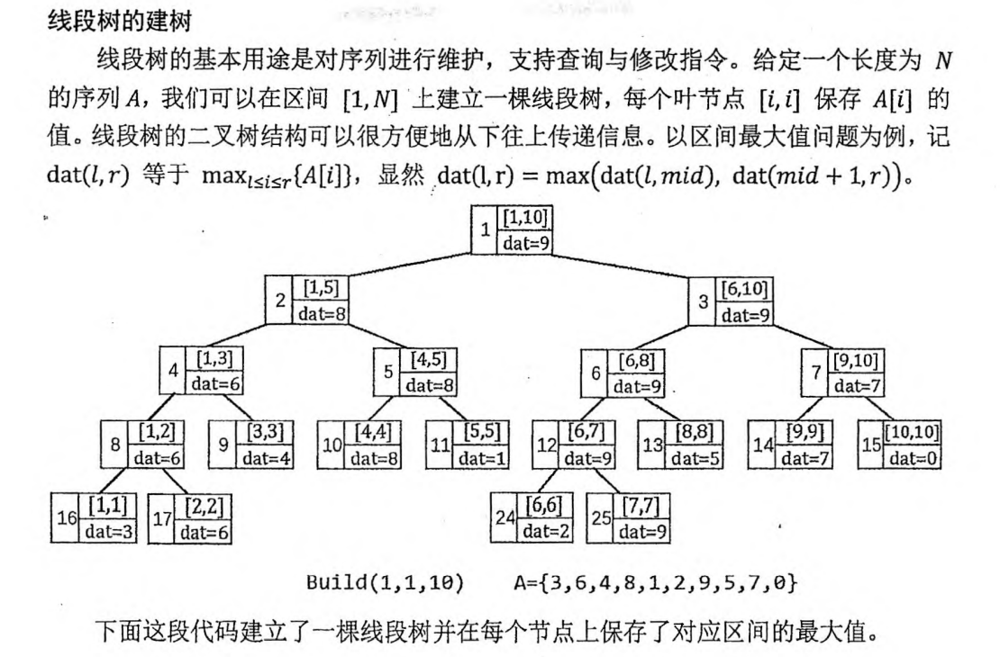
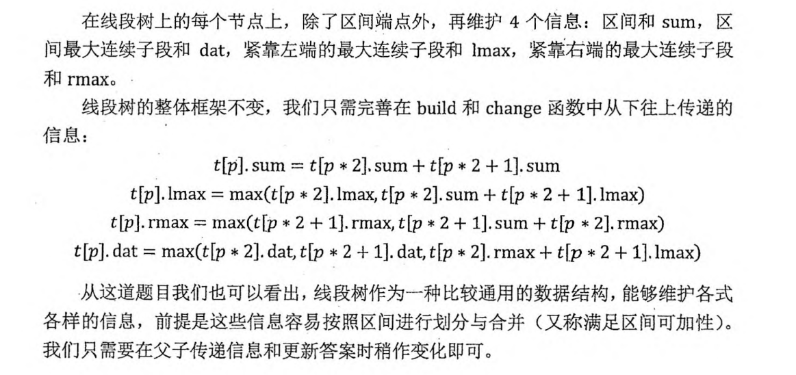

# 线段树

<!-- @import "[TOC]" {cmd="toc" depthFrom=3 depthTo=6 orderedList=false} -->

<!-- code_chunk_output -->

- [线段树：放在区间上进行信息统计](#线段树放在区间上进行信息统计)
  - [线段树的建树](#线段树的建树)
  - [线段树的单点修改](#线段树的单点修改)
  - [线段树的区间修改](#线段树的区间修改)
- [245. 你能回答这些问题吗（线段树最大子列和）](#245-你能回答这些问题吗线段树最大子列和)
- [动态开点线段树](#动态开点线段树)
  - [715. Range 模块（动态开点线段树）](#715-range-模块动态开点线段树)
  - [6066. 统计区间中的整数数目（动态开点线段树/set区间合并/珂朵莉树）](#6066-统计区间中的整数数目动态开点线段树set区间合并珂朵莉树)
  - [10011. 以组为单位订音乐会的门票（线段树二分/很棒的简化版线段树入门题）](#10011-以组为单位订音乐会的门票线段树二分很棒的简化版线段树入门题)

<!-- /code_chunk_output -->

**经验：线段树其实未必要维护一个 struct ，这样略显麻烦。可以参考 lc.10011 题解，把 `o, l, r` （节点，对应左端点，对应右端点）一起传递，总是从根节点开始 `o=1, l=1, r=n` 。**

### 线段树：放在区间上进行信息统计



涉及到建树、更新单个节点值、查询。注意到下标从 1 开始，用 `p*2 p*2+1` 分别表示左右儿子。

下面以维护区间最大值为例。

#### 线段树的建树

```cpp
struct SegmentTree {
    int l, r;
    int dat;
} t[SIZE * 4];

// 以维护区间最大值为例
void build(int p, int l, int r) {
    t[p].l = l, t[p].r = r;  // 叶节点 p 代表区间 [l, r]
    if (l == r) { t[p].dat = a[l]; return ; }  // 叶节点
    int mid = (l + r) / 2;
    build(p * 2, l, mid);
    build(p * 2 + 1, mid + 1, r);
    // 先更新完子节点，再从下往上更新 dat
    t[p].dat = max(t[p * 2].dat, t[p * 2 + 1].dat);
}

build(1, 1, n);  // 调用入口
```

#### 线段树的单点修改

单线修改是一条形如 `C x v` 的指令，表示把 `A[x]` 的值修改为 `v` 。

在线段树中，根节点（编号为 1 的节点）是执行各种指令的入口。我们需要从根结点出发，递归找到代表区间 `[x, x]` 的叶节点，然后从下往上更新 `[x, x]` 以及它的所有祖先节点上保存信息。时间复杂度为 $O(\log N)$ 。

```cpp
// 以维护区间最大值为例
void change(int p, int x, int v) {
    if (t[p].l == t[p].r) { t[p].dat = v; return ; }  // 找到叶节点
    int mid = (t[p].l + t[p].r) / 2;
    if (x <= mid) change(p * 2, x, v);
    else change(p * 2 + 1, x, v);
    // 先更新完子节点，再从下往上更新 dat
    t[p].dat = max(t[p * 2].dat, t[p * 2 + 1].dat);
}

change(1, x, v);
```

#### 线段树的区间修改

```cpp
// 以查询区间最大值为例
ing ask(int p, int l, int r) {
    if (l <= t[p].l && r >= r[p].r)
        return t[p].dat;  // 完全包含
    int mid = (t[p].l + t[p].r) / 2;
    int val = -(1<<30);  // 负无穷
    // 左子节点有重复
    if (l <= mid) val = max(val, ask(p * 2, l, r));
    // 右子节点有重复
    if (r > mid) val = max(val, ask(p * 2 + 1, l, r));
    return val;
}
```

### 245. 你能回答这些问题吗（线段树最大子列和）

给定长度为 $N$ 的数列 $A$，以及 $M$ 条指令，每条指令可能是以下两种之一：

- <code>1 x y</code>，查询区间 $[x,y]$ 中的最大连续子段和，即 $\max\limits_{x \le l \le r \le y}${$\sum\limits^r_{i=l} A[i]$}。
- <code>2 x y</code>，把 $A[x]$ 改成 $y$。

对于每个查询指令，输出一个整数表示答案。

<h4>输入格式</h4>

第一行两个整数 $N,M$。

第二行 $N$ 个整数 $A[i]$。

接下来 $M$ 行每行 $3$ 个整数 $k,x,y$，$k=1$ 表示查询（此时如果 $x>y$，请交换 $x,y$），$k=2$ 表示修改。

<h4>输出格式</h4>

对于每个查询指令输出一个整数表示答案。

每个答案占一行。

<h4>数据范围</h4>

- $N \le 500000, M \le 100000$,
- $-1000 \le A[i] \le 1000$

<h4>输入样例：</h4>

```
5 3
1 2 -3 4 5
1 2 3
2 2 -1
1 3 2
```

<h4>输出样例：</h4>

```
2
-1
```



```cpp
#include <iostream>
#include <cstring>
#include <algorithm>
using namespace std;

const int N = 5e5 + 10;

int n, m;
int a[N];

struct TreeNode
{
    int l, r;
    // 区间合，左连续，右连续，最大连续区间和
    int sum, lmax, rmax, dat;
} tr[N * 4];

// 根据子节点的值更新父节点
void pushup(TreeNode &f, TreeNode &l, TreeNode &r)
{
    f.sum = l.sum + r.sum;
    f.lmax = max(l.lmax, l.sum + r.lmax);
    f.rmax = max(r.rmax, r.sum + l.rmax);
    f.dat = max({l.dat, r.dat, l.rmax + r.lmax});
}

void build(int u, int l, int r)
{
    if (l == r)
    {
        tr[u] = {l, l, a[l], a[l], a[l], a[l]};
        return ;
    }
    tr[u].l = l; tr[u].r = r;
    int mid = l + r >> 1;
    build(u * 2, l, mid);
    build(u * 2 + 1, mid + 1, r);
    pushup(tr[u], tr[u * 2], tr[u * 2 + 1]);
}

TreeNode query(int u, int l, int r)  // 为什么要返回 TreeNode ? 见 else 中逻辑
{
    if (tr[u].l >= l && tr[u].r <= r) return tr[u];
    int mid = tr[u].l + tr[u].r >> 1;
    if (r <= mid) return query(u * 2, l, r);
    else if (l > mid) return query(u * 2 + 1, l, r);
    else
    {   // 处理两个子树区间和，需要建立临时节点来 pushup
        TreeNode lt = query(u * 2, l, r);
        TreeNode rt = query(u * 2 + 1, l, r);
        TreeNode tmp;
        pushup(tmp, lt, rt);
        return tmp;
    }
}

void modify(int u, int x, int y)
{   // 把 x 改成 y
    if (tr[u].l == x && tr[u].r == x)
    {
        tr[u] = {x, x, y, y, y, y};
        return ;
    }
    int mid = tr[u].l + tr[u].r >> 1;
    if (x <= mid) modify(u * 2, x, y);
    else if (x > mid) modify(u * 2 + 1, x, y);
    pushup(tr[u], tr[u * 2], tr[u * 2 + 1]);
}

int main()
{
    scanf("%d%d", &n, &m);
    for (int i = 1; i <= n; ++ i) scanf("%d", &a[i]);
    
    build(1, 1, n);
    
    while (m -- )
    {
        int op, x, y;
        scanf("%d%d%d", &op, &x, &y);
        if (op == 1)
        {
            if (x > y) swap(x, y);
            printf("%d\n", query(1, x, y).dat);
        }
        else
        {
            modify(1, x, y);
        }
    }
}
```

### 动态开点线段树

#### 715. Range 模块（动态开点线段树）

来自力扣。

Range模块是跟踪数字范围的模块。设计一个数据结构来跟踪表示为 半开区间 的范围并查询它们。

半开区间 `[left, right)` 表示所有 `left <= x < right` 的实数 `x` 。

实现 `RangeModule` 类:
- `RangeModule()` 初始化数据结构的对象。
- `void addRange(int left, int right)` 添加 半开区间 `[left, right)`，跟踪该区间中的每个实数。添加与当前跟踪的数字部分重叠的区间时，应当添加在区间 `[left, right)` 中尚未跟踪的任何数字到该区间中。
- `boolean queryRange(int left, int right)` 只有在当前正在跟踪区间 `[left, right)` 中的每一个实数时，才返回 `true` ，否则返回 `false` 。
- `void removeRange(int left, int right)` 停止跟踪 半开区间 `[left, right)` 中当前正在跟踪的每个实数。

示例 1：
```
输入
["RangeModule", "addRange", "removeRange", "queryRange", "queryRange", "queryRange"]
[[], [10, 20], [14, 16], [10, 14], [13, 15], [16, 17]]
输出
[null, null, null, true, false, true]

解释
RangeModule rangeModule = new RangeModule();
rangeModule.addRange(10, 20);
rangeModule.removeRange(14, 16);
rangeModule.queryRange(10, 14); 返回 true （区间 [10, 14) 中的每个数都正在被跟踪）
rangeModule.queryRange(13, 15); 返回 false（未跟踪区间 [13, 15) 中像 14, 14.03, 14.17 这样的数字）
rangeModule.queryRange(16, 17); 返回 true （尽管执行了删除操作，区间 [16, 17) 中的数字 16 仍然会被跟踪）
```

提示：
- $1 <= left < right <= 10^9$
- 在单个测试用例中，对 `addRange`  、  `queryRange` 和 `removeRange` 的调用总数不超过 $10^4$ 次

下面是 set 的做法。

```cpp
// https://leetcode.cn/problems/range-module/solution/tao-lu-ti-qu-jian-he-bing-shi-fen-jian-j-ctch/
class RangeModule {
public:
    set<pair<int,int>>rightLeft;  // 注意！是把右端点放在 pair 的第一个位置上
    RangeModule() {
    }
    void addRange(int left, int right) {
        // 原区间  1    1
        // 新区间    2  ^   2
        auto it=rightLeft.lower_bound({left,0});  // 找 left 左边的区间，如上
        while(it!=rightLeft.end()&&right>=it->second){
            // 往右找区间，如果这个区间完全被盖住，那么删除之
            left=min(left,it->second);  // 扩展 left
            right=max(right,it->first);
            it=rightLeft.erase(it);  // it = set<>().erase(key) 很好用
        }
        rightLeft.emplace(right,left);
    }
    bool queryRange(int left, int right) {
        auto it=rightLeft.lower_bound({right,0});
        if(it==rightLeft.end()||it->second>left)return false;
        return true;
    }
    void removeRange(int left, int right) {
        addRange(left,right);  // 把处于中间的区间合并
        // 找一个right挂在left右边的区间A
        auto it=rightLeft.lower_bound({left,0});
        int newLeft1=it->second,newRight1=left;
        // 如果区间A的左端点与left有区间，则去掉区间A，加上A剩下的部分
        if(newLeft1<newRight1)rightLeft.insert({newRight1,newLeft1});
        // 找右边看有没有没被 left,right 盖到的
        int newLeft2=right,newRight2=it->first;
        // 有的话，插入新区间
        if(newLeft2<newRight2)rightLeft.insert({newRight2,newLeft2});
        // 删除盖到了 left,right 节点的区间
        rightLeft.erase(it);
    }
};

/**
 * Your RangeModule object will be instantiated and called as such:
 * RangeModule* obj = new RangeModule();
 * obj->addRange(left,right);
 * bool param_2 = obj->queryRange(left,right);
 * obj->removeRange(left,right);
 */
```

下面是动态开点线段树的做法。

```cpp
// https://leetcode.cn/problems/range-module/solution/dong-tai-kai-dian-by-constant-r-j7ds/
class RangeModule {
public:
    // 保证最终只有叶子节点上的 lazy 不为 0
    // 用 watch 来确定是否该树上全为合法区间
    static const int MAX=1e6;
    int cnt=0;
    int root=0;  // 0 代表当前点不存在
    struct node{
        int lnode=0;
        int rnode=0;
        bool watch=false;
        int lazy=0;
    };
    vector<node> N;

    // check 只有身为父节点的时候才调用
    // lazy != 0 代表该节点身为父节点，但是并没有把信息完全交到儿子们身上
    // 因此要让左右儿子都有节点
    // 如果 lazy 是 1 ，代表该叶子节点被覆盖（同时 watch 为 true）
    // 如果 lazy 是 2 ，代表该叶子节点没被覆盖（同时 watch 为 false）
    // watch 具有向上传递性，子树中有一个 false 则我这个是 false
    void check(int root){
        if(N[root].lazy){
            if(!N[root].lnode){
                N[root].lnode=++cnt;
            }
            if(!N[root].rnode){
                N[root].rnode=++cnt;
            }
            if(N[root].lazy==1){
                N[N[root].lnode].lazy=1;
                N[N[root].rnode].lazy=1;
                N[N[root].lnode].watch=true;
                N[N[root].rnode].watch=true;
                N[root].lazy=0;
            }else if(N[root].lazy==2){
                N[N[root].lnode].lazy=2;
                N[N[root].rnode].lazy=2;
                N[N[root].lnode].watch=false;
                N[N[root].rnode].watch=false;
                N[root].lazy=0;
            }
        }
    }

    void pushup(int root){
        if(!N[root].lnode||!N[root].rnode)  // 没有左节点或者右节点
            N[root].watch=false;            // watch 设为 false
        // 否者左右节点中有一个 false 那么这个点也是 false
        else N[root].watch=N[N[root].lnode].watch & N[N[root].rnode].watch;
    }

    // 给区间处于 [L, R] 的节点中 lazy 设为 1 ， watch 设为 true
    // l, r 用于迭代
    void update(int &root, int l, int r, int L, int R){
        if(!root){  // 如果点不存在，那么这个点新分配一个编号
            root=++cnt;
        }
        if(l>=L&&r<=R){  // l, r 已经在 L, R 中了，没必要再开点
            N[root].watch=true;
            N[root].lazy=1;
            return;
        }
        check(root);
        int mid=l+r>>1;
        if(mid>=L){
            update(N[root].lnode, l, mid, L, R);
        }
        if(mid<R){
            update(N[root].rnode, mid+1, r, L, R);
        }
        // 子节点都设置完了，这里来设置 watch
        pushup(root);
    }

    void removeUpdate(int &root, int l, int r, int L, int R){
        if(!root){
            root=++cnt;
        }
        if(l>=L&&r<=R){
            N[root].watch=false;
            N[root].lazy=2;
            return;
        }
        check(root);
        int mid=l+r>>1;
        if(mid>=L){
            removeUpdate(N[root].lnode, l, mid, L, R);
        }
        if(mid<R){
            removeUpdate(N[root].rnode, mid+1, r, L, R);
        }
        pushup(root);
    }

    bool query(int root, int l, int r, int L, int R){
        if(!root) return false;
        if(l>=L&&r<=R){
            return N[root].watch;
        }
        check(root);
        int mid=l+r>>1;
        bool result=true;
        if(mid>=L){
            result&=query(N[root].lnode, l, mid, L, R);
        }
        if(mid<R){
            result&=query(N[root].rnode, mid+1, r, L, R);
        }
        return result;
    }

    RangeModule() {
        N=vector<node>(MAX);
    }
    
    // 注意是开闭区间
    void addRange(int left, int right) {
        update(root, 1, 1e9, left, right-1);
    }
    
    bool queryRange(int left, int right) {
        return query(root, 1, 1e9, left,right-1);
    }
    
    void removeRange(int left, int right) {
        removeUpdate(root, 1, 1e9, left, right-1);
    }
};
// 10 200
// 250 500

/**
 * Your RangeModule object will be instantiated and called as such:
 * RangeModule* obj = new RangeModule();
 * obj->addRange(left,right);
 * bool param_2 = obj->queryRange(left,right);
 * obj->removeRange(left,right);
 */
```

####  6066. 统计区间中的整数数目（动态开点线段树/set区间合并/珂朵莉树）

见[力扣周赛293T4](../../leetcode/drafts/293.md)。

此外，推荐有精力后阅读：
- 算法学习笔记(15): 珂朵莉树 https://zhuanlan.zhihu.com/p/106353082

#### 10011. 以组为单位订音乐会的门票（线段树二分/很棒的简化版线段树入门题）

见[力扣双周赛79T4](../../leetcode_double/drafts/79.md)。