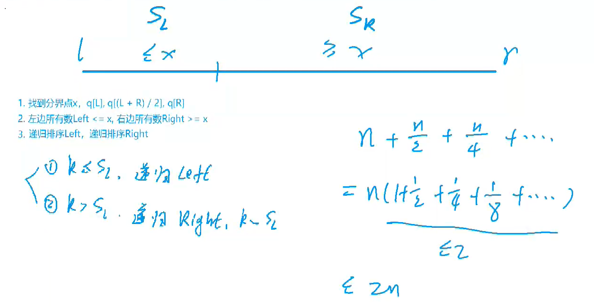
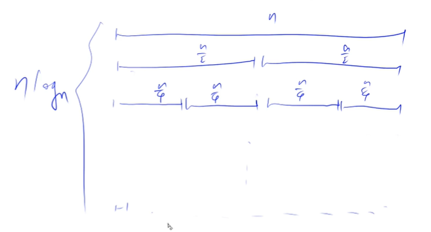
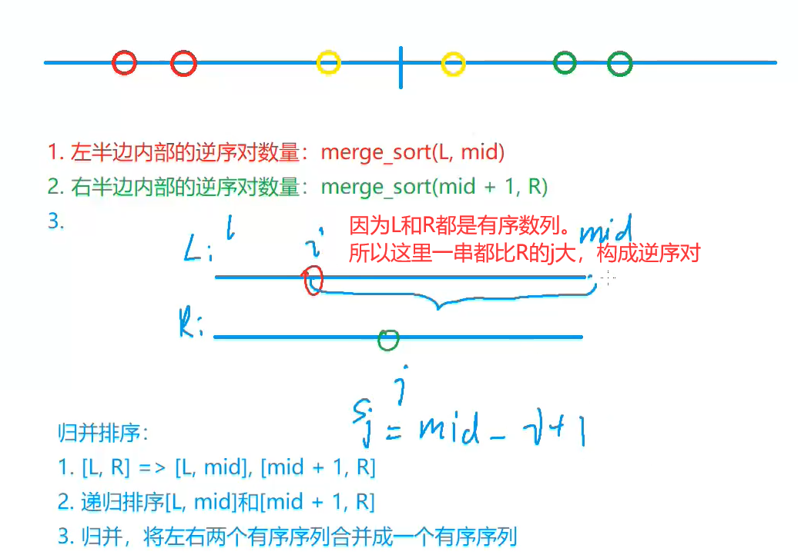
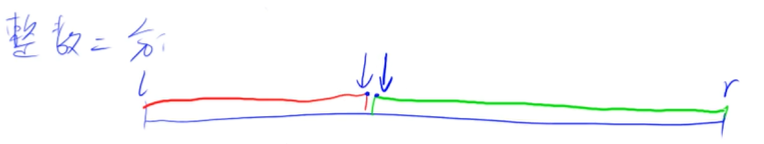
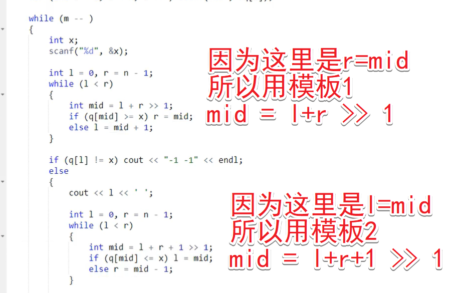

<!-- @import "[TOC]" {cmd="toc" depthFrom=1 depthTo=4 orderedList=false} -->

<!-- code_chunk_output -->

- [快速排序（基于分治）](#快速排序基于分治)
  - [快排模板](#快排模板)
- [快速选择](#快速选择)
  - [快选模板](#快选模板)
- [归并排序（从中心分治）](#归并排序从中心分治)
  - [归并模板](#归并模板)
- [逆序对的数量](#逆序对的数量)
  - [逆序对的数量模板](#逆序对的数量模板)
- [整数二分（很多边界问题）](#整数二分很多边界问题)
  - [整数二分模板](#整数二分模板)
  - [整数二分模板挑选心得](#整数二分模板挑选心得)
- [浮点数二分](#浮点数二分)
  - [浮点数二分模板](#浮点数二分模板)

<!-- /code_chunk_output -->

### 快速排序（基于分治）

- 首先，确定分界点：`q[l], q[(l+r)/2], q[r]` 或者随机确定一个也可
- 调整区间：使得第一个区间的数都小于等于`x`，第二个区间的数都大于等于`x`
- 递归处理左右两段

##### 调整区间一种优美方法：用两个指针
双指针`i与j`往中间走。


`i`遇到比`x`大的停下，`j`遇到比`x`小的停下，此时`i和j`值交换；两个指针接着按照这个规则向中间走，直到两个指针相遇。

为什么合理：
- 保证了任何时刻，`i`左边的数都小于等于`x`
- 保证了任何时刻，`j`右边的数都大于等于`x`

**处理边界问题，建议大家背模板。**

#### 快排模板
```cpp
#include <iostream>

using namespace std;

const int N = 1e6 + 10;

int n;
int q[N];

void quick_sort(int q[], int l, int r)
{
    // 没数就不用排序了
    if (l >= r) return;

    // 先把指针向两侧移动，因此定义分界点时有偏移量
    int i = l - 1, j = r + 1, x = q[l + r >> 1];
    while (i < j)
    {
        do i ++ ; while (q[i] < x);
        do j -- ; while (q[j] > x);
        // 如果 i 和 j 没相遇，交换
        if (i < j) swap(q[i], q[j]);
    }
    quick_sort(q, l, j), quick_sort(q, j + 1, r);
}

int main()
{
    scanf("%d", &n);
    for (int i = 0; i < n; i ++) scanf("%d", &q[i]);

    quick_sort(q, 0, n-1);

    for (int i = 0; i < n; i ++) printf("%d ", q[i]);

    return 0;
}
```

强调：
- swap 是交换两个数，如果用的语言没有 swap 可以手写
- **！！写成 `do while` 形式而非 `while do` 形式！！** 否则陷入死循环


go 版本如下。


```go
package main

import (
	"bufio"
	"fmt"
	"os"
	"strconv"
)

/** https://www.acwing.com/problem/content/787/
 | read | write | time |
 |:---:|:---:|:---:|
 | 1 | 1 | 5265ms |
 | 2 | 1 | 1435ms |
 | 3 | 1 | 976ms |
 | 1 | 2 | 5156ms |
 | 2 | 2 | 452ms |
 | 3 | 2 | 145ms |
 */

func main() {
    // n, a := read_stdin_1()
    // n, a := read_stdin_2()
    n, a := read_stdin_3()
	quick_sort(a, 0, n-1)
	// write_stdout_1(n, a)
	write_stdout_2(n, a)
}

func read_stdin_1() (int, []int) {
	var n int
	fmt.Scanf("%d", &n)
	a := make([]int, n)
	for i := 0; i < n; i++ {
		fmt.Scanf("%d", &a[i])
	}
	return n, a
}

func read_stdin_2() (int, []int) {
	in := bufio.NewReader(os.Stdin)

	var n int
	fmt.Fscan(in, &n)
	a := make([]int, n)
	for i := 0; i < n; i++ {
		fmt.Fscan(in, &a[i])
	}
	return n, a
}

func read_stdin_3() (int, []int) {
	scanner := bufio.NewScanner(os.Stdin)
	scanner.Split(bufio.ScanWords)

	var n int
	scanner.Scan()
	n, _ = strconv.Atoi(scanner.Text())
	a := make([]int, n)
	for i := 0; i < n; i++ {
		scanner.Scan()
		a[i], _ = strconv.Atoi(scanner.Text())
	}
	return n, a
}

func write_stdout_1(n int, a []int) {
	for i := 0; i < n; i++ {
		fmt.Printf("%d ", a[i])
	}
}

func write_stdout_2(n int, a []int) {
	out := bufio.NewWriter(os.Stdout)
	defer out.Flush()

	for i := 0; i < n; i++ {
		if i > 0 {
			out.WriteByte(' ')
		}
		out.WriteString(strconv.Itoa(a[i]))
	}
}

func quick_sort(a []int, l, r int) {
	if l >= r {
		return
	}
	x, i, j := a[(l+r)/2], l-1, r+1
	for i < j {
		for i++; a[i] < x; i++ {
		}
		for j--; a[j] > x; j-- {
		}
		if i < j {
			a[i], a[j] = a[j], a[i]
		}
	}
	quick_sort(a, l, j)
	quick_sort(a, j+1, r)
}
```

如下是错误示例：
```cpp
#include <iostream>

using namespace std;

const int N = 1e6 + 10;

int n;
int q[N];

void quick_sort(int q[], int l, int r)
{
    if (l >= r) return;
    
    int i = l, j = r, x = q[l + r >> 1];
    while (i < j)
    {
        while (q[i] < x) i++;  // !!! 错误示例
        while (q[j] > x) j--;
        if (i < j) swap(q[i], q[j]);
    }
    quick_sort(q, l, j), quick_sort(q, j + 1, r);
}

// 上面这种写法将不适合
// 2
// 1 1
// 因为不是每 while(i < j) 一次就移动一次指针

int main()
{
    scanf("%d", &n);
    for (int i = 0; i < n; i ++) scanf("%d", &q[i]);
    
    quick_sort(q, 0, n-1);
    
    for (int i = 0; i < n; i ++) printf("%d ", q[i]);
    
    return 0;
}
```

##### 为什么要写成 `do while` 而不是 `while do`

`do while` 让每 `while(i < j)` 一次就移动一次指针。

又因为 `x` 取自 `q[]` 中一个真实数据，所以最终退出 `while(i < j)` 前， `i` 与 `j` 会在 `x` 的值对应的某个位置上（注意 `x` 可能有多个在序列中），因此分治时是：
```cpp
    quick_sort(q, l, j), quick_sort(q, j + 1, r);
``` 
如果用 `i` ，则应该是
```cpp
    x = q[l+r+1 >> 1];
    ...
    quick_sort(q, l, i), quick_sort(q, i - 1, r);
    /*
    3 2 1 3 5 5 5 5 5 5 5 8 6 9 8
    l       i   x       j       r
    */
```

关于越界，着实纠结了我大半天，总结于此：[./errorbook/20210505分治_取中值_递归死循环_l_r_i_j.md](./errorbook/20210505分治_取中值_递归死循环_l_r_i_j.md)

##### swap

```cpp
void swap(int *a, int *b)
{
    // 太菜了... 这里写的根本不对
    // 如果把 swap 做成函数的话，应该传入指针 int *a, int *b
    int t = *a;
    *a = *b;
    *b = t;
}
```

### 快速选择
快速选择算法基于快速排序。返回序列里第 `k` 个小的数。



如上。如果 `k` 小于等于分界点左边序列数字的数量，我们对左边序列递归排序即可，不要右边的；如果 `k` 大于分界点右边序列数字的数量，我们对右边序列递归排序即可，不要左边的。

时间复杂度是 O(n) 。

#### 快选模板
```cpp
#include <iostream>
using namespace std;

const int N = 1e5 + 10;
int n, k;
int q[N];

int quick_sort(int l, int r, int k)
{
    if (l == r) return q[l];

    int i = l - 1, j = r + 1, x = q[l+r>>1];
    while (i < j)
    {
        while (q[ ++ i] < x);  // 等效于 do i --; while (q[i] < x);
        while (q[ -- j] > x);

        if (i < j) swap(q[i], q[j]);
    }
    int sl = j - l + 1;
    if (k <= sl) return quick_sort(l, j, k);
    else return quick_sort(j+1, r, k-sl);
}

int main()
{
    cin >> n >> k;
    for(int i=0; i<n; i++) scanf("%d", &q[i]);

    cout << quick_sort(0, n-1, k);
    return 0;
}
```

### 归并排序（从中心分治）
- 第一步，确定分界点 `mid=(1+r)/2`
- 第二步，先递归两边
- 第三步，归并（合二为一），把两个有序的数组合起来

双指针算法做归并：
- 两个排好序的序列
- 两个指针分别指向两个序列最左边（最小值）
- 比较两个指针指向的值
- 谁小，就把谁的值加到 `res` 里，同时指针后移
  - 当两个数相同时，我们倾向于把第一个序列的数移到后面去
- 有任何一个指针移到自己序列的最右端，就把另一个序列指针右边的序列直接补到 `res` 里

排序算法是 **稳定** 的：指原序列里两个数值相同，排序后，其位置不发生变化。快排是不稳定的，归并排序是稳定的。如何把快排变稳定？让快排里数唯一：变成`pair`如`a_i => <a_i, i>`

为什么归并有效？
- 对于两个有序序列，我们进行双指针，可以保证二者合起来之后，是有序的；
- 归并从小到大排序，因此保证了每次合并的两个序列都是有序的。

##### 为何归并时间复杂度`nlog(n)`

如上，一共进行了$log_2(n)$层，每层都是检测一次元素$n$。所以是`nlog_2(n)`。

#### 归并模板
```cpp
const int N = 1e6 + 10;

int n;
int q[N], tmp[N];

void merge_sort(int q[], int l, int r)
{
    // 有没有数
    if (l >= r) return;

    int mid = l + r >> 1;
    merge_sort(q, l, mid);
    merge_sort(q, mid + 1, r);

    // i指向序列一起点
    // j指向序列二起点
    int k = 0, i = l, j = mid + 1;
    while (i <= mid && j <= r)
        // 每次把小的放在答案里去
        if (q[i] <= q[j]) tmp[k ++ ] = q[i ++ ];
        else tmp[k ++ ] = q[j ++ ];

    // 把没移到末端的指针移到末端，放到tmp里
    while (i <= mid) tmp[k ++ ] = q[i ++ ];
    while (j <= r) tmp[k ++ ] = q[j ++ ];

    for (i = l, j = 0; i <= r; i ++, j ++ ) q[i] = tmp[j];
}
```

### 逆序对的数量
给定一个长度为n的整数数列，请你计算数列中的逆序对的数量。

逆序对的定义如下：对于数列的第 i 个和第 j 个元素，如果满 i < j 且 a[i] > a[j]，则其为一个逆序对；否则不是。

在归并排序中，我们先查看小块区间的逆序对之间的比较。



此外，注意，因为逆序对数量最大达到 1e10 超过 int 范围，因此我们用 `long long` 。

#### 逆序对的数量模板
```cpp
#include <iostream>
using namespace std;

typedef long long LL;

const int N = 1e5 + 12;
int n;
int q[N], temp[N];

LL merge_sort(int l, int r)
{
    if (l >= r) return 0;
    
    int mid = l + r >> 1;
    LL res = merge_sort(l, mid) + merge_sort(mid + 1, r);
    
    int i = l, j = mid + 1, k = 0;
    while (i <= mid && j <= r)
        if (q[i] <= q[j]) temp[k++] = q[i++];
        else {
            temp[k++] = q[j++];
            res += mid - i + 1;
        }
    
    while (i <= mid) temp[k++] = q[i++];
    while (j <= r) temp[k++] = q[j++];
    
    for (i = l, j = 0; i <= r; i++, j++) q[i] = temp[j];
    return res;
}

int main()
{
    cin >> n;
    for (int i = 0; i < n; i ++) scanf("%d", &q[i]);
    
    cout << merge_sort(0, n-1);
    return 0;
}
```

### 整数二分（很多边界问题）
#### 整数二分模板
```cpp
bool check(int x) {/* ... */} // 检查x是否满足某种性质

// 区间[l, r]被划分成[l, mid]和[mid + 1, r]时使用：
int bsearch_1(int l, int r)
{
    while (l < r)
    {
        int mid = l + r >> 1;
        if (check(mid)) r = mid;    // check()判断mid是否满足性质
        else l = mid + 1;
    }
    return l;
}

// 区间[l, r]被划分成[l, mid - 1]和[mid, r]时使用：
int bsearch_2(int l, int r)
{
    while (l < r)
    {
        int mid = l + r + 1 >> 1;
        if (check(mid)) l = mid;
        else r = mid - 1;
    }
    return l;
}
```

##### 二分的本质
二分的本质并不是单调性。

有单调性一定可以二分，没有单调性也可能可以二分。



二分的本质是边界：
- 使得左边满足性质，右边不满足性质。


怎么做：
第一个模板：
- `mid = (l+r) / 2`
  - `if (check(mid))`
    - true 则答案在 `[l, mid]`，写 `r = mid`
        - false 则答案在 `[mid+1, r]`，写 `l = mid + 1`

第二个模板：
- `mid = (l+r+1) / 2`
  - `if (check(mid))`
    - true 则答案在 `[mid, r]`，写 `l=mid`
    - false 则答案在 `[l, mid - 1]`，写 `r = mid - 1`

做的流程：
- 先写一个 check() 函数
- 考虑 check() 是 true 或 false 时 mid 如何赋值给 r 或 l
- 选择模板，具体看下面的题

##### 何时用什么模板？
> 789. 数的范围
> 给定一个按照升序排列的长度为 n 的整数数组，以及 q 个查询。

> 对于每个查询，返回一个元素 k 的起始位置和终止位置（位置从 0 开始计数）。

> 如果数组中不存在该元素，则返回 -1 -1。

> 输入格式
> - 第一行包含整数 n 和 q，表示数组长度和询问个数。

> - 第二行包含 n 个整数（均在 1∼10000 范围内），表示完整数组。

> - 接下来 q 行，每行包含一个整数 k，表示一个询问元素。

输入：
```
6 3
1 2 2 3 3 4
3
4
5
```

输出：
```
3 4
5 5
-1 -1
```



```cpp
#include <iostream>
using namespace std;

#define N 100010

int arr[N];

int find_left(int arr[], int n, int k) {
    int l = 0, r = n - 1;
    while (l < r) {
        int mid = l + r >> 1;
        if (arr[mid] >= k) {
            // 说明左边界 可能还在左边，但也有可能是当前元素，所以以当前元素为右端点，向左找
            r = mid; // 希望mid左侧严格小于 k
            // ！！判断性质后，用 mid 更新 r ，因此之前要 mid = l + r >> 1; 否则可能陷入死循环
        } else l = mid + 1; // 若不 mid + 1 会陷入死循环，因为 mid 向下取整
    }
    if (arr[l] != k) return -1;
    else return l;
}


int find_right(int arr[], int n, int k) {
    int l = 0, r = n - 1;
    while (l < r) {
        int mid = l + r + 1 >> 1;
        if (arr[mid] <= k) {
            // 说明右边界 可能还在右边，但也有可能是当前元素，所以以当前元素为左端点，向右找
            l = mid; // 希望mid右侧严格小于 k
            // ！！判断性质后，用 mid 更新 l ，因此之前要 mid = l + r + 1 >> 1; 否则可能陷入死循环
        } else r = mid - 1;
    }
    if (arr[l] != k) return -1;
    else return l;
}

int main() {
    // 使用二分法，分别查找该值左右边界

    int n, q;
    cin >> n >> q;
    for(int i=0; i<n; i++) cin >> arr[i];
    int k;
    while (q--) {
        cin >> k;
        cout << find_left(arr, n, k) << " " << find_right(arr, n, k) << endl;
    }
}

作者：blalalt
链接：https://www.acwing.com/solution/content/12542/
来源：AcWing
著作权归作者所有。商业转载请联系作者获得授权，非商业转载请注明出处。
```

上题中，我们用了两次二分，**每次二分实际上都是在根据某种性质切割一个区间：**
- 第一个二分，实际上定义的性质是`右区间>=k，左区间不是`
- 第二个二分，实际上定义的性质是`左区间<=k，右区间不是`

注意二分一定能给出一个解，但可能不是可行解，因此我们这里做了异常判断。

##### 个人总结一下二分
- 首先明确二分的效果：最终，l将等于r（在你mid取的合理的情况下）
- 基于上述前提，结合二分本质是“使得左边满足性质，右边不满足性质”
- 再去结合[本质](#二分的本质)中的“怎么做”

#### 整数二分模板挑选心得

显而易见，如果只有序列中只有两个数，那么为了不陷入死循环：
- 如果使用 `r = mid; l = mid + 1` 这种更新方式，则要求开始时 `mid` 就不同于 `r` ，所以有 `mid = l + r >> 1`
- 如果使用 `l = mid; r = mid - 1` 这种更新方式，则要求开始时 `mid` 就不同于 `l` ，所以有 `mid = l + r + 1>> 1`
- （`>> 1` 是向下取整）

记忆：
- `l=mid`则`+1`

### 浮点数二分
#### 浮点数二分模板
```cpp
bool check(double x) {/* ... */} // 检查x是否满足某种性质

double bsearch_3(double l, double r)
{
    const double eps = 1e-6;   // eps 表示精度，取决于题目对精度的要求
    while (r - l > eps)
    {
        double mid = (l + r) / 2;
        // 如果左区间满足性质
        // r 往左移
        // 否则 l 右移
        if (check(mid)) r = mid;
        else l = mid;
    }
    return l;
}
```

经验：
- 如果题目要求四位小数，则 `eps = 1e-6`，五位则 `eps = 1e-7`

例题：求三次方根
```cpp
#include <iostream>
using namespace std;

double n;

int main()
{
    cin >> n;
    
    double l = -10000, r = 10000;
    while (r - l > 1e-7)
    {
        double mid = (l + r) / 2;
        if (mid * mid * mid < n) l = mid;
        else r = mid;
    }
    
    printf("%.6lf", l);
    return 0;
}
```

小 tip ：
- C++ printf()的用法 http://blog.sina.com.cn/s/blog_9f0dcc370101as1o.html
- `printf("%.3f", num)` 表示保留三位小数，`f`默认六位小数
- `printf("%lf", num)` 表示 `long + float` 是 `double`
