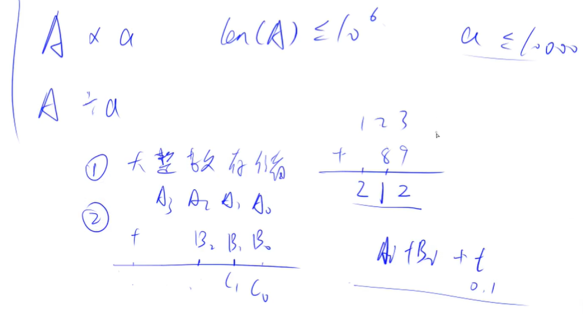
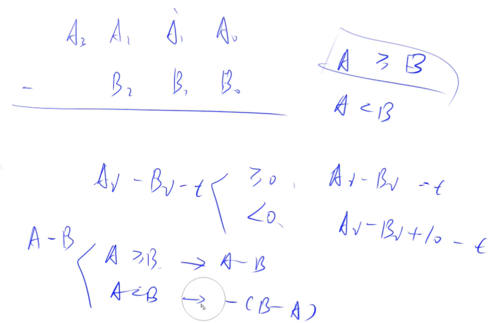
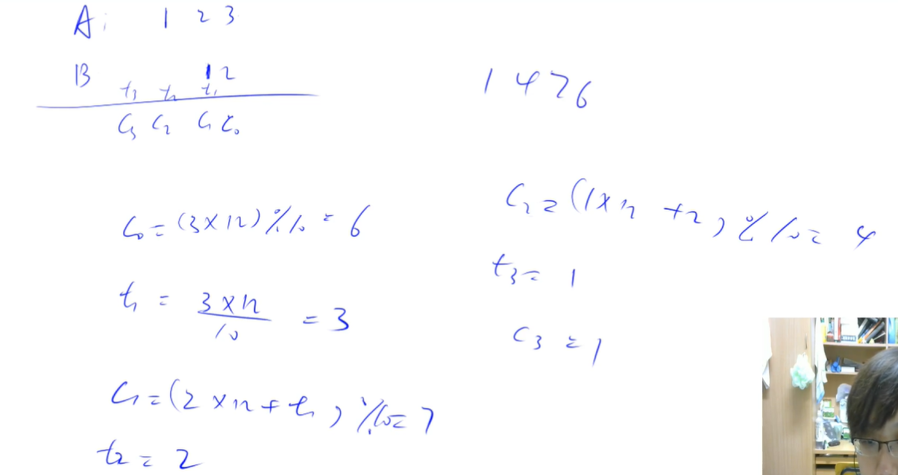
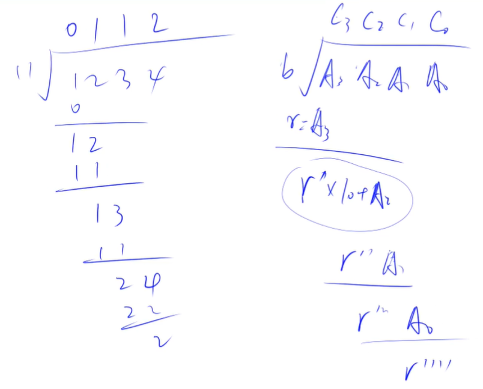
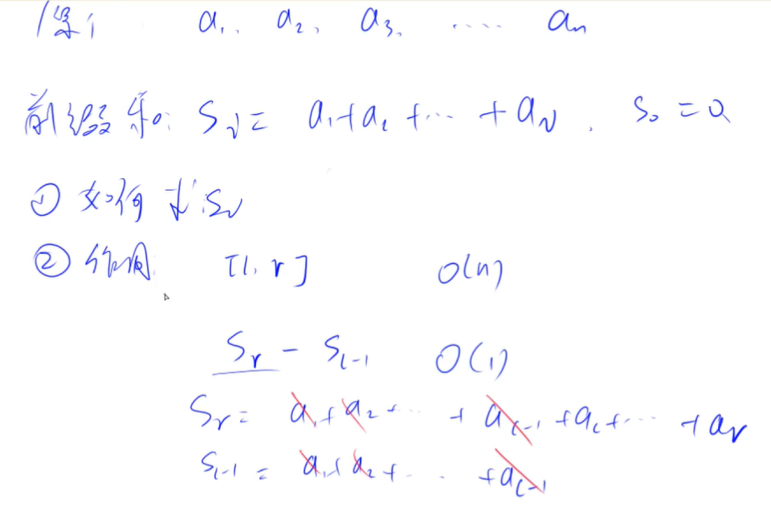
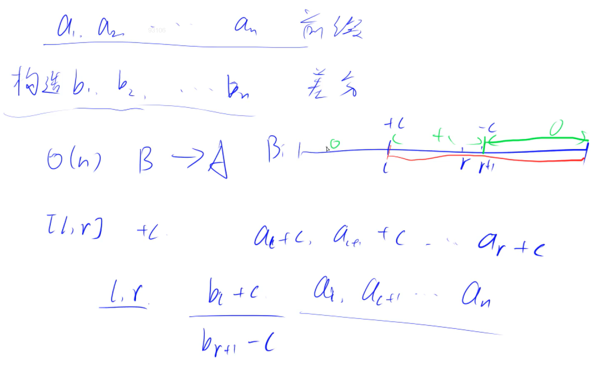
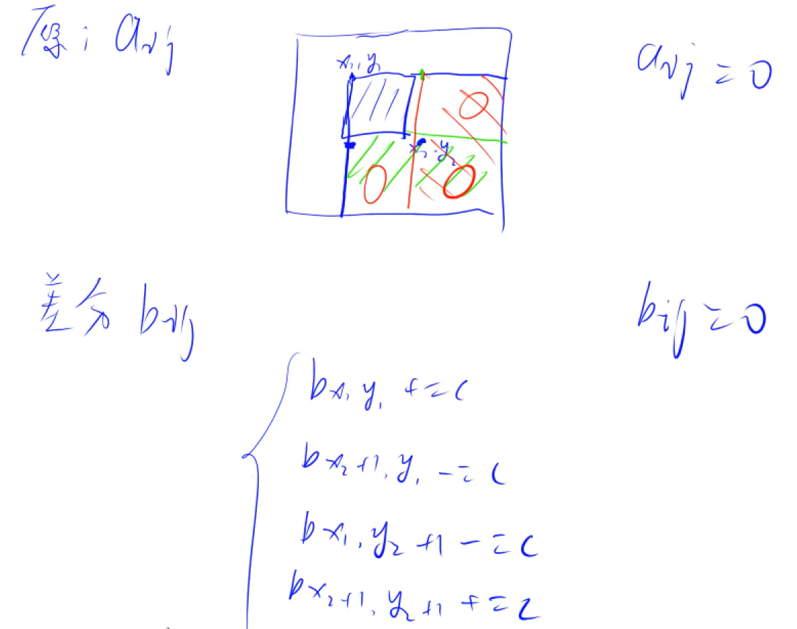

<!-- @import "[TOC]" {cmd="toc" depthFrom=1 depthTo=4 orderedList=false} -->

<!-- code_chunk_output -->

- [高精度](#高精度)
  - [高精度加法与模板](#高精度加法与模板)
  - [高精度减法与模板](#高精度减法与模板)
  - [高精度乘法与模板](#高精度乘法与模板)
  - [高精度除法与模板](#高精度除法与模板)
- [前缀和](#前缀和)
  - [前缀和思想（模板）](#前缀和思想模板)
  - [前缀和（一维求s[i]）](#前缀和一维求si)
  - [子矩阵的和（二维求s[i][j]）](#子矩阵的和二维求sij)
- [差分（与前缀和互为逆运算）](#差分与前缀和互为逆运算)
  - [差分（对连续区间加上同一个数）](#差分对连续区间加上同一个数)
  - [差分矩阵（二维的）](#差分矩阵二维的)

<!-- /code_chunk_output -->

### 高精度
适用于 C++ ，因为 java 或者 python 这种语言里都用数据结构对类型进行了封装。

对于数字 `123456789` ，应该放在数组中存储，注意是反过来的： `a[9] = {9,8,7,6,5,4,3,2,1}` 。

#### 高精度加法与模板


如上，正常加法就行。

```cpp
#include <iostream>
#include <vector>

using namespace std;

vector<int> add(vector<int> &A, vector<int> &B)
{
    vector<int> C;
    
    int t = 0;
    for (int i = 0; i < A.size() || i < B.size(); i ++)
    {
        if (i < A.size()) t += A[i];
        if (i < B.size()) t += B[i];
        C.push_back(t % 10);
        t /= 10;
    }
    
    if (t) C.push_back(t); // 别忘了最高位可能进1
    
    return C;
}

int main()
{
    string a, b;
    cin >> a >> b;
    
    vector<int> A, B;
    for (int i = a.size() - 1; i >= 0; i--) A.push_back(a[i] - '0');
    for (int i = b.size() - 1; i >= 0; i--) B.push_back(b[i] - '0');
    
    vector<int> C = add(A, B);
    for (int i = C.size() - 1; i >= 0; i --) printf("%d", C[i]);
    return 0;
}
```

经验：
- 用 `string` 接收，取出用 `.size()` 或者 `auto a: str`
- `a - '0'`是将数字字符串转为数值
- 定义 `vector<int> add(vector<int> &A, ...)`加上引用，是为了提高效率

```go
package main

import (
    "fmt"
    "bufio"
    "os"
)

func main() {
    var a, b string
    fmt.Scanf("%s", &a)
    fmt.Scanf("%s", &b)
    
    aa, bb := []int{}, []int{}
    for i := len(a) - 1; i >= 0; i -- {
        aa = append(aa, int(a[i] - '0'))
    }
    for i := len(b) - 1; i >= 0; i -- {
        bb = append(bb, int(b[i] - '0'))
    }

    add(aa, bb)
}

func add(aa, bb []int) {
    cc := []int{}
    
    t := 0
    for i := 0; i < len(aa) || i < len(bb); i ++ {
        if i < len(aa) {
            t += aa[i]
        }
        if i < len(bb) {
            t += bb[i]
        }
        cc = append(cc, t % 10)
        t /= 10
    }
    if t > 0 {
        cc = append(cc, t)
    }

    wr := bufio.NewWriter(os.Stdout)
    defer wr.Flush()
    for i := len(cc) - 1; i >= 0; i -- {
        fmt.Fprint(wr, cc[i])
    }
}
```

#### 高精度减法与模板


很显然

```cpp
#include <iostream>
#include <vector>

using namespace std;

bool cmp(vector<int> &A, vector<int> &B)
{
    if (A.size() != B.size()) return A.size() > B.size();

    for (int i = A.size() - 1; i >= 0; i -- )
        if (A[i] != B[i])
            return A[i] > B[i];

    return true;
}

vector<int> sub(vector<int> &A, vector<int> &B)
{
    vector<int> C;
    for (int i = 0, t = 0; i < A.size(); i ++ )
    {
        t = A[i] - t;
        if (i < B.size()) t -= B[i];
        C.push_back((t + 10) % 10);
        if (t < 0) t = 1;
        else t = 0;
    }

    while (C.size() > 1 && C.back() == 0) C.pop_back();
    return C;
}

int main()
{
    string a, b;
    vector<int> A, B;
    cin >> a >> b;
    for (int i = a.size() - 1; i >= 0; i -- ) A.push_back(a[i] - '0');
    for (int i = b.size() - 1; i >= 0; i -- ) B.push_back(b[i] - '0');

    vector<int> C;

    if (cmp(A, B)) C = sub(A, B);
    else C = sub(B, A), cout << '-';

    for (int i = C.size() - 1; i >= 0; i -- ) cout << C[i];
    cout << endl;

    return 0;
}
```

经验：
- `t` 用来表示借位，别想复杂了
- 这道题里有很多前提条件，比如所有参与运算的数都是正整数
- 别忘了“扫尾”，比如把 `001` 变为 `1`

```go
package main

import (
    "fmt"
    "bufio"
    "os"
)

func main() {
    var s1, s2 string
    fmt.Scanf("%s", &s1)
    fmt.Scanf("%s", &s2)
    
    a, b := []int{}, []int{}
    for i := len(s1) - 1; i >= 0; i -- {
        a = append(a, int(s1[i] - '0'))
    }
    for i := len(s2) - 1; i >= 0; i -- {
        b = append(b, int(s2[i] - '0'))
    }
    
    var c []int
    if (cmp(a, b)) {
        c = sub(a, b)
    } else {
        c = sub(b, a)
        fmt.Print("-")
    }
    
    out := bufio.NewWriter(os.Stdout)
    defer out.Flush()
    for i := len(c) - 1; i >= 0; i -- {
        fmt.Fprint(out, c[i])
    }
}

func cmp(a, b []int) bool {
    if len(a) > len(b) {
        return true
    } else if len(a) < len(b) {
        return false
    }
    for i := len(a) - 1; i >= 0; i -- {
        if a[i] > b[i] {
            return true
        } else if a[i] < b[i] {
            return false
        }
    }
    return true
}

func sub(a, b []int) []int {
    c := []int{}
    
    t := 0
    for i := 0; i < len(a); i ++ {
        t += a[i];
        if i < len(b) {
            t -= b[i]
        }
        c = append(c, (t + 10) % 10)
        if t < 0 {
            t = -1
        } else {
            t = 0
        }
    }

    var zeroIdx int
    for zeroIdx = len(c) - 1; zeroIdx >= 1; zeroIdx -- {
        if c[zeroIdx] != 0 {
            break
        }
    }
    return c[:zeroIdx + 1]
}
```

#### 高精度乘法与模板
这里是大数乘上小数。



还是用式子思考，同样是把乘法，拆成几个加法；计算过程与小学略有不同。

从小的位数开始累积起。

```cpp
#include <iostream>
#include <vector>
using namespace std;

vector<int> mul(const vector<int> A, const int b)
{
    vector<int> C;
    int t = 0;
    for (int i = 0; i < A.size() || t; i ++)
    {
        if (i < A.size()) t += A[i] * b;
        C.push_back(t % 10);
        t /= 10;
    }
    
    while (C.size() > 1) if (C.back() == 0) C.pop_back(); else break;

    return C;
}

int main()
{
    string a;
    int b;
    cin >> a >> b;
    
    vector<int> A;
    for (int i = a.size() - 1; i >= 0; i --) A.push_back(a[i] - '0');
    
    auto C = mul(A, b);
    for (int i = C.size() - 1; i >= 0; i --) printf("%d", C[i]);

    return 0;
}
```

```go
package main

import (
    "fmt"
    "bufio"
    "os"
)

func main() {
    var s string
    var b int
    fmt.Scanf("%s", &s)
    fmt.Scanf("%d", &b)
    
    a := []int{}
    for i := len(s) - 1; i >= 0; i -- {
        a = append(a, int(s[i] - '0'))
    }
    
    c := mul(a, b)
    out := bufio.NewWriter(os.Stdout)
    defer out.Flush()
    for i := len(c) - 1; i >= 0; i -- {
        fmt.Fprint(out, c[i])
    }
}

func mul(a []int, b int) []int {
    c := []int{}
    
    t := 0
    for i := 0; i < len(a) || t > 0; i ++ {
        if i < len(a) {
            t += a[i] * b
        }
        c = append(c, t % 10)
        t /= 10
    }
    
    var zIdx int
    for zIdx = len(c) - 1; zIdx >= 1; zIdx -- {
        if c[zIdx] != 0 {
            break
        }
    }

    return c[:zIdx + 1]
}
```

#### 高精度除法与模板



其实除法是很简单的思路。

```cpp
#include <iostream>
#include <vector>
#include <algorithm>  // 要用到 reverse

using namespace std;

vector<int> div(const vector<int> A, const int b, int &r)
{
    vector<int> C;
    r = 0;
    for (int i = A.size() - 1; i >= 0; i --)
    {
        r = r * 10 + A[i];
        C.push_back(r / b);  // r / b 一定是个位数，思考除法过程可得
        r %= b;
    }
    
    reverse(C.begin(), C.end());  // 注意除法从大位做起

    while (C.size() > 1 && C.back() == 0) C.pop_back();
    
    return C;
}

int main()
{
    string a;
    int b;
    cin >> a >> b;

    vector<int> A;
    for (int i = a.size() - 1; i >= 0; i --) A.push_back(a[i] - '0');

    int r;
    auto C = div(A, b, r);
    for (int i = C.size() - 1; i >= 0; i --) printf("%d", C[i]);
    cout << endl << r << endl;
}
```

```go
package main

import (
    "os"
    "bufio"
    "fmt"
)

func main() {
    var s string
    var b int
    fmt.Scanf("%s", &s)
    fmt.Scanf("%d", &b)
    
    a := []int{}
    for i := 0; i < len(s); i ++ {
        a = append(a, int(s[i] - '0'))
    }
    
    c, t := div(a, b)
    out := bufio.NewWriter(os.Stdout)
    defer out.Flush()
    for i := 0; i < len(c); i ++ {
        fmt.Fprint(out, c[i])
    }
    fmt.Fprint(out, "\n")
    fmt.Fprint(out, t)
}

func div(a []int, b int) ([]int, int) {
    c := []int{}
    
    t := 0
    for i := 0; i < len(a); i ++ {
        t = t * 10 + a[i]
        c = append(c, t / b)
        t %= b
    }

    for zIdx := 0; zIdx < len(c) - 1; zIdx ++ {
        if c[zIdx] != 0 {
            return c[zIdx:], t
        }
    }
    return c[len(c) - 1:], t
}
```

### 前缀和



如上，前缀和的作用可以是求数组里 `[l, r]` 这些连续序列的和。

一般，我们将 `S_0` 定义为 0 。

#### 前缀和思想（模板）
前缀和算是一种思想，而非模板。应该记得融入这种思想。

#### 前缀和（一维求s[i]）
- 输入一个长度为 n 的整数序列。
- 接下来再输入 m 个询问，每个询问输入一对 l,r。
- 对于每个询问，输出原序列中从第 l 个数到第 r 个数的和。

输入格式
- 第一行包含两个整数 n 和 m。
- 第二行包含 n 个整数，表示整数数列。
- 接下来 m 行，每行包含两个整数 l 和 r，表示一个询问的区间范围。

输出格式
- 共 m 行，每行输出一个询问的结果。

```cpp
#include <iostream>

using namespace std;

const int N = 1e5 + 10;

int a[N], s[N];

int main()
{
    int n, m;
    cin >> n >> m;
    for (int i = 0; i < n; i ++) scanf("%d", &a[i]);
    
    s[0] = 0;
    for (int i = 0; i < n; i ++) s[i + 1] = s[i] + a[i];
    
    int l, r;
    while (m -- )
    {
        scanf("%d%d", &l, &r);
        printf("%d\n", s[r] - s[l-1]);
    }
    
    return 0;
}
```

注意我上面是 `s[i + 1] = s[i] + a[i];` ，`s[i]` 表示前 i 个数的和。此外，`s[0]=0`不用声明， c++ 中数组默认值为 0 。

此外，也可以在代码中加入 `ios::sync_with_stdio(false)` 来提高 `cin` 速度，但是可能不能使用 `scanf` 了。比赛中可能会干扰文件操作。

```go
package main

import (
    "os"
    "bufio"
    "fmt"
    "strconv"
)

func main() {
    var n, m int
    var l, r int
    
    sc := bufio.NewScanner(os.Stdin)
    sc.Split(bufio.ScanWords)
    sc.Scan()
    n, _ = strconv.Atoi(sc.Text())
    sc.Scan()
    m, _ = strconv.Atoi(sc.Text())
    
    a := make([]int, n)
    s := make([]int, n + 1)
    
    for i := 0; i < n; i ++ {
        sc.Scan()
        a[i], _ = strconv.Atoi(sc.Text())
    }
    
    for i := 0; i < n; i ++ {
        s[i + 1] = s[i] + a[i];
    }
    
    out := bufio.NewWriter(os.Stdout)
    defer out.Flush()
    for i := 0; i < m; i ++ {
        sc.Scan()
        l, _ = strconv.Atoi(sc.Text())
        sc.Scan()
        r, _ = strconv.Atoi(sc.Text())
        
        fmt.Fprint(out, s[r] - s[l - 1])
        fmt.Fprint(out, "\n")
    }
}
```

#### 子矩阵的和（二维求s[i][j]）
- 输入一个 n 行 m 列的整数矩阵，再输入 q 个询问，每个询问包含四个整数 x1,y1,x2,y2，表示一个子矩阵的左上角坐标和右下角坐标。
 -对于每个询问输出子矩阵中所有数的和。

输入格式
- 第一行包含三个整数 n，m，q。
- 接下来 n 行，每行包含 m 个整数，表示整数矩阵。
- 接下来 q 行，每行包含四个整数 x1,y1,x2,y2，表示一组询问。

输出格式
- 共 q 行，每行输出一个询问的结果。

**同样，用小学数学就可以算：**
- 计算前缀和时，用两个小矩形加起来，减去重叠部分面积，再加上新元素 `a[i][j]`
- 计算子矩阵时，也是同样的思想，大矩阵减去两个小矩阵，补上被重复减去的部分的面积
- 注意 c++ 中数组默认值为 0

```cpp
#include <iostream>
using namespace std;

const int N = 1e3 + 10;
int n, m, q;
int a[N][N], s[N][N];

int main()
{
    scanf("%d%d%d", &n, &m, &q);
    for (int i = 0; i < n; i ++)
        for (int j = 0; j < m; j++)
            scanf("%d", &a[i][j]);

    for (int i = 1; i <= n; i ++)
        for (int j = 1; j <= m; j ++)
            s[i][j] = s[i - 1][j] + s[i][j - 1] - s[i - 1][j - 1] + a[i - 1][j - 1];
    
    while (q --)
    {
        int x1, y1, x2, y2;
        scanf("%d%d%d%d", &x1, &y1, &x2, &y2);
        printf("%d\n", s[x2][y2] - s[x1 - 1][y2] - s[x2][y1 - 1] + s[x1 - 1][y1 - 1]);
    }

    return 0;
}
```

注意，这里
```cpp
for (int i = 1; i <= n; i ++)
        for (int j = 1; j <= m; j ++)
            s[i][j] = s[i - 1][j] + s[i][j - 1] - s[i - 1][j - 1] + a[i - 1][j - 1];
```
我也可以写成：
```cpp
for (int i = 0; i < n; i ++)
        for (int j = 0; j < m; j ++)
            s[i + 1][j + 1] = s[i][j + 1] + s[i + 1][j] - s[i][j] + a[i][j];
```

都一个意思，因为对于`s,a`我们的下标意义不同，一个是数学上的（从1计数），一个是程序上的（从0计数）。

```go
package main

import (
    "fmt"
    "bufio"
    "os"
    "strconv"
)

func main() {
    var n, m, q, x1, y1, x2, y2 int
    
    sc := bufio.NewScanner(os.Stdin)
    sc.Split(bufio.ScanWords)
    
    sc.Scan()
    n, _ = strconv.Atoi(sc.Text())
    sc.Scan()
    m, _ = strconv.Atoi(sc.Text())
    sc.Scan()
    q, _ = strconv.Atoi(sc.Text())
    
    a := make([][]int, n)
    s := make([][]int, n + 1)
    for i := 0; i < n; i ++ {
        a[i] = make([]int, m)
        for j := 0; j < m; j ++ {
            sc.Scan()
            a[i][j], _ = strconv.Atoi(sc.Text())
        }
    }
    s[0] = make([]int, m + 1)
    for i := 0; i < n; i ++ {
        s[i + 1] = make([]int, m + 1)
        for j := 0; j < m; j ++ {
            s[i + 1][j + 1] = s[i][j + 1] + s[i + 1][j] + a[i][j] - s[i][j]
        }
    }
    
    out := bufio.NewWriter(os.Stdout)
    defer out.Flush()
    for i := 0; i < q; i ++ {
        sc.Scan()
        x1, _ = strconv.Atoi(sc.Text())
        sc.Scan()
        y1, _ = strconv.Atoi(sc.Text())
        sc.Scan()
        x2, _ = strconv.Atoi(sc.Text())
        sc.Scan()
        y2, _ = strconv.Atoi(sc.Text())
        
        fmt.Fprint(out, s[x2][y2] - s[x2][y1 - 1] - s[x1 - 1][y2] + s[x1 - 1][y1 - 1])
        fmt.Fprint(out, "\n")
    }
}
```

### 差分（与前缀和互为逆运算）

有 `a1, a2, ... , an`，构造 `b1, b2, ..., bn` 使得 `an = b1 + ... + bn` 。则 `{ai}` 是 `{bi}` 的前缀和， `{bi}` 是 `{ai}` 的差分。

构造方法可以是：`b1 = a1, b2 = a2 - a1, b3 = a3 - a2` 。

#### 差分（对连续区间加上同一个数）

- 输入一个长度为 n 的整数序列。
- 接下来输入 m 个操作，每个操作包含三个整数 l,r,c，表示将序列中 [l,r] 之间的每个数加上 c。
- 请你输出进行完所有操作后的序列。

输入格式
- 第一行包含两个整数 n 和 m。
- 第二行包含 n 个整数，表示整数序列。
- 接下来 m 行，每行包含三个整数 l，r，c，表示一个操作。

输出格式
- 共一行，包含 n 个整数，表示最终序列。



**分析：**
- 只有理解了差分的性质，才能在考试时遇到这种题目想到用差分的方法，因为如你所见，题目中没有“差分”字样。
- 差分序列是`b`，则`b5`加上一个值，因为`a5=b5+...+b1`、`a6=b6+...+b1`，所有序列`a5,a6...`都会因此加上一个值
- 如果希望区间`l, r`序列加上一个值，则对其差分序列操作两次即可`b[l] += c; b[r+1] -= c`，之后再把差分序列还原回原序列

```cpp
#include <iostream>

using namespace std;

const int N = 1e5 + 10;

int n, m;
int a[N], b[N];
int l, r, c;

void insert(int l, int r, int c)
{
    b[l] += c;
    b[r + 1] -= c;
}

int main()
{
    cin >> n >> m;
    for (int i = 1; i <= n; i ++) scanf("%d", &a[i]);
    
    // 差分序列实际上也可以用 insert 初始化
    // b1 = a1, b2 = a2 - a1 注意 a1 用了两次
    for (int i = 1; i <= n; i ++) insert(i, i, a[i]);
    
    while (m --)
    {
        scanf("%d%d%d", &l, &r, &c);
        insert(l, r, c);
    }
    
    // 差分序列转换为原序列
    for (int i = 1; i <= n; i ++) b[i] += b[i - 1];
    
    for (int i = 1; i <= n; i ++) printf("%d ", b[i]);
    
    return 0;
}
```

经验：
- 我这里复刻y总的代码风格，为了避免数学计数与程序计数混淆，这里下表都直接从1开始；且很好地利用了  c++ 中数组默认值为 0
- 最后差分序列转换为原序列也是很妙，直接在 b 上操作

> 上面用 insert 初始化差分序列还有一个思路：差分从一开始就被构造好了，即a是全零序列，b是全零序列，因此b是a的差分；a的每个i被加了个值c，那么执行insert(i,i,c)就可以把a的变化反应在b上。

```go
package main

import (
    "bufio"
    "os"
    "fmt"
    "strconv"
)

func main() {
    var n, m int
    var l, r, c int
    var a, b []int

    insert := func (i, j, v int) {
        b[i] += v
        b[j + 1] -= v
    }

    sc := bufio.NewScanner(os.Stdin)
    sc.Split(bufio.ScanWords)
    
    sc.Scan()
    n, _ = strconv.Atoi(sc.Text())
    sc.Scan()
    m, _ = strconv.Atoi(sc.Text())
    
    a = make([]int, n + 1)
    b = make([]int, n + 2)
    for i := 1; i <= n; i ++ {
        sc.Scan()
        a[i], _ = strconv.Atoi(sc.Text())
        insert(i, i, a[i])
    }
    
    for i := 0; i < m; i ++ {
        sc.Scan()
        l, _ = strconv.Atoi(sc.Text())
        sc.Scan()
        r, _ = strconv.Atoi(sc.Text())
        sc.Scan()
        c, _ = strconv.Atoi(sc.Text())
        insert(l, r, c)
    }
    
    for i := 0; i < n; i ++ {
        b[i + 1] = b[i + 1] + b[i]
    }
    
    out := bufio.NewWriter(os.Stdout)
    defer out.Flush()
    for i := 0; i < n; i ++ {
        fmt.Fprint(out, b[i + 1])
        fmt.Fprint(out, " ")
    }
}
```

#### 差分矩阵（二维的）


也是类似的思路。

- 输入一个 n 行 m 列的整数矩阵，再输入 q 个操作，每个操作包含五个整数 x1,y1,x2,y2,c，其中 (x1,y1) 和 (x2,y2) 表示一个子矩阵的左上角坐标和右下角坐标。
- 每个操作都要将选中的子矩阵中的每个元素的值加上 c。
- 请你将进行完所有操作后的矩阵输出。

输入格式
- 第一行包含整数 n,m,q。
- 接下来 n 行，每行包含 m 个整数，表示整数矩阵。
- 接下来 q 行，每行包含 5 个整数 x1,y1,x2,y2,c，表示一个操作。

输出格式
- 共 n 行，每行 m 个整数，表示所有操作进行完毕后的最终矩阵。

```cpp
#include <iostream>
using namespace std;

const int N = 1e3 + 10;
int n, m, q;
int a[N][N], b[N][N];
int x1, y1, x2, y2, c;

void insert(int x1, int y1, int x2, int y2, int c)
{
    b[x1][y1] += c;
    b[x1][y2 + 1] -= c;
    b[x2 + 1][y1] -= c;
    b[x2 + 1][y2 + 1] += c;
}

int main()
{
    cin >> n >> m >> q;
    
    for (int i = 1; i <= n; i ++)
        for (int j = 1; j <= m; j ++)
            scanf("%d", &a[i][j]);
    
    for (int i = 1; i <= n; i ++)
        for (int j = 1; j <= m; j ++)
            insert(i, j, i, j, a[i][j]);
    
    while (q --)
    {
        scanf("%d%d%d%d%d", &x1, &y1, &x2, &y2, &c);
        insert(x1, y1, x2, y2, c);
    }
    
    // 差分矩阵转换为原矩阵
    for (int i = 1; i <= n; i ++)
        for (int j = 1; j <= m; j ++)
            b[i][j] += (b[i][j - 1] + b[i - 1][j] - b[i - 1][j - 1]);
    
    for (int i = 1; i <= n; i ++)
    {
        for (int j = 1; j <= m; j ++)
            printf("%d ", b[i][j]);
        puts("");
    }
}
```

经验：
- 用 `puts("")` 换行
- 这里 `差分矩阵转换为原矩阵` ，主要从空间（图像）上思考：`a[i][j] = b[0][0] + ... + b[i][j]`

```go
package main

import (
    "bufio"
    "os"
    "fmt"
    "strconv"
)

func main() {
    var n, m, q int
    var b [][]int
    
    insert := func(x1, y1, x2, y2, c int) {
        b[x1][y1] += c
        b[x1][y2 + 1] -= c
        b[x2 + 1][y1] -= c
        b[x2 + 1][y2 + 1] += c
    }
    
    sc := bufio.NewScanner(os.Stdin)
    sc.Split(bufio.ScanWords)
    
    readInt := func(x *int) {
        sc.Scan()
        *x, _ = strconv.Atoi(sc.Text())
    }
    
    readInt(&n)
    readInt(&m)
    readInt(&q)
    
    // fmt.Println(n, m, q)
    b = make([][]int, n + 2)
    b[0] = make([]int, m + 2)
    b[1] = make([]int, m + 2)
    for i := 1; i <= n; i ++ {
        b[i + 1] = make([]int, m + 2)  // or out-of-range error in `insert`
        for j := 1; j <= m; j ++ {
            var x int
            readInt(&x)
            insert(i, j, i, j, x)
        }
    }
    
    for i := 1; i <= q; i ++ {
        var x1, y1, x2, y2, c int
        readInt(&x1)
        readInt(&y1)
        readInt(&x2)
        readInt(&y2)
        readInt(&c)
        insert(x1, y1, x2, y2, c)
    }
    
    out := bufio.NewWriter(os.Stdout)
    defer out.Flush()
    for i := 1; i <= n; i ++ {
        for j := 1; j <= m; j ++ {
            b[i][j] = b[i][j] + b[i][j - 1] + b[i - 1][j] - b[i - 1][j - 1]
            fmt.Fprint(out, b[i][j])
            fmt.Fprint(out, " ")
        }
        fmt.Fprint(out, "\n")
    }
}
```
