<!-- @import "[TOC]" {cmd="toc" depthFrom=1 depthTo=4 orderedList=false} -->

<!-- code_chunk_output -->

- [链表](#链表)
  - [数组模拟单链表（邻接表）](#数组模拟单链表邻接表)
  - [数组模拟双链表](#数组模拟双链表)
- [栈](#栈)
  - [数组实现栈模板](#数组实现栈模板)
  - [表达式求值模板](#表达式求值模板)
- [队列](#队列)
  - [数组实现队列模板](#数组实现队列模板)
- [单调栈](#单调栈)
  - [寻找左边最近的比自己小的数](#寻找左边最近的比自己小的数)
- [单调队列](#单调队列)
  - [滑动窗口](#滑动窗口)
- [KMP：字符串匹配](#kmp字符串匹配)

<!-- /code_chunk_output -->

### 链表

链表有很多种实现方式：
```cpp
struct Node
{
    int val;
    Node *next;
};
```

上述方式不讲，因为 `new 新节点` 非常慢。笔试一边不采用动态链表。今天拿数组模拟链表（称为静态链表）。

#### 数组模拟单链表（邻接表）
单链表常用于做邻接表，邻接表常用于存储树和图。

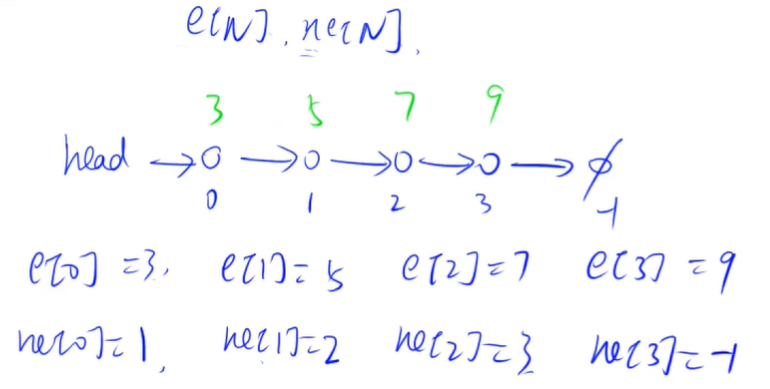

如上：
- 点值`e`和next指针`ne`用下标关联
- 空集用`-1`表示
- 此外，我们还会定义 `idx` ，表示当前已经用到哪个点
- `head` 表示头节点是谁（数组下标）

数组模拟链表可以做指针链表的所有事，优势就是速度快。

##### 数组单链表模板
- 实现一个单链表，链表初始为空，支持三种操作：
  - 向链表头插入一个数；
  - 删除第 k 个插入的数后面的数；`（删掉数组下标是k-1的点，因为k从1开始计数，而链表的“地址”从0开始计数）`
  - 在第 k 个插入的数后插入一个数。
- 现在要对该链表进行 M 次操作，进行完所有操作后，从头到尾输出整个链表。
- 注意:题目中第 k 个插入的数并不是指当前链表的第 k 个数。例如操作过程中一共插入了 n 个数，则按照插入的时间顺序，这 n 个数依次为：第 1 个插入的数，第 2 个插入的数，…第 n 个插入的数。

输入格式
- 第一行包含整数 M，表示操作次数。
- 接下来 M 行，每行包含一个操作命令，操作命令可能为以下几种：
  - H x，表示向链表头插入一个数 x。
  - D k，表示删除第 k 个插入的数后面的数（当 k 为 0 时，表示删除头结点）。
  - I k x，表示在第 k 个插入的数后面插入一个数 x（此操作中 k 均大于 0）。

输出格式
- 共一行，将整个链表从头到尾输出。

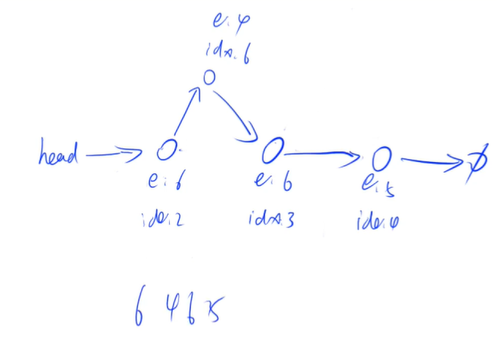

```cpp
#include <iostream>
using namespace std;

const int N = 1e5 + 10;

// idx 在这里类似于地址
int head, e[N], ne[N], idx;

void init()
{
    head = -1;
    idx = 0;
}

void add_to_head(int x)
{
    e[idx] = x, ne[idx] = head, head = idx, idx ++ ;
}

// 将 x 插到 k 后
// 插入的思路都是：先把待插入点指针确定
//      再把原有链切断、连接
void add(int k, int x)
{
    e[idx] = x, ne[idx] = ne[k], ne[k] = idx, idx ++ ;
}

void remove(int k)
{
    ne[k] = ne[ne[k]];
}

int main()
{
    int m;
    cin >> m;
    
    init();  // 别忘了初始化
    
    while (m --)
    {
        int k, x;
        char op;
        cin >> op;
        if (op == 'H')
        {
            cin >> x;
            add_to_head(x);
        }
        else if (op == 'D')
        {
            cin >> k;
            if (!k) head = ne[head];  // k=0代表删除头节点
            else remove(k - 1);  // 注意题目中 k 从 1 开始计数
        }
        else
        {
            cin >> k >> x;
            add(k - 1, x);  // 注意题目中 k 从 1 开始计数
        }
    }
    
    for (int i = head; i != -1; i = ne[i]) cout << e[i] << " ";
    return 0;
}
```

**经验：**
- **静态链表的 head 、idx、-1实际上都是“地址”，要被指针指的**
- 静态链表不好的地方是内存不安全，我们删除了某个点，实际上只是改变指针，被删除的点还会躺在数组里

```go
package main

import (
    "fmt"
    "bufio"
    "strconv"
    "os"
)

var N int = 1e5 + 10

var sc *bufio.Scanner
var head, idx int
var e, ne []int

func init() {
    sc = bufio.NewScanner(os.Stdin)
    sc.Split(bufio.ScanWords)
    
    head, idx = -1, 0
    e, ne = make([]int, N), make([]int, N)
}

func addToHead(x int) {
    // malloc (create new node)
    e[idx] = x
    ne[idx] = head
    // 整理纠正之前已存在 nodes
    head = idx
    // 下一个可申请空间
    idx ++
}

func remove(k int) {
    ne[k] = ne[ne[k]]  // 所有操作合法，所以不考虑 k 后无数
}

func insert(k, x int) {
    // malloc (create new node)
    e[idx] = x
    ne[idx] = ne[k]
    // 整理纠正之前已存在 nodes
    ne[k] = idx
    // 下一个可申请空间
    idx ++
}

func getReadIntHook () func() int {
    return func() int {
        sc.Scan()
        x, _ := strconv.Atoi(sc.Text())
        return x
    }
}

func getReadStrHook () func() string {
    return func() string {
        sc.Scan()
        return sc.Text()
    }
}

func main() {
    readInt := getReadIntHook()
    readStr := getReadStrHook()
    
    m := readInt()
    for i := 0; i < m; i ++ {
        _ = i
        op := readStr()
        if op == "H" {
            x := readInt()
            addToHead(x)
        } else if op == "D" {
            k := readInt()
            if k == 0 {
                head = ne[head];
            } else {
                remove(k - 1)
            }
        } else {
            k, x := readInt(), readInt()
            insert(k - 1, x)
        }
    }
    
    out := bufio.NewWriter(os.Stdout)
    defer out.Flush()
    
    for p := head; p != -1; p = ne[p] {
        fmt.Fprint(out, e[p], " ")
    }
}
```

#### 数组模拟双链表
常用于优化某些问题。

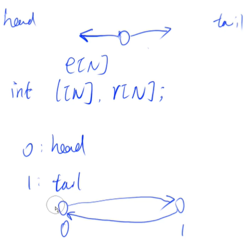

如上是双链表初始状态。双链表有两个指针，分别指向前后。**这里“偷个懒”，不定义头节点和尾节点了。** 对于初始状态：
- 头节点右指针 `r[0]` 指向尾节点 `1`
- 尾节点左指针 `l[1]` 指向头节点 `0`

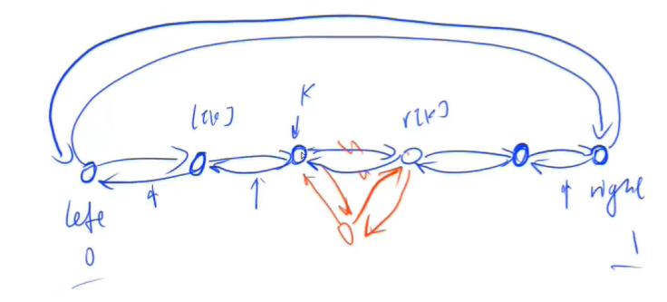

如上是双链表插入。

##### 双链表模板
- 实现一个双链表，双链表初始为空，支持 5 种操作：
  - 在最左侧插入一个数；
  - 在最右侧插入一个数；
  - 将第 k 个插入的数删除；
  - 在第 k 个插入的数左侧插入一个数；
  - 在第 k 个插入的数右侧插入一个数
  - 现在要对该链表进行 M 次操作，进行完所有操作后，从左到右输出整个链表。
- 注意:题目中第 k 个插入的数并不是指当前链表的第 k 个数。例如操作过程中一共插入了 n 个数，则按照插入的时间顺序，这 n 个数依次为：第 1 个插入的数，第 2 个插入的数，…第 n 个插入的数。

输入格式
- 第一行包含整数 M，表示操作次数。
- 接下来 M 行，每行包含一个操作命令，操作命令可能为以下几种：
- `L x`，表示在链表的最左端插入数 x。
- `R x`，表示在链表的最右端插入数 x。
- `D k`，表示将第 k 个插入的数删除。
- `IL k x`，表示在第 k 个插入的数左侧插入一个数。
- `IR k x`，表示在第 k 个插入的数右侧插入一个数。

输出格式
- 共一行，将整个链表从左到右输出。

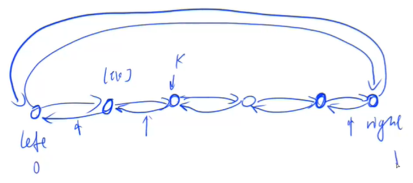

```cpp
#include <iostream>
#include <string>
using namespace std;

const int N = 1e5 + 10;

int idx;
int e[N], l[N], r[N];

void init()
{
    r[0] = 1;
    l[1] = 0;
    idx = 2; // 新加入的元素，其地址从2开始计
}

void add(int k, int x)
{
    e[idx] = x;
    l[idx] = k;
    r[idx] = r[k];
    l[r[k]] = idx;  // 这行和下一行顺序不能反
    r[k] = idx;  // 因为先会用到 r[k]
    idx ++;
}

void remove(int k)
{
    r[l[k]] = r[k];
    l[r[k]] = l[k];
}

int main()
{
    string op;
    int k, x, m;
    cin >> m;
    
    init(); // init 总容易让人忘
    
    while (m --)
    {
        cin >> op;
        if (op == "L")
        {
            cin >> x;
            add(0, x);
        }
        else if (op == "R")
        {
            cin >> x;
            add(l[1], x);
        }
        else if (op == "D")
        {
            cin >> k;
            remove(k + 1);  // 第k插入的点，地址为 k + 1，因为地址 0 与 1 被头尾节点用去
        }
        else if (op == "IL")
        {
            cin >> k >> x;
            add(l[k + 1], x);
        }
        else if (op == "IR")
        {
            cin >> k >> x;
            add(k + 1, x);
        }
    }
    
    for (int i = r[0]; i != 1; i = r[i]) printf("%d ", e[i]);
    
    return 0;
}
```

思路：
- 只实现在某一个数右边插入一个点，就可了，可以相应地实现其他三个操作
  - 在最左端插入数，相当于 `add(left, x)`
  - 在最右端插入数，相当于 `add(l[right], x)` ，即在右端点的左边点的右边插入一点
  - 在第 k 个数的左侧插入一个数，相当于 `add(l[k], x)` ，即在 k 的左边点的右边插入一点

经验：
- `r[i]` 表示 i 节点的右侧节点

```go
package main

import (
    "fmt"
    "bufio"
    "strconv"
    "os"
)

var N int = 1e5 + 10

var sc *bufio.Scanner
var idx int
var e, l, r []int

func init() {
    sc = bufio.NewScanner(os.Stdin)
    sc.Split(bufio.ScanWords)

    e, l, r = make([]int, N), make([]int, N), make([]int, N)
    r[0] = 1
    l[1] = 0
    idx = 2
}

func insert(k, x int) {
    // malloc (create new node)
    e[idx] = x
    l[idx] = k
    r[idx] = r[k]
    // 整理纠正之前已存在 nodes
    l[r[k]] = idx
    r[k] = idx
    // 下一个可申请空间
    idx ++
}

func remove(k int) {
    r[l[k]] = r[k]
    l[r[k]] = l[k]
}

func getReadIntHook () func() int {
    return func() int {
        sc.Scan()
        x, _ := strconv.Atoi(sc.Text())
        return x
    }
}

func getReadStrHook () func() string {
    return func() string {
        sc.Scan()
        return sc.Text()
    }
}

func main() {
    readInt := getReadIntHook()
    readStr := getReadStrHook()
    
    m := readInt()
    for i := 0; i < m; i ++ {
        _ = i
        op := readStr()
        if op == "L" {
            x := readInt()
            insert(0, x)
        } else if op == "R" {
            x := readInt()
            insert(l[1], x)
        } else if op == "D" {
            k := readInt()
            remove(k + 1)
        } else if op == "IL" {
            k, x := readInt(), readInt()
            insert(l[k + 1], x)
        } else {
            k, x := readInt(), readInt()
            insert(k + 1, x)
        }
    }
    
    out := bufio.NewWriter(os.Stdout)
    defer out.Flush()

    for p := r[0]; p != 1; p = r[p] {
        fmt.Fprint(out, e[p], " ")
    }
}
```

##### 简单提一下邻接表
邻接表是多个单链表。

用邻接表存储树和图，会在之后部分细讲。

### 栈
先进后出。

#### 数组实现栈模板

- 实现一个栈，栈初始为空，支持四种操作：
  - push x – 向栈顶插入一个数 x；
  - pop – 从栈顶弹出一个数；
  - empty – 判断栈是否为空；
  - query – 查询栈顶元素。
- 现在要对栈进行 M 个操作，其中的每个操作 3 和操作 4 都要输出相应的结果。

输入格式
- 第一行包含整数 M，表示操作次数。
- 接下来 M 行，每行包含一个操作命令，操作命令为 push x，pop，empty，query 中的一种。

输出格式
- 对于每个 empty 和 query 操作都要输出一个查询结果，每个结果占一行。
- 其中，empty 操作的查询结果为 YES 或 NO，query 操作的查询结果为一个整数，表示栈顶元素的值。

```cpp
#include <iostream>
#include <string>
using namespace std;

const int N = 1e5 + 10;

int stk[N], tt;

int main()
{
    int x, m;
    string op;
    cin >> m;
    
    while (m --)
    {
        cin >> op;
        if (op == "push")
        {
            cin >> x;
            stk[ ++ tt ] = x;  // 第一个元素下标为1
        }
        else if (op == "pop")
        {
            tt --;
        }
        else if (op == "empty")
        {
            if (tt > 0) cout << "NO" << endl;
            else cout << "YES" << endl;
        }
        else if (op == "query")
        {
            cout << stk[tt] << endl;
        }
    }

    return 0;
}
```

```go
package main

import (
    "fmt"
    "bufio"
    "os"
    "strconv"
)

var sc *bufio.Scanner

var tt int
var stk [1e5 + 10]int

func init() {
    sc = bufio.NewScanner(os.Stdin)
    sc.Split(bufio.ScanWords)
    
    tt = 0
}

func main() {
    var m int
    
    readInt := func () int {
        sc.Scan()
        x, _ := strconv.Atoi(sc.Text())
        return x
    }
    
    readStr := func () string {
        sc.Scan()
        return sc.Text()
    }
    
    out := bufio.NewWriter(os.Stdout)
    defer out.Flush()
    
    m = readInt()
    for i := 0; i < m; i ++ {
        op := readStr()
        if op == "push" {
            x := readInt()
            tt ++
            stk[tt] = x
        } else if op == "query" {
            fmt.Fprint(out, stk[tt], "\n")
        } else if op == "pop" {
            tt --
        } else {
            if tt > 0 {
                fmt.Fprint(out, "NO\n")
            } else {
                fmt.Fprint(out, "YES\n")
            }
        }
    }
}
```

#### 表达式求值模板
- 给定一个表达式，其中运算符仅包含 +,-,*,/（加 减 乘 整除），可能包含括号，请你求出表达式的最终值。
- 注意：
  - 数据保证给定的表达式合法。
  - 题目保证符号 - 只作为减号出现，不会作为负号出现，例如，-1+2,(2+2)*(-(1+1)+2) 之类表达式均不会出现。
  - 题目保证表达式中所有数字均为正整数。
  - 题目保证表达式在中间计算过程以及结果中，均不超过 231−1。
  - 题目中的整除是指向 0 取整，也就是说对于大于 0 的结果向下取整，例如 5/3=1，对于小于 0 的结果向上取整，例如 5/(1−4)=−1。
  - C++和Java中的整除默认是向零取整；Python中的整除//默认向下取整，因此Python的eval()函数中的整除也是向下取整，在本题中不能直接使用。

输入格式
- 共一行，为给定表达式。

输出格式
- 共一行，为表达式的结果。

分析：
- 很经典的数据结构题目
- 我们这里实现的是中缀表达式，要注意优先级问题（用括号）
- y总讲解（y总结合了后缀表达式求值，这里不好直接理解，直接看代码，举例子更好理解）：树如下，重点是：**如何判断某棵子树被遍历完？当前运算符优先级大于等于上一子树优先级，表示遍历完。**
  - 上面是 + ，下面是 × ，则 × 完遇到 + ，另一侧子树可能还没遍历完
  - 遇到右括号，就直接把右括号左的内容都计算完

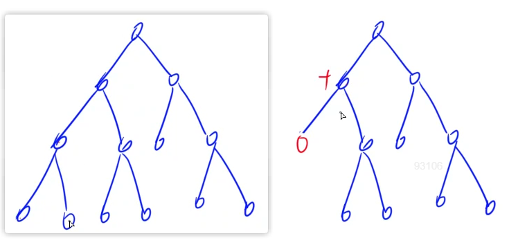

```cpp
#include <iostream>
#include <string>
#include <algorithm>
#include <stack>
#include <unordered_map>

using namespace std;

stack<int> num;
stack<char> op;

void eval()
{
    auto b = num.top(); num.pop();  // 注意顺序，因为有减法、除法
    auto a = num.top(); num.pop();
    auto c = op.top(); op.pop();
    int x;
    if (c == '+') x = a + b;
    else if (c == '-') x = a - b;
    else if (c == '*') x = a * b;
    else x = a / b;
    num.push(x);
}

int main()
{
    unordered_map<char, int> pr{
        {'+', 1}, {'-', 1}, {'*', 2}, {'/', 2}
    };
    string str;
    cin >> str;
    for (int i = 0; i < str.size(); i ++)
    {
        auto c = str[i];
        if (isdigit(c))
        {
            int x = 0, j = i;
            while (j < str.size() && isdigit(str[j]))
                x = x * 10 + str[j ++] - '0';
            num.push(x);
            i = j - 1;
        }
        else if (c == '(') op.push(c);
        else if (c == ')')
        {
            while (op.top() != '(') eval();
            op.pop();
        }
        else
        {
            while (op.size() && pr[op.top()] >= pr[c]) eval();
            op.push(c);
        }
    }
    while (op.size()) eval();
    cout << num.top() << endl;
    return 0;
}
```

```go
package main

import (
    "fmt"
    "bufio"
    "os"
)

var (
    num []int = []int{}
    op []rune = []rune{}
    pr map[rune]int = map[rune]int{
        '+': 1, '-': 1, '*': 2, '/': 2,
    }
)

func main() {
    sc := bufio.NewScanner(os.Stdin)
    sc.Buffer(nil, 1e9)  // 这里很重要，默认 buf 只有 65536
    sc.Scan()
    s := sc.Text()

    out := bufio.NewWriter(os.Stdout)
    defer out.Flush()

    eval := func() {
        b := num[len(num) - 1]
        num = num[:len(num) - 1]
        a := num[len(num) - 1]
        num = num[:len(num) - 1]
        p := op[len(op) - 1]
        op = op[:len(op) - 1]
        if p == '+' {
            num = append(num, a + b)
        } else if p == '-' {
            num = append(num, a - b)
        } else if p == '*' {
            num = append(num, a * b)
        } else {
            num = append(num, a / b)
        }
    }

    x := 0
    constructingNum := false
    for _, c := range s {
        if c >= '0' && c <= '9' {
            x = x * 10 + int(c - '0')
            constructingNum = true
        } else {
            if constructingNum {
                num = append(num, x)
                x = 0
                constructingNum = false
            }
            if c == '(' {
                op = append(op, c)
            } else if c == ')' {
                for op[len(op) - 1] != '(' {
                    eval()
                }
                op = op[:len(op) - 1]
            } else {
                for len(op) > 0 && pr[op[len(op) - 1]] >= pr[c] {
                    eval()
                }
                op = append(op, c)
            }
        }
    }
    
    if constructingNum {
        num = append(num, x)
        x = 0
        constructingNum = false
    }
    
    for len(op) > 0 {
        eval()
    }
    
    fmt.Println(num[0])
}
```

### 队列
先进先出。

#### 数组实现队列模板
- 实现一个队列，队列初始为空，支持四种操作：
  - push x – 向队尾插入一个数 x；
  - pop – 从队头弹出一个数；
  - empty – 判断队列是否为空；
  - query – 查询队头元素。
  - 现在要对队列进行 M 个操作，其中的每个操作 3 和操作 4 都要输出相应的结果。

输入格式
- 第一行包含整数 M，表示操作次数。
- 接下来 M 行，每行包含一个操作命令，操作命令为 push x，pop，empty，query 中的一种。

输出格式
- 对于每个 empty 和 query 操作都要输出一个查询结果，每个结果占一行。
- 其中，empty 操作的查询结果为 YES 或 NO，query 操作的查询结果为一个整数，表示队头元素的值。

```cpp
#include <iostream>
#include <string>
using namespace std;

const int N = 1e5 + 10;

int q[N], hh, tt = - 1;

int main()
{
    int x, m;
    string op;
    cin >> m;
    
    while (m --)
    {
        cin >> op;
        if (op == "push")
        {
            cin >> x;
            q[ ++ tt ] = x;
        }
        else if (op == "pop")
        {
            hh ++;
        }
        else if (op == "empty")
        {
            if (tt >= hh) cout << "NO" << endl;
            else cout << "YES" << endl;
        }
        else if (op == "query")
        {
            // 其实数组实现的队列，不单单能查询队头
            // 还可以查询队尾
            cout << q[hh] << endl;
        }
    }

    return 0;
}
```

注意队尾 tt 从 -1 开始。

```go
package main

import (
    "fmt"
    "bufio"
    "os"
    "strconv"
)

var (
    q [1e5 + 10]int
    hh int = 0
    tt int = -1
)

func main() {
    sc := bufio.NewScanner(os.Stdin)
    sc.Split(bufio.ScanWords)
    
    out := bufio.NewWriter(os.Stdout)
    defer out.Flush()
    
    readInt := func () int {
        sc.Scan()
        x, _ := strconv.Atoi(sc.Text())
        return x
    }
    
    readStr := func () string {
        sc.Scan()
        return sc.Text()
    }
    
    m := readInt()
    for i := 0; i < m; i ++ {
        op := readStr()
        if op == "push" {
            x := readInt()
            tt ++
            q[tt] = x
        } else if op == "pop" {
            hh ++
        } else if op == "empty" {
            if tt >= hh {
                fmt.Fprint(out, "NO\n")
            } else {
                fmt.Fprint(out, "YES\n")
            }
        } else {
            fmt.Fprint(out, q[hh], "\n")
        }
    }
}
```

### 单调栈
一般就这一个题型：寻找左边最近的比自己小的数。

**单调栈心得：** 遍历到 i 时，总会把 i 推入栈，总会保证栈顶到栈底是降序的。因此在把 i 入栈前，从栈顶开始，把比 i 高（大于等于）的都 pop 出来。

#### 寻找左边最近的比自己小的数
- 给定一个长度为 N 的整数数列，输出每个数左边第一个比它小的数，如果不存在则输出 −1。

输入格式
- 第一行包含整数 N，表示数列长度。
- 第二行包含 N 个整数，表示整数数列。

输出格式
- 共一行，包含 N 个整数，其中第 i 个数表示第 i 个数的左边第一个比它小的数，如果不存在则输出 −1。

分析：
- 首先想到两层循环，暴力做法；接下来想哪里可以优化（类似双指针的思路）
- 注意一个性质，如果 `i < j` ，且 `a[i] >= a[j]` ，那么我们之后都没必要管 `i` 了，因为 `j` 比 `i` 更加靠右，且值更小；后面的数向左搜索的过程中，碰到 `j` 觉得不行（还没 `a[j]` 大呢），碰到 `i` 更不会觉得行了（更不会有 `a[i]` 大）

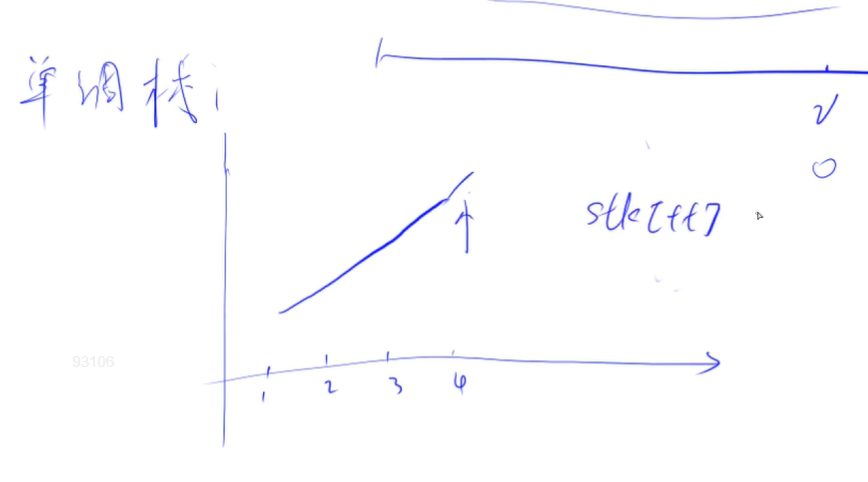
如上，我们保留在栈中的内容是单调的。

```cpp
#include <iostream>

using namespace std;

const int N = 1e5 + 10;

int stk[N], tt;

int main()
{
    int n, x;
    cin >> n;
    
    for (int i = 0; i < n; i ++)
    {
        cin >> x;
        while (tt && stk[tt] >= x) tt --;
        if (tt) cout << stk[tt] << " ";
        else cout << -1 << " ";
        
        stk[++ tt] = x;
    }
    
    return 0;
}
```

经验：
- `while (tt && stk[tt] >= x)` 与 `while (tt & stk[tt] >= x)` 结果有区别，后者在不是 Boolean 类型时，会自动转换为位运算
- 此题不考虑返回索引，因此可以边读边输出，且肆意删除元素。

```go
package main

import (
    "fmt"
    "bufio"
    "os"
    "strconv"
)

func main() {
    sc := bufio.NewScanner(os.Stdin)
    sc.Split(bufio.ScanWords)
    
    out := bufio.NewWriter(os.Stdout)
    defer out.Flush()
    
    readInt := func() int {
        sc.Scan()
        x, _ := strconv.Atoi(sc.Text())
        return x
    }
    
    stk := make([]int, 0)
    
    n := readInt()
    for i := 0; i < n; i ++ {
        x := readInt()
        for len(stk) > 0 && stk[len(stk) - 1] >= x {
            stk = stk[:len(stk) - 1]
        }
        if len(stk) == 0 {
            fmt.Fprint(out, "-1 ")
        } else {
            fmt.Fprint(out, stk[len(stk) - 1], " ")
        }
        stk = append(stk, x)
    }
}
```

### 单调队列

#### 滑动窗口
- 给定一个大小为 $n\le 10^6$ 的数组。
- 有一个大小为 k 的滑动窗口，它从数组的最左边移动到最右边。
- 你只能在窗口中看到 k 个数字。
- 每次滑动窗口向右移动一个位置。
- 以下是一个例子：
  - 该数组为 `[1 3 -1 -3 5 3 6 7]`，k 为 3。

|窗口位置	|最小值	|最大值|
|---|---|---|
|[1 3 -1] -3 5 3 6 7	|-1	|3|
|1 [3 -1 -3] 5 3 6 7	|-3	|3|
|1 3 [-1 -3 5] 3 6 7	|-3	|5|
|1 3 -1 [-3 5 3] 6 7	|-3	|5|
|1 3 -1 -3 [5 3 6] 7|	3	|6|
|1 3 -1 -3 5 [3 6 7]|	3	|7|

- 你的任务是确定滑动窗口位于每个位置时，窗口中的最大值和最小值。

输入格式
- 输入包含两行。
- 第一行包含两个整数 n 和 k，分别代表数组长度和滑动窗口的长度。
- 第二行有 n 个整数，代表数组的具体数值。
- 同行数据之间用空格隔开。

输出格式
- 输出包含两个。
- 第一行输出，从左至右，每个位置滑动窗口中的最小值。
- 第二行输出，从左至右，每个位置滑动窗口中的最大值。

**思路：**
- 考虑用普通队列该怎么做
- 将队列中没有用的元素删掉，具有了单调性
- 可以用O(1)时间从队头/队尾取出最值
- 最大值的对称做就行

```cpp
#include <iostream>

using namespace std;

const int N = 1e6 + 10;

int n, k;
int a[N], q[N];  // q单调队列，里面存的下标

int main()
{
    scanf("%d%d", &n, &k);
    for (int i = 0; i < n; i ++) scanf("%d", &a[i]);
    
    // 输出最小值
    // 核心目标：保证单调队列长度不超过 k ，且单调递增
    int tt = -1, hh = 0;
    for (int i = 0; i < n; i ++)
    {
        if (hh <= tt && q[hh] < i - k + 1) hh ++;  // 保证滑窗长度别过大
        while (hh <= tt && a[i] <= a[q[tt]]) tt --;  // 如果目前队尾比新加入元素都大，那我这个队尾还留着干啥
                                                     // 反正我之后要的是最小值，而且要的是后面的元素中的最小值
        q[++ tt] = i;
        
        if (i >= k - 1) printf("%d ", a[q[hh]]);
    }
    
    puts("");
    
    // 输出最大值
    // 核心目标：保证单调队列长度不超过 k ，且单调递减
    tt = -1, hh = 0;
    for (int i = 0; i < n; i ++)
    {
        if (hh <= tt && q[hh] < i - k + 1) hh ++;  // 保证滑窗长度别过大
        while (hh <= tt && a[i] >= a[q[tt]]) tt --;  // 如果目前队尾比新加入元素都小，那我这个队尾还留着干啥
                                                     // 反正我之后要的是最大值，而且要的是后面的元素中的最小值
        q[++ tt] = i;
        
        if (i >= k - 1) printf("%d ", a[q[hh]]);
    }
    
    return 0;
}
```

这里其实用到了双端队列，如果是最朴素的队列的话，是没办法同时观测队头和队尾的。

```cpp
#include <iostream>
#include <cstring>
#include <algorithm>
#include <queue>
using namespace std;

const int N = 1e6 + 10;
int a[N];

int main()
{
    deque<int> qmax, qmin;
    int n, k;
    cin >> n >> k;
    for (int i = 0; i < n; i ++ )
    {
        cin >> a[i];
        if (i - qmin.front() >= k) qmin.pop_front();
        while (!qmin.empty() && a[qmin.back()] >= a[i]) qmin.pop_back();
        qmin.push_back(i);
        if (i + 1 >= k) cout << a[qmin.front()] << " ";
    }
    cout << endl;
    for (int i = 0; i < n; i ++ )
    {
        if (i - qmax.front() >= k) qmax.pop_front();
        while (!qmax.empty() && a[qmax.back()] <= a[i]) qmax.pop_back();
        qmax.push_back(i);
        if (i + 1 >= k) cout << a[qmax.front()] << " ";
    }
}
```

```go
package main

import (
    "fmt"
    "bufio"
    "os"
    "strconv"
)

func main() {
    sc := bufio.NewScanner(os.Stdin)
    sc.Split(bufio.ScanWords)
    
    out := bufio.NewWriter(os.Stdout)
    defer out.Flush()
    
    readInt := func() int {
        sc.Scan()
        x, _ := strconv.Atoi(sc.Text())
        return x
    }

    // qmax, qmin 中应记录 index 而非 value
    // 否则无法确认值是否还在窗口之内
    qmax, qmin := make([]int, 0), make([]int, 0)
    res0, res1 := make([]int, 0), make([]int, 0)
    
    n := readInt()
    k := readInt()
    vals := make([]int, n)
    for i := 0; i < n; i ++ {

        x := readInt()
        vals[i] = x

        for len(qmax) > 0 && i - qmax[0] >= k {
            qmax = qmax[1:]
        }
        if len(qmin) > 0 && i - qmin[0] >= k {
            qmin = qmin[1:]
        }
        for len(qmax) > 0 && vals[qmax[len(qmax) - 1]] <= x {
            qmax = qmax[:len(qmax) - 1]
        }
        for len(qmin) > 0 && vals[qmin[len(qmin) - 1]] >= x {
            qmin = qmin[:len(qmin) - 1]
        }
        
        qmax = append(qmax, i)
        qmin = append(qmin, i)
        
        if i >= k - 1 {
            res0 = append(res0, vals[qmin[0]])
            res1 = append(res1, vals[qmax[0]])
        }
    }
    
    for i := range res0 {
        fmt.Fprint(out, res0[i], " ")
    }
    fmt.Fprint(out, "\n")
    
    for i := range res1 {
        fmt.Fprint(out, res1[i], " ")
    }
    fmt.Fprint(out, "\n")
}
```

### KMP：字符串匹配

- 给定一个模式串 S，以及一个模板串 P，所有字符串中只包含大小写英文字母以及阿拉伯数字。
- 模板串 P 在模式串 S 中多次作为子串出现。
- 求出模板串 P 在模式串 S 中所有出现的位置的起始下标。

输入格式
- 第一行输入整数 N，表示字符串 P 的长度。
- 第二行输入字符串 P。
- 第三行输入整数 M，表示字符串 S 的长度。
- 第四行输入字符串 S。

输出格式
- 共一行，输出所有出现位置的起始下标（下标从 0 开始计数），整数之间用空格隔开。

```cpp
#include <iostream>
using namespace std;

const int N = 1e5, M = 1e6;

int n, m;
char p[N], s[M];
int ne[N];

int main()
{
    cin >> n >> p + 1 >> m >> s + 1;  // 给 p + 1 赋值，让 p[0] 为空
    
    // 求 next ，记住 next 的意义，前缀和后缀相等多少
    // 自己跟自己匹配
    for (int i = 2, j = 0; i <= n; i ++)
    {
        while (j && p[i] != p[j + 1]) j = ne[j];
        if (p[i] == p[j + 1]) j ++ ;
        ne[i] = j;
    }
    
    for (int i = 1, j = 0; i <= m; i ++)
    {
        while (j && s[i] != p[j + 1]) j = ne[j];
        if (s[i] == p[j + 1]) j ++ ;
        if (j == n)
        {
            printf("%d ", i - n);  // 我们的字符串从 1 开始计数，而题目中的从 0 开始，所以这里是 i - n
            j = ne[j];
        }
    }
    
    return 0;
}
```

```go
package main

import (
    "fmt"
    "bufio"
    "os"
)

func main() {
    var n, m int
    var p, s string
    
    fmt.Scanf("%d", &n)
    fmt.Scanf("%s", &p)
    fmt.Scanf("%d", &m)
    fmt.Scanf("%s", &s)
    
    // 从 1 计数好操作
    p = " " + p
    s = " " + s
    
    ne := make([]int, n + 1)
    for i, j := 2, 0; i <= n; i ++ {
        for j > 0 && p[i] != p[j + 1] {
            j = ne[j]
        }
        if (p[i] == p[j + 1]) {
            j ++
        }
        ne[i] = j
    }
    
    out := bufio.NewWriter(os.Stdout)
    defer out.Flush()
    
    for i, j := 1, 0; i <= m; i ++ {
        for j > 0 && s[i] != p[j + 1] {
            j = ne[j]
        }
        if (s[i] == p[j + 1]) {
            j ++
        }
        if j == n {
            fmt.Fprint(out, i - n, " ")
            j = ne[j]
        }
    }
}
```

**思考：**
- 首先考虑：`next` 是什么？对于字符串 `p` ， `ne[i]` 表示前缀 `p[1 ~ ne[i]]` 与后缀 `p[... ~ i]` 是相等的；我建议想象成一个钥匙，前面的部分可以平移到末尾，与后面的部分咬合
- 首先计算 `ne` 是为了获取足够的信息，防止匹配时走冤枉道，如果 `p[1 ~ i]` 行 `p[1 ~ i+1]` 不行，那么就直接跳到 `p[1 ~ ne[i]]` 尝试 `p[1 ~ ne[i]+1]`，而非只把 `p` 往前走一步看 `p[1 ~ i-1]` 行不行

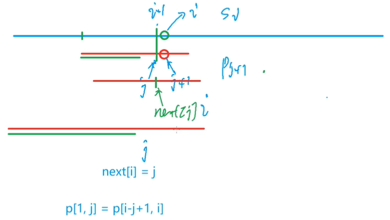

第一张图是进行 p 和 s 的匹配，红色是 p ，p 在向后移动；绿色是 `p[1~j]` 。

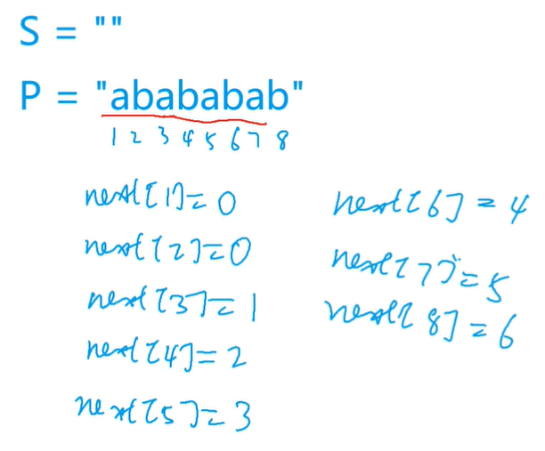
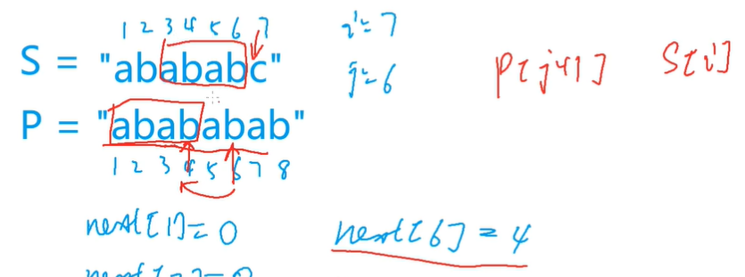

第二张、三张图是通过 `p` 求 `ne` 。注意这里是看前后缀相等的有多少，而非是看是否对称。

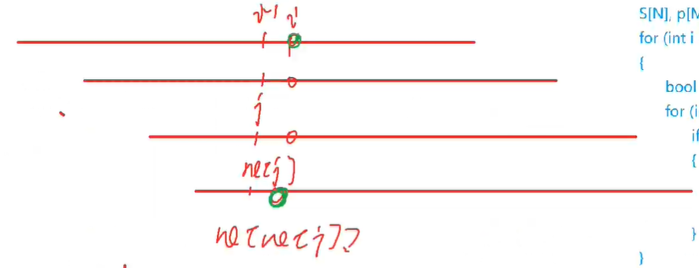

第四张是说，我们匹配成功后，同样，要 `j = ne[j]` ，而非 `j = j - 1` 。

其实用如下的例子更好说明：
```
P abcabcx
M abcabcabcx

P  abcabcx
ne 0001230

try to match:
M abcabcabcx
P ^^^^^^!
     ^^^^^^^  # 直接根据 ne 平移到这里
```
