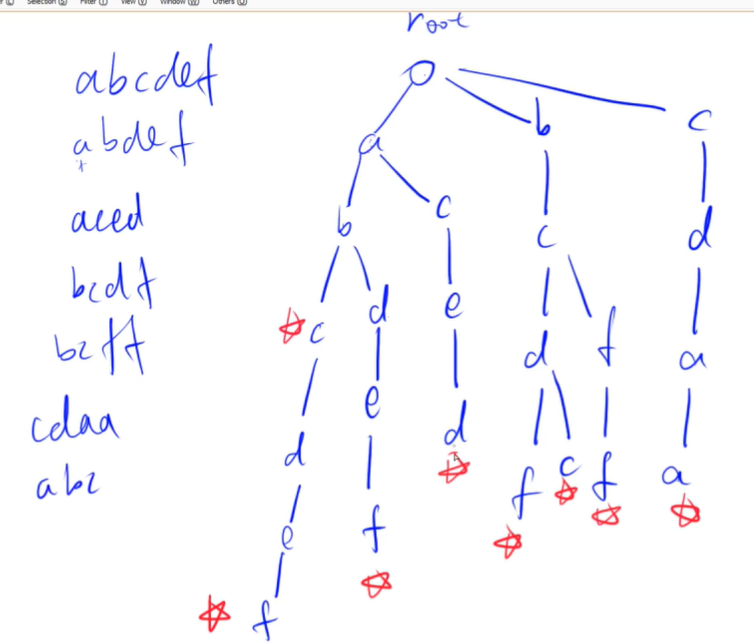
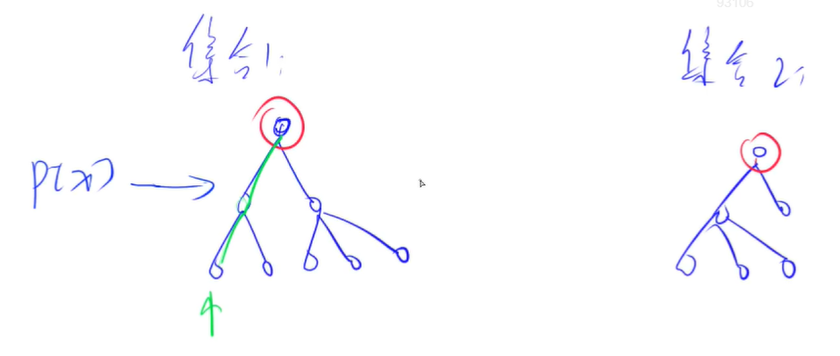
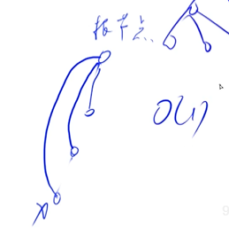
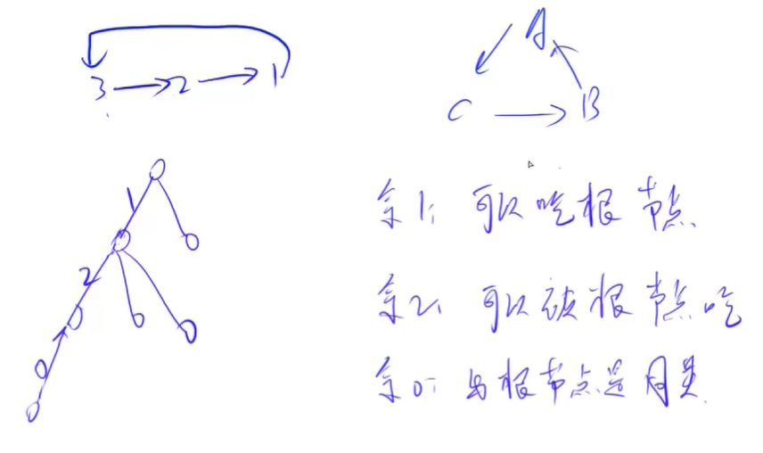
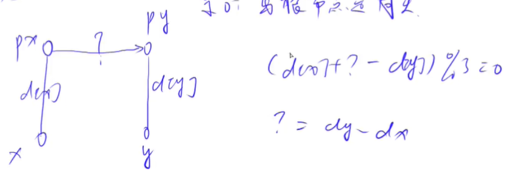
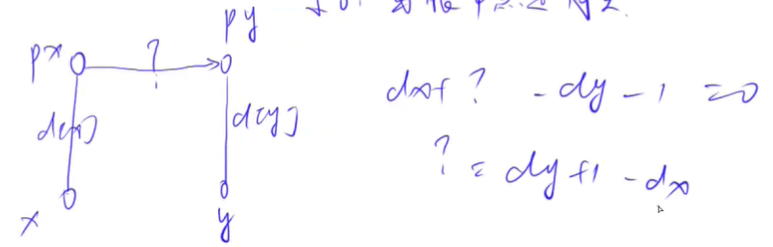
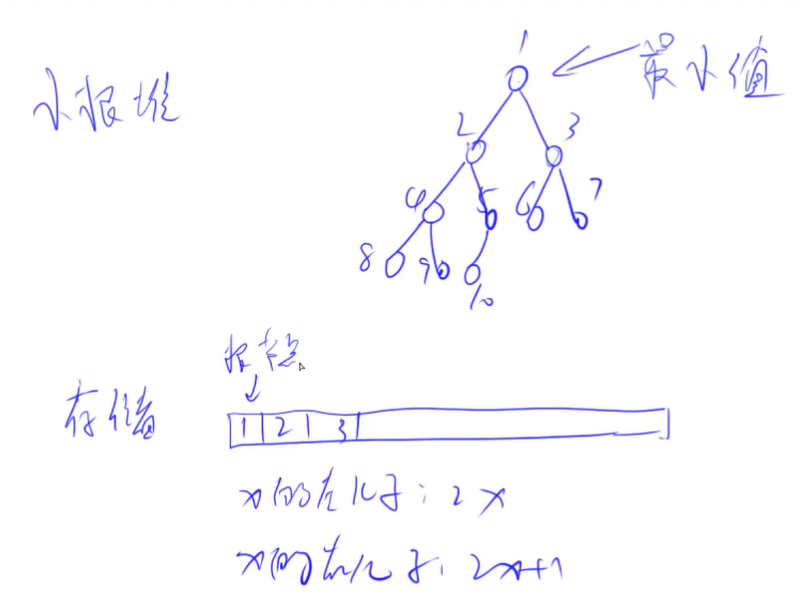
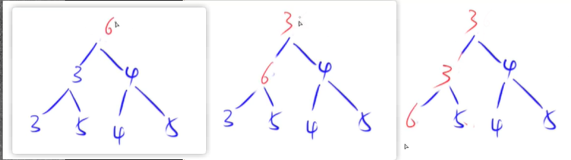
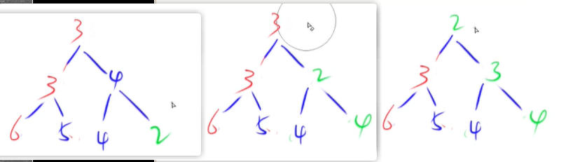

<!-- @import "[TOC]" {cmd="toc" depthFrom=1 depthTo=4 orderedList=false} -->

<!-- code_chunk_output -->

- [字典树Trie树](#字典树trie树)
  - [模板：Trie字符串统计](#模板trie字符串统计)
  - [模板：最大异或对](#模板最大异或对)
- [并查集](#并查集)
  - [模板：合并集合](#模板合并集合)
  - [动态维护集合大小信息：连通块中点的数量](#动态维护集合大小信息连通块中点的数量)
  - [另一道例题：食物链](#另一道例题食物链)
- [堆](#堆)
  - [以小根堆为例](#以小根堆为例)
  - [堆排序模板](#堆排序模板)
  - [模拟堆模板](#模拟堆模板)

<!-- /code_chunk_output -->

### 字典树Trie树
Trie树：高效存储和查找字符串集合。



注意根节点为空，结尾要打上标记。

也根据这个快速查找。

**字典树建树心得：**
- `son[i][j]` 相当于节点 i 指向字符 j 的地址为 `son[i][j]`
- `son[i][j]` 的值为 0 则代表这个节点指向的字符从没出现过
- `son[0][j]` 即根节点指向的字符 j 节点存储在 `son[0][j]` 中， 0 为根节点
  - 每次插入或者查询都是从根节点出发，所以有 p = 0
  - 根节点不表示任何字符串，是空的，因此每次插入都是 `++ idx` 而非 `idx ++` ，是为了保证 `cnt[0] == 0;`

#### 模板：Trie字符串统计
- 维护一个字符串集合，支持两种操作：
  - I x 向集合中插入一个字符串 x；
  - Q x 询问一个字符串在集合中出现了多少次。
- 共有 N 个操作，输入的字符串总长度不超过 $10^5$，字符串仅包含小写英文字母。

输入格式
- 第一行包含整数 N，表示操作数。
- 接下来 N 行，每行包含一个操作指令，指令为 I x 或 Q x 中的一种。

输出格式
- 对于每个询问指令 Q x，都要输出一个整数作为结果，表示 x 在集合中出现的次数。
- 每个结果占一行。

```cpp
#include <iostream>
using namespace std;

const int N = 1e5 + 10;

int son[N][26];  // son[i][j] 总第i（从0计数）个字符是 j ，保存在位置 son[i][j] 中
int cnt[N];  // 总第i个字符作为结尾的单词出现次数
int idx;  // 相当于指针，保存未出现过的字符串中字符在内存中的位置（即Trie树中的位置）

void insert(char str[])
{
    int p = 0;
    for (int i = 0; str[i]; i ++ )  // cpp 中字符串最后一个值是 `\0`
    {
        int u = str[i] - 'a';  // 把小写字母映射为 0~25
        if (!son[p][u]) son[p][u] = ++ idx;  // 这个字符串遍历到这里，以前从未出现过
        p = son[p][u];
    }
    cnt[p] ++;
}

int query(char str[])
{
    int p = 0;
    for (int i = 0; str[i]; i ++)
    {
        int u = str[i] - 'a';
        if (!son[p][u]) return 0;
        p = son[p][u];
    }
    return cnt[p];
}

int main()
{
    char str[N];
    int n;
    scanf("%d", &n);
    
    while (n --) {
        char op[2];
        scanf("%s%s", op, str);
        if (op[0] == 'I') insert(str);
        else printf("%d\n", query(str));
    }
    
    return 0;
}
```

**经验：**
- cpp 中字符串最后一个值是 `\0`，因此 for 可以用 `for (int i; str[i]; i++)`
- `scanf("%s%s", op, str);` 其中 `op` 和 `str` 是字符串首值指针

#### 模板：最大异或对
- 在给定的 $N$ 个整数 $A_1，A_2 …… A_N$ 中选出两个进行 xor（异或）运算，得到的结果最大是多少？

输入格式
- 第一行输入一个整数 N。
- 第二行输入 N 个整数 A1～AN。

输出格式
- 输出一个整数表示答案。

**思路：**
- 还是先想暴力，然后考虑怎么优化
- 对于数字 101 ，我们倾向于找其反码 010
- 从高位开始找，为什么从高位？因为我们要找`最大`异或值，就是说对于`0100`，`1000`肯定比`0011`要好。


```cpp
#include <iostream>
#include <algorithm>  // max
using namespace std;

const int N = 1e5 + 10;
const int M = 3e6 + 1e5 + 10; // 有 31 位长度，且有1e5个数，树的大小 3e6 + 1e5
// （ 3e6 是因为每个数顶多带来 30 个节点，一共 1e5 个数）

int n;
int son[M][2], idx;
int a[N];

void insert(int x)
{
    int p = 0;
    for (int i = 30; ~i; i --)  // ~i 即 i>=0 ，i=-1是11...111，取反就是 00...000
    {
        int &s = son[p][x >> i & 1];  // x >> i & 1 把第i位取出来  &s 引用调用
        if (!s) s = ++ idx;  // 创建新节点
        p = s;
    }
}

int query(int x)
{
    int res = 0, p = 0;
    for (int i = 30; ~i; i --)
    {
        int s = x >> i & 1;
        if (son[p][!s])
        {
            res += 1 << i;
            p = son[p][!s];
        }
        else p = son[p][s];
    }
    
    return res;
}

int main()
{
    cin >> n;
    for (int i = 0; i < n; i ++)
    {
        scanf("%d", &a[i]);
        insert(a[i]);
    }
    
    int res = 0;
    for (int i = 0; i < n; i ++) res = max(res, query(a[i]));
    
    cout << res;
    
    return 0;
}
```

### 并查集
- 将两个集合合并
- 询问两个元素是否在一个集合当中

并查集可以在近乎 O(1) 的时间内快速完成上述两个操作。



基本原理：
- 用树的形式维护某一个集合
- 根节点的编号就是当前集合的编号
- 对于每一个点，都存储其父节点是谁
- 当想求某一个点属于谁时，通过其父节点找到根节点

对于点 `x` ，其父节点为 `p[x]` ：
- 如何判断是否为树根？`if (p[x] == x)`
- 如何求 `x` 的集合编号？`while (p[x] != x) x = p[x];`
- 如何合并两个集合？`px` 是 `x` 的集合编号， `py` 是 `y` 的集合编号，`p[x] = py`

对于 **如何求 `x` 的集合编号？** 还可以进行很 **牛逼的优化** 。
- 路径压缩：我们在找根节点的过程中，经过哪些点，直接把这些点的父节点变为根节点
- 按秩合并：y总没有讲，因为没啥用。合并时总是将高度小的树根指向高度大的树根，秩就是树的高度，按秩合并防止树越来越高，导致查找效率降低。



路径压缩如图。

#### 模板：合并集合
- 一共有 n 个数，编号是 1∼n，最开始每个数各自在一个集合中。
- 现在要进行 m 个操作，操作共有两种：
  - M a b，将编号为 a 和 b 的两个数所在的集合合并，如果两个数已经在同一个集合中，则忽略这个操作；
  - Q a b，询问编号为 a 和 b 的两个数是否在同一个集合中；

输入格式
- 第一行输入整数 n 和 m。
- 接下来 m 行，每行包含一个操作指令，指令为 M a b 或 Q a b 中的一种。

输出格式
- 对于每个询问指令 Q a b，都要输出一个结果，如果 a 和 b 在同一集合内，则输出 Yes，否则输出 No。
- 每个结果占一行。

```cpp
#include <iostream>

using namespace std;

const int N = 1e5 + 10;
int n, m;
int p[N];

int find(int x)
{
    if (x != p[x]) p[x] = find(p[x]);  // 路径压缩
    return p[x];
}

int main()
{
    scanf("%d%d", &n, &m);
    for (int i = 1; i <= n; i ++) p[i] = i;
    
    while (m --)
    {
        char op[2];
        int a, b;
        scanf("%s%d%d", op, &a, &b);
        
        if (op[0] == 'M') p[find(a)] = find(b);
        else
        {
            if (find(a) == find(b)) puts("Yes");
            else puts("No");
        }
    }
    
    return 0;
}
```

**经验：为什么写成`char op[2]`读字符？**
- 因为`char op; scanf("%c", op);`会读入空格、回车
- 如果`char op[2]; scanf("%s", op);`则不会读入空格、回车

#### 动态维护集合大小信息：连通块中点的数量

- 给定一个包含 n 个点（编号为 1∼n）的无向图，初始时图中没有边。
- 现在要进行 m 个操作，操作共有三种：
  - C a b，在点 a 和点 b 之间连一条边，a 和 b 可能相等；
  - Q1 a b，询问点 a 和点 b 是否在同一个连通块中，a 和 b 可能相等；
  - Q2 a，询问点 a 所在连通块中点的数量；

输入格式
- 第一行输入整数 n 和 m。
- 接下来 m 行，每行包含一个操作指令，指令为 C a b，Q1 a b 或 Q2 a 中的一种。

输出格式
- 对于每个询问指令 Q1 a b，如果 a 和 b 在同一个连通块中，则输出 Yes，否则输出 No。
- 对于每个询问指令 Q2 a，输出一个整数表示点 a 所在连通块中点的数量
- 每个结果占一行。

**思路：**
- 与并查集一样
- 动态维护 `size[]` ，并且仅对根节点的 `size[]` 进行维护

```cpp
#include <iostream>
using namespace std;

const int N = 1e5 + 10;

int n, m;
int p[N], s[N];

int find(int x)
{
    if (x != p[x]) p[x] = find(p[x]);
    return p[x];
}

int main()
{
    scanf("%d%d", &n, &m);
    for (int i = 1; i <= n; i ++)
    {
        p[i] = i;
        s[i] = 1;
    }
    
    char op[3];
    int a, b;
    
    while (m --)
    {
        scanf("%s", op);
        if (op[0] == 'C')
        {
            scanf("%d%d", &a, &b);
            if (find(a) != find(b))
            {
                s[find(b)] += s[find(a)];  // 注意，在合并前先把 s 加起来
                p[find(a)] = find(b);
            }
        }
        else if (op[1] == '1')
        {
            scanf("%d%d", &a, &b);
            if (find(a) != find(b)) puts("No");
            else puts("Yes");
        }
        else if (op[1] == '2')
        {
            scanf("%d", &a);
            printf("%d\n", s[find(a)]);
        }
    }

    return 0;
}
```

#### 另一道例题：食物链

- 动物王国中有三类动物 A,B,C，这三类动物的食物链构成了有趣的环形。
- A 吃 B，B 吃 C，C 吃 A。
- 现有 N 个动物，以 1∼N 编号。
- 每个动物都是 A,B,C 中的一种，但是我们并不知道它到底是哪一种。
- 有人用两种说法对这 N 个动物所构成的食物链关系进行描述：
- 第一种说法是 1 X Y，表示 X 和 Y 是同类。
- 第二种说法是 2 X Y，表示 X 吃 Y。
- 此人对 N 个动物，用上述两种说法，一句接一句地说出 K 句话，这 K 句话有的是真的，有的是假的。
- 当一句话满足下列三条之一时，这句话就是假话，否则就是真话。
  - 当前的话与前面的某些真的话冲突，就是假话；
  - 当前的话中 X 或 Y 比 N 大，就是假话；
  - 当前的话表示 X 吃 X，就是假话。
- 你的任务是根据给定的 N 和 K 句话，输出假话的总数。

输入格式
- 第一行是两个整数 N 和 K，以一个空格分隔。
- 以下 K 行每行是三个正整数 D，X，Y，两数之间用一个空格隔开，其中 D 表示说法的种类。
- 若 D=1，则表示 X 和 Y 是同类。
- 若 D=2，则表示 X 吃 Y。

输出格式
- 只有一个整数，表示假话的数目。



**思路：**
- 可以发现规律，用与根节点的距离，表示吃的关系
  - 与根节点的距离模3余1，则吃根节点
  - 与根节点的距离模3余2，则被吃根节点
  - 与根节点的距离模3余0，则与根节点同类

```cpp
#include <iostream>
using namespace std;

const int N = 5e4 + 10;

int p[N], d[N];
int n, m;

int find(int x)
{
    if (x != p[x])
    {
        int t = find(p[x]);
        d[x] += d[p[x]];
        p[x] = t;
    }
    return p[x];
}

int main()
{
    scanf("%d%d", &n, &m);
    for (int i = 1; i <= n; i ++) p[i] = i;
    
    int t, x, y;
    int res = 0;
    while (m --)
    {
        scanf("%d%d%d", &t, &x, &y);
        if (x > n || y > n) res ++;
        else
        {
            int px = find(x), py = find(y);
            if (t == 1)
            {
                if (px == py && (d[x] - d[y]) % 3) res ++;  // x y都归入了集合但是距离 % 3 不为 0，则假话
                else if (px != py)  // 两者中有一个还没有归入集合
                {
                    p[px] == py;  // 把 x 合到 y 上，即用 px 指向 py
                    d[px] = d[y] - d[x];  // x y 同类则满足 (d[x] + d[px]) % 3 == (d[y]) % 3才行
                }
            }
            else if (t == 2)
            {
                if (px == py && (d[x] - d[y] - 1) % 3) res ++;  // x y 都归入了集合但是 x 不吃 y，假话
                else if (px != py)
                {
                    p[px] = py;
                    d[px] = d[y] + 1 - d[x];  // x 吃 y 则满足 (d[x] + d[px]) % 3 == (d[y] + 1) % 3才行
                }
            }
        }
    }
    printf("%d", res);
    return 0;
}
```

**分析：** 关于上面两个计算 `p[x]` 的式子，可以考虑方程式如下两张图。





### 堆
堆是维护一个数组集合：
- 插入一个数
- 求集合当中的最小值
- 删除最小值
- 删除任意一个元素
- 修改任意一个元素

堆的话，是二叉树（完全二叉树：除了最后一层，上面的所有节点都是满的；最后一层从左到右排列）。

#### 以小根堆为例
- 根节点是最小值
- 每个点都满足小于等于左右两边的子节点



存储如图：
- x的左儿子：2x
- x的右儿子：2x+1

STL里对应优先队列。

**down操作**



如上，我们把根节点的数变大，变成 6 ，down操作是保证堆的性质被满足，因此，在父节点比子点大时，总是将父节点与较小的子节点交换位置。

**up操作**



如上，我们把某节点的数变小，变成 2 ，up操作是保证堆的性质被满足，因此，在其父节点比自己大时，总是将父节点与自己交换位置。

有了这两个操作，我们就可用代码表示堆的操作：
- 插入一个数 `heap[++size] = x; up(size);`
- 求集合当中的最小值 `heap[1]`
- 删除最小值，用堆最后一个元素覆盖堆顶（因为一维数组删除头元素很困难，但是删除尾部元素size--就行） `heap[1] = heap[size]; size --; down(1);`
- 删除任意一个元素 `heap[k] = heap[size]; size --; down(k); up(k);` down 和 up 只会自动执行一个
- 修改任意一个元素 `heap[k] = x; down(k); up(k);`

注意：**这里下标都是从 1 开始的。** 从 0 开始，会导致 0 的左儿子不满足 `2x` 。

#### 堆排序模板
- 输入一个长度为 n 的整数数列，从小到大输出前 m 小的数。

输入格式
- 第一行包含整数 n 和 m。
- 第二行包含 n 个整数，表示整数数列。

输出格式
- 共一行，包含 m 个整数，表示整数数列中前 m 小的数。

```cpp
#include <iostream>
#include <algorithm>
using namespace std;

const int N = 1e5 + 10;

int n, m;
int h[N], cnt;  // cnt 是堆元素数量，也是最后一个放入元素的地址

void down(int u)
{
    int t = u;  // t 目前是当前节点
    if (u * 2 <= cnt && h[u * 2] < h[t]) t = u * 2;  // 如果左儿子存在，还更小，t成为左儿子
    if (u * 2 + 1 <= cnt && h[u * 2 + 1] < h[t]) t = u * 2 + 1;  // 如果右儿子存在，还更小，t成为右儿子
    if (u != t)
    {
        swap(h[u], h[t]);
        down(t);
    }
}

int main()
{
    scanf("%d%d", &n, &m);
    for (int i = 1; i <= n; i ++) scanf("%d", &h[i]);
    cnt = n;
    
    // i 为什么从 n/2 开始down？
    // 要明确要进行down操作时必须满足左儿子和右儿子已经是个堆
    for (int i = n / 2; i > 0; i --) down(i);
    
    while (m --)
    {
        printf("%d ", h[1]);
        h[1] = h[cnt --];
        down(1);
    }
    
    return 0;
}
```

#### 模拟堆模板

<p>维护一个集合，初始时集合为空，支持如下几种操作：</p>

- <code>I x</code>，插入一个数 $x$；
- <code>PM</code>，输出当前集合中的最小值；
- <code>DM</code>，删除当前集合中的最小值（数据保证此时的最小值唯一）；
- <code>D k</code>，删除第 $k$ 个插入的数；
- <code>C k x</code>，修改第 $k$ 个插入的数，将其变为 $x$；

现在要进行 $N$ 次操作，对于所有第 $2$ 个操作，输出当前集合的最小值。

<h4>输入格式</h4>

第一行包含整数 $N$。

接下来 $N$ 行，每行包含一个操作指令，操作指令为 <code>I x</code>，<code>PM</code>，<code>DM</code>，<code>D k</code> 或 <code>C k x</code> 中的一种。

<h4>输出格式</h4>

<p>对于每个输出指令 <code>PM</code>，输出一个结果，表示当前集合中的最小值。</p>

<p>每个结果占一行。</p>

<h4>数据范围</h4>

- $1 \le N \le 10^5$
- $-10^9 \le x \le 10^9$
- 数据保证合法。

<h4>输入样例：</h4>

<pre><code>
8
I -10
PM
I -10
D 1
C 2 8
I 6
PM
DM
</code></pre>

<h4>输出样例：</h4>

<pre><code>
-10
6
</code></pre>

```cpp
#include <iostream>
#include <string.h>
#include <algorithm>
using namespace std;

const int N = 1e5 + 10;

int h[N], hp[N], ph[N];
int cnt;

void swap_heap(int a, int b)
{
    swap(ph[hp[a]], ph[hp[b]]);
    swap(hp[a], hp[b]);
    swap(h[a], h[b]);
}

void down(int u)
{
    int t = u;
    if (u * 2 <= cnt && h[u * 2] < h[t]) t = u * 2;
    if (u * 2 + 1 <= cnt && h[u * 2 + 1] < h[t]) t = u * 2 + 1;
    if (t != u)
    {
        swap_heap(t, u);
        down(t);
    }
}

int up(int u)
{
    while (u / 2 && h[u / 2] > h[u])
    {
        swap_heap(u / 2, u);
        u /= 2;
    }
}

int main()
{
    int n, m = 0;  // m 是第 m 个插入的
    scanf("%d", &n);
    
    while (n --)
    {
        char op[5];
        scanf("%s", op);
        if (!strcmp(op, "I"))
        {
            int x = 0;
            scanf("%d", &x);
            cnt ++;
            m ++;
            h[cnt] = x;
            ph[m] = cnt, hp[cnt] = m;
            up(cnt);
        }
        else if (!strcmp(op, "PM"))
        {
            printf("%d\n", h[1]);
        }
        else if (!strcmp(op, "DM"))
        {
            swap_heap(1, cnt);
            cnt --;
            down(1);
        }
        else if (!strcmp(op, "D"))
        {
            int k;
            scanf("%d", &k);
            k = ph[k];
            swap_heap(k, cnt);
            cnt --;
            down(k), up(k);
        }
        else if (!strcmp(op, "C"))
        {
            int k, x;
            scanf("%d%d", &k, &x);
            k = ph[k];
            h[k] = x;
            down(k), up(k);
        }
    }

    return 0;
}
```

如上，需要重写 `swap_heap` 。

**经验：**
- 对于 `char op[5]`；我们用`!strcmp(op, "DM")`判断是否 `op` 是 `"DM"`；`strcmp`是`string`中的方法，如果两个字符串相等，则返回0。
