<!-- @import "[TOC]" {cmd="toc" depthFrom=1 depthTo=4 orderedList=false} -->

<!-- code_chunk_output -->

- [DFS与BFS对比](#dfs与bfs对比)
- [DFS](#dfs)
  - [DFS最简单模板](#dfs最简单模板)
  - [n皇后问题两种做法](#n皇后问题两种做法)
- [BFS](#bfs)
  - [走迷宫问题](#走迷宫问题)
  - [八数码](#八数码)
  - [补充一道例题：魔板](#补充一道例题魔板)
- [树与图的表示方法（有向图）](#树与图的表示方法有向图)
- [树与图的深度优先遍历](#树与图的深度优先遍历)
  - [树的重心](#树的重心)
- [树与图的广度优先遍历](#树与图的广度优先遍历)
  - [图中点的层次](#图中点的层次)
  - [有向图的拓扑序列（图bfs基本应用）](#有向图的拓扑序列图bfs基本应用)
  - [例题：有向图的拓扑序列](#例题有向图的拓扑序列)

<!-- /code_chunk_output -->

### DFS与BFS对比
- DFS：深度优先搜索 Depth First Search
- BFS：广度优先搜索 Breadth First Search

对比：
- DFS 使用 stack 实现（也不一定），空间为 $O(h)$ ，因为只记录本条路径
- BFS 使用 queue 实现，空间为 $O(2^h)$ ，因为记录所有路径
- DFS 不具有最短性，BFS 得到的是最短路

### DFS
搜索流程从树的角度考虑。

DFS 俗称暴力搜索，最重要地考虑顺序。

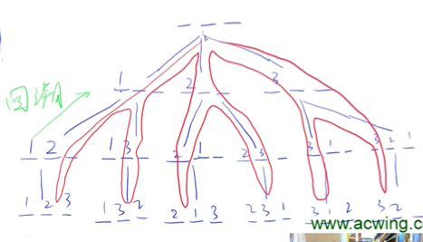

最难的是“回溯”与“剪枝”。回溯时记得`恢复现场`。

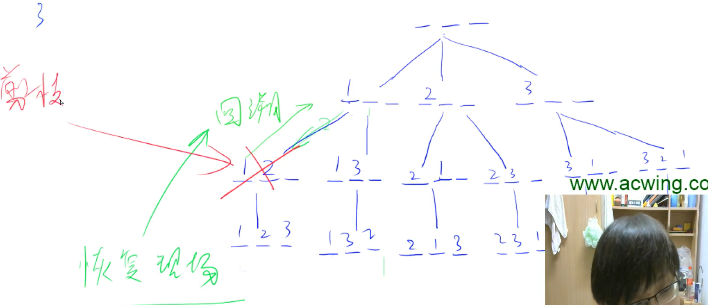

#### DFS最简单模板
- 给定一个整数 n，将数字 1∼n 排成一排，将会有很多种排列方法。
- 现在，请你按照字典序将所有的排列方法输出。

输入格式
- 共一行，包含一个整数 n。

输出格式
- 按字典序输出所有排列方案，每个方案占一行。

```cpp
#include <iostream>
using namespace std;

const int N = 10;
int path[N], n;
bool state[N];

void dfs(int u)  // u 是在第几层
{
    if (u == n) 
    {
        for (int i = 0; i < n; i ++)
            printf("%d ", path[i]);
        puts("");
        return ;
    }
    
    for (int i = 0; i < n; i ++)
    {
        if (!state[i])  // 数字 i 还没被用过
        {
            state[i] = true;
            path[u] = i + 1;  // 题目中数值从 1 开始记录
            dfs(u + 1);
            state[i] = false;  // 回溯：恢复现场
        }
    }

    return;
}

int main()
{
    cin >> n;
    
    for (int i = 0; i < n; i ++) state[i] = false;

    dfs(0);
    return 0;
}
```

**经验：**
- 注意 `dfs();` 后，接着执行的语句属于回溯，要 “恢复现场” 

此外，还有一种方法，更优雅。

```cpp
#include <iostream>
using namespace std;

const int N = 10;
int path[N], n, state;

void dfs(int u, int state)  // u 是在第几层， state 每一个为代表是否用过数字
{
    if (u == n) 
    {
        for (int i = 0; i < n; i ++)
            printf("%d ", path[i]);
        puts("");
        return ;
    }
    
    for (int i = 0; i < n; i ++)
    {
        if (!(state & (1 << i)))  // 数字 i 还没被用过
        {
            path[u] = i + 1;  // 题目中数值从 1 开始记录
            dfs(u + 1, state + (1 << i));  // 传入状态表征，无需“恢复现场”
        }
    }

    return;
}

int main()
{
    cin >> n;

    dfs(0, 0);
    return 0;
}
```

```go
package main

import (
    "fmt"
    "bufio"
    "os"
    "strconv"
)

func main() {
    sc := bufio.NewScanner(os.Stdin)
    sc.Split(bufio.ScanWords)
    
    sc.Scan()
    n, _ := strconv.Atoi(sc.Text())
    
    out := bufio.NewWriter(os.Stdout)
    defer out.Flush()
    
    seen := map[int]bool{}
    slot := make([]int, n)
    var dfs func(depth int)
    dfs = func(depth int) {
        if depth == n {
            for _, x := range slot {
                fmt.Fprint(out, x, " ")
            }
            fmt.Fprint(out, "\n")
            return
        }
        
        for i := 1; i <= n; i ++ {
            if seen[i] {
                continue
            }
            seen[i] = true
            slot[depth] = i
            dfs(depth + 1)
            seen[i] = false
        }
    }
    
    dfs(0)
}
```

#### n皇后问题两种做法
- n−皇后问题是指将 n 个皇后放在 n×n 的国际象棋棋盘上，使得皇后不能相互攻击到，即任意两个皇后都不能处于同一行、同一列或同一斜线上。


- 现在给定整数 n，请你输出所有的满足条件的棋子摆法。

输入格式
- 共一行，包含整数 n。

输出格式
- 每个解决方案占 n 行，每行输出一个长度为 n 的字符串，用来表示完整的棋盘状态。
- 其中 `.` 表示某一个位置的方格状态为空，`Q` 表示某一个位置的方格上摆着皇后。
- 每个方案输出完成后，输出一个空行。
- 注意：行末不能有多余空格。
- 输出方案的顺序任意，只要不重复且没有遗漏即可。

##### n皇后问题做法1

**思路：**
- `1324`可以表示第一行的第一列放一个皇后，第二行的第三列放一个皇后...
- 因此，我们把其变成了正整数排序问题

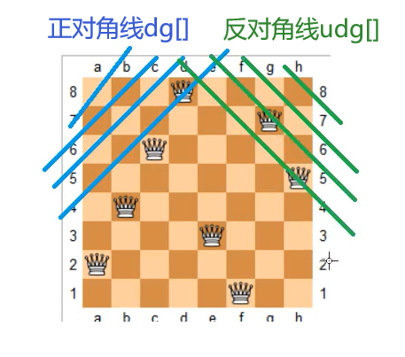

- 如上，我们用 `dg[]` 和 `udg[]` 记录各个对角线上是否已经有了皇后
- 已知皇后横纵坐标，如何确定其所在对角线呢？**用截距作为对角线编号** 相同方向的对角线，如果截距相同，则一定是同一个对角线
- 已知 `x, y` ，则其正对角线截距 `y-x` ，反对角线截距 `x-y` ，而正对角线截距可能为负值，因此编号向上偏移 `n` ，为 `y-x+n`

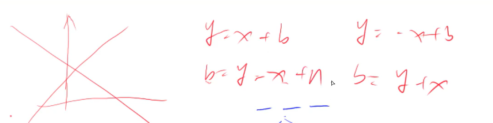
对角线计算如上图。

```cpp
#include <iostream>
using namespace std;

const int N = 20;
int n;
bool col[N], dg[N], udg[N];
char g[N][N];

void dfs(int u)
{
    if (u == n) {
        for (int i = 0; i < n; i ++)
        {
            puts(g[i]);
        }
        puts("");
        return ;  // 差点忘了 return ;
    }

    for (int i = 0; i < n; i ++)
    {
        if (!col[i] && !dg[u - i + n] && !udg[u + i])
        {
            col[i] = dg[u - i + n] = udg[u + i] = true;
            g[u][i] = 'Q';
            dfs(u + 1);
            col[i] = dg[u - i + n] = udg[u + i] = false;  // 恢复现场
            g[u][i] = '.';
        }
    }
    return ;
}

int main()
{
    cin >> n;
    
    for (int i = 0; i < n; i ++)
        for (int j = 0; j < n; j ++)
            g[i][j] = '.';
    
    dfs(0);
    return 0;
}
```

**经验：**
- `col[i] = dg[u - i + n] = udg[u + i] = true;` CPP 中多变量赋同值
- `bool[]` 数组的默认初始值是 false

时间复杂度（最坏）为 $O(n \cdot n!)$ 。

```go
package main

import (
    "fmt"
    "bufio"
    "os"
    "strconv"
)

func main() {
    sc := bufio.NewScanner(os.Stdin)
    sc.Split(bufio.ScanWords)
    
    sc.Scan()
    n, _ := strconv.Atoi(sc.Text())
    
    out := bufio.NewWriter(os.Stdout)
    defer out.Flush()
    
    col := map[int]bool{}
    dg := map[int]bool{}
    udg := map[int]bool{}
    slot := make([][]int, n)
    for i := range slot {
        slot[i] = make([]int, n)
    }
    var dfs func(row int)
    dfs = func(row int) {
        if row == n {
            for _, x := range slot {
                for _, y := range x {
                    if y > 0 {
                        fmt.Fprint(out, "Q")
                    } else {
                        fmt.Fprint(out, ".")
                    }
                }
                fmt.Fprint(out, "\n")
            }
            fmt.Fprint(out, "\n")
            return
        }

        for i := 0; i < n; i ++ {  // col index
            if col[i] || dg[i + row] || udg[i - row] {
                continue
            }
            col[i] = true
            dg[i + row] = true
            udg[i - row] = true
            slot[row][i] = 1
            dfs(row + 1)
            slot[row][i] = 0
            col[i] = false
            dg[i + row] = false
            udg[i - row] = false
        }
    }
    
    dfs(0)
}
```

##### n皇后问题做法2
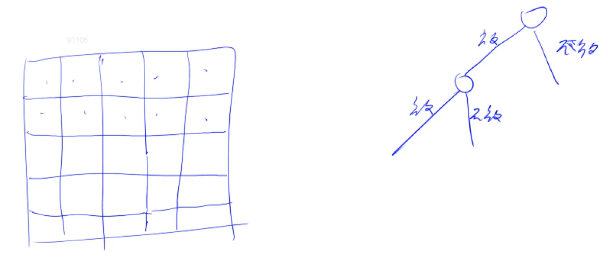

**思路：**
- 我们不按照行来枚举
- 而是按照格子枚举

```cpp
#include <iostream>
using namespace std;

const int N = 20;
int n;
bool row[N], col[N], dg[N], udg[N];
char g[N][N];

void dfs(int x, int y, int s)  // s 皇后数量
{
    if (y == n) y = 0, x ++ ;

    if (x == n)
    {
        if (s == n) {
            for (int i = 0; i < n; i ++)
            {
                puts(g[i]);
            }
            puts("");
        } 
        return ;  // 这个 return 位置要正确，否则死循环
    }

    
    // 不放皇后
    dfs(x, y + 1, s);

    // 符合条件的话，放皇后
    if (!row[x] && !col[y] && !dg[x - y + n] && !udg[x + y])  // 比按 row 的方法多了 row[] 的判断
    {
        row[x] = col[y] = dg[x - y + n] = udg[x + y] = true;
        g[x][y] = 'Q';
        dfs(x, y + 1, s + 1);
        row[x] = col[y] = dg[x - y + n] = udg[x + y] = false;  // 恢复现场
        g[x][y] = '.';
    }
    return ;
}

int main()
{
    cin >> n;
    
    for (int i = 0; i < n; i ++)
        for (int j = 0; j < n; j ++)
            g[i][j] = '.';
    
    dfs(0, 0, 0);
    return 0;
}
```

时间复杂度为 $O(2^{n^2})$ 。

```go
package main

import (
    "fmt"
    "bufio"
    "os"
    "strconv"
)

func main() {
    sc := bufio.NewScanner(os.Stdin)
    sc.Split(bufio.ScanWords)
    
    sc.Scan()
    n, _ := strconv.Atoi(sc.Text())
    
    out := bufio.NewWriter(os.Stdout)
    defer out.Flush()
    
    row := map[int]bool{}
    col := map[int]bool{}
    dg := map[int]bool{}
    udg := map[int]bool{}
    slot := make([][]int, n)
    for i := range slot {
        slot[i] = make([]int, n)
    }
    var dfs func(x, y, cnt int)
    dfs = func(x, y, cnt int) {
        if x == n {
            x, y = 0, y + 1
        }

        if y == n {  // 枚举到了 n * n 最后一格
            if cnt == n {
                for _, xx := range slot {
                    for _, yy := range xx {
                        if yy > 0 {
                            fmt.Fprint(out, "Q")
                        } else {
                            fmt.Fprint(out, ".")
                        }
                    }
                    fmt.Fprint(out, "\n")
                }
                fmt.Fprint(out, "\n")
            }
            return
        }

        dfs(x + 1, y, cnt)  // 不放

        if row[x] || col[y] || dg[x + y] || udg[x - y] {
            return
        }
        row[x] = true
        col[y] = true
        dg[x + y] = true
        udg[x - y] = true
        slot[x][y] = 1
        dfs(x + 1, y, cnt + 1)
        slot[x][y] = 0
        row[x] = false
        col[y] = false
        dg[x + y] = false
        udg[x - y] = false
    }
    
    dfs(0, 0, 0)
}
```

### BFS
基本框架：维护一个队列。

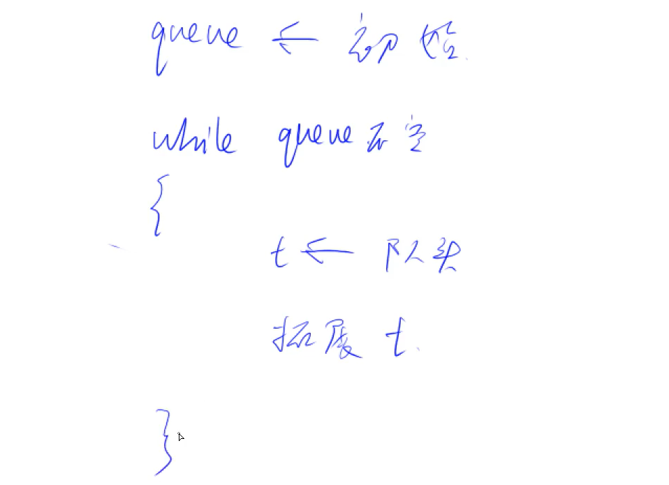

#### 走迷宫问题
- 给定一个 $n\times m$ 的二维整数数组，用来表示一个迷宫，数组中只包含 0 或 1，其中 0 表示可以走的路，1 表示不可通过的墙壁。
- 最初，有一个人位于左上角 (1,1) 处，已知该人每次可以向上、下、左、右任意一个方向移动一个位置。
- 请问，该人从左上角移动至右下角 (n,m) 处，至少需要移动多少次。
- 数据保证 (1,1) 处和 (n,m) 处的数字为 0，且一定至少存在一条通路。

输入格式
- 第一行包含两个整数 n 和 m。
- 接下来 n 行，每行包含 m 个整数（0 或 1），表示完整的二维数组迷宫。

输出格式
- 输出一个整数，表示从左上角移动至右下角的最少移动次数。

**思考：**
- DFS 可以保证找到重点，但没法保证最短

```cpp
#include <iostream>
#include <queue>
#include <cstring>
using namespace std;

typedef pair<int, int> PII;
const int N = 110;

int n, m;
int g[N][N], d[N][N];
queue<PII> q;

int bfs()
{
    memset(d, -1, sizeof d);
    d[0][0] = 0;
    q.push({0, 0});
    
    int dx[4] = {0, 1, 0, -1};
    int dy[4] = {1, 0, -1, 0};
    
    while (q.size())
    {
        auto t = q.front();
        q.pop();
        
        for (int i = 0; i < 4; i ++)
        {
            int x = t.first + dx[i], y = t.second + dy[i];

            if (x >= 0 && x < n && y >= 0 && y < m && d[x][y] == -1 && g[x][y] == 0)  // 去 d[x][y] == -1 没经过的点
            {
                d[x][y] = d[t.first][t.second] + 1;
                q.push({x, y});
                // cout << x << " " << y << " " << d[x][y] << endl;
            }
        }
    }

    return d[n-1][m-1];
}

int main()
{
    cin >> n >> m;
    for (int i = 0; i < n; i ++)  // 很狗，这里写成 for(int i = 0; i ++ ; i < n) 了， Debug 半天
        for (int j = 0; j < m; j ++)
            cin >> g[i][j];

    cout << bfs();

    return 0;
}
```

```go
package main

import (
    "bufio"
    "fmt"
    "os"
    "strconv"
)

func main() {
    sc := bufio.NewScanner(os.Stdin)
    sc.Split(bufio.ScanWords)
    
    readInt := func() int {
        sc.Scan()
        x, _ := strconv.Atoi(sc.Text())
        return x
    }
    
    n, m := readInt(), readInt()
    g := make([][]int, n)
    d := make([][]int, n)
    for i := range g {
        g[i] = make([]int, m)
        d[i] = make([]int, m)
        for j := range g[i] {
            g[i][j] = readInt()
            d[i][j] = -1
        }
    }
    
    dx, dy := []int{0, 1, 0, -1}, []int{1, 0, -1, 0}
    q := [][]int{[]int{0, 0}}
    d[0][0] = 0
    for len(q) > 0 {
        x, y := q[0][0], q[0][1]
        q = q[1:]

        for i := range dx {
            xt, yt := x + dx[i], y + dy[i]
            if xt < 0 || xt >= n || yt < 0 || yt >= m || g[xt][yt] == 1 || d[xt][yt] != -1 {
                continue
            }
            d[xt][yt] = 1 + d[x][y]
            q = append(q, []int{xt, yt})
        }
    }
    
    fmt.Println(d[n - 1][m - 1])
}
```

#### 八数码
- 在一个 $3\times 3$ 的网格中，1∼8 这 8 个数字和一个 x 恰好不重不漏地分布在这 $3\times 3$ 的网格中。
- 例如：
```
1 2 3
x 4 6
7 5 8
```

- 在游戏过程中，可以把 x 与其上、下、左、右四个方向之一的数字交换（如果存在）。
- 我们的目的是通过交换，使得网格变为如下排列（称为正确排列）：
```
1 2 3
4 5 6
7 8 x
```
- 例如，示例中图形就可以通过让 x 先后与右、下、右三个方向的数字交换成功得到正确排列。
- 交换过程如下：
```
1 2 3   1 2 3   1 2 3   1 2 3
x 4 6   4 x 6   4 5 6   4 5 6
7 5 8   7 5 8   7 x 8   7 8 x
```
- 现在，给你一个初始网格，请你求出得到正确排列至少需要进行多少次交换。

输入格式
- 输入占一行，将 3×3 的初始网格描绘出来。
- 例如，如果初始网格如下所示：
```
1 2 3 
x 4 6 
7 5 8 
```
- 则输入为：1 2 3 x 4 6 7 5 8

输出格式
- 输出占一行，包含一个整数，表示最少交换次数。
- 如果不存在解决方案，则输出 −1。

**思考：**
- 把当前状态看成一个节点
- 难点在于：
  - 状态表示比较复杂（如何把状态放在 queue 里？）
  - 距离数组的下标如何表示？
- 一种简单的方式是，用字符串来表示；且距离用 `unordered_map<string, int> dist` 来记录

```cpp
#include <iostream>
#include <unordered_map>
#include <string>
#include <algorithm>
#include <queue>

using namespace std;

int bfs(string state)
{
    string end = "12345678x";
    unordered_map<string, int> d;
    queue<string> q;
    
    d[state] = 0;
    q.push(state);
    
    int dx[4] = {0, 1, 0, -1};
    int dy[4] = {1, 0, -1, 0};
    
    while (q.size())
    {
        auto t = q.front();
        q.pop();
        int dist = d[t];
        
        if (t == end) return dist;
        
        auto idx = t.find('x');  // 用 find 返回字符在 string 中位置
        int x = idx / 3, y = idx % 3;
        for (int i = 0; i < 4; i ++)
        {
            int a = x + dx[i], b = y + dy[i];
            if (a >= 0 && a < 3 && b >= 0 && b < 3)
            {
                swap(t[a * 3 + b], t[idx]);
                if (!d.count(t))  // 检查 map 的 key 里是否有 t
                {
                    q.push(t);
                    d[t] = dist + 1;
                }
                swap(t[a * 3 + b], t[idx]);  // 清理现场
            }
        }
    }
    
    return -1;
}

int main()
{
    string state;
    char s[2];
    for (int i = 0; i < 9; i ++)
    {
        cin >> s;
        state += *s;
    }

    cout << bfs(state);
    return 0;
}
```

**经验：**
- 获取字符串字符的方式如下
- 可以用 `string_obj.find('x')` 来返回字符在 string 中位置
- `if (!d.count(t))` 检查 map 的 key 里是否有 t

```cpp
string state;
char s[2];
for (int i = 0; i < 9; i ++)
{
    cin >> s;
    state += *s;
}
```

```go
package main

import (
    "fmt"
    "os"
    "bufio"
    "strings"
)

func main() {
    sc := bufio.NewScanner(os.Stdin)
    sc.Split(bufio.ScanWords)

    state := ""
    for i := 0; i < 9; i ++ {
        sc.Scan()
        state += sc.Text()
    }
    
    dx := []int{0, 1, 0, -1}
    dy := []int{1, 0, -1, 0}
    
    d := map[string]int{}
    d[state] = 0
    q := []string{state}
    for len(q) > 0 {
        s := q[0]
        q = q[1:]
        dist := d[s]
        loc := strings.Index(s, "x")
        x, y := loc / 3, loc % 3
        for i := range dx {
            a, b := x + dx[i], y + dy[i]
            if a < 0 || a >= 3 || b < 0 || b >= 3 {
                continue
            }
            tmp := []byte(s)
            tmp[a * 3 + b], tmp[loc] = tmp[loc], tmp[a * 3 + b]
            // fmt.Println(string(tmp), s)
            _, ok := d[string(tmp)]
            if !ok {
                d[string(tmp)] = dist + 1
                q = append(q, string(tmp))
            }
        }
    }
    
    ans, ok := d["12345678x"]
    if ok {
        fmt.Println(ans)
    } else {
        fmt.Println("-1")
    }
}
```

#### 补充一道例题：魔板

<p>Rubik 先生在发明了风靡全球的魔方之后，又发明了它的二维版本——魔板。</p>

这是一张有 $8$ 个大小相同的格子的魔板：

<pre><code>
1 2 3 4
8 7 6 5
</code></pre>

<p>我们知道魔板的每一个方格都有一种颜色。</p>

这 $8$ 种颜色用前 $8$ 个正整数来表示。

<p>可以用颜色的序列来表示一种魔板状态，规定从魔板的左上角开始，沿顺时针方向依次取出整数，构成一个颜色序列。</p>

对于上图的魔板状态，我们用序列 $(1,2,3,4,5,6,7,8)$ 来表示，这是基本状态。

<p>这里提供三种基本操作，分别用大写字母 A，B，C 来表示（可以通过这些操作改变魔板的状态）：</p>

<p>A：交换上下两行；<br />

B：将最右边的一列插入到最左边；<br />

C：魔板中央对的4个数作顺时针旋转。</p>

<p>下面是对基本状态进行操作的示范：</p>

<p>A：</p>

<pre><code>
8 7 6 5
1 2 3 4
</code></pre>

<p>B：</p>

<pre><code>
4 1 2 3
5 8 7 6
</code></pre>

<p>C：</p>

<pre><code>
1 7 2 4
8 6 3 5
</code></pre>

<p>对于每种可能的状态，这三种基本操作都可以使用。</p>

<p>你要编程计算用最少的基本操作完成基本状态到特殊状态的转换，输出基本操作序列。</p>

<p><strong>注意</strong>：数据保证一定有解。</p>

<h4>输入格式</h4>

输入仅一行，包括 $8$ 个整数，用空格分开，表示目标状态。

<h4>输出格式</h4>

<p>输出文件的第一行包括一个整数，表示最短操作序列的长度。 </p>

<p>如果操作序列的长度大于0，则在第二行输出字典序最小的操作序列。</p>

<h4>数据范围</h4>

输入数据中的所有数字均为 $1$ 到 $8$ 之间的整数。

<h4>输入样例：</h4>

<pre><code>
2 6 8 4 5 7 3 1
</code></pre>

<h4>输出样例：</h4>

<pre><code>
7
BCABCCB
</code></pre>

```cpp
#include <iostream>
#include <string>
#include <unordered_map>
#include <queue>
#include <algorithm>
using namespace std;

const string START = "12345678";
const char opts[4] = {'A', 'B', 'C'};

string A(string t)
{
    for (int i = 0; i < 4; ++ i)
    {
        swap(t[i], t[7 - i]);
    }
    
    return t;
}

string B(string t)
{
    for (int i = 0; i < 3; ++ i) swap(t[i], t[3]);
    for (int i = 4; i < 7; ++ i) swap(t[i], t[i + 1]);
    return t;
}

string C(string t)
{
    swap(t[1], t[2]);
    swap(t[5], t[6]);
    swap(t[5], t[1]);
    return t;
}

unordered_map<string, pair<string, char>> bfs(string target)
{
    unordered_map<string, pair<string, char>> pre;
    queue<string> q;
    
    q.push(START);
    
    while (q.size())
    {
        auto t = q.front();
        q.pop();
        
        if (t == target) return pre;
        
        string ne;
        for (int i = 0; i < 3; ++ i)
        {
            if (i == 0) ne = A(t);
            else if (i == 1) ne = B(t);
            else ne = C(t);
            
            if (!pre.count(ne))
            {
                pre[ne] = {t, opts[i]};
                q.push(ne);
            }
        }
    }
}

int main()
{
    string target;
    char s[2];
    for (int i = 0; i < 8; ++ i)
    {
        cin >> s;
        target += *s;
    }
    
    auto pre = bfs(target);
    
    int ans = 0;
    string res;
    while (target != START)
    {
        ans ++;
        res += pre[target].second;
        target = pre[target].first;
    }
    
    reverse(res.begin(), res.end());
    
    cout << ans << endl;
    cout << res;
}
```

**经验：**
- 务必仔细读题！这道题要求从基本状态到目标状态！这个逻辑没搞正确的话， `while(){pre}` 里面会死循环！

```golang
package main

import (
    "fmt"
    "os"
    "bufio"
)

func main() {
    sc := bufio.NewScanner(os.Stdin)
    sc.Split(bufio.ScanWords)

    state := ""
    for i := 0; i < 8; i ++ {
        sc.Scan()
        state += sc.Text()
    }
    
    A := func(s string) string {
        tmp := []byte(s)
        for i := 0; i < 4; i ++ {
            tmp[i], tmp[7 - i] = tmp[7 - i], tmp[i]
        }
        return string(tmp)
    }
    
    B := func(s string) string {
        tmp := []byte(s)
        for i := 0; i < 3; i ++ {
            tmp[i], tmp[3] = tmp[3], tmp[i]
        }
        for i := 4; i < 7; i ++ {
            tmp[i], tmp[i + 1] = tmp[i + 1], tmp[i]
        }
        return string(tmp)
    }
    
    C := func(s string) string {
        tmp := []byte(s)
        tmp[1], tmp[2] = tmp[2], tmp[1]
        tmp[5], tmp[6] = tmp[6], tmp[5]
        tmp[5], tmp[1] = tmp[1], tmp[5]
        return string(tmp)
    }

    pre := map[string]struct{
        State string
        op string
    }{}
    ininState := "12345678"
    q := []string{ininState}
    for len(q) > 0 {
        s := q[0]
        q = q[1:]
        
        if s == state {
            break
        }

        var ne string
        ops := []string{"A", "B", "C"}
        for i := 0; i < 3; i ++ {
            if i == 0 {
                ne = A(s)
            } else if i == 1 {
                ne = B(s)
            } else {
                ne = C(s)
            }
            _, ok := pre[ne]
            // fmt.Println(s, ne)
            if !ok {
                pre[ne] = struct{
                    State string
                    op string
                }{
                    State: s,
                    op: ops[i],
                }
                q = append(q, ne)
            }
        }
    }
    
    ans := 0
    res := ""
    // fmt.Println(pre)
    for t := state; t != ininState; {
        ans ++
        res += pre[t].op
        t = pre[t].State
        // fmt.Println(t)
    }

    tmp := []byte(res)
    for i := 0; i < len(tmp) / 2; i ++ {
        tmp[i], tmp[len(tmp) - i - 1] = tmp[len(tmp) - i - 1], tmp[i]
    }

    fmt.Println(ans)
    if ans > 0 {
        fmt.Println(string(tmp))
    }
}
```

### 树与图的表示方法（有向图）
树是一种特殊的图：无环连通图。所以我们只讲图就可以了。

图分为有向图和无向图，无向图可以看作边总是双向的。无向图是特殊的有向图。因此我们只讲有向图就行了。

有向图的表示方法：
- 邻接矩阵，开个二维数组就行，有点浪费
- 邻接表，每个点都是单链表，链表上是我这个点可以一步到达的点

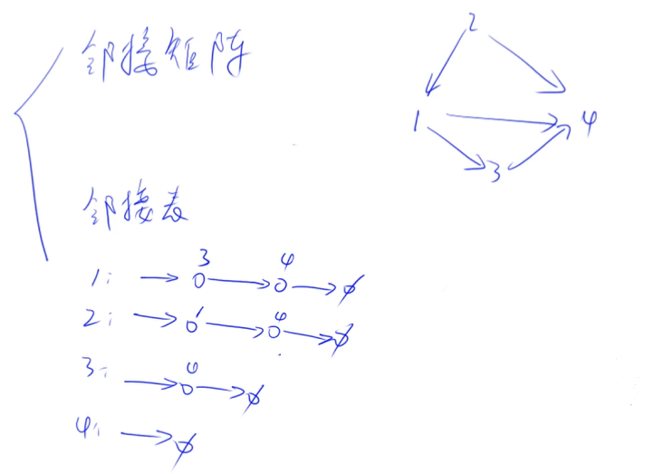

当我们向插入新边`2->3`时，则相当于给 2 多增加了一个可达的节点 3 ，因此把 3 插到链表 2 的表头。

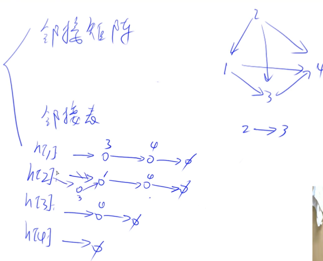

### 树与图的深度优先遍历
树的dfs和bfs如下。

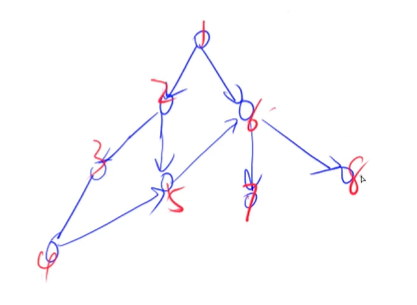

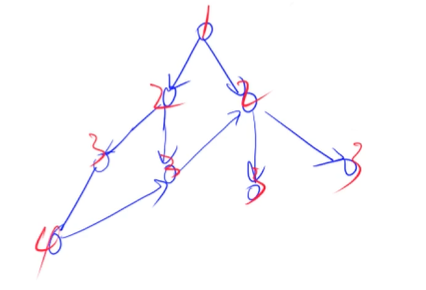

#### 树的重心
- 给定一颗树，树中包含 n 个结点（编号 1∼n）和 n−1 条无向边。
- 请你找到树的重心，并输出将重心删除后，剩余各个连通块中点数的最大值。
- 重心定义：重心是指树中的一个结点，如果将这个点删除后，剩余各个连通块中点数的最大值最小，那么这个节点被称为树的重心。

输入格式
- 第一行包含整数 n，表示树的结点数。
- 接下来 n−1 行，每行包含两个整数 a 和 b，表示点 a 和点 b 之间存在一条边。

输出格式
- 输出一个整数 m，表示将重心删除后，剩余各个连通块中点数的最大值。

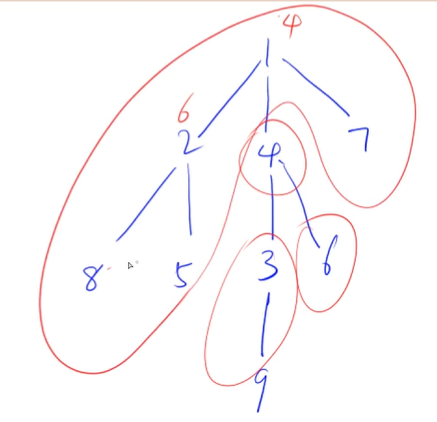

**分析：**
- 把4节点删掉，发现一共有3个连通块
- 其中最大的连通块有 5 个点
- 然后看别的，比如 1 删掉后，值为 4 ； 2 删掉后，值为 6 ；显然点 1 比 4 和 2 都更倾向于成为重心

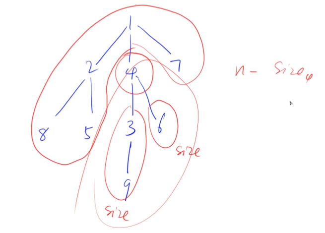

**思路：**
- 如何求出连通块个数？
- 如上，我们用 dfs ，因为 dfs 可以求出每个子树里节点的个数
- 比如我们删除 4 后，我们怎么知道最大的上面的连通区域内的点的个数？`n - size[4]`
- `我们这里用 dfs(u) 求以 u 为根的子树中的点的数量 sum 的同时，用 res 记录节点 u 删除后，各连通块的最大值`

```cpp
#include <iostream>
#include <cstring>
#include <algorithm>
using namespace std;

const int N  = 1e5 + 10, M = N * 2;

// 链表
int e[M], ne[M], h[M], idx;
// 本题目
int n;
int ans = M;
bool st[M];  // 是否检查过这个点了

void add(int a, int b)
{
    // 把 b 插到 a 链表头
    e[idx] = b, ne[idx] = h[a], h[a] = idx ++ ;
}

// 以 u 为根，看其子树以及上面的部分谁点多
int dfs(int u)
{
    st[u] = true;

    // 当前产出子树的连通图节点数量
    int res = 0;
    // 作为子树，其节点数量
    int sum = 1;  // 其自己是一个节点
    
    // 遍历各个节点
    for (int i = h[u]; i != -1; i = ne[i])
    {
        // i 是地址， e[i] 是元素
        int j = e[i];
        if (st[j]) continue;
        int s = dfs(j);
        res = max(res, s);
        sum += s;
    }
    
    res = max(n - sum, res);  // 与子树的上面部分连通图比较
    ans = min(res, ans);
    return sum;
}

int main()
{
    // ！链表，初始化，所有点都是一个结点的单链表，因此 h 指向 -1
    memset(h, -1, sizeof h);
    
    cin >> n;
    int a, b;
    for (int i = 0; i < n - 1; i ++)
    {
        scanf("%d%d", &a, &b);
        add(a, b);
        add(b, a);  // 树是双向图
    }
    
    // 题中默认第1个点是根节点
    dfs(1);
    
    printf("%d", ans);
    return 0;
}
```

```go
package main

import (
    "fmt"
    "bufio"
    "strconv"
    "os"
)

type Node struct {
    Childs []*Node
}

func main() {
    sc := bufio.NewScanner(os.Stdin)
    sc.Split(bufio.ScanWords)
    
    sc.Scan()
    n, _ := strconv.Atoi(sc.Text())
    
    idx2Node := map[string]*Node{}
    for i := 0; i < n; i ++ {
        sc.Scan()
        a := sc.Text()
        sc.Scan()
        b := sc.Text()
        node1 := idx2Node[a]
        node2 := idx2Node[b]
        if node1 == nil {
            node1 = &Node{}
            idx2Node[a] = node1
        }
        if node2 == nil {
            node2 = &Node{}
            idx2Node[b] = node2
        }
        node1.Childs = append(node1.Childs, node2)
        node2.Childs = append(node2.Childs, node1)
    }

    ans := len(idx2Node)
    viewed := map[*Node]bool{}

    var dfs func(u *Node) int
    dfs = func(u *Node) int {
        viewed[u] = true
        
        maxv := 0
        sum := 1
        for _, child := range u.Childs {
            if viewed[child] {
                continue
            }
            s := dfs(child)
            if s > maxv {
                maxv = s
            }
            sum += s
        }
        if n - sum > maxv {
            maxv = n - sum
        }
        if maxv < ans {
            ans = maxv
        }
        return sum
    }

    dfs(idx2Node["1"])
    fmt.Println(ans)
}
```

### 树与图的广度优先遍历
#### 图中点的层次
- 给定一个 n 个点 m 条边的有向图，图中可能存在重边和自环。
- 所有边的长度都是 1`（因此我们可以用bfs）`，点的编号为 1∼n。
- 请你求出 1 号点到 n 号点的最短距离，如果从 1 号点无法走到 n 号点，输出 −1。

输入格式
- 第一行包含两个整数 n 和 m。
- 接下来 m 行，每行包含两个整数 a 和 b，表示存在一条从 a 走到 b 的长度为 1 的边。

输出格式
- 输出一个整数，表示 1 号点到 n 号点的最短距离。

```cpp
#include <iostream>
#include <cstring>
using namespace std;

const int N = 1e5 + 10;  // 一个有向图，N这么大够用
int n, m;

// 链表
int e[N], ne[N], h[N], idx;
void add(int a, int b)
{
    e[idx] = b, ne[idx] = h[a], h[a] = idx ++;
}

// 队列
int hh = 0, tt = -1, q[N];

int d[N];

int bfs()
{
    q[++tt] = 1;
    memset(d, -1, sizeof d);
    d[1] = 0;  // 1 跟自己的距离是 0
    
    while (hh <= tt)
    {
        int t = q[hh++];
        for (int i = h[t]; i != -1; i = ne[i])
        {
            int j = e[i];
            if (d[j] == -1)  // 这个点还没有被遍历到
            {
                d[j] = d[t] + 1;
                q[++tt] = j;
            }
        }
    }
    
    return d[n];
}

int main()
{
    memset(h, -1, sizeof h);  // C++中，全局阈只能声明、初始化变量； 不能用于赋值、运算、调用函数等！！！
    // 因此 memset(h, -1, sizeof h); 不能放在开头

    scanf("%d%d", &n, &m);
    int a, b;
    for (int i = 0; i < m; i ++)
    {
        scanf("%d%d", &a, &b);
        add(a, b);
    }
    
    cout << bfs();
    return 0;
}
```

```go
package main

import (
    "fmt"
    "bufio"
    "strconv"
    "os"
)

type Node struct {
    Childs []*Node
}

func main() {
    sc := bufio.NewScanner(os.Stdin)
    sc.Split(bufio.ScanWords)
    
    sc.Scan()
    n, _ := strconv.Atoi(sc.Text())
    sc.Scan()
    m, _ := strconv.Atoi(sc.Text())

    idx2Node := map[string]*Node{}
    for i := 1; i <= n; i ++ {
        idx2Node[strconv.Itoa(i)] = &Node{}
    }
    for i := 0; i < m; i ++ {
        sc.Scan()
        a := sc.Text()
        sc.Scan()
        b := sc.Text()
        node1 := idx2Node[a]
        node2 := idx2Node[b]
        node1.Childs = append(node1.Childs, node2)
    }
    
    d := map[*Node]int{}
    d[idx2Node["1"]] = 0

    q := []*Node{idx2Node["1"]}
    for len(q) > 0 {
        s := q[0]
        q = q[1:]
        for _, c := range s.Childs {
            _, ok := d[c]
            if ok {
                continue
            }
            d[c] = d[s] + 1
            q = append(q, c)
        }
    }

    dis, ok := d[idx2Node[strconv.Itoa(n)]]
    if ok {
        fmt.Println(dis)
    } else {
        fmt.Println(-1)
    }
}
```

#### 有向图的拓扑序列（图bfs基本应用）
拓扑序列针对有向图来说的。

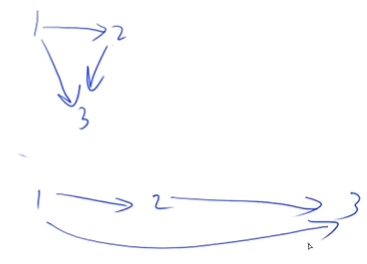

每条边都是起点在终点前面，或者说所有边都是从前指向后的：
- 因此拓扑序列没有环
- 有向无环图则一定有拓扑序列，有向无环图也被称为拓扑图

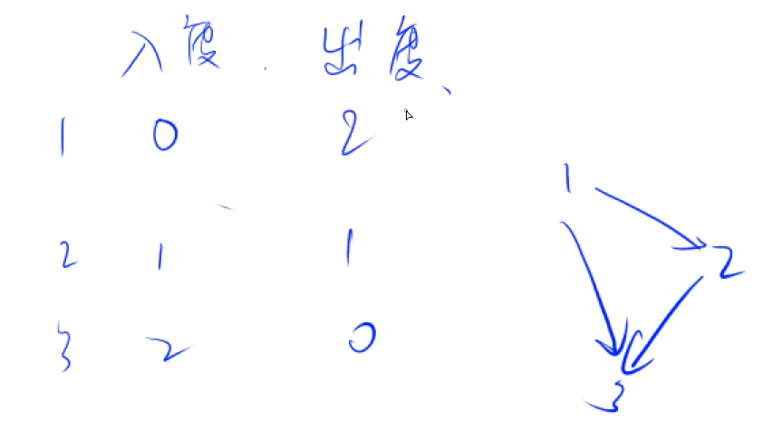

入度：一个点有几条边进来
出度：一个点有几条边出啦

#### 例题：有向图的拓扑序列
- 给定一个 n 个点 m 条边的有向图，点的编号是 1 到 n，图中可能存在重边和自环。
- 请输出任意一个该有向图的拓扑序列，如果拓扑序列不存在，则输出 −1。
- 若一个由图中所有点构成的序列 A 满足：对于图中的每条边 (x,y)，x 在 A 中都出现在 y 之前，则称 A 是该图的一个拓扑序列。

输入格式
- 第一行包含两个整数 n 和 m。
- 接下来 m 行，每行包含两个整数 x 和 y，表示存在一条从点 x 到点 y 的有向边 (x,y)。

输出格式
- 共一行，如果存在拓扑序列，则输出任意一个合法的拓扑序列即可。
- 否则输出 −1。

**思路：**
- 如何求拓扑序列？
- 首先把所有入度为 0 的点放入 queue
- 之后宽搜，枚举 t 的所有出边 `t->j`
- 删掉 `t->j` ，这会导致 `d[j]--` （影响了 j 的入度）
- 如果 `d[j] == 0` ，则可以让 `j` 入队
- 如果是环，则一定会有不能入队的点（如果是有向无环图，一定存在入度为0的点）
- 最终的队列痕迹，就是一个该图的拓扑排序

```cpp
#include <iostream>
#include <cstring>
using namespace std;

const int N = 1e5 + 10;
int n, m;

int e[N], ne[N], h[N], idx;
void add(int a, int b)
{
    e[idx] = b; ne[idx] = h[a]; h[a] = idx ++;
}

int hh = 0, tt = -1, q[N];
int d[N]; // 入度

bool bfs()
{
    for (int i = 1; i <= n; i ++)
    {
        if (!d[i]) // 入度为 0 ，入队
            q[++tt] = i;
    }
    
    while (hh <= tt)
    {
        int t = q[hh ++];
        for (int i = h[t]; i != -1; i = ne[i])
        {
            int j = e[i];
            if (--d[j] == 0)  // 如果删去边后，入度为 0 ，入队
            {
                q[++tt] = j;
            }
        }
    }
    
    if (tt == n - 1) return true;
    return false;
    // 可以写成 return tt == n - 1;
}

int main()
{
    memset(h, -1, sizeof h);
    
    cin >> n >> m;
    for (int i = 0; i < m; i ++)
    {
        int a, b;
        scanf("%d%d", &a, &b);
        add(a, b);
        d[b] ++;
    }
    
    if (bfs())
        for (int i = 0; i <= tt; i ++) printf("%d ", q[i]);
    else puts("-1");
    
    return 0;
}
```

```go
package main

import (
    "fmt"
    "bufio"
    "strconv"
    "os"
)

type Node struct {
    Val int
    Childs []*Node
}

func main() {
    sc := bufio.NewScanner(os.Stdin)
    sc.Split(bufio.ScanWords)
    
    sc.Scan()
    n, _ := strconv.Atoi(sc.Text())
    sc.Scan()
    m, _ := strconv.Atoi(sc.Text())

    idx2Node := map[string]*Node{}
    d := map[*Node]int{}
    for i := 1; i <= n; i ++ {
        idx2Node[strconv.Itoa(i)] = &Node{ Val: i }
    }
    for i := 0; i < m; i ++ {
        sc.Scan()
        a := sc.Text()
        sc.Scan()
        b := sc.Text()
        node1 := idx2Node[a]
        node2 := idx2Node[b]
        node1.Childs = append(node1.Childs, node2)
        d[node2] ++
    }

    q := []*Node{}
    for _, node := range idx2Node {
        if d[node] == 0 {
            q = append(q, node)
            
        }
    }
    ans := []*Node{}
    for len(q) > 0 {
        s := q[0]
        q = q[1:]
        ans = append(ans, s)
        for _, c := range s.Childs {
            d[c] --
            if d[c] == 0 {
                q = append(q, c)
            }
        }
    }

    if len(ans) != n {
        fmt.Println(-1)
    } else {
        for i := range ans {
            fmt.Print(ans[i].Val, " ")
        }
    }
}
```
