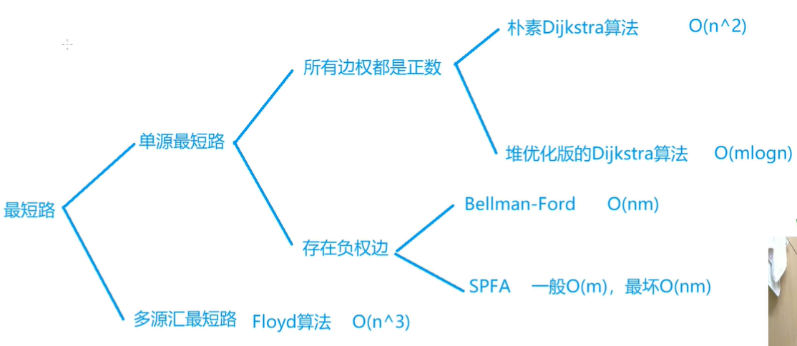
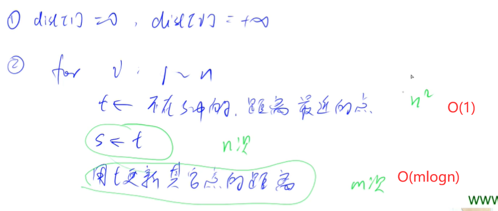
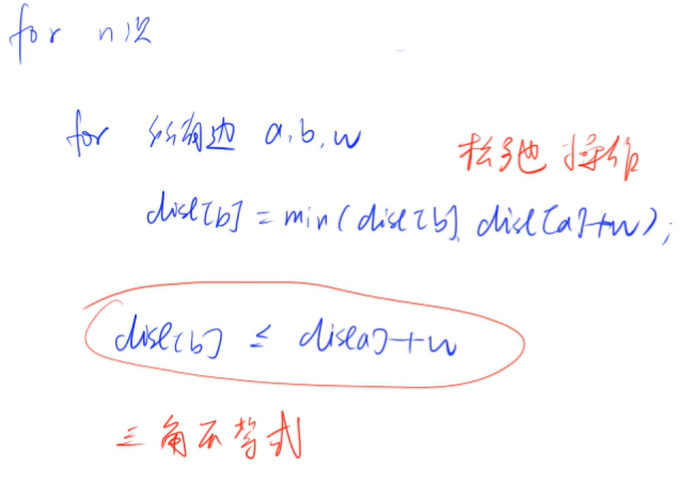
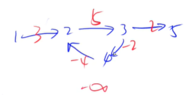
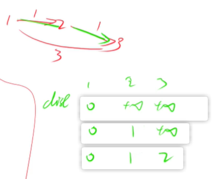
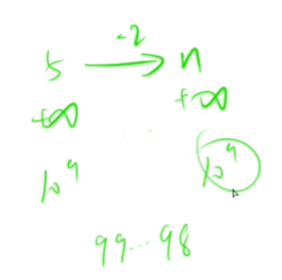
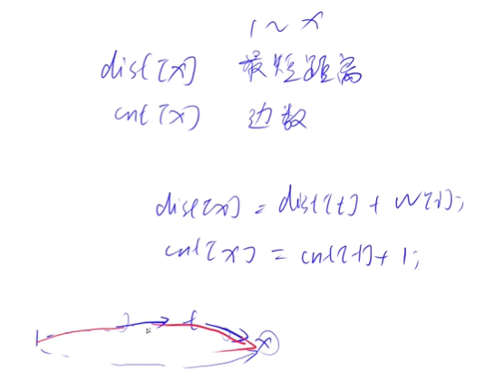

<!-- @import "[TOC]" {cmd="toc" depthFrom=1 depthTo=4 orderedList=false} -->

<!-- code_chunk_output -->

- [最短路](#最短路)
- [朴素 Dijkstra 算法](#朴素-dijkstra-算法)
  - [Dijkstra求最短路 I](#dijkstra求最短路-i)
- [堆优化版的 Dijkstra 算法](#堆优化版的-dijkstra-算法)
  - [Dijkstra求最短路 II](#dijkstra求最短路-ii)
- [bellman-ford（负权）](#bellman-ford负权)
  - [有边数限制的最短路](#有边数限制的最短路)
- [SPFA](#spfa)
  - [spfa求最短路模板](#spfa求最短路模板)
  - [spfa判断负环模板](#spfa判断负环模板)
- [Floyd求最短路](#floyd求最短路)
  - [Floyd求最短路](#floyd求最短路-1)

<!-- /code_chunk_output -->

### 最短路
最短路分为：
- 单源最短路（1点到n点的最短距离）
- 多源汇最短路
  - 源点就是起点、汇点就是终点
  - 多源汇就是多个起点终点

我们约定 `n` 为点个数， `m` 为边个数。

单元最短路又可分为：
- 所有边权都是正数：
  - 朴素 Dijkstra 算法（时间复杂度 $O(n^2)$）
  - 堆优化版的 Dijkstra 算法（时间复杂度 $O(m\log n)$）
  - 因此，朴素 Dijkstra 算法更适合稠密图，与边数量无关
- 存在负权边：
  - Bellman-Ford 时间复杂度 $O(nm)$
  - SPFA 一般为 $O(m)$ ，最坏 $O(nm)$

而多源汇最短路一般用 Floyd 算法 $O(n^3)$ 。



最短路一般考察：**建图** 。如何把问题抽象为图问题。

### 朴素 Dijkstra 算法

[Ni](https://www.acwing.com/solution/content/5806/)：进行n次迭代去确定每个点到起点的最小值，最后输出的终点的即为我们要找的最短路的距离。

[Dijkstra算法原理](https://blog.csdn.net/yalishadaa/article/details/55827681)：
- (1) 初始时，S只包含起点s；U包含除s外的其他顶点，且U中顶点的距离为"起点s到该顶点的距离"[例如，U中顶点v的距离为(s,v)的长度，然后s和v不相邻，则v的距离为∞]。
- (2) 从U中选出"距离最短的顶点k"，并将顶点k加入到S中；同时，从U中移除顶点k。
- (3) 更新U中各个顶点到起点s的距离。之所以更新U中顶点的距离，是由于上一步中确定了k是求出最短路径的顶点，从而可以利用k来更新其它顶点的距离；例如，(s,v)的距离可能大于(s,k)+(k,v)的距离。
- (4) 重复步骤(2)和(3)，直到遍历完所有顶点。

说白了，就是这个思想：
- 有两个集合，以及固定了最小距离的 A ，以及不知道的是不是最小距离的 B ；
- 每次都把 B 中 dist 最小的顶点 t 放进 A ，然后拿这个点去更新 B 中剩下的点的距离 `dist[j] = min(dist[j], dist[t] + g[t][j])`
- 如此往复

#### Dijkstra求最短路 I
- 给定一个 n 个点 m 条边的有向图，图中可能存在重边和自环，所有边权均为正值。
- 请你求出 1 号点到 n 号点的最短距离，如果无法从 1 号点走到 n 号点，则输出 −1。

输入格式
- 第一行包含整数 n 和 m。
- 接下来 m 行每行包含三个整数 x,y,z，表示存在一条从点 x 到点 y 的有向边，边长为 z。

输出格式
- 输出一个整数，表示 1 号点到 n 号点的最短距离。
- 如果路径不存在，则输出 −1。

**思考：**
- 稠密图，用邻接矩阵表达

```cpp
#include <iostream>
#include <cstring>
#include <algorithm>
using namespace std;

const int N = 501;

int n, m;
int a, b, c;
int g[N][N], d[N];
bool st[N];

void dijkstra()
{
    memset(d, 0x3f, sizeof d);
    d[1] = 0;
    
    for (int i = 0; i < n - 1; i ++ )  // 循环 n - 1 次
    {
        // 下面在找不属于 S 的距离最小值
        int t = -1;  // t = -1 保证至少取到一个点，配合下面的 t == -1
        for (int j = 1; j <= n; j ++ )
            if (!st[j] && (t == -1 || d[t] > d[j]))
                t = j;
        
        // 更新
        for (int j = 1; j <= n; j ++ )
            d[j] = min(d[j], d[t] + g[t][j]);
        
        st[t] = true;
    }
    
    if (d[n] == 0x3f3f3f3f) d[n] = -1;
}


int main()
{
    scanf("%d%d", &n, &m);
    
    memset(g, 0x3f, sizeof g);
    
    while (m -- )
    {
        scanf("%d%d%d", &a, &b, &c);
        g[a][b] = min(g[a][b], c);
    }
    
    dijkstra();
    
    printf("%d", d[n]);
    
    return 0;
}
```

```go
package main

import (
    "fmt"
    "strconv"
    "bufio"
    "os"
    // "math"
)

func main() {
    n, g, seen := getInput()
    d := dijkstra(n, g, seen)
    if d[n - 1] == 2147483647 / 2 {
        fmt.Println("-1")
    } else {
        fmt.Println(d[n - 1])
    }
}

func dijkstra(n int, g [][]int, seen []bool) (d []int) {
    d = make([]int, n)
    for i := 0; i < n; i ++ {
        d[i] = 2147483647 / 2
    }
    d[0] = 0
    for i := 1; i < n; i ++ {
        t := -1
        for j := 0; j < n; j ++ {  // 选出一个点
            if (!seen[j] && (t == -1 || d[j] < d[t])) {
                t = j
            }
        }

        for j := 0; j < n; j ++ {
            newD := d[t] + g[t][j]
            if newD < d[j] {
                d[j] = newD
            }
        }
        seen[t] = true
    }
    return
}

func getInput() (n int, g [][]int, seen []bool) {
    sc := bufio.NewScanner(os.Stdin)
    sc.Split(bufio.ScanWords)
    
    readInt := func() int {
        sc.Scan()
        r, _ := strconv.Atoi(sc.Text())
        return r
    }
    
    n = readInt()
    g = make([][]int, n)
    seen = make([]bool, n)
    for i := range g {
        g[i] = make([]int, n)
        for j := range g[i] {
            g[i][j] = 2147483647 / 2
        }
    }
    
    m := readInt()
    for m > 0 {
        x, y, z := readInt(), readInt(), readInt()
        if z < g[x - 1][y - 1] {
            g[x - 1][y - 1] = z
        }
        m --
    }
    return
}
```

### 堆优化版的 Dijkstra 算法
如果有 `n=1e5` ，则 `n**2 = 1e10` 会超时。

因此，思考如何优化。



如上，在朴素 Dijkstra 中，寻找最短的 `dist` 时间复杂度是 $O(n^2)$ ，因此，我们用堆来存储，让其时间复杂度为 $O(1)$ ；而这会导致更新各点的时间复杂度变为 $O(m \log n)$ 。

#### Dijkstra求最短路 II
- 给定一个 n 个点 m 条边的有向图，图中可能存在重边和自环，所有边权均为非负值。
- 请你求出 1 号点到 n 号点的最短距离，如果无法从 1 号点走到 n 号点，则输出 −1。

输入格式
- 第一行包含整数 n 和 m。
- 接下来 m 行每行包含三个整数 x,y,z，表示存在一条从点 x 到点 y 的有向边，边长为 z。

输出格式
- 输出一个整数，表示 1 号点到 n 号点的最短距离。
- 如果路径不存在，则输出 −1。

**分析**：
- 别忘了稀疏图用链表存（不需要处理重边）
- 堆有两种实现方式
  - 自己用数组，这样可以保证能修改堆中任一元素，保证堆的大小总是 `n`
  - 用 `priority_queue` ，这将导致无法修改堆中任意元素，因此使用 `冗余` 的方法插入，这样会导致堆的大小是 `m` ，时间复杂度为 $m \log m < m \log n^2 = 2m \log n$ ，和 $m\log n$ 也没数量级上的区别，因此我们用 `priority_queue`

```cpp
#include <iostream>
#include <cstring>
#include <algorithm>
#include <queue>
#include <vector>
using namespace std;

const int N = 2e5;

typedef pair<int, int> PII;

int h[N], e[N], ne[N], idx, w[N];
int n, m;
int d[N];
bool st[N];

void add(int a, int b, int c)
{
    e[idx] = b, w[idx] = c, ne[idx] = h[a], h[a] = idx ++;
}

void dijkstra()
{
    memset(d, 0x3f, sizeof d);
    d[1] = 0;
    priority_queue<PII, vector<PII>, greater<PII>> heap;
    heap.push({0, 1});  // {距离，点编号}
    
    while(heap.size())
    {
        auto t = heap.top();
        heap.pop();
        
        int ver = t.second, dist = t.first;
        
        if (st[ver]) continue;
        st[ver] = true;
        
        for (int i = h[ver]; i != -1; i = ne[i])
        {
            int j = e[i];
            if (d[j] > d[ver] + w[i])
                d[j] = d[ver] + w[i];
            heap.push({d[j], j});
        }
    }
    
    if (d[n] == 0x3f3f3f3f) d[n] = -1;
}


int main()
{
    scanf("%d%d", &n, &m);
    
    memset(h, -1, sizeof h);
    
    while (m -- )
    {
        int a, b, c;
        scanf("%d%d%d", &a, &b, &c);
        add(a, b, c);
    }
    
    dijkstra();
    
    printf("%d", d[n]);

    return 0;
}
```

```go
// acwing 上的 golang 版本太低
package main

import (
    "fmt"
    "strconv"
    "bufio"
    "os"
    // "math"
    "container/heap"
)

type hp []struct { c, d int }
func (h hp) Len() int { return len(h) }
func (h hp) Less(i, j int) bool { return h[i].d < h[j].d }
func (h hp) Swap(i, j int) { h[i], h[j] = h[j], h[i] }
func (h *hp) Push(v interface{}) { *h = append(*h, v.(struct { c, d int })) }
func (h *hp) Pop() interface{} {
    r := (*h)[len(*h) - 1]
    *h = (*h)[:len(*h) - 1]
    return r
}

var _ heap.Interface = &hp{}

func main() {
    n, g, seen := getInput()
    d := dijkstra(n, g, seen)
    if d[n - 1] == 2147483647 / 2 {
        fmt.Println("-1")
    } else {
        fmt.Println(d[n - 1])
    }
}

func dijkstra(n int, g map[int][][2]int, seen []bool) (d []int) {
    d = make([]int, n)
    for i := 0; i < n; i ++ {
        d[i] = 2147483647 / 2
    }
    d[0] = 0
    h := &hp{struct { c, d int }{ 0, 0 }}
    heap.Init(h)
    for h.Len() > 0 {
        t := heap.Pop(h).(struct { c, d int })
        if seen[t.c] {
            continue
        }
        for j := range g[t.c] {
            child := g[t.c][j]
            newD := d[t.c] + child[1]
            if newD < d[child[0]] {
                d[child[0]] = newD
            }
            heap.Push(h, struct { c, d int }{ child[0], d[child[0]] })
        }
        seen[t.c] = true
    }
    return
}

func getInput() (n int, g map[int][][2]int, seen []bool) {
    sc := bufio.NewScanner(os.Stdin)
    sc.Split(bufio.ScanWords)
    
    readInt := func() int {
        sc.Scan()
        r, _ := strconv.Atoi(sc.Text())
        return r
    }
    
    n = readInt()
    g = make(map[int][][2]int, 0)
    seen = make([]bool, n)

    m := readInt()
    for m > 0 {
        x, y, z := readInt() - 1, readInt() - 1, readInt()
        g[x] = append(g[x], [2]int{y, z})
        m --
    }
    return
}
```

### bellman-ford（负权）


遍历所有 `(a, b, w)` 边，之后进行松弛操作。为什么能收敛？利用了三角不等式。

**迭代 n 次，表示最多经过不超过 n 条边。**



注意：
- 不能处理负权回路
- Bellman-Ford算法还可以检测一个图是否含有负权回路，如果在进行n-1轮松弛之后，仍然可以继续松弛，那么次图必然存在负权回路

#### 有边数限制的最短路
- 给定一个 n 个点 m 条边的有向图，图中可能存在重边和自环， **边权可能为负数。**
- 请你求出从 1 号点到 n 号点的最多经过 k 条边的最短距离（**导致只能用 bellman_ford**），如果无法从 1 号点走到 n 号点，输出 `impossible。`
- 注意：图中可能 **存在负权回路** 。

输入格式
- 第一行包含三个整数 n,m,k。
- 接下来 m 行，每行包含三个整数 x,y,z，表示存在一条从点 x 到点 y 的有向边，边长为 z。

输出格式
- 输出一个整数，表示从 1 号点到 n 号点的最多经过 k 条边的最短距离。
- 如果不存在满足条件的路径，则输出 `impossible`。

```cpp
#include <iostream>
#include <cstring>
#include <algorithm>
using namespace std;

const int M = 1e4 + 10;
const int N = 510;

int n, m, k;
int a, b, c;
int d[N];
int last[N];  // 备份上一次的 d[N]

struct Edge
{
    int a, b, c;
} edges[M];

void bellman_ford()
{
    memset(d, 0x3f, sizeof d);
    d[1] = 0;

    for (int i = 0; i < k; i ++)
    {
        memcpy(last, d, sizeof d);
        for (int j = 0; j < m; j ++)
        {
            auto e = edges[j];
            d[e.b] = min(d[e.b], last[e.a] + e.c);
        }
    }
}

int main()
{
    scanf("%d%d%d", &n, &m, &k);
    for (int i = 0; i < m; i ++)
    {
        scanf("%d%d%d", &a, &b, &c);
        edges[i] = {a, b, c};
    }
    
    bellman_ford();
    
    if (d[n] > 0x3f3f3f3f / 2) printf("impossible");
    else printf("%d", d[n]);
    
    return 0;
}
```

**经验：**
- 因为本算法中顺序不重要，用结构体保存边信息



**分析：**
- 备份很必要，如上图
- 假设我们 `k=1` ，如果不备份，在第一次迭代中，我们先更新了 `dist[2] = 1`
- 接下啦更新 `dist[3]` ，我们按理说应该是用 `(1, 3, 3)` 来 `dist[3] = 3`
- 然而，因为没有备份，所以本次迭代的结果导致了 `dist[2] = 1` 参与了进来，串联现象产生



为什么有 `dist[n] > 0x3f3f3f3f / 2`? **分析：**
- 我们这里的正无穷设置为 `0x3f3f3f3f` ，并不是数学意义上的正无穷
- 因此，如果减去常数，其数值会变小
- 但是数学意义上不会小，因此考虑计算次数，最后判断时，大于 `0x3f3f3f3f / 2` 都看作正无穷

此外，参考视频：
- [https://www.bilibili.com/video/BV1gb41137u4](https://www.bilibili.com/video/BV1gb41137u4)、[https://www.youtube.com/watch?v=lyw4FaxrwHg](https://www.youtube.com/watch?v=lyw4FaxrwHg)，不好的地方在于，没有备份，没法通过 k 次更新得到 k 次可达的最短路

### SPFA
SPFA（Shortest Path Faster Algorithm, Bellman-Ford using queue optimization）实际上使用队列优化 bellman-ford 算法。

核心：更新了哪个点，把哪个点放入队列，下次循环看看其邻居是不是有必要更新。

[SPFA百度百科](https://baike.baidu.com/item/SPFA%E7%AE%97%E6%B3%95/8297411?fromtitle=SPFA&fromid=11018124&fr=aladdin)：为了避免最坏情况的出现，在正权图上应使用效率更高的Dijkstra算法。

#### spfa求最短路模板
- 给定一个 n 个点 m 条边的有向图，图中可能存在重边和自环， **边权可能为负数。**
- 请你求出 1 号点到 n 号点的最短距离，如果无法从 1 号点走到 n 号点，则输出 impossible。
- **数据保证不存在负权回路。**

输入格式
- 第一行包含整数 n 和 m。
- 接下来 m 行每行包含三个整数 x,y,z，表示存在一条从点 x 到点 y 的有向边，边长为 z。

输出格式
- 输出一个整数，表示 1 号点到 n 号点的最短距离。
- 如果路径不存在，则输出 impossible。

```cpp
#include <iostream>
#include <cstring>
#include <algorithm>
#include <queue>
using namespace std;

const int N = 1e5 + 10;
int m, n;
int d[N];
bool s[N];  // s[i] 是目前 i 是否在队列里
queue<int> q;

int e[N], ne[N], w[N], h[N], idx;

void add(int a, int b, int c)
{
    e[idx] = b, w[idx] = c, ne[idx] = h[a], h[a] = idx ++ ;
}

void spfa()
{
    q.push(1);
    d[1] = 0;
    s[1] = true;
    
    while (q.size())
    {
        int t = q.front();
        q.pop();
        // s 用于防止队列中存除重复的点
        s[t] = false;

        for (int i = h[t]; i != -1; i = ne[i])
        {
            int j = e[i];
            if (d[j] > d[t] + w[i])
            {
                d[j] = d[t] + w[i];
                if (!s[j])
                {
                    q.push(j);
                    s[j] = true;
                }
            }
        }
    }
}

int main()
{
    scanf("%d%d", &n, &m);

    memset(d, 0x3f, sizeof d);
    memset(h, -1, sizeof h);

    while (m -- )
    {
        int a, b, c;
        scanf("%d%d%d", &a, &b, &c);
        add(a, b, c);
    }
    
    spfa();
    
    if (d[n] == 0x3f3f3f3f) puts("impossible");
    else printf("%d", d[n]);
    
    return 0;
}
```

注意，一般的 SPFA 处理不了负权回路，会陷入死循环。

#### spfa判断负环模板
- 给定一个 n 个点 m 条边的有向图，图中可能存在重边和自环， 边权可能为负数。
- 请你判断图中是否存在负权回路。

输入格式
- 第一行包含整数 n 和 m。
- 接下来 m 行每行包含三个整数 x,y,z，表示存在一条从点 x 到点 y 的有向边，边长为 z。

输出格式
- 如果图中存在负权回路，则输出 Yes，否则输出 No。



**分析：**
- `dist[x]` 是最短距离
- `cnt[x]` 是最短路经过边数
- 每次更新，都要做两个操作：`dist[x] = dist[t] + w[i]` 以及 `cnt[x] = cnt[t] + 1`
- 如果某次 `cnt[x] >= n` ，说明从 `1` 到 `x` 至少经过了 `n` 条边，则最短路需要 `n+1` 个以上的点，则肯定存在负环

**注意：**
- 我们原来做法是从 1 开始找
- 而这道题判断是否存在负环，不一定把 1 作为起点
- 因此这道题最开始把所有点都推入队列

```cpp
#include <iostream>
#include <cstring>
#include <algorithm>
#include <queue>
using namespace std;

const int N = 1e5 + 10;

int e[N], w[N], h[N], ne[N], idx;
int d[N], cnt[N];
bool st[N];

int n, m;

void add(int a, int b, int c)
{
    e[idx] = b, w[idx] = c, ne[idx] = h[a], h[a] = idx ++;
}

bool spfa()
{
    memset(d, 0x3f, sizeof d);
    
    queue<int> q;
    for (int i = 1; i <= n; i ++ )
    {
        q.push(i);  // 把所有点推入队列
        st[i] = true;
    }
    
    while (q.size())
    {
        int t = q.front();
        q.pop();
        
        st[t] = false;
        
        for (int i = h[t]; i != -1; i = ne[i])
        {
            int j = e[i];
            if (d[j] > d[t] + w[i])
            {
                d[j] = d[t] + w[i];
                cnt[j] = cnt[t] + 1;
                
                if (cnt[j] >= n) return true;
                if (!st[j])
                {
                    q.push(j);
                    st[j] = true;
                }
            }
        }
    }
    
    return false;
    
    
}

int main()
{
    scanf("%d%d", &n, &m);
    
    memset(h, -1, sizeof h);
    while (m -- )
    {
        int a, b, c;
        scanf("%d%d%d", &a, &b, &c);
        add(a, b, c);
    }
    
    if (spfa()) puts("Yes");
    else puts("No");

    return 0;
}
```

### Floyd求最短路
```cpp
for (int k = 1; k <= n; k ++)
  for (int i = 1; i <= n; i ++)
    for (int j = 1; j <= n; j ++)
      d[i, j] = min(d[i, j], d[i, k] + d[k, j])
```

原理是动态规划：
- 状态表征是 `d[k, i, j]` ， `k` 是指阶段（ `k` 阶段只考虑了前 `k` 个点，状态转移从 `k-1` 的阶段转移过来）
- `d[k, i, j] = d[k - 1, i, k] + d[k - 1, k, j]` 其中 `k` 可以省略，所以有了上式 `d[i, j] = min(d[i, j], d[i, k] + d[k, j])`

#### Floyd求最短路
- 给定一个 n 个点 m 条边的有向图，图中可能存在重边和自环，边权可能为负数。
- 再给定 k 个询问，每个询问包含两个整数 x 和 y，表示查询从点 x 到点 y 的最短距离，如果路径不存在，则输出 impossible。
- 数据保证图中不存在负权回路。

输入格式
- 第一行包含三个整数 n,m,k。
- 接下来 m 行，每行包含三个整数 x,y,z，表示存在一条从点 x 到点 y 的有向边，边长为 z。
- 接下来 k 行，每行包含两个整数 x,y，表示询问点 x 到点 y 的最短距离。

输出格式
- 共 k 行，每行输出一个整数，表示询问的结果，若询问两点间不存在路径，则输出 impossible。

```cpp
#include <iostream>
#include <cstring>
#include <algorithm>
using namespace std;

const int N = 210, INF = 1e9;  // 如果是 2e9 ，则 2e9 + 2e9 = -294967296 越界
int d[N][N], n, m, Q;

void floyd()
{
    for (int k = 1; k <= n; k ++)
        for (int i = 1; i <= n; i ++)
            for (int j = 1; j <= n; j ++)
                d[i][j] = min(d[i][j], d[i][k] + d[k][j]);
}

int main()
{
    scanf("%d%d%d", &n, &m, &Q);
    for (int i = 1; i <= n; i ++)
        for (int j = 1; j <= n; j ++)
            if (i == j) d[i][i] = 0;
            else d[i][j] = INF;
    
    while (m -- )
    {
        int a, b, c;
        scanf("%d%d%d", &a, &b, &c);
        d[a][b] = min(d[a][b], c);
    }
    
    floyd();
    
    while (Q -- )
    {
        int a, b;
        scanf("%d%d", &a, &b);
        if (d[a][b] > INF / 2) puts("impossible");
        else printf("%d\n", d[a][b]);
    }
    
    return 0;
}
```

**经验：**
- 因为存在自环和重复的边
- 因此为了在读入时就消去自环和重复的边，我们初始化时设置 `d[i][i] = 0` 以及 `d[i][j] = INF`
- 出了 `Segment Fault` 就用删代码大法
- 如果是 `2e9` ，则 `2e9 + 2e9 = -294967296` 越界
- 注意： Floyd 中 **for (int k = 0)** 循环一定要在最外层
