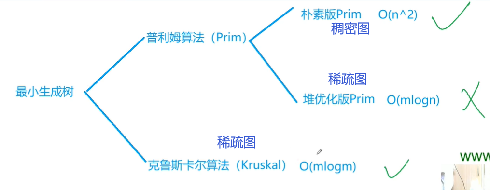
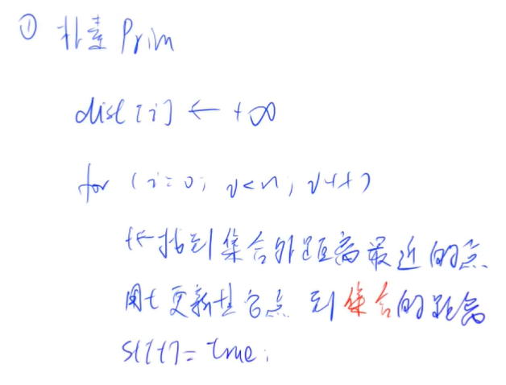
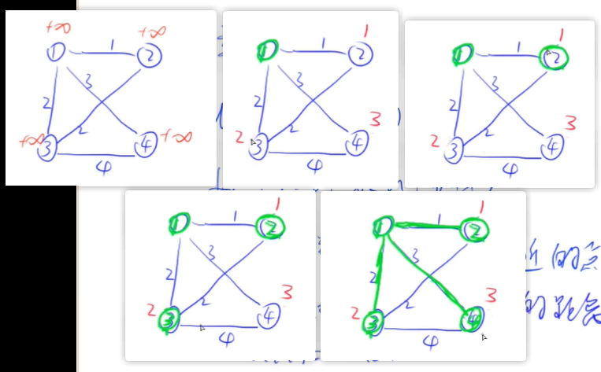
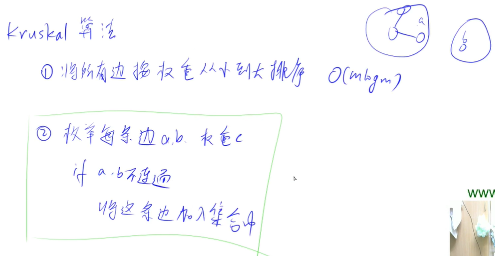
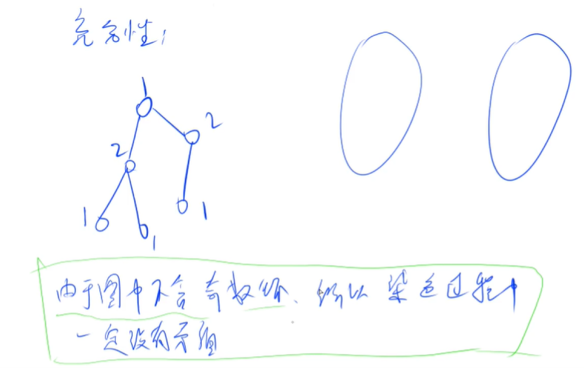
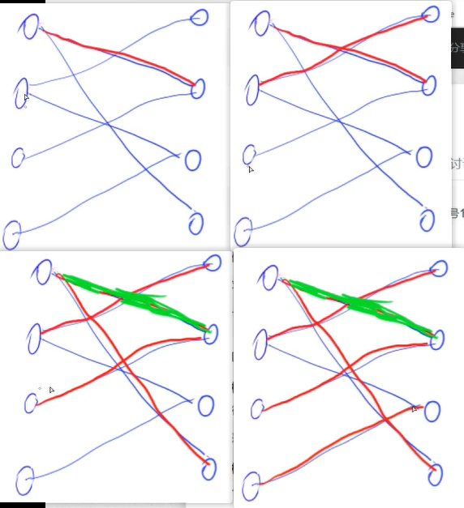

<!-- @import "[TOC]" {cmd="toc" depthFrom=1 depthTo=4 orderedList=false} -->

<!-- code_chunk_output -->

- [最小生成树](#最小生成树)
- [Prim](#prim)
  - [Prim模板](#prim模板)
- [Kruskal](#kruskal)
  - [Kruskal模板：Kruskal算法求最小生成树](#kruskal模板kruskal算法求最小生成树)
- [二分图](#二分图)
- [染色法判定二分图](#染色法判定二分图)
  - [染色法判定二分图模板](#染色法判定二分图模板)
- [匈牙利算法](#匈牙利算法)
  - [例题：二分图的最大匹配](#例题二分图的最大匹配)

<!-- /code_chunk_output -->

### 最小生成树


一般来讲，稠密图用朴素Prim（$O(n^2)$），稀疏图用Kruskal（$O(m \log m)$）；堆优化的Prim（$O(m\log n)$）不常用。

### Prim


算法示例如下。



#### Prim模板
- 给定一个 $n$ 个点 $m$ 条边的无向图，图中可能存在重边和自环，边权可能为负数。
- 求最小生成树的树边权重之和，如果最小生成树不存在则输出 `impossible`。
- 给定一张边带权的无向图 $G=(V,E)$，其中 $V$ 表示图中点的集合，$E$ 表示图中边的集合，$n=|V|$，$m=|E|$。
- 由 $V$ 中的全部 $n$ 个顶点和 $E$ 中 $n−1$ 条边构成的无向连通子图被称为 $G$ 的一棵生成树，其中边的权值之和最小的生成树被称为无向图 $G$ 的最小生成树。

输入格式
- 第一行包含两个整数 $n$ 和 $m$。
- 接下来 $m$ 行，每行包含三个整数 $u,v,w$，表示点 $u$ 和点 $v$ 之间存在一条权值为 $w$ 的边。

输出格式
- 共一行，若存在最小生成树，则输出一个整数，表示最小生成树的树边权重之和，如果最小生成树不存在则输出 `impossible` 。

```cpp
#include <iostream>
#include <cstring>
#include <algorithm>
using namespace std;

const int N = 510, INF = 0x3f3f3f3f;
int n, m;
int g[N][N], dist[N];
bool st[N];

int prim()
{
    memset(dist, 0x3f, sizeof dist);
    
    int res = 0;
    for (int i = 0; i < n; i ++)  // 循环 n 次
    {
        int t = -1;
        for (int j = 1; j <= n; j ++)  // 检测每个点
            if (!st[j] && (t == -1 || dist[j] < dist[t]))  // t 是技巧，把第一个拿出来和别的点比较
                t = j;
        
        if (i && dist[t] == INF)  // 不是第一次循环，新增到树的点d是最小的，然而值却是 -1
            return INF;
        
        st[t] = true;
        if (i) res += dist[t];  // 先把 res += dist[t] ，防止自环产生影响
        
        for (int j = 1; j <= n; j ++) dist[j] = min(dist[j], g[t][j]);  // 更新到集合的最小距离
    }
    return res;
}

int main()
{
    scanf("%d%d", &n, &m);
    
    memset(g, 0x3f, sizeof g);
    while (m -- )
    {
        int a, b, c;
        scanf("%d%d%d", &a, &b, &c);
        g[a][b] = g[b][a] = min(g[a][b], c);
    }
    
    int t = prim();
    
    if (t == INF) puts("impossible");
    else printf("%d", t);
    return 0;
}
```

**注意：**
- 使用 `if(i)` 检测是不是第一个循环，第一个循环只是任取一个点加到集合，不更新 `res`

### Kruskal



第二步是 $O(m)$ 的。

#### Kruskal模板：Kruskal算法求最小生成树
- 给定一个 $n$ 个点 $m$ 条边的无向图，图中可能存在重边和自环，边权可能为负数。
- 求最小生成树的树边权重之和，如果最小生成树不存在则输出 `impossible`。
- 给定一张边带权的无向图 $G=(V,E)$，其中 $V$ 表示图中点的集合，$E$ 表示图中边的集合，$n=|V|$，$m=|E|$。
- 由 $V$ 中的全部 $n$ 个顶点和 $E$ 中 $n−1$ 条边构成的无向连通子图被称为 $G$ 的一棵生成树，其中边的权值之和最小的生成树被称为无向图 $G$ 的最小生成树。

输入格式
- 第一行包含两个整数 $n$ 和 $m$。
- 接下来 $m$ 行，每行包含三个整数 $u,v,w$，表示点 $u$ 和点 $v$ 之间存在一条权值为 $w$ 的边。

输出格式
- 共一行，若存在最小生成树，则输出一个整数，表示最小生成树的树边权重之和，如果最小生成树不存在则输出 `impossible`。

```cpp
#include <iostream>
#include <cstring>
#include <algorithm>
using namespace std;

const int N = 1e5 + 10, M = 2e5 + 10;
int n, m;
int p[N];  // 并查集指针

struct Edge {
    int a, b, w;
    
    bool operator < (const Edge &e) const
    {
        return w < e.w;
    }
} edges[M];

int find(int x)
{
    if (x != p[x])
        p[x] = find(p[x]);
    return p[x];
}

int kruskal()
{
    sort(edges, edges + m);
    for (int i = 1; i <= n; i ++) p[i] = i;
    
    int res = 0, cnt = 1;  // 默认树里已经有 1 个点了
    for (int i = 0; i < m; i ++)  // 这里不能是 Edge e : edges ，因为 edges 默认开了 N
    {
        Edge e = edges[i];
        int a = e.a, b = e.b, w = e.w;
        a = find(a), b = find(b);
        if (a != b)
        {
            p[a] = b;
            cnt ++ ;
            res += w;
        }
    }
    
    if (cnt != n) return 0x3f3f3f3f;
    return res;
}

int main()
{
    scanf("%d%d", &n, &m);
    for (int i = 0; i < m; i ++)
    {
        int a, b, c;
        scanf("%d%d%d", &a, &b, &c);
        edges[i] = { a, b, c };
    }
    
    int t = kruskal();
    
    if (t == 0x3f3f3f3f) puts("impossible");
    else printf("%d", t);
    
    return 0;
}
```

**经验：**
- 重载了结构体的运算符，用于 `sort`

### 二分图


染色法（$O(n + m)$）判断是否为为二分图，匈牙利法（$O(mn)$，实际运行时间一般远小于$O(mn)$）最大匹配。

### 染色法判定二分图
**一个图是二分图，当且仅当这个图中不含奇数环。**

用二染色的方式：
- 一条边的两个点颜色一定不同
- 如果是二分图，所以不含奇数环，所以染色过程中没有矛盾



#### 染色法判定二分图模板
- 给定一个 $n$ 个点 $m$ 条边的无向图，图中可能存在重边和自环。
- 请你判断这个图是否是二分图。

输入格式
- 第一行包含两个整数 $n$ 和 $m$。
- 接下来 $m$ 行，每行包含两个整数 $u$ 和 $v$，表示点 $u$ 和点 $v$ 之间存在一条边。

输出格式
- 如果给定图是二分图，则输出 `Yes`，否则输出 `No`。

```cpp
#include <iostream>
#include <cstring>
#include <algorithm>
using namespace std;

const int N = 1e5 + 10, M = 2e5 + 10;  // 无向图
int n, m;
int color[N];  // 0 是未染色， 1 是颜色 1 ，2 是颜色 2

int h[M], e[M], ne[M], idx;
void add(int a, int b)
{
    e[idx] = b, ne[idx] = h[a], h[a] = idx ++;
}

bool dfs(int u, int c)  // 根节点 u 与颜色 c
{
    color[u] = c;
    
    for (int i = h[u]; i != -1; i = ne[i])
    {
        int j = e[i];
        if (!color[j])  // j 没上色
        {
            if(!dfs(j, 3 - c))  // 2 to 1, 1 to 2
                return false;
        }  // 这个大括号要加，要么 else if 会跟着 if(!dfs(j, 3 - c))
        else if (color[j] == c)
            return false;
    }

    return true;
}

int main()
{
    memset(h, -1, sizeof h);

    scanf("%d%d", &n, &m);
    while (m -- )
    {
        int a, b;
        scanf("%d%d", &a, &b);
        add(a, b), add(b, a);
    }

    bool flag = true;
    for (int i = 1; i <= n; i++)  // 因为未必是连通图，因此从每个点都查一遍
        if (!color[i])
            if (!dfs(i, 1)) {
                flag = false;
                break;
            }

    if (flag) puts("Yes");
    else puts("No");
    
    return 0;
}
```

**经验：**
- 无向图边的数组扩大二倍
- 多个 if 嵌套，大括号该加还是得加，否则 `else` 这种逻辑容易跟错

### 匈牙利算法
我们这里的目标值是最大匹配数量。



思路是，左3匹配到右2，右2原本有左1，左1看看除了右2和已经被匹配的右1，还有什么右边的可以给自己；如果有，那左3就匹配右2，左1换成新的；如果没有，左3再看看自己除了右2还有没有其他连接。

#### 例题：二分图的最大匹配
- 给定一个二分图，其中左半部包含 $n_1$ 个点（编号 $1∼n_1$），右半部包含 $n_2$ 个点（编号 $1∼n_2$），二分图共包含 $m$ 条边。
- 数据保证任意一条边的两个端点都不可能在同一部分中。
- 请你求出二分图的最大匹配数。
- 二分图的匹配：给定一个二分图 $G$，在 $G$ 的一个子图 $M$ 中，$M$ 的边集 $\{E\}$ 中的任意两条边都不依附于同一个顶点，则称 $M$ 是一个匹配。
- 二分图的最大匹配：所有匹配中包含边数最多的一组匹配被称为二分图的最大匹配，其边数即为最大匹配数。

输入格式
- 第一行包含三个整数 $n_1$、 $n_2$ 和 $m$。
- 接下来 $m$ 行，每行包含两个整数 $u$ 和 $v$，表示左半部点集中的点 $u$ 和右半部点集中的点 $v$ 之间存在一条边。

输出格式
- 输出一个整数，表示二分图的最大匹配数。

```cpp
#include <iostream>
#include <cstring>
#include <algorithm>
using namespace std;

const int N = 510, M = 1e5 + 10;
int n1, n2, m;
int match[N];  // match[i] 右左边 i 的点属于谁
int st[N];  // st[i] 右边的点 i 是否已经有主（每次更换左边的点， st 都清零）
// st 保证了每条边顶多走一次

int h[M], e[M], ne[M], idx;
void add(int a, int b)
{
    e[idx] = b, ne[idx] = h[a], h[a] = idx ++ ;
}

bool find(int u)
{
    for (int i = h[u]; i != -1; i = ne[i])
    {
        int j = e[i];
        if (!st[j])
        {
            st[j] = true;
            if (match[j] == 0 || find(match[j]))  // 如果对于 match[j] ，还能找到别的右边点与其匹配
            {
                match[j] = u;
                return true;
            }
        }
    }
    return false;
}

int main()
{
    scanf("%d%d%d", &n1, &n2, &m);
    
    memset(h, -1, sizeof h);

    while (m--)
    {
        int a, b;
        scanf("%d%d", &a, &b);
        add(a, b);
    }

    int res = 0;
    for (int i = 1; i <= n1; i ++ )
    {
        memset(st, false, sizeof st);
        if (find(i)) res ++;
    }
    printf("%d", res);
    return 0;
}
```
