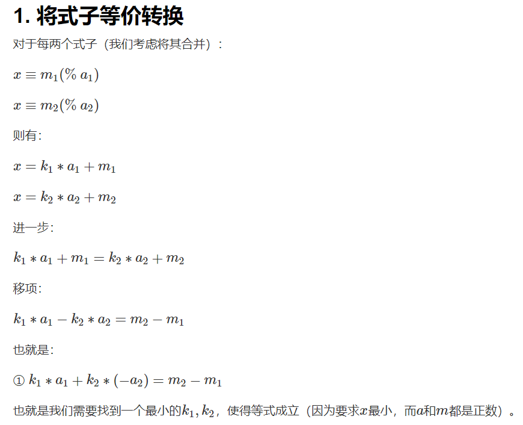
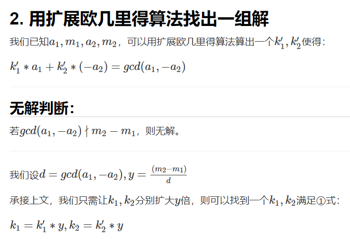
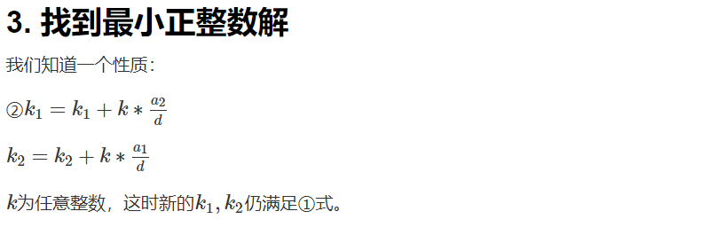
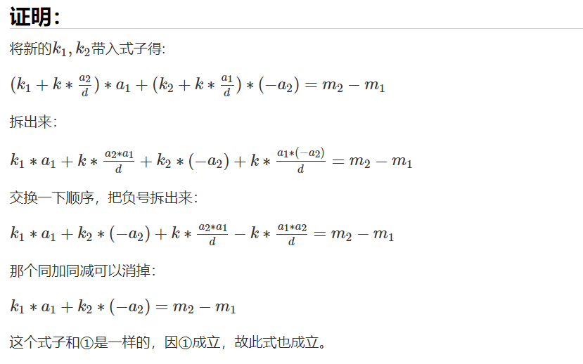
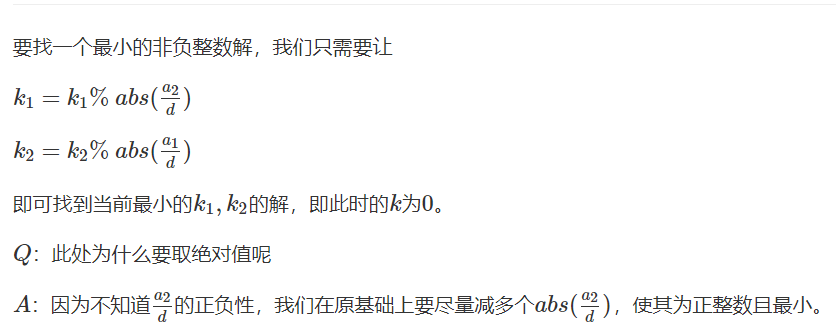
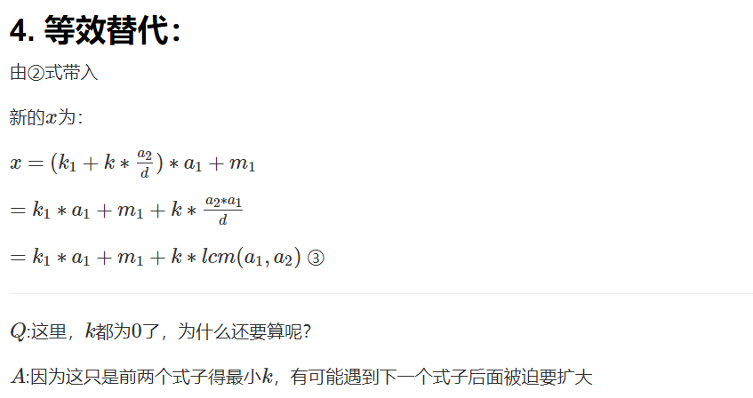
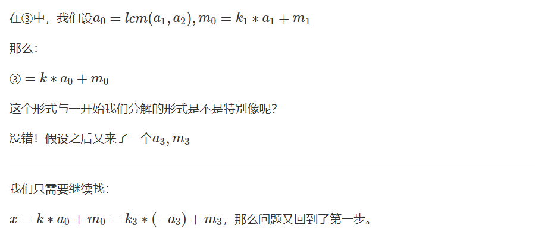
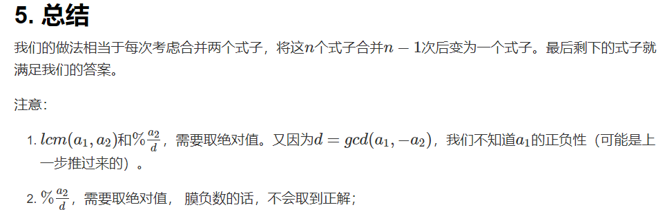

<!-- @import "[TOC]" {cmd="toc" depthFrom=1 depthTo=4 orderedList=false} -->

<!-- code_chunk_output -->

- [欧拉函数](#欧拉函数)
  - [欧拉函数（定义法例题）](#欧拉函数定义法例题)
  - [筛法求欧拉函数](#筛法求欧拉函数)
- [欧拉定理、费马小定理](#欧拉定理-费马小定理)
- [快速幂](#快速幂)
  - [极简写法的快速幂](#极简写法的快速幂)
  - [快速幂求逆元](#快速幂求逆元)
- [扩展欧几里得算法](#扩展欧几里得算法)
  - [裴属定理](#裴属定理)
  - [扩展欧几里得算法例题](#扩展欧几里得算法例题)
  - [线性同余方程](#线性同余方程)
  - [线性同余方程例题](#线性同余方程例题)
- [中国剩余定理（孙子定理）](#中国剩余定理孙子定理)
  - [例题：表达整数的奇怪方式](#例题表达整数的奇怪方式)

<!-- /code_chunk_output -->

### 欧拉函数

$1 \sim N$中与$N$互质的数的个数被称为欧拉函数，记为$\phi(N)$。

若在算数的基本定理中，$N=p_1^{a_1} p_2^{a_2} ... p_m^{a_m}$ ，则有

$$\phi(N) = N \times \frac{p_1 - 1}{p_1} \times \frac{p_2 - 1}{p_2} \times ... \times \frac{p_m - 1}{p_m}$$

其合理性应用了容斥原理：
- 在 $N$ 中，减去所有 $p_1$ 、 $p_2$ ... $p_m$ 的倍数
- 在 $N$ 中，因为有的倍数被上个减法重复减掉了（比如 $p_1$ 、 $p_2$ 的倍数，都是 $p_1 p_2$ 的倍数，因此 $p_1 p_2$ 的倍数就被减了两次），所以加回来，加上 $p_1 p_2$ 、 $p_2 p_3$ ... 的倍数
- ...

所以有：
$$
\begin{aligned}
& & N & - \frac{N}{p_1} - \frac{N}{p_2} - ... - \frac{N}{p_m} \\
& & & + \frac{N}{p_1 p_2} + \frac{N}{p_2 p_3} + ... + \frac{N}{p_{m-1} p_m} \\
& & &  - \frac{N}{p_1 p_2 p_3} - \frac{N}{p_2 p_3 p_4} - ... - \frac{N}{p_{m-2} p_{m-1} p_m} \\
& & &  + \frac{N}{p_1 p_2 p_3 p_4} + \frac{N}{p_2 p_3 p_4 p_5} + ... + \frac{N}{p_{m-3} p_{m-2} p_{m-1} p_m} \\
& & & ...
\end{aligned}
$$

上式把所有质数的倍数都减掉了，也是 $\phi (N)$ 的展开。

#### 欧拉函数（定义法例题）
- 给定 n 个正整数 $a_i$，请你求出每个数的欧拉函数。

输入格式
- 第一行包含整数 n。
- 接下来 n 行，每行包含一个正整数 $a_i$。

输出格式
- 输出共 n 行，每行输出一个正整数 $a_i$ 的欧拉函数。

```cpp
#include <iostream>
#include <cstring>
#include <algorithm>
using namespace std;

int main()
{
    int n;
    scanf("%d", &n);
    
    while (n --)
    {
        int x;
        scanf("%d", &x);
        int res = x;
        for (int i = 2; i <= x / i; i ++)
        {
            if (x % i == 0)
            {
                res = res / i * (i - 1);  // 先除再乘，否则大数越界
                while (x % i == 0) x /= i;
            }
        }
        if (x > 1) res = res / x * (x - 1);  // 先除再乘
        printf("%d\n", res);
    }
    
    return 0;
}
```

**经验：**
- **先除再乘！** 一是，防止大数乘后爆 int
- 二是， `7 * 11 / 2 == 38` ，而 `7 / 2 * 11 == 33` ，这里欧拉函数的数学公式，我们用第二种

#### 筛法求欧拉函数

- 给定一个正整数 n，求 1~n 中每个数的欧拉函数之和。

输入格式
- 共一行，包含一个整数 n。

输出格式
- 共一行，包含一个整数，表示 1~n 中每个数的欧拉函数之和。

```cpp
#include <iostream>
#include <cstring>
#include <algorithm>

using namespace std;

const int N = 1e6 + 10;

typedef long long LL;

int primes[N], cnt;
int eulers[N];
bool st[N];

void get_eulers(int n)
{
    eulers[1] = 1;
    for (int i = 2; i <= n; i ++)
    {
        if (!st[i])
        {
            primes[cnt ++] = i;
            eulers[i] = i - 1;  // 质数
        }
        
        for (int j = 0; primes[j] <= n / i; j ++)
        {
            int t = primes[j] * i;
            st[t] = true;
            if (i % primes[j] == 0)
            {
                eulers[t] = eulers[i] * primes[j];
                break;
            }
            else
            {
                eulers[t] = eulers[i] * (primes[j] - 1);
            }
        }
    }
}

int main()
{
    int n;
    scanf("%d", &n);
    
    get_eulers(n);
    
    LL res = 0;
    for (int i = 1; i <= n; i ++) res += eulers[i];
    printf("%lld", res);  // 注意，输出 long long 用 "%lld" 或者用 cout 更方便
    return 0;
}
```

**经验：**
- 注意，输出 `long long` 用 `"%lld"` 或者用 `cout` 更方便

结合代码，线性筛法思路，来自[番茄酱](https://www.acwing.com/user/myspace/index/6828/)：
- 质数 `i` 的欧拉函数即为 `phi[i] = i - 1` ： $1 \sim i-1$ 均与 $i$ 互质，共 $i-1$ 个。
`phi[primes[j] * i]` 分为两种情况：
  - `i % primes[j] == 0` 时： `primes[j]` 是 `i` 的最小质因子，也是 `primes[j] * i` 的最小质因子，因此`1 - 1 / primes[j]` 这一项在 `phi[i]` 中计算过了，只需将基数 `N` 修正为 `primes[j]` 倍，最终结果为 `phi[i] * primes[j]` 。
  - `i % primes[j] != 0` ： `primes[j]` 不是 `i` 的质因子，只是 `primes[j] * i` 的最小质因子，因此不仅需要将基数 `N` 修正为 `primes[j]` 倍，还需要补上 `1 - 1 / primes[j]` 这一项，因此最终结果 `phi[i] * (primes[j] - 1)` 。

### 欧拉定理、费马小定理
欧拉定理：若 $a$ 与 $n$ 互质，则 $a^{\phi(n)} \equiv 1 (\mod n)$ （$a^{\phi(n)}$ 模 $n$ 为 1） 。

比如，$5$ 与 $6$ 互质，则 $5^{\phi(6)} \mod 6 = 5^2 \mod 6 = 1$ 。

**证明欧拉定理：**

在 $1\sim n$ 中，有 $\phi(n)$ 个与 $n$ 互质的数：$Z_n = \{ a_1, a_2, ... , a_{\phi(n)} \}$ 。

我们将上面的数列乘上 $a$ ，得到新数列 $\{a a_1, a a_2, ... , a a_{\phi(n)} \}$ 。我们现在要证明： $\{a a_1 \mod n, a a_2 \mod n, ... , a a_{\phi(n)} \mod n \}$ 就是数列 $Z_n$ ，这需要应用 $\{a a_1, a a_2, ... , a a_{\phi(n)} \}$ 的两点性质。

> 第一，$i \neq j$ ，则 $aa_i$ 与 $aa_j$ 不模 $n$ 同余。

我们用反证法证明这个：

假若 $aa_i$ 与 $aa_j$ 模 $n$ 同余，那么就有 $a a_i  - a a_j = a(a_i - a_j) = n k$ （$k$是常数倍）。因为 $a$ 与 $n$ 互质，又因为等号成立，只能有 $(a_i - a_j)$ 是 $n$ 的倍数，而 $a_i$ 和 $a_j$ 分别是与 $n$ 互质的，且模 $n$ 不同余，因此矛盾了（$(a_i - a_j)$ 不可能是 $n$ 的倍数）。

这说明了 $\phi(n)$ 个 $\{ a a_i \mod n \}$ 都是**唯一的元素**。

> 第二，$a a_i$ 与 $n$ 互质。

因为 $a$ 与 $n$ 互质， $a_i$ 与 $n$ 互质，所以 $a a_i$ 与 $n$ 互质。所以，$a a_i \mod n \in \{a_1, a_2, ... , a_{\phi(n)} \}$ 。又因为 $a a_i \mod n$ 一共有 $\phi(n)$ 个，且每个都是唯一的，而 $Z_n$ 也有$\phi(n)$ 个元素 ，因此 $\{a a_1 \mod n, a a_2 \mod n, ... , a a_{\phi(n)} \mod n \}$ 就是数列 $Z_n$ 。

这里详细讨论一下，为什么 $a a_i \mod n \in \{a_1, a_2, ... , a_{\phi(n)} \}$ 。

因为 $a a_i \mod n$ 一定是小于 $n$ 的，且与 $n$ 互质。

小于 $n$ 很好理解，毕竟取了 $n$ 的模；但是，为什么 $A$ 与 $B$ 互质，那么 $A \mod B$ 就与 $B$ 互质呢？如下。

记 $C = A \mod B$ ，则 $A + C = B k$ ， $C$ 一定与 $B$ 互质，否则 $C = B h$ ，$A = B(k - h)$ ， $k - h$ 为整数倍，这与 $A$ $B$ 互质的假设矛盾。

（从这里开始，不太严谨，未来可参考：[浅谈欧拉定理的证明](https://www.cnblogs.com/wangxiaodai/articles/9758242.html)）

至此，证明了 $\{a a_1 \mod n, a a_2 \mod n, ... , a a_{\phi(n)} \mod n \}$ 就是数列 $Z_n$ 。

我们把数列累乘，则有 $a^{\phi(n)} a_1 a_2 ... a_{\phi(n)} \equiv a_1 a_2 ... a_{\phi(n)} (\mod n)$ （二者模 $n$ 同余）；约掉两边 $a^{\phi(n)} \equiv 1 (\mod n)$ 。

证毕。

> 当 $n$ 为质数 $p$ 时，就有 $a^{\phi(p)} = a^{p-1} \equiv 1 (\mod p)$ 。这就是费马小定理。

### 快速幂

我们求 $a^k \mod p (1 \le a, p, k \le 10^9)$ 时，暴力做法为：
```cpp
LL res = 1;
for (int i = 1; i <= k; i ++)
    res = res * a % p;
```

时间复杂度为 $O(k)$ 。

我们使用快速幂将其降低到 $O(\log k)$ 。

**快速幂原理：**

对于 $a^k \mod p$ ，我们首先进行 $\log{k} + 1$ 次计算：
$$a^{2^0} \mod p = a^1 \mod p$$
$$a^{2^1} \mod p = a^{2^0 \cdot 2} \mod p$$
$$a^{2^2} \mod p = a^{2^1 \cdot 2} \mod p$$
$$ ... $$
$$a^{2^{\log{k}}} \mod p = (a^{2^{\log{k} - 1}})^2 \mod p$$

上面这些数$a^{...}$也有规律，**每个数都是上面一个数的平方** 。

对于任何一个 $a^k$ ，我们都可以化为：
$$a^k = a^{2^{x_1}} \cdot a^{2^{x_2}} \cdot ... \cdot a^{2^{x_t}} = a^{2^{x_1} + 2^{x_2} + ... + 2^{x_t}}$$

即，把 $k$ 化为二进制表示： $k = 2^{x_1} + 2^{x_2} + ... + 2^{x_t}$ 。

如此，便可以利用之前计算的 $a^{2^{\log{k}}} \mod p$ 这些值了。

#### 极简写法的快速幂

- 给定 $n$ 组 $a_i,b_i,p_i$，对于每组数据，求出 $a_i^{b_i} \mod p_i$ 的值。

输入格式
- 第一行包含整数 $n$。
- 接下来 n 行，每行包含三个整数 $a_i,b_i,p_i$。

输出格式
- 对于每组数据，输出一个结果，表示 abiimodpi 的值。
- 每个结果占一行。

```cpp
#include <iostream>
#include <cstring>
#include <algorithm>
using namespace std;

const int N = 1e5 + 10;
typedef long long LL;

int n;
int a, b, p;

LL qmi(int a, int b, int p)
{
    LL res = 1 % p;
    while (b)
    {
        if (b & 1) res = res * a % p;
        a = a * (LL) a % p;
        b >>= 1;
    }
    return res;
}

int main()
{
    scanf("%d", &n);
    
    while (n --)
    {
        scanf("%d%d%d", &a, &b, &p);
        printf("%lld\n", qmi(a, b, p));
    }

    return 0;
}
```

**经验：**
- 一种很好地提取二进制最低位地方法：`while(b) ... b&1 ... b >>=1; `

#### 快速幂求逆元

- 给定 n 组 $a_i,p_i$，其中 $p_i$ 是质数，求 $a_i$ 模 $p_i$ 的乘法逆元，若逆元不存在则输出 `impossible`。
- 注意：请返回在 $0\sim p-1$ 之间的逆元。

> 乘法逆元的定义：若整数 b，m 互质，并且对于任意的整数 a，如果满足 b|a （$a / b$ 是整数），则存在一个整数 x，使得 $a/b \equiv a \times x (\mod m)$，则称 x 为 b 的模 m 乘法逆元，记为 $b^{-1}(\mod m)$。b 存在乘法逆元的充要条件是 b 与模数 m 互质。当模数 m 为质数时，$b^{m-2}$ 即为 b 的乘法逆元。

输入格式
- 第一行包含整数 n。
- 接下来 n 行，每行包含一个数组 $a_i,p_i$，数据保证 $p_i$ 是质数。

输出格式
- 输出共 n 行，每组数据输出一个结果，每个结果占一行。
- 若 $a_i$ 模 $p_i$ 的乘法逆元存在，则输出一个整数，表示逆元，否则输出 `impossible`。

**分析：**
- 如何求 $a$ 模 $p$ 的乘法逆元？其实就是在 $a \cdot x \equiv 1 (\mod p)$ 中，找符合这是式子的 $x$ 。
- 因为题目中声明了 $p$ 为质数，因此应用费马小定理 $a^{p-1} \equiv 1 (\mod p)$ ，我们有 $a \cdot a^{p-2} \equiv 1 (\mod p)$，求 $a^{p-2}$ 即是 $a$ 模 $p$ 的乘法逆元。
- 所以本题就是费马小定理+快速幂
- 由于 $p$ 是质数，因此只有当 $a$ 是 $p$ 的倍数时，二者不是互质，此时无解

```cpp
#include <iostream>
#include <cstring>
#include <algorithm>
using namespace std;

const int N = 1e5 + 10;
typedef long long LL;

int n;
int a, p;

LL qmi(int a, int b, int p)
{
    LL res = 1 % p;
    while (b)
    {
        if (b & 1) res = res * a % p;
        a = a * (LL) a % p;
        b >>= 1;
    }
    return res;
}

int main()
{
    scanf("%d", &n);
    
    while (n --)
    {
        scanf("%d%d", &a, &p);
        if (a % p == 0) puts("impossible");
        else printf("%lld\n", qmi(a, p-2, p));
    }

    return 0;
}
```

### 扩展欧几里得算法

#### 裴属定理

[百度百科](https://baike.baidu.com/item/%E8%A3%B4%E8%9C%80%E5%AE%9A%E7%90%86/5186593?fr=aladdin)：
- 在数论中，裴蜀定理是一个关于最大公约数（或最大公约式）的定理，裴蜀定理得名于法国数学家艾蒂安・裴蜀。
- 裴蜀定理说明了对任何整数 a、b 和它们的最大公约数 d ，关于未知数 x 以及 y 的线性的丢番图方程（称为裴蜀等式）。

即：若a,b是整数，且$gcd(a,b)=d$，那么对于任意的整数$x,y$，$ax+by$都一定是$d$的倍数，特别地，一定存在整数$x,y$，使$ax+by=d$成立。

证明中，使用构造方法，构造$ax+by=d$，使用了欧几里得算法。

#### 扩展欧几里得算法例题

- 给定 n 对正整数 $a_i,b_i$，对于每对数，求出一组 $x_i,y_i$，使其满足 $a_i\times x_i+b_i\times y_i=gcd(a_i,b_i)$。

输入格式
- 第一行包含整数 n。
- 接下来 n 行，每行包含两个整数 $a_i,b_i$。

输出格式
- 输出共 n 行，对于每组 $a_i,b_i$，求出一组满足条件的 $x_i,y_i$，每组结果占一行。
- 本题答案不唯一，输出任意满足条件的 $x_i,y_i$ 均可。

**分析：** （参考了[zeroAC](https://www.acwing.com/solution/content/1393/)）

用于求解方程 $ax + by = \gcd(a,b)$ 的解

当 $b=0$ 时， $ax + by = a$ 故而 $x=1, y=0$

当 $b\neq 0$ 时，

因为

$$\gcd(a,b) = \gcd (b, a\%b)$$

而

$$bx' + (a\% b)y' = \gcd(b, a \% b)$$

$$b x' + (a - \lfloor a / b \rfloor \times b) y' = \gcd(b, a\% b)$$

$$ay' + b (x' - \lfloor a / b \rfloor \times y) = \gcd(b,a\% b) = \gcd (a,b)$$

故而

$$x=y', y=x' - \lfloor a / b \rfloor \times y'$$

因此，可以采用递归，求出下一层的 $x', y'$ 再带回本层公式即可。

```cpp
#include <iostream>
#include <cstring>
#include <algorithm>

using namespace std;

int exgcd(int a, int b, int &x, int &y)
{
    if (!b)
    {
        x = 1, y = 0;
        return a;
    }

    int d = exgcd(b, a % b, y, x);
    y -= a / b * x;
    return d;
    /*
    上面的代码不好理解，可以写为
    int x1, y1;
    int d = exgcd(b, a % b, x1, y1);
    x = y1, y = x1 - a / b * y1;
    return d;
    */
}

int main()
{
    int n ;
    scanf("%d", &n);
    
    while (n -- )
    {
        int a, b, x, y;
        scanf("%d%d", &a, &b);
        exgcd(a, b, x, y);
        printf("%d %d\n", x, y);
    }
    return 0;
}
```

#### 线性同余方程

**先导知识：** （参考了[zeroAC](https://www.acwing.com/solution/content/1393/)）

##### 对于更一般的方程$ax + by = c$

设 $d = \gcd(a,b)$ 则其有解当且仅当 $d | c$

求解方法如下：

用欧几里得求出 $ax_0 + by_0 = d$ 的解

则 $a(x_0 \times c / d) + b (y_0 \times c /d) = c$

故而特解为 $x' = x_0 \times c / d, y' = y_0 \times c / d$

而 **通解 = 特解 + 齐次解**

而齐次解即为方程 $ax + by = 0$ 的解

故而通解为 $x = x' + k \times b / d, y = y' - k \times a / d, k \in \mathbb{Z}$

##### 应用：求一次同余方程$ax\equiv b (\mod m)$

则等价于求

$$ax = m \times (-y) + b$$

$$ax + my = b$$

有解条件为 $\gcd(a,m) | b$ ，然后用扩展欧几里得求解即可。

特别地，当 $b = 1$ 且 $a$ 与 $m$ 互质时， $x$ 即为 $a$ 的逆元。

#### 线性同余方程例题

- 给定 n 组数据 $a_i,b_i,m_i$，对于每组数求出一个 $x_i$，使其满足 $a_i \times x_i \equiv b_i(\mod m_i)$，如果无解则输出 `impossible`。

输入格式
- 第一行包含整数 n。
- 接下来 n 行，每行包含一组数据 $a_i,b_i,m_i$。

输出格式
- 输出共 n 行，每组数据输出一个整数表示一个满足条件的 $x_i$，如果无解则输出 `impossible`。
- 每组数据结果占一行，结果可能不唯一，输出任意一个满足条件的结果均可。
- 输出答案必须在 `int` 范围之内。

```cpp
#include <iostream>
#include <cstring>
#include <algorithm>

using namespace std;

typedef long long LL;

int exgcd(int a, int b, int &x, int &y)
{
    if (!b)
    {
        x = 1, y = 0;
        return a;
    }

    int d = exgcd(b, a % b, y, x);
    y -= a / b * x;
    return d;
}

int main()
{
    int n ;
    scanf("%d", &n);
    
    while (n -- )
    {
        int a, b, m, x, y;
        scanf("%d%d%d", &a, &b, &m);
        int d = exgcd(a, m, x, y);
        if (b % d == 0) printf("%d\n", (LL) b / d * x % m);  // LL 防止 b / d * x 爆 int
        // x 扩大 b / d 倍再 % m 是为了让 x 尽可能地小
        else puts("impossible");
    }
    return 0;
}
```

### 中国剩余定理（孙子定理）

$m_1 , m_2 , ... , m_k$ 两两互质，求 $x$ 使得：

$$x \equiv a_1 (\mod m_1)$$
$$x \equiv a_2 (\mod m_2)$$
$$ ... $$
$$x \equiv a_k (\mod m_k)$$

我们记：

$$M = m_1 m_2 ... m_k$$

$$M_i = M / m_i$$

$ M_i^{-1} $ 为 $M_i$ 模 $m_i$ 的逆

因此

$$x = a_1 M_1 M_1^{-1} + a_2 M_2 M_2^{-1} + ... + a_k M_k M_k^{-1}$$

#### 例题：表达整数的奇怪方式

- 给定 2n 个整数 $a_1,a_2,…,a_n$ 和 $m_1,m_2,…,m_n$，求一个最小的非负整数 x，满足 $\forall i \in [1,n],x \equiv m_i(\mod a_i)$。

输入格式
- 第 1 行包含整数 n。
- 第 2…n+1 行：每 i+1 行包含两个整数 $a_i$ 和 $m_i$，数之间用空格隔开。

输出格式
- 输出最小非负整数 x，如果 x 不存在，则输出 ?1。
- 如果存在 x，则数据保证 x 一定在 64 位整数范围内。

**分析：**
- 题目中没有任何限制，然而，中国剩余定理要求 $m_i$ 两两互质
- 我们只好推导一下

##### 本题的推导

参考[墨染空](https://www.acwing.com/solution/content/3539/)：










```cpp
#include <iostream>
#include <cstring>
#include <algorithm>

using namespace std;

typedef long long LL;

LL exgcd(LL a, LL b, LL &x, LL &y)
{
    if (!b)
    {
        x = 1, y = 0;
        return a;
    }

    LL d = exgcd(b, a % b, y, x);
    y -= a / b * x;
    return d;
}

int main()
{
    int n ;
    scanf("%d", &n);
    
    LL x = 0, a1, m1;
    scanf("%lld%lld", &a1, &m1);  // 注意 "%lld"
    for (int i = 0; i < n - 1; i ++)
    {
        LL a2, m2;
        scanf("%lld%lld", &a2, &m2);

        LL k1, k2;
        LL d = exgcd(a1, a2, k1, k2);
        if ((m2 - m1) % d)
        {
            x = -1;
            break;
        }
        
        k1 *= (m2 - m1) / d;
        k1 = (k1 % (a2/d) + a2/d) % (a2 / d);
        
        x = k1 * a1 + m1;
        
        LL a = abs(a1 / d * a2);
        m1 = k1 * a1 + m1;
        a1 = a;
    }

    if (x != -1) x = (m1 % a1 + a1) % a1;  // 为了应对负数取模
    
    printf("%lld", x);

    return 0;
}
```

**经验：**
- C++ 里对负数 `x` 取 `a` 的模 `x = (x % a + a) % a`
