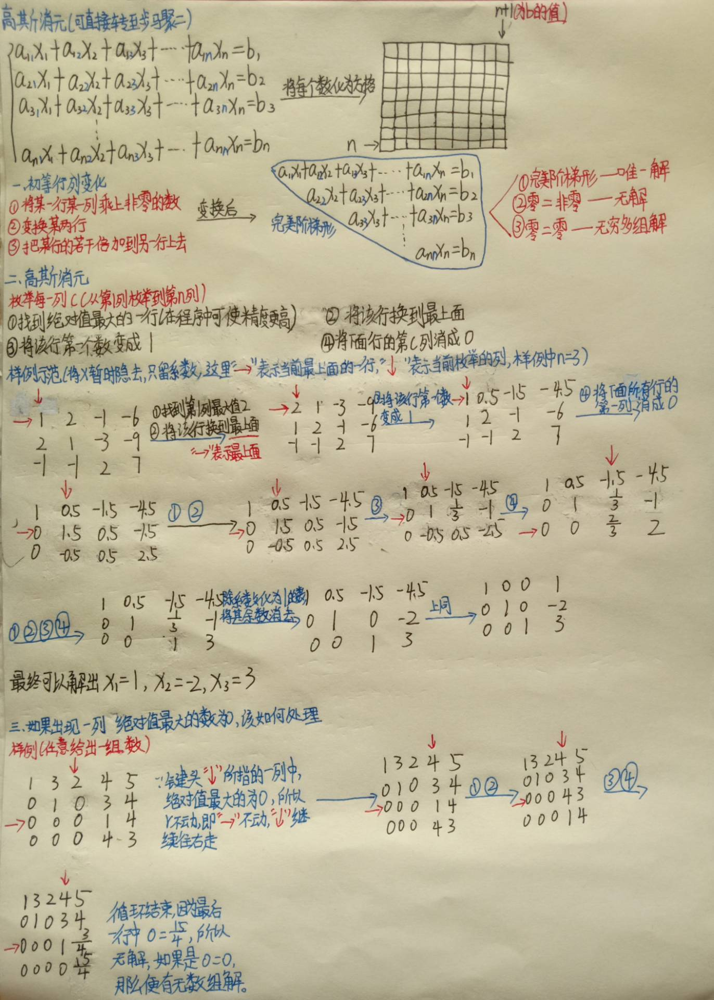
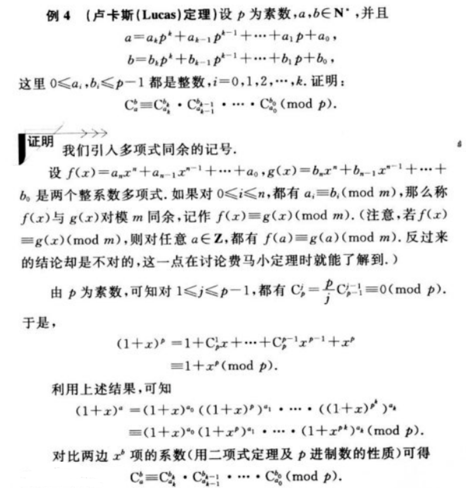
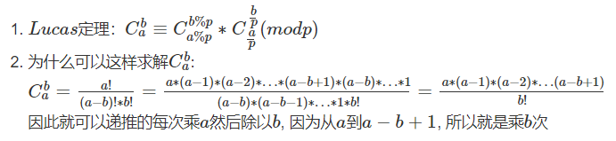
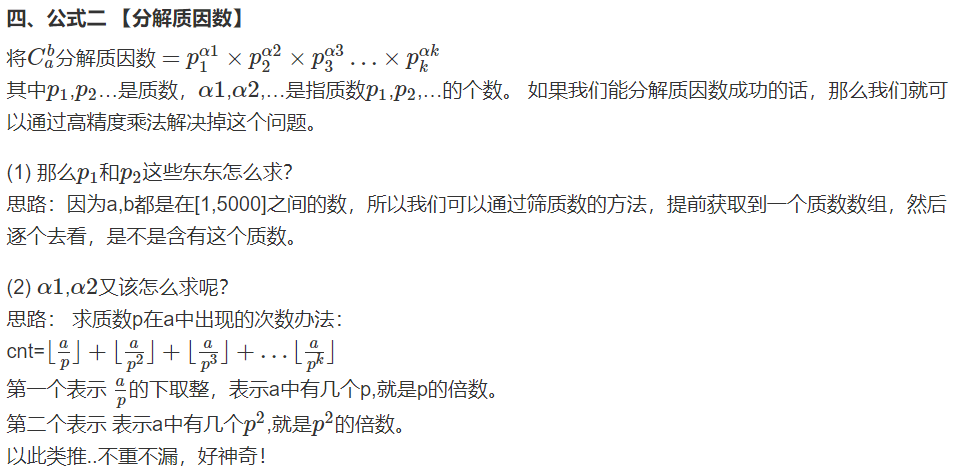
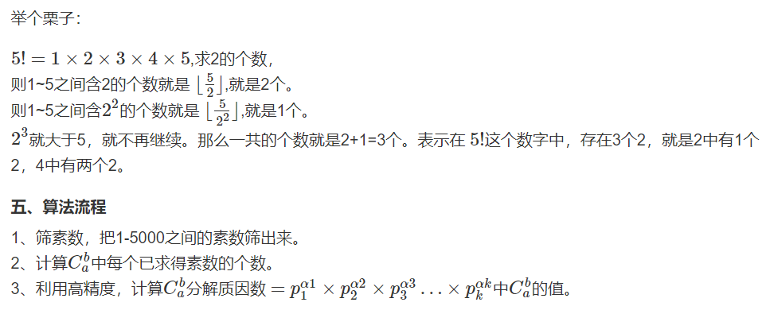
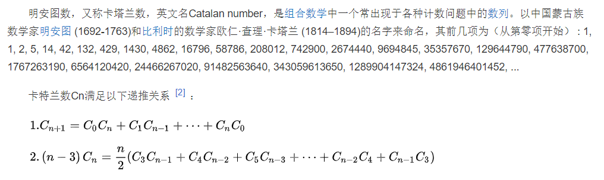
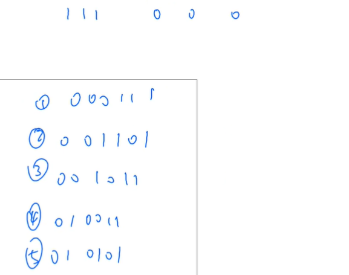

<!-- @import "[TOC]" {cmd="toc" depthFrom=1 depthTo=4 orderedList=false} -->

<!-- code_chunk_output -->

- [高斯消元](#高斯消元)
  - [高斯消元解线性方程组](#高斯消元解线性方程组)
  - [高斯消元解异或线性方程组](#高斯消元解异或线性方程组)
- [求组合数](#求组合数)
  - [组合数递推式（以及例题）](#组合数递推式以及例题)
  - [组合数与逆元、快速幂（以及例题）](#组合数与逆元-快速幂以及例题)
  - [组合数与卢卡斯定理（以及例题）](#组合数与卢卡斯定理以及例题)
  - [组合数与高精度（不模）](#组合数与高精度不模)
- [组合计数、卡特兰数](#组合计数-卡特兰数)
  - [例题：满足条件的01序列](#例题满足条件的01序列)

<!-- /code_chunk_output -->

### 高斯消元

其实，就是求解多元一次方程组。线性代数中初等变换。

来自 [灰之魔女](https://www.acwing.com/solution/content/22897/) 的笔记，很认真，大赞：



而程序实现也十分直观，就是把算法一步步复现出来。

#### 高斯消元解线性方程组

- 输入一个包含 n 个方程 n 个未知数的线性方程组。
- 方程组中的系数为实数。
- 求解这个方程组。
- 下图为一个包含 m 个方程 n 个未知数的线性方程组示例：


输入格式
- 第一行包含整数 n。
- 接下来 n 行，每行包含 n+1 个实数，表示一个方程的 n 个系数以及等号右侧的常数。

输出格式
- 如果给定线性方程组存在唯一解，则输出共 n 行，其中第 i 行输出第 i 个未知数的解，结果保留两位小数。
- 如果给定线性方程组存在无数解，则输出 `Infinite group solutions`。
- 如果给定线性方程组无解，则输出 `No solution`。

```cpp
#include <iostream>
#include <cstring>
#include <algorithm>
#include <cmath>  // fabs 在 cmath 里

using namespace std;

double a[110][110];
int n;

double eps = 1e-6 ;

void out()  // 用来 debug
{
    for (int i = 0; i < n; i ++ )
    {
        for (int j = 0; j <= n; j ++ ) printf("%10.2lf ", a[i][j]);
        puts("");
    }
    puts("");
}

int gauss()
{
    int c, r;
    // out();
    for (c = 0, r = 0; c < n; c ++)
    {
        // 找到剩余行种，系数绝对值最大的行
        int t = r;
        for (int i = r; i < n; i ++)
            if (fabs(a[i][c]) > fabs(a[t][c]))
                t = i;
        
        // 找不到系数绝对值大于 0 的，说明本列剩余行系数都为 0
        if (fabs(a[t][c]) < eps) continue;  // 于是跳到下一列

        // 把系数绝对值最大的行挪到上面（r行）
        for (int i = c; i < n + 1; i ++) swap(a[t][i], a[r][i]);
        
        // 把当前行首位变成 1
        for (int i = n; i >= c; i --) a[r][i] /= a[r][c];  // 技巧：从后向前更新，用到了首位的值，所以最后更新首位
        
        // 把当前行下面的所有 c 列消成 0
        for (int i = r + 1; i < n; i ++)
            if (fabs(a[i][c]) > eps)
                for (int j = n; j >= c; j --)  // 因为要用到 a[i][c] ，所以倒着更新
                    a[i][j] -= a[r][j] * a[i][c];
        // out();
        r ++;
    }
    
    if (r < n)
    {
        for (int i = r; i < n; i ++)
            if (fabs(a[i][n]) > eps)
                return 2;  // 有 0 = 非0 ，则无解
        return 1;  // 否则是矩阵不满秩，无穷多解
    }
    
    // 把非对角线上的数字清 0 ，这里结果仅仅反映在等号右边
    for (int i = n - 1; i >= 0; i --) // 本行 i
        for (int j = i + 1; j < n; j ++)  // 列 j ，对应行 j
            a[i][n] -= a[j][n] * a[i][j];

    return 0;
}

int main()
{
    scanf("%d", &n);
    for (int i = 0; i < n; i ++ )
        for (int j = 0; j < n + 1; j ++ )
            scanf("%lf", &a[i][j]);
    
    int t = gauss();
    
    if (t == 1) puts("Infinite group solutions");
    else if (t == 2) puts("No solution");
    else for (int i = 0; i < n; i ++) printf("%.2lf\n", a[i][n]);

    return 0;
}
```

#### 高斯消元解异或线性方程组

- 输入一个包含 n 个方程 n 个未知数的异或线性方程组。
- 方程组中的系数和常数为 0 或 1，每个未知数的取值也为 0 或 1。
- 求解这个方程组。
- 异或线性方程组示例如下：

```
M[1][1]x[1] ^ M[1][2]x[2] ^ … ^ M[1][n]x[n] = B[1]
M[2][1]x[1] ^ M[2][2]x[2] ^ … ^ M[2][n]x[n] = B[2]
…
M[n][1]x[1] ^ M[n][2]x[2] ^ … ^ M[n][n]x[n] = B[n]
```

- 其中 `^` 表示异或(XOR)，`M[i][j]` 表示第 i 个式子中 `x[j]` 的系数，`B[i]` 是第 `i` 个方程右端的常数，取值均为 0 或 1。

输入格式
- 第一行包含整数 n。
- 接下来 n 行，每行包含 n+1 个整数 0 或 1，表示一个方程的 n 个系数以及等号右侧的常数。

输出格式
- 如果给定线性方程组存在唯一解，则输出共 n 行，其中第 i 行输出第 i 个未知数的解。
- 如果给定线性方程组存在多组解，则输出 `Multiple sets of solutions`。
- 如果给定线性方程组无解，则输出 `No solution`。

**分析：**
- 异或就是不进位的加法
- 所以我们依然可以用高斯消元的框架来做

```cpp
#include <iostream>
#include <cstring>
#include <algorithm>

using namespace std;

const int N = 110;

int a[N][N];
int n;

int gauss()
{
    int r, c;
    for (r = 0, c = 0; c < n; c ++)
    {
        // 选择本列系数最大的行（选择为1的行）
        int t = r;
        for (int i = r; i < n; i ++)
            if (a[i][c])  // 是 1 不是 0
            {
                t = i;
                break;
            }
        
        if (!a[t][c])  // 如果还是 0 （本列没有 1 了）
            continue;
        
        // 交换行
        for (int i = c; i < n + 1; i ++) swap(a[r][i], a[t][i]);
        
        // 第一个系数化为 1
        // 不需要，因为一定为 1
        
        // 把 r 行以下的行 c 列都化为 0
        for (int i = r + 1; i < n; i ++)
            if (a[i][c])
                for (int j = c; j <= n; j ++)
                    a[i][j] ^= a[r][j];
        
        r ++;
    }
    
    // 检测
    if (r < n)
    {
        for (int i = r; i < n; i ++)
            if (a[i][n]) return 2;
        return 1;
    }
    
    // 把三角矩阵化为对角矩阵，这里只改变最后一列的值
    for (int i = n - 1; i >= 0; i --)
        for (int j = i + 1; j < n; j ++)
            a[i][n] ^= a[i][j] * a[j][n];
    
    return 0;
}

int main()
{
    scanf("%d", &n);
    for (int i = 0; i < n; i ++ )
        for (int j = 0; j < n + 1; j ++ )
            scanf("%d", &a[i][j]);
    
    int t = gauss();
    
    if (t == 1) puts("Multiple sets of solutions");
    else if (t == 2) puts("No solution");
    else for (int i = 0; i < n; i ++) printf("%d\n", a[i][n]);

    return 0;
}
```

### 求组合数

$$A_a^b = \frac{a!}{(a-b)!}$$

$$C_a^b = \frac{A_a^b}{A_b^b} = \frac{a!}{b! (a-b)!}$$

#### 组合数递推式（以及例题）

$$C_a^b = C_{a-1}^{b-1} + C_{a-1}^{b}$$

如何理解？
- 在 a 中抽 b 个东西，可分为两种情况
- 第一种是抽到物品 X ，一共有 $C_{a-1}^{b-1}$ 种抽法（在剩下的 a-1 个里抽 b-1 个）
- 第一种是没抽到物品 X ，一共有 $C_{a-1}^{b}$ 种抽法（在剩下的 a-1 个里抽 b 个）

##### 组合数递推式例题

- 给定 n 组询问，每组询问给定两个整数 a，b，请你输出 $C_a^b \mod (10^9 +7)$ 的值。

输入格式
- 第一行包含整数 n。
- 接下来 n 行，每行包含一组 a 和 b。

输出格式
- 共 n 行，每行输出一个询问的解。

```cpp
#include <iostream>
#include <cstring>
#include <algorithm>

using namespace std;

const int N = 2e3 + 10, mod = 1e9 + 7;

int c[N][N];

void init()
{
    for (int i = 0; i < N; i ++ )
        for (int j = 0; j <= i; j ++ )
            {
                if (!j) c[i][j] = 1;
                else c[i][j] = (c[i - 1][j - 1] + c[i - 1][j]) % mod;
            }
}

int main()
{
    int n;
    scanf("%d", &n);
    
    init();
    
    while (n -- )
    {
        int a, b;
        scanf("%d%d", &a, &b);
        printf("%d\n", c[a][b]);
    }

    return 0;
}
```

本题的数据范围：10万组数据，$1 \le b \le a \le 2000$，这种方法时间复杂度 $O(N^2)$

#### 组合数与逆元、快速幂（以及例题）

注意这里被模的数是质数才能用逆元。

记 `a!` 为 `fact(a)`，而 `infact(a)` 为 `a!` 模某个质数 `M` 的乘法逆元。

因此，对于 $C_a^b$ ，我们有：

$$C_a^b \equiv \frac{a!}{b! (a-b)!} \equiv \text{fact}(a) \cdot \text{infact}(b) \cdot \text{infact}(a-b) \mod M$$

##### 组合数与逆元、快速幂例题

- 给定 n 组询问，每组询问给定两个整数 a，b，请你输出 $C_a^b \mod (10^9 +7)$ 的值。

输入格式
- 第一行包含整数 n。
- 接下来 n 行，每行包含一组 a 和 b。

输出格式
- 共 n 行，每行输出一个询问的解。

**分析：**
- 注意能用快速幂+逆元的前提是 `1e9 + 7` 是质数

```cpp
#include <iostream>
#include <cstring>
#include <algorithm>

using namespace std;
typedef long long LL;

const int N = 1e5 + 10, mod = 1e9 + 7;

int fact[N], infact[N];  // 阶乘与阶乘的逆元

LL qmi(int a, int k, int p)  // 求a^k mod p
{
    int res = 1 % p;
    while (k)
    {
        if (k & 1) res = (LL)res * a % p;
        a = (LL)a * a % p;
        k >>= 1;
    }
    return res;
}


int main()
{
    int n ;
    scanf("%d", &n);
    
    fact[0] = infact[0] = 1;
    for (int i = 1; i < N; i ++ )
    {
        fact[i] = (LL) fact[i - 1] * i % mod;
        infact[i] = (LL) infact[i - 1] * qmi(i, mod - 2, mod) % mod;
    }
    
    while (n -- )
    {
        int a, b;
        scanf("%d%d", &a, &b);
        
        printf("%d\n", (LL) fact[a] * infact[b] % mod * infact[a - b] % mod);
    }

    return 0;
}
```

本题的数据范围：1万组数据，$1 \le b \le a \le 10^5$，这种方法时间复杂度 $O(N \log N)$


#### 组合数与卢卡斯定理（以及例题）

来自[Struggle](https://www.acwing.com/solution/content/22147/)：



来自[嘤嘤嘤0](https://www.acwing.com/solution/content/5244/)：



时间复杂度为：$p \log_p{N} \log{N}$

我们应对 $1 \le b \le a \le 10^18$ ，使用卢卡斯定理：

$$C_a^b \equiv C_{a\%p}^{b\% p} \times C_{a / p}^{b / p} (\mod p)$$

##### 组合数与卢卡斯定理例题

- 给定 n 组询问，每组询问给定三个整数 a,b,p，其中 p 是质数，请你输出 $C_a^b \mod p$ 的值。

输入格式
- 第一行包含整数 n。
- 接下来 n 行，每行包含一组 a 和 b。

输出格式
- 共 n 行，每行输出一个询问的解。

```cpp
#include <iostream>
#include <cstring>
#include <algorithm>

using namespace std;

typedef long long LL;

int qmi(int a, int k, int p)
{
    int res = 1;
    while (k)
    {
        if (k & 1) res = (LL) res * a % p;
        a = (LL) a * a % p;
        k >>= 1;
    }
    return res;
}

int C(int a, int b, int p)
{
    if (b > a) return 0;
    
    int res = 1;
    for (int i = 1, j = a; i <= b; i ++, j --)
    {
        res = (LL) res * j % p;
        res = (LL) res * qmi(i, p - 2, p) % p;
    }
    
    return res;
}

int lucas(LL a, LL b, int p)
{
    if (a < p && b < p) return C(a, b, p);
    return (LL) C(a % p, b % p, p) * lucas(a / p, b / p, p) % p;
}

int main()
{
    int n;
    cin >> n;
    
    while (n --)
    {
        LL a, b;
        int p;
        cin >> a >> b >> p;
        cout << lucas(a, b, p) << endl;
    }

    return 0;
}
```

本题的数据范围：20组数据，$1 \le b \le a \le 10^18$，$1\ \le p \le 10^5$，这种方法时间复杂度 $p \log_p{N} \log{N}$

#### 组合数与高精度（不模）

来自[糖豆](https://www.acwing.com/solution/content/38244/)：





##### 组合数与高精度例题

- 输入 a,b，求 $C_b^a$ 的值。
- 注意结果可能很大，需要使用高精度计算。

输入格式
- 共一行，包含两个整数 a 和 b。

输出格式
- 共一行，输出 $C_b^a$ 的值。

数据范围
- $1≤b≤a≤5000$

```cpp
#include <iostream>
#include <cstring>
#include <algorithm>
#include <vector>

using namespace std;

const int N = 5e3 + 10;

int primes[N], cnt;
bool st[N];
int sum[N];

void get_primes(int a)
{
    for (int i = 2; i <= a; i ++)
    {
        if (!st[i]) primes[cnt ++] = i;
        for (int j = 0; primes[j] <= a / i; j ++)
        {
            st[primes[j] * i] = true;
            if (i % primes[j] == 0) break;
        }
    }
}

int get(int n, int p)
{
    int res = 0;
    while (n)
    {
        res += n / p;
        n /= p;
    }
    return res;
}

vector<int> mul(vector<int> a, int b)
{
    vector<int> c;
    int t = 0;
    for (int i = 0; i < a.size(); i ++)
    {
        t += a[i] * b;
        c.push_back(t % 10);
        t /= 10;
    }
    while (t)
    {
        c.push_back(t % 10);
        t /= 10;
    }
    return c;
}

int main()
{
    int a, b;
    cin >> a >> b;

    get_primes(a);
    
    for (int i = 0; i < cnt; i ++)
    {
        int p = primes[i];
        sum[i] = get(a, p) - get(a - b, p) - get(b, p);
        // a 的阶乘里面的个数 - (a-b)阶乘里面的个数 - (b) 的阶乘里面的个数
    }

    vector<int> res;
    res.push_back(1);
    
    for (int i = 0; i < cnt; i ++)
        for (int j = 0; j < sum[i]; j ++)
            res = mul(res, primes[i]);
    
    for (int i = res.size() - 1; i >= 0; i --) printf("%d", res[i]);
    puts("");
    
    return 0;
}
```

### 组合计数、卡特兰数

来自[百度百科](https://baike.baidu.com/item/%E5%8D%A1%E7%89%B9%E5%85%B0%E6%95%B0/6125746)：



应用时，更多的是：

$$C_{2n}^n - C_{2n}^{n-1} = \frac{C_{2n}^n}{n+1}$$

#### 例题：满足条件的01序列

- 给定 n 个 0 和 n 个 1，它们将按照某种顺序排成长度为 2n 的序列，求它们能排列成的所有序列中，能够满足任意前缀序列中 0 的个数都不少于 1 的个数的序列有多少个。
- 输出的答案对 $10^9+7$ 取模。

输入格式
- 共一行，包含整数 n。

输出格式
- 共一行，包含一个整数，表示答案。

数据范围
- $1≤n≤10^5$

**分析：**

对于例子 `n=3` 满足要求的只有以下几种序列：



来自[番茄酱](https://www.acwing.com/solution/content/8907/)：

将 01 序列置于坐标系中，起点定于原点。若 0 表示向右走，1 表示向上走，那么任何前缀中 0 的个数不少于 1 的个数就转化为，路径上的任意一点，横坐标大于等于纵坐标。题目所求即为这样的合法路径数量。

下图中，表示从 (0,0) 走到 (n,n) 的路径，在绿线及以下表示合法，若触碰红线即不合法。


由图可知，任何一条不合法的路径（如黑色路径），都对应一条从 (0,0) 走到 (n−1,n+1) 的一条路径（如灰色路径）。而任何一条 (0,0) 走到 (n−1,n+1) 的路径，也对应了一条从 (0,0) 走到 (n,n) 的不合法路径。

答案如图，即卡特兰数。

```cpp
#include <iostream>
#include <cstring>
#include <algorithm>

using namespace std;

typedef long long LL;

const int mod = 1e9 + 7;

int qmi(int a, int k, int p)
{
    int res = 1;
    while (k)
    {
        if (k&1) res = (LL) res * a % mod;
        a = (LL) a * a % mod;
        k >>= 1;
    }
    return res;
}

int main()
{
    int n;
    scanf("%d", &n);
    
    int a = n * 2, b = n;
    
    int res = 1;
    for (int i = a; i > a - b; i --) res = (LL) res * i % mod;
    
    for (int i = 1; i <= b; i ++) res = (LL) res * qmi(i, mod - 2, mod) % mod;
    
    res = (LL) res * qmi(n + 1, mod - 2, mod) % mod;
    
    printf("%d", res);
    
    return 0;
}
```
