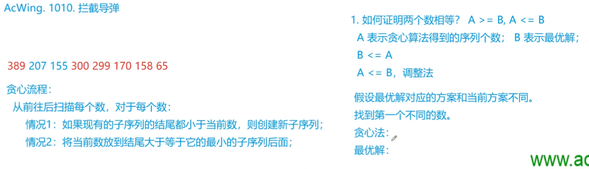
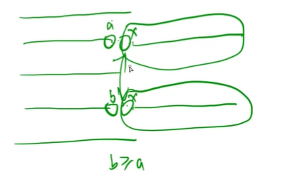
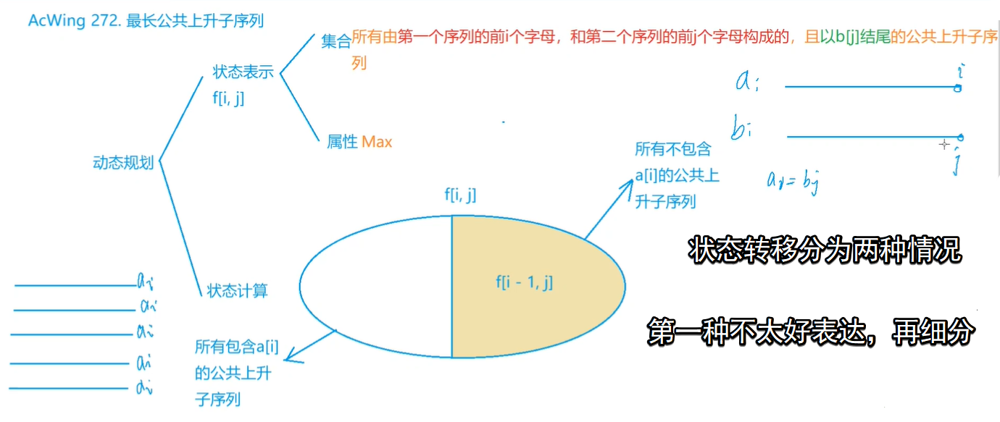
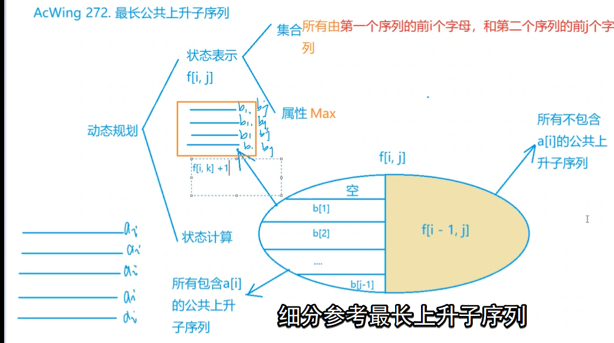

<!-- @import "[TOC]" {cmd="toc" depthFrom=1 depthTo=6 orderedList=false} -->

<!-- code_chunk_output -->

- [最长上升子序列模型](#最长上升子序列模型)
  - [拦截导弹](#拦截导弹)
  - [导弹防御系统](#导弹防御系统)
  - [最长公共上升子序列](#最长公共上升子序列)

<!-- /code_chunk_output -->

### 最长上升子序列模型

#### 拦截导弹

某国为了防御敌国的导弹袭击，发展出一种导弹拦截系统。

但是这种导弹拦截系统有一个缺陷：虽然它的第一发炮弹能够到达任意的高度，但是以后每一发炮弹都不能高于前一发的高度。

某天，雷达捕捉到敌国的导弹来袭。

由于该系统还在试用阶段，所以只有一套系统，因此有可能不能拦截所有的导弹。

输入导弹依次飞来的高度（雷达给出的高度数据是不大于30000的正整数，导弹数不超过1000），计算这套系统最多能拦截多少导弹，如果要拦截所有导弹最少要配备多少套这种导弹拦截系统。

<h4>输入格式</h4>

共一行，输入导弹依次飞来的高度。

<h4>输出格式</h4>

第一行包含一个整数，表示最多能拦截的导弹数。

第二行包含一个整数，表示要拦截所有导弹最少要配备的系统数。

<h4>数据范围</h4>

雷达给出的高度数据是不大于 $30000$ 的正整数，导弹数不超过 $1000$。

<h4>输入样例：</h4>

```
389 207 155 300 299 170 158 65
```

<h4>输出样例：</h4>

```
6
2
```



如上，使用贪心的方法求有多少个 LIS ：
- 如果现有的子序列结尾都小于当前数，则创建新子序列
- 否则将当前数放到结尾大于等于它的最小的子序列后面

下面证明贪心法的解与最优解同：
- 首先一定有最优解小于等于贪心法的解
- 所以只需证明最优解大于等于贪心法的解（使用调整法）



如上，目前存在很多序列：
- 新来的一个数 `x` ，接到第二条序列上（按照贪心规则），则 `a` 是所有序列结尾中值最小的
- 而最优解可能需要把 `x` 放在第四条序列上，则有 `b >= a`
- 而我们发现，对于之后的迭代，`x` 及自身后的序列是可以互换的，即两种解等价

```cpp
#include <sstream>
#include <iostream>
#include <algorithm>

using namespace std;

const int N = 1010;

int n;
int h[N], f[N], q[N];

int main()
{
    string line;
    getline(cin, line);
    stringstream ssin(line);
    while (ssin >> h[n]) n ++ ;

    int res = 0, cnt = 0;  // cnt 即有几组子序列
    for (int i = 0; i < n; i ++ )
    {
        f[i] = 1;
        for (int j = 0; j < i; j ++ )
            if (h[i] <= h[j])
                f[i] = max(f[i], f[j] + 1);
        res = max(res, f[i]);  // 最长下降子序列
        
        // 下面这部分与 res 和 f 无关，可以从 for {} 拿出来单独循环
        int k = 0;
        while (k < cnt && q[k] < h[i]) k ++ ;  // 从前往后枚举所有序列
        if (k == cnt) q[cnt ++ ] = h[i];  // 如果没有序列满足要求，则新开一个序列
        else q[k] = h[i];  // 否则把 h[i] 接到结尾大于等于它的序列后面
    }

    printf("%d\n", res);
    printf("%d\n", cnt);
    return 0;
}
```

#### 导弹防御系统

为了对抗附近恶意国家的威胁，$R$ 国更新了他们的导弹防御系统。

一套防御系统的导弹拦截高度要么一直 <strong>严格单调</strong> 上升要么一直 <strong>严格单调</strong> 下降。

例如，一套系统先后拦截了高度为 $3$ 和高度为 $4$ 的两发导弹，那么接下来该系统就只能拦截高度大于 $4$ 的导弹。

给定即将袭来的一系列导弹的高度，请你求出至少需要多少套防御系统，就可以将它们全部击落。

<h4>输入格式</h4>

输入包含多组测试用例。

对于每个测试用例，第一行包含整数 $n$，表示来袭导弹数量。

第二行包含 $n$ 个<strong>不同的</strong>整数，表示每个导弹的高度。

当输入测试用例 $n=0$ 时，表示输入终止，且该用例无需处理。

<h4>输出格式</h4>

对于每个测试用例，输出一个占据一行的整数，表示所需的防御系统数量。

<h4>数据范围</h4>

$1 \le n \le 50$

<h4>输入样例：</h4>

```
5
3 5 2 4 1
0 
```

<h4>输出样例：</h4>

```
2
```

<h4>样例解释</h4>

对于给出样例，最少需要两套防御系统。

一套击落高度为 $3,4$ 的导弹，另一套击落高度为 $5,2,1$ 的导弹。

```cpp
// 暴搜，因为没法确认每个数处于上升序列好还是下降序列好
// 怎么暴搜呢？用 dfs ，有两种思路记录最小值：记录全局最小值和迭代加深
// 这里用全局最小值
#include <iostream>
#include <algorithm>

using namespace std;

const int N = 55;

int n;
int q[N];
int up[N], down[N];  // up[i] 第 i 个上升子序列的最后一个数
int ans;

void dfs(int u, int su, int sd)  // 到第 u 个数，上升子序列数字，下降子序列数字
{
    if (su + sd >= ans) return ;
    if (u == n)
    {
        ans = su + sd;
        return;
    }
    
    // 情况1：将当前数放到上升子序列中
    int k = 0;
    while (k < su && up[k] >= q[u]) k ++ ;  // 找到能接到结尾的序列
    int t = up[k];  // 保存现场
    up[k] = q[u];  // 接到 k 序列尾巴上
    if (k < su) dfs(u + 1, su, sd);
    else dfs(u + 1, su + 1, sd);  // 开辟新上升序列
    up[k] = t;  // 恢复现场
    
    // 情况2：将当前数放到下降子序列中
    k = 0;
    while (k < sd && down[k] <= q[u]) k ++ ;
    t = down[k];
    down[k] = q[u];
    if (k < sd) dfs(u + 1, su, sd);
    else dfs(u + 1, su, sd + 1);
    down[k] = t;
}

int main()
{
    while (cin >> n, n)
    {
        for (int i = 0; i < n; i ++) cin >> q[i];
        
        ans = n;
        dfs(0, 0, 0);
        
        cout << ans << endl;
    }
    
    return 0;
}
```

```cpp
// 暴搜，因为没法确认每个数处于上升序列好还是下降序列好
// 怎么暴搜呢？用 dfs ，有两种思路记录最小值：记录全局最小值和迭代加深
// 这里用全局最小值
#include <iostream>
#include <algorithm>

using namespace std;

const int N = 55;

int n;
int q[N];
int up[N], down[N];  // up[i] 第 i 个上升子序列的最后一个数

bool dfs(int depth, int u, int su, int sd)
{
    if (su + sd > depth) return false;
    if (u == n) return true;
    
    // 枚举放到上升子序列中的情况
    bool flag = false;
    for (int i = 1; i <= su; i ++)
        if (up[i] < q[u])
        {
            int t = up[i];
            up[i] = q[u];
            if (dfs(depth, u + 1, su, sd)) return true;
            up[i] = t;
            flag = true;
            break;  // 以及根据贪心把数 q[u] 放到可以放的最大结尾上了
        }
    if (!flag)
    {
        up[su + 1] = q[u];  // 否则新开一个序列，注意这样可以保证序列编号越高结尾越大，从而满足贪心算法
        if (dfs(depth, u + 1, su + 1, sd)) return true;
    }
    
    // 枚举放到下降子序列中的情况
    flag = false;
    for (int i = 1; i <= sd; ++ i)
        if (down[i] > q[u])
        {
            int t = down[i];
            down[i] = q[u];
            if (dfs(depth, u + 1, su, sd)) return true;
            down[i] = t;
            flag = true;
            break;
        }
    if (!flag)
    {
        down[sd + 1] = q[u];
        if (dfs(depth, u + 1, su, sd + 1)) return true;
    }
    
    return false;
}

int main()
{
    while (cin >> n, n)
    {
        for (int i = 0; i < n; i ++) cin >> q[i];
        
        int depth = 0;
        while (!dfs(depth, 0, 0, 0)) depth ++ ;
        
        cout << depth << endl;
    }

    return 0;
}
```

#### 最长公共上升子序列

熊大妈的奶牛在小沐沐的熏陶下开始研究信息题目。

小沐沐先让奶牛研究了最长上升子序列，再让他们研究了最长公共子序列，现在又让他们研究最长公共上升子序列了。

小沐沐说，对于两个数列 $A$ 和 $B$，如果它们都包含一段位置不一定连续的数，且数值是严格递增的，那么称这一段数是两个数列的公共上升子序列，而所有的公共上升子序列中最长的就是最长公共上升子序列了。

奶牛半懂不懂，小沐沐要你来告诉奶牛什么是最长公共上升子序列。

不过，只要告诉奶牛它的长度就可以了。

数列 $A$ 和 $B$ 的长度均不超过 $3000$。

<h4>输入格式</h4>

第一行包含一个整数 $N$，表示数列 $A，B$ 的长度。

第二行包含 $N$ 个整数，表示数列 $A$。

第三行包含 $N$ 个整数，表示数列 $B$。

<h4>输出格式</h4>

输出一个整数，表示最长公共上升子序列的长度。

<h4>数据范围</h4>

$1 \le N \le 3000$,序列中的数字均不超过 $2^{31}-1$。

<h4>输入样例：</h4>

```
4
2 2 1 3
2 1 2 3
```

<h4>输出样例：</h4>

```
2
```





```cpp
// 未优化， TLE 了

#include <iostream>
#include <algorithm>

using namespace std;

const int N = 3010;

int n;
int a[N], b[N];
int f[N][N];

int main()
{
    cin >> n;
    for (int i = 1; i <= n; i ++ ) cin >> a[i];
    for (int i = 1; i <= n; i ++ ) cin >> b[i];

    for (int i = 1; i <= n; i ++ )
    {
        for (int j = 1; j <= n; j ++ )
        {
            f[i][j] = f[i - 1][j];
            if (a[i] == b[j])
            {
                f[i][j] = max(f[i][j], 1);  // 序列1是空 + a[i] 的情况
                for (int k = 1; k < j; ++ k)
                    if (b[k] < b[j])  // 不用判断 a 因为其之前的序列都是公共的（相同的）
                        f[i][j] = max(f[i][j], f[i][k] + 1);
            }
        }
    }

    int res = 0;
    for (int i = 1; i <= n; i ++ ) res = max(res, f[n][i]);
    cout << res << endl;

    return 0;
}
```

上述是 TLE 的代码，对于 3000 个 `1` 时。

```cpp
// 优化过程如下
for (int i = 1; i <= n; i ++ )
{
    for (int j = 1; j <= n; j ++ )
    {
        f[i][j] = f[i - 1][j];
        if (a[i] == b[j])
        {
            f[i][j] = max(f[i][j], 1);
            for (int k = 1; k < j; ++ k)
                if (b[k] < b[j])  // 因为 a[i] == b[j] 所以 这里可以是 b[k] < a[i] 发现这个判断与 j 无关了
                    f[i][j] = max(f[i][j], f[i][k] + 1);
        }
    }
}

// 优化循环（通过循环找 f[i][t<=j] 最大值，则可以优化掉）
for (int i = 1; i <= n; i ++ )
{
    int g[i][0] = 1;  // g[i][j] 表示满足 a[i] > b[j] 的所有 f[i][j] + 1 的最大值
    for (int j = 1; j <= n; j ++ )
    {
        f[i][j] = f[i - 1][j];
        if (a[i] == b[j]) f[i][j] = max(f[i][j], g[i][j - 1]);
        g[i][j] = g[i][j - 1];
        if (b[j] < a[i]) g[i][j] = max(g[i][j], f[i][j] + 1);
    }
}

// 再优化一下就是
for (int i = 1; i <= n; i ++ )
{
    int maxv = 1;
    for (int j = 1; j <= n; j ++ )
    {
        f[i][j] = f[i - 1][j];
        if (a[i] == b[j]) f[i][j] = max(f[i][j], maxv);

        if (b[j] < a[i])
            maxv = max(maxv, f[i - 1][j] + 1);
    }
}
```

```cpp
#include <iostream>

using namespace std;

const int N = 3010;

int n;
int a[N], b[N];
int f[N][N];

int main()
{
    cin >> n;
    for (int i = 1; i <= n; i ++ ) cin >> a[i];
    for (int i = 1; i <= n; i ++ ) cin >> b[i];

    for (int i = 1; i <= n; i ++ )
    {
        int maxv = 1;
        for (int j = 1; j <= n; j ++ )
        {
            f[i][j] = f[i - 1][j];
            if (a[i] == b[j]) f[i][j] = max(f[i][j], maxv);

            if (b[j] < a[i])
                maxv = max(maxv, f[i - 1][j] + 1);
        }
    }

    int res = 0;
    for (int i = 1; i <= n; i ++ ) res = max(res, f[n][i]);
    cout << res << endl;

    return 0;
}
```
