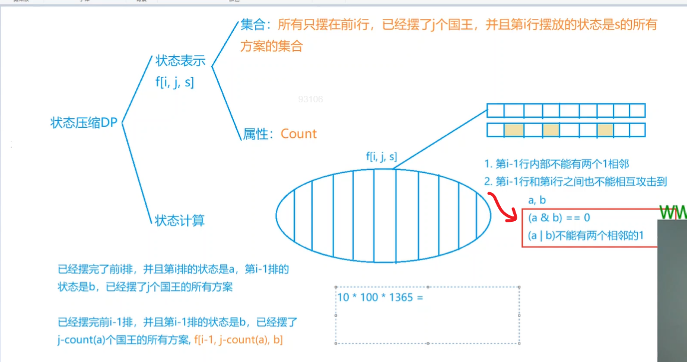
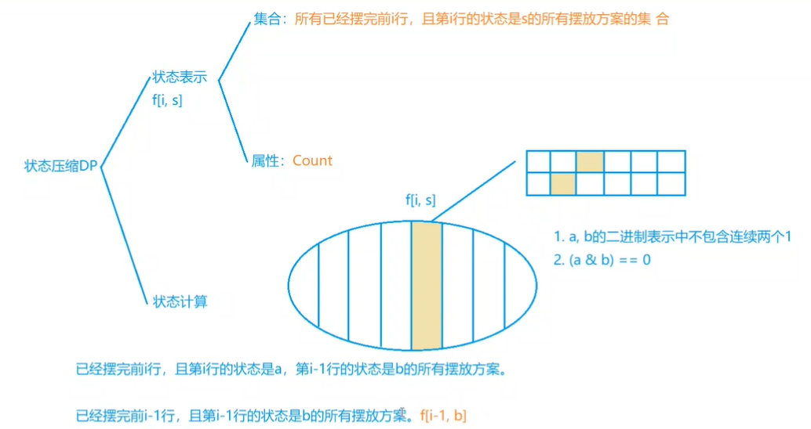
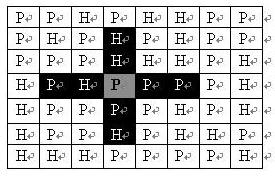
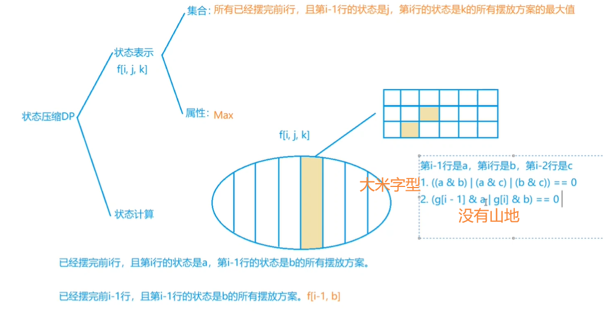
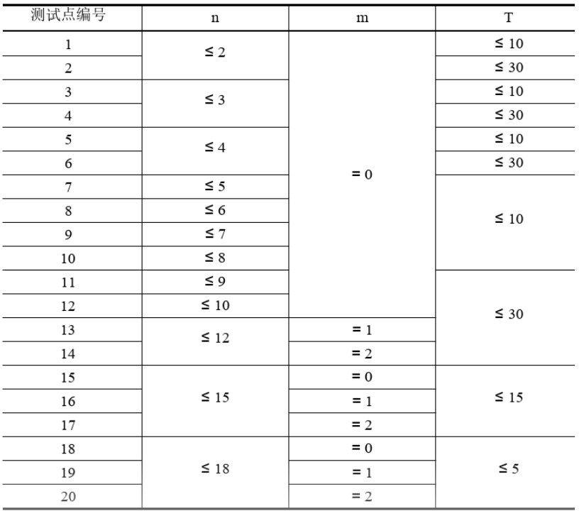
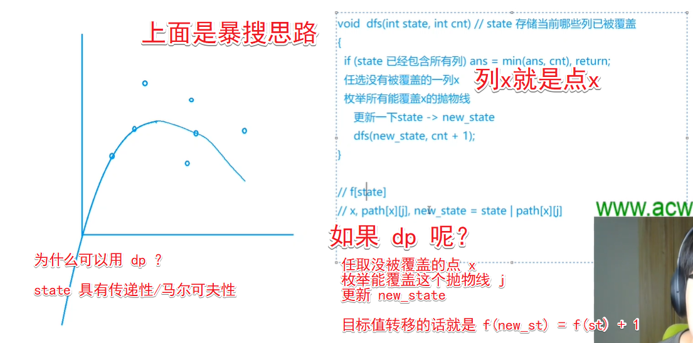
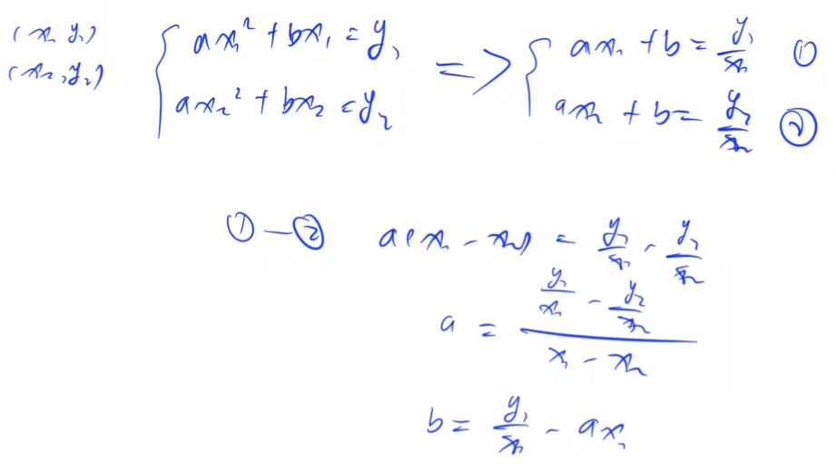

<!-- @import "[TOC]" {cmd="toc" depthFrom=1 depthTo=6 orderedList=false} -->

<!-- code_chunk_output -->

- [状态压缩DP](#状态压缩dp)
  - [小国王（棋盘类）](#小国王棋盘类)
  - [玉米田（棋盘类）](#玉米田棋盘类)
  - [炮兵阵地（大米字型/棋盘型+滚动数组）](#炮兵阵地大米字型棋盘型滚动数组)
  - [愤怒的小鸟（重复覆盖）](#愤怒的小鸟重复覆盖)
  - [宝藏（生成树）](#宝藏生成树)

<!-- /code_chunk_output -->

### 状态压缩DP

大概有两类：棋盘式和集合式。

#### 小国王（棋盘类）

在 $n \times n$ 的棋盘上放 $k$ 个国王，国王可攻击相邻的 $8$ 个格子，求使它们无法互相攻击的方案总数。

<h4>输入格式</h4>

共一行，包含两个整数 $n$ 和 $k$。

<h4>输出格式</h4>

共一行，表示方案总数，若不能够放置则输出$0$。

<h4>数据范围</h4>

- $1 \le n \le 10$,
- $0 \le k \le n^2$

<h4>输入样例：</h4>

```
3 2
```

<h4>输出样例：</h4>

```
16
```



总结：一般来讲思考出 `f[i, s]` 即可，但本题还限制了摆多少个棋子，因此需要再加一个维度表示棋子数量 `f[i, j, s]` 。

```cpp
#include <cstring>
#include <iostream>
#include <algorithm>
#include <vector>

using namespace std;

typedef long long LL;  // 小心溢出

const int N = 12, M = 1 << 10, K = 110;

int n, m;
vector<int> state;
int cnt[M];
vector<int> head[M];
LL f[N][K][M];

bool check(int state)
{   // 是否合法状态
    for (int i = 0; i < n; i ++ )
        if ((state >> i & 1) && (state >> i + 1 & 1))
            return false;
    return true;
}

int count(int state)
{
    int res = 0;
    for (int i = 0; i < n; i ++ ) res += state >> i & 1;
    return res;
}

int main()
{
    cin >> n >> m;

    for (int i = 0; i < 1 << n; i ++ )
        if (check(i))
        {
            state.push_back(i);
            cnt[i] = count(i);  // 状态 i 里有几个 1
        }

    for (int i = 0; i < state.size(); i ++ )
        for (int j = 0; j < state.size(); j ++ )
        {
            int a = state[i], b = state[j];
            if ((a & b) == 0 && check(a | b))
                head[i].push_back(j);  // 构建合法状态连接
        }

    f[0][0][0] = 1;
    for (int i = 1; i <= n + 1; i ++ )  // 这里 i <= n + 1 是一个技巧，方便输出答案
        for (int j = 0; j <= m; j ++ )
            for (int a = 0; a < state.size(); a ++ )
                for (int b : head[a])
                {
                    int c = cnt[state[a]];
                    if (j >= c)
                        f[i][j][a] += f[i - 1][j - c][b];
                }

    cout << f[n + 1][m][0] << endl;  // 输出第 n + 1 行 0 状态方案数即可

    return 0;
}
```

#### 玉米田（棋盘类）

农夫约翰的土地由 $M \times N$ 个小方格组成，现在他要在土地里种植玉米。

非常遗憾，部分土地是不育的，无法种植。

而且，相邻的土地不能同时种植玉米，也就是说种植玉米的所有方格之间都不会有公共边缘。

现在给定土地的大小，请你求出共有多少种种植方法。

土地上什么都不种也算一种方法。

<h4>输入格式</h4>

第 $1$ 行包含两个整数 $M$ 和 $N$。

第 $2..M+1$ 行：每行包含 $N$ 个整数 $0$ 或 $1$，用来描述整个土地的状况，$1$ 表示该块土地肥沃，$0$ 表示该块土地不育。

<h4>输出格式</h4>

输出总种植方法对 $10^8$ 取模后的值。

<h4>数据范围</h4>

$1 \le M,N \le 12$

<h4>输入样例：</h4>

```
2 3
1 1 1
0 1 0
```

<h4>输出样例：</h4>

```
9
```



```cpp
#include <cstring>
#include <iostream>
#include <algorithm>
#include <vector>

using namespace std;

const int N = 14, M = 1 << 12, mod = 1e8;

int n, m;
int w[N];
vector<int> state;
vector<int> head[M];
int f[N][M];

bool check(int state)
{
    for (int i = 0; i + 1 < m; i ++ )
        if ((state >> i & 1) && (state >> i + 1 & 1))
            return false;
    return true;
}

int main()
{
    cin >> n >> m;
    for (int i = 1; i <= n; i ++ )
        for (int j = 0; j < m; j ++ )
        {
            int t;
            cin >> t;
            w[i] += !t * (1 << j);
        }

    for (int i = 0; i < 1 << m; i ++ )
        if (check(i))
            state.push_back(i);

    for (int i = 0; i < state.size(); i ++ )
        for (int j = 0; j < state.size(); j ++ )
        {
            int a = state[i], b = state[j];
            if (!(a & b))
                head[i].push_back(j);
        }

    f[0][0] = 1;
    for (int i = 1; i <= n + 1; i ++ )
        for (int j = 0; j < state.size(); j ++ )
            if (!(state[j] & w[i]))  // 第 i 行状态合法
                for (int k : head[j])
                    f[i][j] = (f[i][j] + f[i - 1][k]) % mod;

    cout << f[n + 1][0] << endl;

    return 0;
}
```

#### 炮兵阵地（大米字型/棋盘型+滚动数组）

司令部的将军们打算在 $N \times M$ 的网格地图上部署他们的炮兵部队。

一个 $N \times M$ 的地图由 $N$ 行 $M$ 列组成，地图的每一格可能是山地（用 `H` 表示），也可能是平原（用 `P` 表示），如下图。

在每一格平原地形上最多可以布置一支炮兵部队（山地上不能够部署炮兵部队）；一支炮兵部队在地图上的攻击范围如图中黑色区域所示： 



如果在地图中的灰色所标识的平原上部署一支炮兵部队，则图中的黑色的网格表示它能够攻击到的区域：沿横向左右各两格，沿纵向上下各两格。

图上其它白色网格均攻击不到。

从图上可见炮兵的攻击范围不受地形的影响。 

现在，将军们规划如何部署炮兵部队，在防止误伤的前提下（保证任何两支炮兵部队之间不能互相攻击，即任何一支炮兵部队都不在其他支炮兵部队的攻击范围内），在整个地图区域内最多能够摆放多少我军的炮兵部队。

<h4>输入格式</h4>

第一行包含两个由空格分割开的正整数，分别表示 $N$ 和 $M$； 

接下来的 $N$ 行，每一行含有连续的 $M$ 个字符(`P` 或者 `H`)，中间没有空格。按顺序表示地图中每一行的数据。

<h4>输出格式</h4>

仅一行，包含一个整数 $K$，表示最多能摆放的炮兵部队的数量。

<h4>数据范围</h4>

$N \le 100,M \le 10$

<h4>输入样例：</h4>

```
5 4
PHPP
PPHH
PPPP
PHPP
PHHP
```

<h4>输出样例：</h4>

```
6
```



```cpp
#include <cstring>
#include <iostream>
#include <algorithm>
#include <vector>

using namespace std;

const int N = 10, M = 1 << 10;

int n, m;
int g[1010];
int f[2][M][M];
vector<int> state;
int cnt[M];

bool check(int state)
{
    for (int i = 0; i < m; i ++ )  // 1 2 3 4 5 中， 3 不能和 {1 2 4 5} 共存
        if ((state >> i & 1) && ((state >> i + 1 & 1) || (state >> i + 2 & 1)))
            return false;
    return true;
}

int count(int state)
{
    int res = 0;
    for (int i = 0; i < m; i ++ )
        if (state >> i & 1)
            res ++ ;
    return res;
}

int main()
{
    cin >> n >> m;
    for (int i = 1; i <= n; i ++ )
        for (int j = 0; j < m; j ++ )
        {
            char c;
            cin >> c;
            g[i] += (c == 'H') << j;
        }

    for (int i = 0; i < 1 << m; i ++ )
        if (check(i))
        {
            state.push_back(i);
            cnt[i] = count(i);
        }

    // for (int i = 1; i <= n; i ++ )
    for (int i = 1; i <= n + 2; i ++ )
        for (int j = 0; j < state.size(); j ++ )  // 第 i-1 行
            for (int k = 0; k < state.size(); k ++ )  // 第 i 行
                for (int u = 0; u < state.size(); u ++ )  // 第 i - 2 行
                {
                    int a = state[j], b = state[k], c = state[u];
                    if (a & b | a & c | b & c) continue;  // 有在同一列
                    if (g[i] & b | g[i - 1] & a) continue;  // 第 i - 2 行不用检查，因为不合法的一定是 0
                    f[i & 1][j][k] = max(f[i & 1][j][k], f[i - 1 & 1][u][j] + cnt[b]);
                }

    // int res = 0;
    // for (int i = 0; i < state.size(); i ++ )
    //     for (int j = 0; j < state.size(); j ++ )
    //         res = max(res, f[n & 1][i][j]);
    // cout << res << endl;

    cout << f[n + 2 & 1][0][0] << endl;

    return 0;
}
```

**经验：**
- 写滚动数组的话，就正常写出来，然后 `f[i & 1]` 就行（加一个 `& 1`）

#### 愤怒的小鸟（重复覆盖）

Kiana 最近沉迷于一款神奇的游戏无法自拔。   

简单来说，这款游戏是在一个平面上进行的。 

有一架弹弓位于 $(0,0)$ 处，每次 Kiana 可以用它向第一象限发射一只红色的小鸟， 小鸟们的飞行轨迹均为形如 $y=ax^2+bx$ 的曲线，其中 $a,b$ 是 Kiana 指定的参数，且必须满足 $a<0$。

当小鸟落回地面（即 $x$ 轴）时，它就会瞬间消失。

在游戏的某个关卡里，平面的第一象限中有 $n$ 只绿色的小猪，其中第 $i$ 只小猪所在的坐标为 $(x_i,y_i)$。 

如果某只小鸟的飞行轨迹经过了 $(x_i, y_i)$，那么第 $i$ 只小猪就会被消灭掉，同时小鸟将会沿着原先的轨迹继续飞行； 

如果一只小鸟的飞行轨迹没有经过 $(x_i, y_i)$，那么这只小鸟飞行的全过程就不会对第 $i$ 只小猪产生任何影响。 

例如，若两只小猪分别位于 $(1,3)$ 和 $(3,3)$，Kiana 可以选择发射一只飞行轨迹为 $y=−x^2+4x$ 的小鸟，这样两只小猪就会被这只小鸟一起消灭。 

而这个游戏的目的，就是通过发射小鸟消灭所有的小猪。 

这款神奇游戏的每个关卡对 Kiana 来说都很难，所以 Kiana 还输入了一些神秘的指令，使得自己能更轻松地完成这个这个游戏。   

这些指令将在输入格式中详述。 

假设这款游戏一共有 $T$ 个关卡，现在 Kiana 想知道，对于每一个关卡，至少需要发射多少只小鸟才能消灭所有的小猪。  

由于她不会算，所以希望由你告诉她。

<strong>注意</strong>:本题除 NOIP 原数据外，还包含加强数据。

<h4>输入格式</h4>

第一行包含一个正整数 $T$，表示游戏的关卡总数。

下面依次输入这 $T$ 个关卡的信息。

每个关卡第一行包含两个非负整数 $n,m$，分别表示该关卡中的小猪数量和 Kiana 输入的神秘指令类型。

接下来的 $n$ 行中，第 $i$ 行包含两个正实数 $(x_i,y_i)$，表示第 $i$ 只小猪坐标为 $(x_i,y_i)$，数据保证同一个关卡中不存在两只坐标完全相同的小猪。

如果 $m=0$，表示 Kiana 输入了一个没有任何作用的指令。

如果 $m=1$，则这个关卡将会满足：至多用 $⌈n/3+1⌉$ 只小鸟即可消灭所有小猪。

如果 $m=2$，则这个关卡将会满足：一定存在一种最优解，其中有一只小鸟消灭了至少 $⌊n/3⌋$ 只小猪。

保证 $1 \le n \le 18，0 \le m \le 2，0<x_i,y_i<10$，输入中的实数均保留到小数点后两位。

上文中，符号 $⌈c⌉$ 和 $⌊c⌋$ 分别表示对 $c$ 向上取整和向下取整，例如 ：$⌈2.1⌉=⌈2.9⌉=⌈3.0⌉=⌊3.0⌋=⌊3.1⌋=⌊3.9⌋=3$。

<h4>输出格式</h4>

对每个关卡依次输出一行答案。

输出的每一行包含一个正整数，表示相应的关卡中，消灭所有小猪最少需要的小鸟数量。

<h4>数据范围</h4>



<h4>输入样例：</h4>

```
2
2 0
1.00 3.00
3.00 3.00
5 2
1.00 5.00
2.00 8.00
3.00 9.00
4.00 8.00
5.00 5.00
```

<h4>输出样例：</h4>

```
1
1
```

枚举出所有有效的抛物线，则现在变成了最少需要多少抛物线。



上图中， `path` 是一个矩阵， `path[i][j]` 表示同时覆盖 `i` `j` 两点的抛物线其状态是什么（`path[0][2] = 0b100101` 即覆盖了 `0 2 5` 点的抛物线）。



```cpp
#include <cstring>
#include <iostream>
#include <algorithm>
#include <cmath>

#define x first
#define y second

using namespace std;

typedef pair<double, double> PDD;

const int N = 18, M = 1 << 18;
const double eps = 1e-8;

int n, m;
PDD q[N];
int path[N][N];
int f[M];

int cmp(double x, double y)  // 注意 double 比较用 eps 误差
{
    if (fabs(x - y) < eps) return 0;
    if (x < y) return -1;
    return 1;
}

int main()
{
    int T;
    cin >> T;
    while (T -- )
    {
        cin >> n >> m;
        for (int i = 0; i < n; i ++ ) cin >> q[i].x >> q[i].y;

        memset(path, 0, sizeof path);
        for (int i = 0; i < n; i ++ )
        {
            path[i][i] = 1 << i;
            for (int j = 0; j < n; j ++ )
            {
                double x1 = q[i].x, y1 = q[i].y;
                double x2 = q[j].x, y2 = q[j].y;
                if (!cmp(x1, x2)) continue;
                double a = (y1 / x1 - y2 / x2) / (x1 - x2);
                double b = y1 / x1 - a * x1;

                if (cmp(a, 0) >= 0) continue;  // 注意 a 必须小于 0 （因为题意）
                int state = 0;
                for (int k = 0; k < n; k ++ )
                {
                    double x = q[k].x, y = q[k].y;
                    if (!cmp(a * x * x + b * x, y)) state += 1 << k;
                }
                path[i][j] = state;
            }
        }

        memset(f, 0x3f, sizeof f);
        f[0] = 0;
        for (int i = 0; i + 1 < 1 << n; i ++ )  // 不写成 i < 1 << n - 1 因为运算优先级
        {   // 对于状态 i ，任取一个目前没被覆盖的点 x
            int x = 0;
            for (int j = 0; j < n; j ++ )
                if (!(i >> j & 1))
                {
                    x = j;
                    break;
                }

            for (int j = 0; j < n; j ++ )  // 状态 i 基础上覆盖了 x 的抛物线们得到的状态的更新
                f[i | path[x][j]] = min(f[i | path[x][j]], f[i] + 1);
        }

        cout << f[(1 << n) - 1] << endl;
    }

    return 0;
}
```

#### 宝藏（生成树）

参与考古挖掘的小明得到了一份藏宝图，藏宝图上标出了 $n$ 个深埋在地下的宝藏屋，也给出了这 $n$ 个宝藏屋之间可供开发的 $m$ 条道路和它们的长度。 

小明决心亲自前往挖掘所有宝藏屋中的宝藏。

但是，每个宝藏屋距离地面都很远，也就是说，从地面打通一条到某个宝藏屋的道路是很困难的，而开发宝藏屋之间的道路则相对容易很多。

小明的决心感动了考古挖掘的赞助商，赞助商决定免费赞助他打通一条从地面到某个宝藏屋的通道，通往哪个宝藏屋则由小明来决定。 

在此基础上，小明还需要考虑如何开凿宝藏屋之间的道路。

已经开凿出的道路可以任意通行不消耗代价。

每开凿出一条新道路，小明就会与考古队一起挖掘出由该条道路所能到达的宝藏屋的宝藏。

另外，小明不想开发无用道路，即两个已经被挖掘过的宝藏屋之间的道路无需再开发。

新开发一条道路的代价是：  

这条道路的长度 $×$ 从赞助商帮你打通的宝藏屋到这条道路起点的宝藏屋所经过的宝藏屋的数量（包括赞助商帮你打通的宝藏屋和这条道路起点的宝藏屋）。 

请你编写程序为小明选定由赞助商打通的宝藏屋和之后开凿的道路，使得工程总代价最小，并输出这个最小值。

<h4>输入格式</h4>

第一行两个用空格分离的正整数 $n$ 和 $m$，代表宝藏屋的个数和道路数。

接下来 $m$ 行，每行三个用空格分离的正整数，分别是由一条道路连接的两个宝藏屋的编号（编号为 $1 \sim n$），和这条道路的长度 $v$。

<h4>输出格式</h4>

输出共一行，一个正整数，表示最小的总代价。

<h4>数据范围</h4>

- $1 \le n \le 12$,
- $0 \le m \le 1000$,
- $v \le 5*10^5$

<h4>输入样例：</h4>

```
4 5 
1 2 1 
1 3 3 
1 4 1 
2 3 4 
3 4 1 
```

<h4>输出样例：</h4>

```
4
```

<h4>注意</h4>

<p>本题数据有加强，前二十个测试点为 NOIP 官方数据，后三个测试点为加强数据。</p>

y 总的题解 [https://www.acwing.com/solution/content/4026/](https://www.acwing.com/solution/content/4026/) ：

状态压缩DP $O(n^23^n)$

参考 [这篇题解](https://www.luogu.org/blog/fusu2333/solution-p3959) 所写。

状态压缩DP，下文中`i`是一个 $n$ 位二进制数，表示每个点是否存在。

状态`f[i][j]`表示：

- 集合：所有包含`i`中所有点，且树的高度等于`j`的生成树
- 属性：最小花费

- 状态计算：枚举`i`的所有非全集子集`S`作为前`j - 1`层的点，剩余点作为第`j`层的点。
- <strong>核心：</strong> 求出第`j`层的所有点到`S`的最短边，将这些边权和乘以`j`，直接加到`f[S][j - 1]`上，即可求出`f[i][j]`。

证明：
- 将这样求出的结果记为`f'[i][j]`
- `f[i][j]`中花费最小的生成树一定可以被枚举到，因此`f[i][j] >= f'[i][j]`；
- 如果第`j`层中用到的某条边`(a, b)`应该在比`j`小的层，假设`a`是`S`中的点，`b`是第`j`层的点，则在枚举`S + {b}`时会得到更小的花费，即这种方式枚举到的所有花费均大于等于某个合法生成树的花费，因此`f[i][j] <= f'[i][j]`

所以有 `f[i][j] = f'[i][j]`。

<h4>时间复杂度</h4>

包含 $k$ 个元素的集合有 $C_n^k$ 个，且每个集合有 $2^k$ 个子集，因此总共有 $C_n^k2^k$ 个子集。$k$ 可以取 $0 \sim n$，则总共有 $\sum_{k=0}^n C_n^k2^k = (1+2)^n = 3^n$，这一步由二项式定理可得。

对于每个子集需要 $n^2$ 次计算来算出剩余点到子集中的最短边。

因此总时间复杂度是 $O(n^23^n)$。

```cpp
#include <cstdio>
#include <cstring>
#include <iostream>
#include <algorithm>

using namespace std;

const int N = 12, M = 1 << 12, INF = 0x3f3f3f3f;

int n, m;
int d[N][N];  // 距离
int f[M][N], g[M];  // f[点是是否被包含的状态][生成树第几层]
// g[i] 状态 i 中被覆盖的点，其邻接的点有哪些

int main()
{
    scanf("%d%d", &n, &m);

    memset(d, 0x3f, sizeof d);
    for (int i = 0; i < n; i ++ ) d[i][i] = 0;

    while (m -- )
    {
        int a, b, c;
        scanf("%d%d%d", &a, &b, &c);
        a --, b --;
        d[a][b] = d[b][a] = min(d[a][b], c);
    }

    for (int i = 1; i < 1 << n; i ++ )
        for (int j = 0; j < n; j ++ )
            if (i >> j & 1)  // 对于状态 i 中的每个点
            {
                for (int k = 0; k < n; k ++ )
                    if (d[j][k] != INF)  // 记录与 i 有邻接关系的点 k
                        g[i] |= 1 << k;
            }

    memset(f, 0x3f, sizeof f);
    for (int i = 0; i < n; i ++ ) f[1 << i][0] = 0;  // 每一个点作为初始点，都没花钱

    for (int i = 1; i < 1 << n; i ++ )
        for (int j = i - 1 & i; j; j = (j - 1) & i)  // 枚举状态 i 的真子集 j（背下来）
            if ((g[j] & i) == i)  // 子集 j 恰好都可以直接连接到 i 中的点上
            {
                int remain = i ^ j;  // 集合 S 中的点，这里写成 int remain = i; 也可以
                int cost = 0;
                for (int k = 0; k < n; k ++ )
                    if (remain >> k & 1)  // 集合 S 中的 k 点
                    {
                        int t = INF;
                        for (int u = 0; u < n; u ++ )
                            if (j >> u & 1)
                                t = min(t, d[k][u]);  // j 中的 u 点
                                // 这里 S 包含 j 但是 d[u][u] = 0 因此没有影响
                        cost += t;
                    }

                for (int k = 1; k < n; k ++ ) f[i][k] = min(f[i][k], f[j][k - 1] + cost * k);
            }

    int res = INF;
    for (int i = 0; i < n; i ++ ) res = min(res, f[(1 << n) - 1][i]);  // 未必在 n-1 层是最优

    printf("%d\n", res);
    return 0;
}
```

**经验：**
- `for(int j = i; j; j = (j - 1) & i)` 用于枚举二进制表征的子集，而 `for(int j = i - 1 & i; j; j = (j - 1) & i)` 是真子集，要背下来

参考[Pipipapi](https://www.acwing.com/user/myspace/record/92692/)的模拟退火（很慢但是AC），长见识了：

```cpp
#include<bits/stdc++.h>
#define N 15
#define int long long 
using namespace std;
double T,start_T,del_T,low_T;
int INF;
int B[N],fa[N],n,Map[N+N][N+N],x,y,z,ans,m;
double rand_double(){
    return rand()/(double)RAND_MAX;
}
void addedge(int x,int y,int z){
    Map[x][y]=min(Map[x][y],z);
    Map[y][x]=min(Map[y][x],z);
}
void init(){
    srand(6662333);
    start_T=23333;
    del_T=0.99;
    low_T=1e-9;
    INF=12345678987654321;
    ans=INF;
    for (int i=0;i<=20;i++)
        for (int j=0;j<=20;j++)
            Map[i][j]=Map[j][i]=INF;
}
int find(int x){
    if (x==B[x])
        return x; else
        return B[x]=find(B[x]);
}
void merge(int x,int y){
    int fx=find(x);
    int fy=find(y);
    if (fx==fy) return;
    B[fx]=fy;
}
int dfs_sum(int v,int Fa,int dep){
    int res=dep*Map[Fa][v];
    for (int i=1;i<=n;i++){
        if (fa[i]!=v||Fa==i) continue;
        res+=dfs_sum(i,v,dep+1);
    } 
    return res;
}
bool judge(){
    for (int i=1;i<=n;i++)
        B[i]=i;

    for (int i=1;i<=n;i++){
        bool skip=false;
        if (find(i)==find(fa[i])) skip=true;
        if (i!=fa[i]&&skip) 
            return false;
        merge(i,fa[i]);
    }
    return true;
}
int SA_main(int root){//退火主要部分
    int res=dfs_sum(root,0,0);
//    if (root != 1ll) printf("res = %lld\n", res), system("pause");
    T=start_T;
    while (T>low_T){
        int change,go;
        do {
            change=rand()%n+1;
            go=rand()%n+1;
        } while (change==go||change==root);
        int deposit=fa[change];
        fa[change]=go;
        if (!judge()){
        fa[change]=deposit;
            continue;
        }
        int nxt=dfs_sum(root,0,0);
        double depos=exp((res-nxt)/T);
        if (nxt<res||depos>rand_double())
        res=nxt; else
            fa[change]=deposit; 
        T*=del_T;
    }
    //cout << res << endl;
    return res;
} 
void read(){
    scanf("%lld%lld",&n,&m);
    for (int i=1;i<=m;i++){
        scanf("%lld%lld%lld",&x,&y,&z);
        addedge(x,y,z);
    }
} 
void solve(){
    if (n==1){
        ans=0;
        return;
    }
    for (int i=1;i<=n;i++){
        for (int j=1;j<=n;j++)
            fa[j]=i;
        fa[i]=0;
        for (int j=1;j<=16;j++)
            ans=min(ans,SA_main(i));
    }
}
void write(){
    cout << ans <<  endl;
} 

signed main(){
    init();
    read();
    solve();
    write();
    return 0;
}
```
