<!-- @import "[TOC]" {cmd="toc" depthFrom=1 depthTo=6 orderedList=false} -->

<!-- code_chunk_output -->

- [区间DP](#区间dp)
  - [环形石子合并](#环形石子合并)
  - [能量项链](#能量项链)
  - [凸多边形的划分（高精度）](#凸多边形的划分高精度)
  - [加分二叉树（如何记录方案）](#加分二叉树如何记录方案)
  - [棋盘分割（记忆化搜索）](#棋盘分割记忆化搜索)

<!-- /code_chunk_output -->

### 区间DP

分为大概四方面：
- 环形序列
- 记录方案数
- 区间 DP + 高精度
- 二维区间 DP

#### 环形石子合并

将 $n$ 堆石子绕圆形操场排放，现要将石子有序地合并成一堆。

规定每次只能选相邻的两堆合并成新的一堆，并将新的一堆的石子数记做该次合并的得分。

请编写一个程序，读入堆数 $n$ 及每堆的石子数，并进行如下计算：

- 选择一种合并石子的方案，使得做 $n-1$ 次合并得分总和最大。
- 选择一种合并石子的方案，使得做 $n-1$ 次合并得分总和最小。

<h4>输入格式</h4>

第一行包含整数 $n$，表示共有 $n$ 堆石子。

第二行包含 $n$ 个整数，分别表示每堆石子的数量。

<h4>输出格式</h4>

输出共两行：

第一行为合并得分总和最小值，

第二行为合并得分总和最大值。

<h4>数据范围</h4>

$1 \le n \le 200$

<h4>输入样例：</h4>

```
4
4 5 9 4
```

<h4>输出样例：</h4>

```
43
54
```

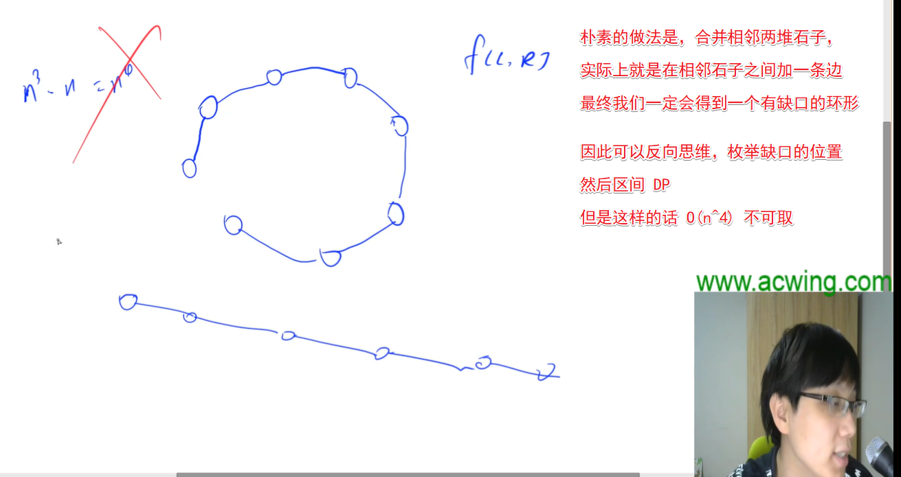

如上，朴素思想不可取。

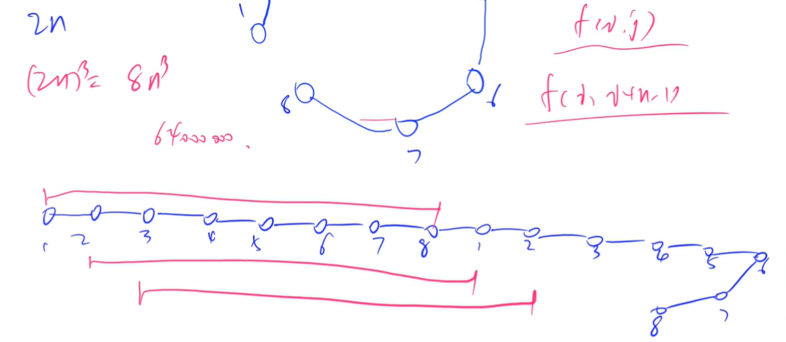

如上，把 `n` 长度的链当成 `2n` 来对待，**也是区间 DP 的通用思想** 。

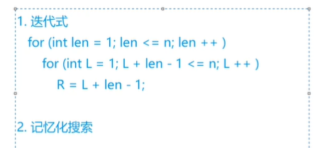

如上，区间 DP 有两种实现方式，推荐用迭代式，之后也会有记忆化搜索的代码。

```cpp
#include <cstring>
#include <iostream>
#include <algorithm>

using namespace std;

const int N = 410, INF = 0x3f3f3f3f;

int n;
int w[N], s[N];
int f[N][N], g[N][N];

int main()
{
    cin >> n;
    for (int i = 1; i <= n; i ++ )
    {
        cin >> w[i];
        w[i + n] = w[i];  // 预处理
    }

    for (int i = 1; i <= n * 2; i ++ ) s[i] = s[i - 1] + w[i];

    memset(f, 0x3f, sizeof f);
    memset(g, -0x3f, sizeof g);

    for (int len = 1; len <= n; len ++ )
        for (int l = 1; l + len - 1 <= n * 2; l ++ )
        {
            int r = l + len - 1;
            if (l == r) f[l][r] = g[l][r] = 0;
            else
            {
                for (int k = l; k < r; k ++ )
                {
                    f[l][r] = min(f[l][r], f[l][k] + f[k + 1][r] + s[r] - s[l - 1]);
                    g[l][r] = max(g[l][r], g[l][k] + g[k + 1][r] + s[r] - s[l - 1]);
                }
            }
        }

    int minv = INF, maxv = -INF;
    for (int i = 1; i <= n; i ++ )  // 找长度为 n 的区间
    {
        minv = min(minv, f[i][i + n - 1]);
        maxv = max(maxv, g[i][i + n - 1]);
    }

    cout << minv << endl << maxv << endl;

    return 0;
}
```

#### 能量项链

在 Mars 星球上，每个 Mars 人都随身佩带着一串能量项链，在项链上有 $N$ 颗能量珠。

能量珠是一颗有头标记与尾标记的珠子，这些标记对应着某个正整数。

并且，对于相邻的两颗珠子，前一颗珠子的尾标记一定等于后一颗珠子的头标记。

因为只有这样，通过吸盘（吸盘是 Mars 人吸收能量的一种器官）的作用，这两颗珠子才能聚合成一颗珠子，同时释放出可以被吸盘吸收的能量。

如果前一颗能量珠的头标记为 $m$，尾标记为 $r$，后一颗能量珠的头标记为 $r$，尾标记为 $n$，则聚合后释放的能量为 $m \times r \times n$（Mars 单位），新产生的珠子的头标记为 $m$，尾标记为 $n$。

需要时，Mars 人就用吸盘夹住相邻的两颗珠子，通过聚合得到能量，直到项链上只剩下一颗珠子为止。

显然，不同的聚合顺序得到的总能量是不同的，请你设计一个聚合顺序，使一串项链释放出的总能量最大。

例如：设 $N=4$，$4$ 颗珠子的头标记与尾标记依次为 $(2，3) (3，5) (5，10) (10，2)$。

我们用记号 $⊕$ 表示两颗珠子的聚合操作，$(j⊕k)$ 表示第 $j$，$k$ 两颗珠子聚合后所释放的能量。则

第 $4、1$ 两颗珠子聚合后释放的能量为：$(4⊕1)=10 \times 2 \times 3=60$。

这一串项链可以得到最优值的一个聚合顺序所释放的总能量为 $((4 \oplus 1) \oplus 2) \oplus 3) = 10 \times 2 \times 3+10 \times 3 \times 5+10 \times 5 \times 10=710$。

<h4>输入格式</h4>

输入的第一行是一个正整数 $N$，表示项链上珠子的个数。

第二行是 $N$ 个用空格隔开的正整数，所有的数均不超过 $1000$，第 $i$ 个数为第 $i$ 颗珠子的头标记，当 $i<N$ 时，第 $i$ 颗珠子的尾标记应该等于第 $i+1$ 颗珠子的头标记，第 $N$ 颗珠子的尾标记应该等于第 $1$ 颗珠子的头标记。

至于珠子的顺序，你可以这样确定：将项链放到桌面上，不要出现交叉，随意指定第一颗珠子，然后按顺时针方向确定其他珠子的顺序。

<h4>输出格式</h4>

输出只有一行，是一个正整数 $E$，为一个最优聚合顺序所释放的总能量。

<h4>数据范围</h4>

- $4 \le N \le 100$,
- $1 \le E \le 2.1 \times 10^9$

<h4>输入样例：</h4>

```
4
2 3 5 10
```

<h4>输出样例：</h4>

```
710
```

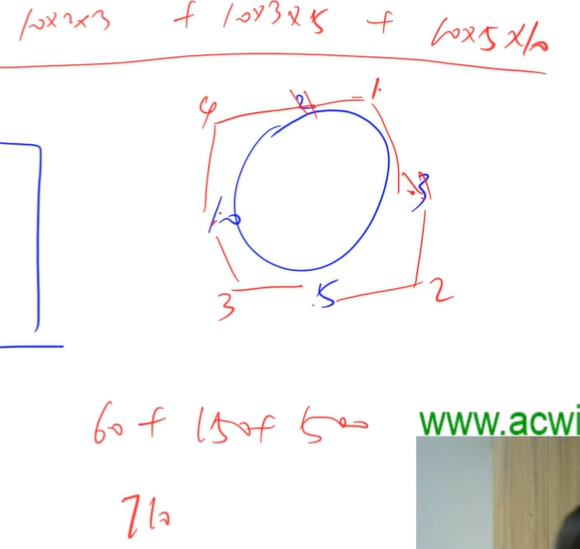

如上，还是一个环形链。

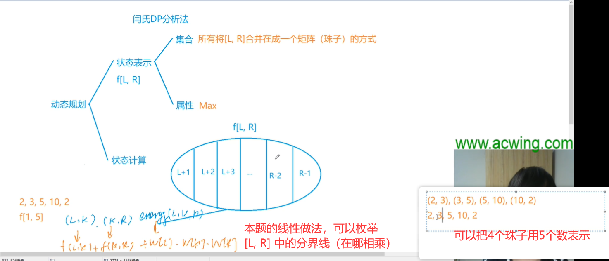

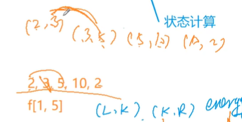

如上，这里有个细节：
- 把区间 `(2, 3) (3, 5)` 合并，实际上是将 `2 3 5` 合并成 `2 5` ，把中间的 `3` 去掉了
- 所以我们最后求结果，枚举的是 `n+1` 长度的区间而非 `n`

对于环形做法，我们还是只要把线性序列扩展为两倍长度就好。最后枚举 `n+1` 长度的区间取最大值。

```cpp
#include <cstring>
#include <iostream>
#include <algorithm>

using namespace std;

const int N = 210, INF = 0x3f3f3f3f;

int n;
int w[N];
int f[N][N];

int main()
{
    cin >> n;
    for (int i = 1; i <= n; i ++ )
    {
        cin >> w[i];
        w[i + n] = w[i];
    }

    for (int len = 3; len <= n + 1; len ++ )  // len 从 3 开始，因为 3 才可表示两两合并
        for (int l = 1; l + len - 1 <= n * 2; l ++ )
        {
            int r = l + len - 1;
            for (int k = l + 1; k < r; k ++ )
                f[l][r] = max(f[l][r], f[l][k] + f[k][r] + w[l] * w[k] * w[r]);
        }

    int res = 0;
    for (int l = 1; l <= n; l ++ ) res = max(res, f[l][l + n]);

    cout << res << endl;

    return 0;
}
```

#### 凸多边形的划分（高精度）

给定一个具有 $N$ 个顶点的凸多边形，将顶点从 $1$ 至 $N$ 标号，每个顶点的权值都是一个正整数。

将这个凸多边形划分成 $N-2$ 个互不相交的三角形，对于每个三角形，其三个顶点的权值相乘都可得到一个权值乘积，试求所有三角形的顶点权值乘积之和至少为多少。

<h4>输入格式</h4>

第一行包含整数 $N$，表示顶点数量。

第二行包含 $N$ 个整数，依次为顶点 $1$ 至顶点 $N$ 的权值。

<h4>输出格式</h4>

输出仅一行，为所有三角形的顶点权值乘积之和的最小值。

<h4>数据范围</h4>

- $N \le 50$,
- 数据保证所有顶点的权值都小于$10^9$

<h4>输入样例：</h4>

```
5
121 122 123 245 231
```

<h4>输出样例：</h4>

```
12214884
```

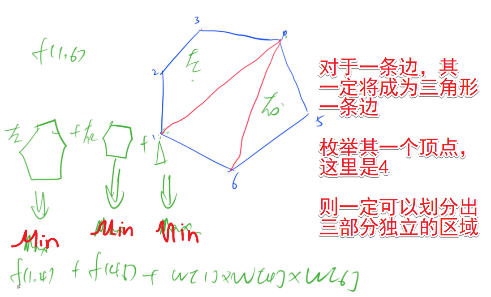

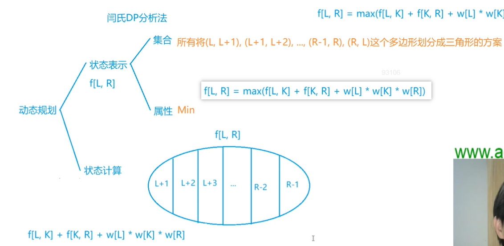

对于 `[L, R]` 与被枚举的 `K` 深入地理解如下图。

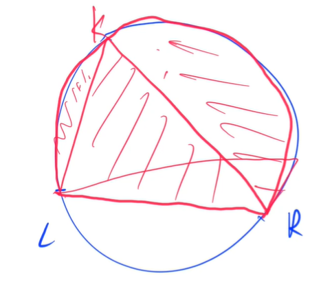

```cpp
#include <cstring>
#include <iostream>
#include <algorithm>

using namespace std;

typedef long long LL;

const int N = 55, M = 35, INF = 1e9;

int n;
int w[N];
LL f[N][N][M];

void add(LL a[], LL b[])
{
    static LL c[M];
    memset(c, 0, sizeof c);
    for (int i = 0, t = 0; i < M; i ++ )
    {
        t += a[i] + b[i];
        c[i] = t % 10;
        t /= 10;
    }
    memcpy(a, c, sizeof c);
}

void mul(LL a[], LL b)
{
    static LL c[M];
    memset(c, 0, sizeof c);
    LL t = 0;
    for (int i = 0; i < M; i ++ )
    {
        t += a[i] * b;  // 防止乘法爆 int
        c[i] = t % 10;
        t /= 10;
    }
    memcpy(a, c, sizeof c);
}

int cmp(LL a[], LL b[])
{
    for (int i = M - 1; i >= 0; i -- )
        if (a[i] > b[i]) return 1;
        else if (a[i] < b[i]) return -1;
    return 0;
}

void print(LL a[])
{
    int k = M - 1;
    while (k && !a[k]) k -- ;
    while (k >= 0) cout << a[k -- ];
    cout << endl;
}

int main()
{
    cin >> n;
    for (int i = 1; i <= n; i ++ ) cin >> w[i];

    LL temp[M];
    for (int len = 3; len <= n; len ++ )  // 从 [1, 3] 开始枚举
        for (int l = 1; l + len - 1 <= n; l ++ )
        {
            int r = l + len - 1;
            f[l][r][M - 1] = 1;  // 初始值相当于无穷大
            for (int k = l + 1; k < r; k ++ )
            {
                memset(temp, 0, sizeof temp);
                temp[0] = w[l];
                mul(temp, w[k]);
                mul(temp, w[r]);
                add(temp, f[l][k]);
                add(temp, f[k][r]);
                if (cmp(f[l][r], temp) > 0)
                    memcpy(f[l][r], temp, sizeof temp);
            }
        }

    print(f[1][n]);  // 这里是 [1, n] 是因为这是包含了所有情况的集合

    return 0;
}
```

**经验：**
- 本题是 $(10^9)^3$ `long long` 存不下，因此开个高精度；写高精度可以先安正常的写，然后再改成高精度

#### 加分二叉树（如何记录方案）

设一个 $n$ 个节点的二叉树 tree 的中序遍历为（$1,2,3,…,n$），其中数字 $1,2,3,…,n$ 为节点编号。

每个节点都有一个分数（均为正整数），记第 $i$ 个节点的分数为 $d_i$，tree 及它的每个子树都有一个加分，任一棵子树 subtree（也包含 tree 本身）的加分计算方法如下：     

subtree的左子树的加分 $×$ subtree的右子树的加分 $＋$ subtree的根的分数 

若某个子树为空，规定其加分为 $1$。

叶子的加分就是叶节点本身的分数，不考虑它的空子树。

试求一棵符合中序遍历为（$1,2,3,…,n$）且加分最高的二叉树 tree。

要求输出： 

（1）tree的最高加分 

（2）tree的前序遍历

<h4>输入格式</h4>

第 $1$ 行：一个整数 $n$，为节点个数。 

第 $2$ 行：$n$ 个用空格隔开的整数，为每个节点的分数（$0<$分数$<100$）。

<h4>输出格式</h4>

第 $1$ 行：一个整数，为最高加分（结果不会超过`int`范围）。     

第 $2$ 行：$n$ 个用空格隔开的整数，为该树的前序遍历。如果存在多种方案，则输出字典序最小的方案。

<h4>数据范围</h4>

$n < 30$

<h4>输入样例：</h4>

```
5
5 7 1 2 10
```

<h4>输出样例：</h4>

```
145
3 1 2 4 5
```

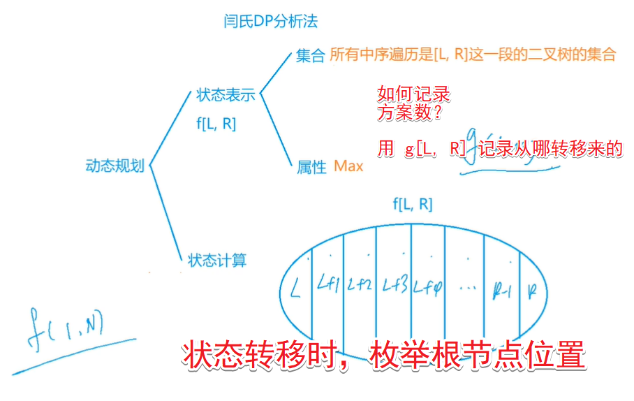

```cpp
#include <cstring>
#include <iostream>
#include <algorithm>

using namespace std;

const int N = 30;

int n;
int w[N];
int f[N][N], g[N][N];

void dfs(int l, int r)
{
    if (l > r) return;
    int k = g[l][r];
    cout << k << ' ';
    dfs(l, k - 1);
    dfs(k + 1, r);
}

int main()
{
    cin >> n;

    for (int i = 1; i <= n; i ++ ) cin >> w[i];

    for (int len = 1; len <= n; len ++ )
        for (int l = 1; l + len - 1 <= n; l ++ )
        {
            int r = l + len - 1;
            if (len == 1) f[l][r] = w[l], g[l][r] = l;
            else
            {
                for (int k = l; k <= r; k ++ )
                {
                    int left = k == l ? 1 : f[l][k - 1];
                    int right = k == r ? 1 : f[k + 1][r];
                    int score = left * right + w[k];
                    if (f[l][r] < score)
                    {
                        f[l][r] = score;
                        g[l][r] = k;  // 记录 l r 根节点位置
                    }
                }
            }
        }

    cout << f[1][n] << endl;

    dfs(1, n);  // 前序遍历

    return 0;
}
```

#### 棋盘分割（记忆化搜索）

将一个 $8 \times 8$ 的棋盘进行如下分割：将原棋盘割下一块矩形棋盘并使剩下部分也是矩形，再将剩下的部分继续如此分割，这样割了 $(n-1)$ 次后，连同最后剩下的矩形棋盘共有 $n$ 块矩形棋盘。(每次切割都只能沿着棋盘格子的边进行)


原棋盘上每一格有一个分值，一块矩形棋盘的总分为其所含各格分值之和。

现在需要把棋盘按上述规则分割成 $n$ 块矩形棋盘，并使各矩形棋盘总分的均方差最小。 

均方差  ，其中平均值  ，$x_i$ 为第 $i$ 块矩形棋盘的总分。

请编程对给出的棋盘及 $n$，求出均方差的最小值。

<h4>输入格式</h4>

第 $1$ 行为一个整数 $n$。 

第 $2$ 行至第 $9$ 行每行为 $8$ 个小于 $100$ 的非负整数，表示棋盘上相应格子的分值。每行相邻两数之间用一个空格分隔。 

<h4>输出格式</h4>

输出最小均方差值（四舍五入精确到小数点后三位）。

<h4>数据范围</h4>

$1 < n < 15$

<h4>输入样例：</h4>

```
3
1 1 1 1 1 1 1 3
1 1 1 1 1 1 1 1
1 1 1 1 1 1 1 1
1 1 1 1 1 1 1 1
1 1 1 1 1 1 1 1
1 1 1 1 1 1 1 1
1 1 1 1 1 1 1 0
1 1 1 1 1 1 0 3
```

<h4>输出样例：</h4>

```
1.633
```

给均方差变形，即

$$\frac{\sum_{i=1}^n (x_i - \bar{x})^2}{n} = \frac{\sum_{i=1}^n x_i^2}{n} - \bar{x}^2$$

因此目标就是最小化各矩形平方和。

此外，这题也不用推导就能做。

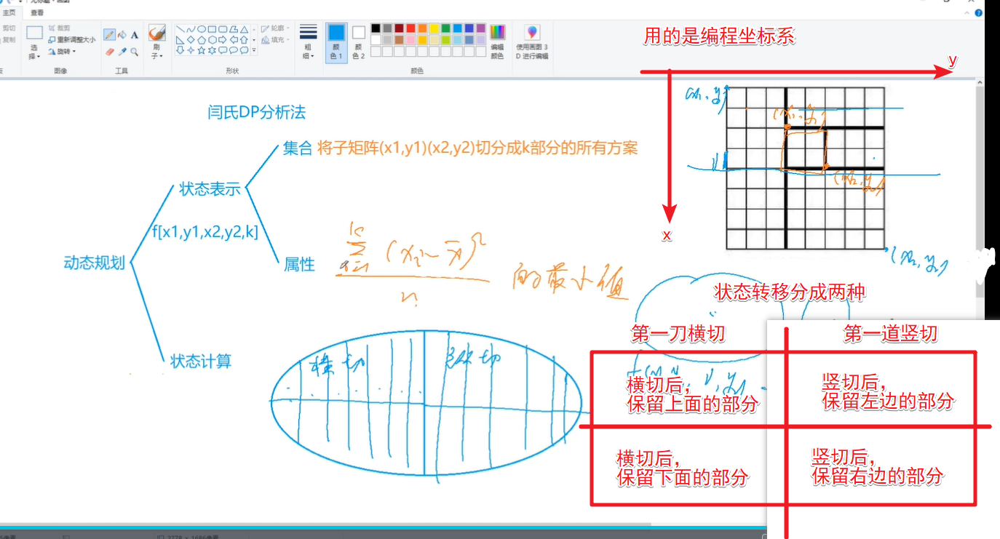

分析如上，这里用记忆化搜索来写。

矩形平方和用二维前缀和来优化。

```cpp
#include <cstring>
#include <iostream>
#include <algorithm>
#include <cmath>

using namespace std;

const int N = 15, M = 9;
const double INF = 1e9;

int n, m = 8;
int s[M][M];
double f[M][M][M][M][N];
double X;

int get_sum(int x1, int y1, int x2, int y2)
{
    return s[x2][y2] - s[x2][y1 - 1] - s[x1 - 1][y2] + s[x1 - 1][y1 - 1];
}

double get(int x1, int y1, int x2, int y2)
{
    double sum = get_sum(x1, y1, x2, y2) - X;
    return (double)sum * sum / n;
}

double dp(int x1, int y1, int x2, int y2, int k)
{
    double &v = f[x1][y1][x2][y2][k];
    if (v >= 0) return v;  // 之前算过这块了
    if (k == 1) return v = get(x1, y1, x2, y2);

    v = INF;
    for (int i = x1; i < x2; i ++ )  // 横切
    {
        v = min(v, get(x1, y1, i, y2) + dp(i + 1, y1, x2, y2, k - 1));
        v = min(v, get(i + 1, y1, x2, y2) + dp(x1, y1, i, y2, k - 1));
    }

    for (int i = y1; i < y2; i ++ )  // 竖切
    {
        v = min(v, get(x1, y1, x2, i) + dp(x1, i + 1, x2, y2, k - 1));
        v = min(v, get(x1, i + 1, x2, y2) + dp(x1, y1, x2, i, k - 1));
    }

    return v;
}

int main()
{
    cin >> n;
    for (int i = 1; i <= m; i ++ )
        for (int j = 1; j <= m; j ++ )
        {
            cin >> s[i][j];
            s[i][j] += s[i - 1][j] + s[i][j - 1] - s[i - 1][j - 1];
        }

    X = (double)s[m][m] / n;  // 别忘了转为 double
    memset(f, -1, sizeof f);  // 记忆化搜索前，清空 dp
    printf("%.3lf\n", sqrt(dp(1, 1, 8, 8, n)));

    return 0;
}
```
