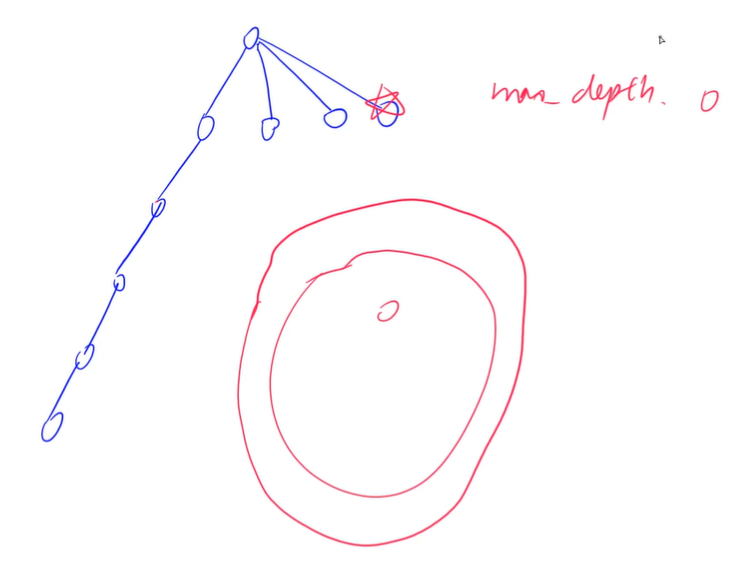
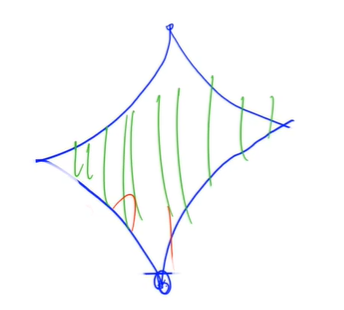
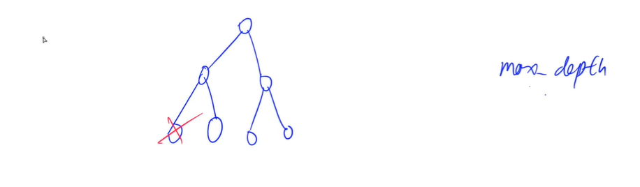
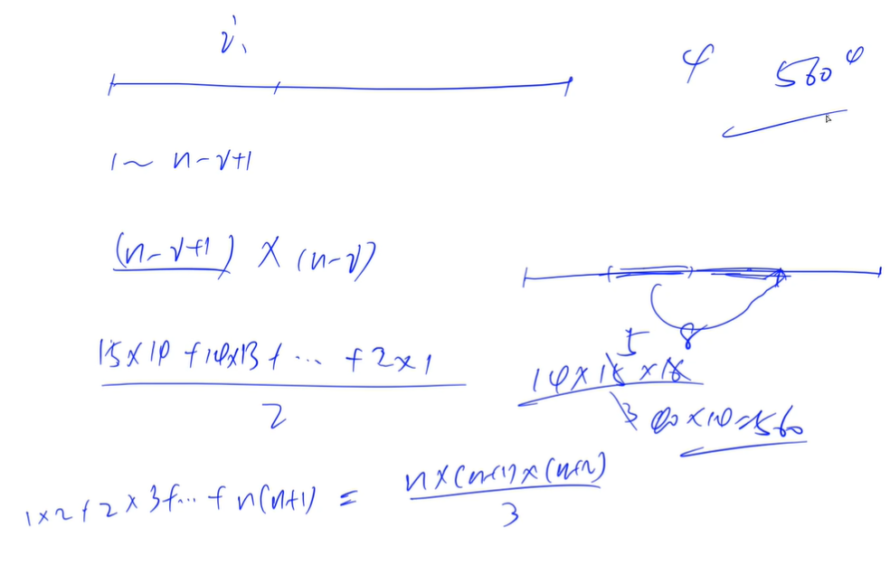
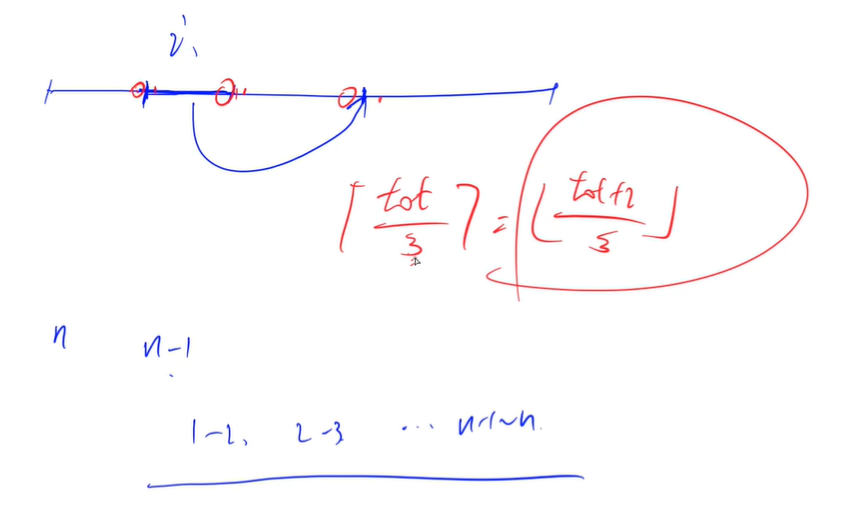
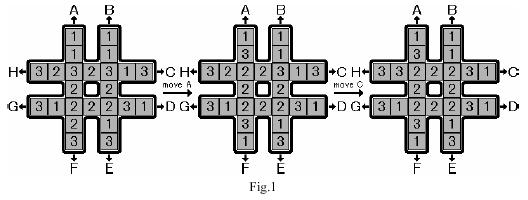

<!-- @import "[TOC]" {cmd="toc" depthFrom=1 depthTo=6 orderedList=false} -->

<!-- code_chunk_output -->

- [迭代加深](#迭代加深)
  - [加成序列](#加成序列)
- [双向DFS](#双向dfs)
  - [送礼物](#送礼物)
- [IDA*](#ida)
  - [排书](#排书)
  - [回转游戏](#回转游戏)

<!-- /code_chunk_output -->

### 迭代加深



如上，答案可能在浅层，但是我们可能陷入某一个很深的层。因此我们定义一个 `max_depth` ，在某个范围内搜索，并且逐渐扩大。本质上还是 `dfs` ，并非 `bfs` 。

#### 加成序列

满足如下条件的序列 $X$（序列中元素被标号为 $1、2、3...m$）被称为“加成序列”：

- $X[1]=1$
- $X[m]=n$
- $X[1]<X[2]<...<X[m-1]<X[m]$
- 对于每个 $k$（$2 \le k \le m$）都存在两个整数 $i$ 和 $j$ （$1 \le i,j \le k-1$，$i$ 和 $j$ 可相等），使得 $X[k]=X[i]+X[j]$。

你的任务是：给定一个整数 $n$，找出符合上述条件的长度 $m$ 最小的“加成序列”。

<p>如果有多个满足要求的答案，只需要找出任意一个可行解。</p>

<h4>输入格式</h4>

<p>输入包含多组测试用例。</p>

每组测试用例占据一行，包含一个整数 $n$。

当输入为单行的 $0$ 时，表示输入结束。

<h4>输出格式</h4>

<p>对于每个测试用例，输出一个满足需求的整数序列，数字之间用空格隔开。</p>

<p>每个输出占一行。</p>

<h4>数据范围</h4>

$1 \le n \le 100$

<h4>输入样例：</h4>

<pre><code>
5
7
12
15
77
0
</code></pre>

<h4>输出样例：</h4>

<pre><code>
1 2 4 5
1 2 4 6 7
1 2 4 8 12
1 2 4 5 10 15
1 2 4 8 9 17 34 68 77
</code></pre>


每层搜索一个数，层不会很深（因为构造的数列不会很长）。答案会在某个浅层里，而不是一股脑搜到100个数再退回来。

搜索顺序为从小到大搜索，还有剪枝：
- 优先枚举较大的数（倒序枚举候选数字）
- 排除等效冗余：枚举前面两数的和，而非枚举接下来选哪个数；注意到前两数和可能是一样的，因此这种情况只枚举一次

```cpp
#include <cstring>
#include <iostream>
#include <algorithm>

using namespace std;

const int N = 110;

int n;
int path[N];

bool dfs(int u, int k)  // 当前层，最大深度
{
    if (u == k) return path[u - 1] == n;  // 抵达最大层，是否找到解

    bool st[N] = {0};  // 当前已经用过的数字
    for (int i = u - 1; i >= 0; i -- )  // 从大到小枚举所有组合数
        for (int j = i; j >= 0; j -- )
        {
            int s = path[i] + path[j];  
            if (s > n || s <= path[u - 1] || st[s]) continue;  // 大于 n 或者不严格递增 或者被搜索过，不行
            st[s] = true;
            path[u] = s;
            if (dfs(u + 1, k)) return true;
        }

    return false;
}

int main()
{
    path[0] = 1;  // 第一个数一定是 1
    while (cin >> n, n)
    {
        int k = 1;
        while (!dfs(1, k)) k ++ ;  // 该深度找不到解时，增大层数

        for (int i = 0; i < k; i ++ ) cout << path[i] << ' ';
        cout << endl;
    }

    return 0;
}
```

### 双向DFS



如上，和双向BFS很像。原理也是相同的。

#### 送礼物

达达帮翰翰给女生送礼物，翰翰一共准备了 $N$ 个礼物，其中第 $i$ 个礼物的重量是 $G[i]$。

达达的力气很大，他一次可以搬动重量之和不超过 $W$ 的任意多个物品。

达达希望一次搬掉尽量重的一些物品，请你告诉达达在他的力气范围内一次性能搬动的最大重量是多少。

<h4>输入格式</h4>

第一行两个整数，分别代表 $W$ 和 $N$。

以后 $N$ 行，每行一个正整数表示 $G[i]$。

<h4>输出格式</h4>

<p>仅一个整数，表示达达在他的力气范围内一次性能搬动的最大重量。</p>

<h4>数据范围</h4>

- $1 \le N \le 46$,
- $1 \le W,G[i] \le 2^{31}-1$

<h4>输入样例：</h4>

<pre><code>
20 5
7
5
4
18
1
</code></pre>

<h4>输出样例：</h4>

<pre><code>
19
</code></pre>

如果枚举各个物品有或者没有，则是 $2^{46}$ 。因此思考 **用时间换空间** 。

比如前 3 个物品重量 `4 5 7` 它们组合的重量就是 `4 5 7 11 12 16` 。

我们把前一半物品组合，因此一共有 `2^{23} ≈ 8e6` 这么多种组合。

这道题总体思路：
- 将所有物品按重量从大到小排序
- 先将前K件物品能凑出的所有重量打表，然后排序判重
- 搜索剩下的N-K件物品的选择方式，然后在表中而分出总和不超过W的最大值

时间复杂度：$2^{K} + 2^{N-K}log_2{2^{K}} = 2^K + 2^{N-K} * K$

```cpp
// 因为重量 2^31 - 1 因此无法用背包 DP
// 但是 N 较小，因此可以暴搜#include <cstring>
#include <iostream>
#include <algorithm>

using namespace std;

typedef long long LL;

const int N = 46;

int n, m, k;
int w[N];
int weights[1 << 25], cnt = 1;  // 注意 weights[0] = 0 也是一种组合
int ans;

void dfs1(int u, int s)
{
    if (u == k)  // 前 u 个数都遍历完，新组合出现
    {
        weights[cnt ++ ] = s;
        return;
    }
    
    // 两个分支：第 u 个数选或不选
    dfs1(u + 1, s);
    if ((LL)s + w[u] <= m) dfs1(u + 1, s + w[u]);  // 注意 LL
}

void dfs2(int u, int s)
{
    if (u >= n)  // 如果此时后 n-k 也遍历完了，那在前 k 个数里找让 ans 最大的
    {
        int l = 0, r = cnt - 1;
        while (l < r)
        {
            int mid = l + r + 1 >> 1;
            if ((LL)s + weights[mid] <= m) l = mid;
            else r = mid - 1;
        }
        ans = max(ans, s + weights[l]);
        return;
    }
    
    // 两个分支： u 这个数选或者不选
    dfs2(u + 1, s);
    if ((LL)s + w[u] <= m) dfs2(u + 1, s + w[u]);
}

int main()
{
    cin >> m >> n;
    for (int i = 0; i < n; i ++ ) cin >> w[i];

    sort(w, w + n);
    reverse(w, w + n);  // 从大到小组合

    k = n / 2 + 2;
    dfs1(0, 0);  // 前 k 个数组合

    sort(weights, weights + cnt);
    cnt = unique(weights, weights + cnt) - weights;  // 去重，并且返回还剩几个数

    dfs2(k, 0);  // 后 n-k 个数 dfs

    cout << ans << endl;

    return 0;
}
```

### IDA*

IDA* 比 A* 好理解，两者相似。

IDA* 往往配合迭代加深。



预估一下，如果当前点至迭代完成的步数大于 `max_depth` ，则没必要接着探索了。

说白了就是一种启发式剪枝。其要求也很明了：估价函数的值必须小于等于真实步数。

#### 排书

给定 $n$ 本书，编号为 $1 \sim n$。

<p>在初始状态下，书是任意排列的。</p>

<p>在每一次操作中，可以抽取其中连续的一段，再把这段插入到其他某个位置。</p>

我们的目标状态是把书按照 $1 \sim n$ 的顺序依次排列。

<p>求最少需要多少次操作。</p>

<h4>输入格式</h4>

第一行包含整数 $T$，表示共有 $T$ 组测试数据。

每组数据包含两行，第一行为整数 $n$，表示书的数量。

第二行为 $n$ 个整数，表示 $1 \sim n$ 的一种任意排列。

<p>同行数之间用空格隔开。</p>

<h4>输出格式</h4>

<p>每组数据输出一个最少操作次数。</p>

如果最少操作次数大于或等于 $5$ 次，则输出 <code>5 or more</code>。

<p>每个结果占一行。</p>

<h4>数据范围</h4>

$1 \le n \le 15$

<h4>输入样例：</h4>

<pre><code>
3
6
1 3 4 6 2 5
5
5 4 3 2 1
10
6 8 5 3 4 7 2 9 1 10
</code></pre>

<h4>输出样例：</h4>

<pre><code>
2
3
5 or more
</code></pre>



如上，我们取长度 `i` 的段，则一共有 `1~n-i+1` 个段可选，现在一共还剩 `n-i` 个数，则有 `n-i+1` 个空缺可以给我们取出的段插入，由于不能插入其原本所在的位置，因此，有 `n-i` 个空缺插入。

此外，对于段`ABCD`，我们把`B`插到`C`后，和把`C`插到`B`前是一样的。因此最终插入的动作数量要除以2。

每次我们的可选方案数量最坏为：

$$\frac{15\times 14 + 14 \times 13 + ... + 2 \times 1}{2} = \frac{14\times 15 \times 16}{3 \times 2} = 560$$

因此如果暴搜，本题时间复杂度 $560^4$ 。



如何求估计函数？

我们最终的目的为：让每个数的后继关系都是正确的。比如`1`后面要是`2`，`2`后面要是`3`以此类推。

一个长度为`n`序列排好序，其正确后继数量应该是`n-1`。

如上图，我们移动某一段，顶多改变3个数的后继关系。假设我们当前有`tot`个后继是不正确的，则我们最少需要操作 `tot/3` 上取整次（即`(tot+2)/3`下取整次）：

$$\lceil \frac{tot}{3} \rceil=\lfloor \frac{tot+2}{3} \rfloor$$

```cpp
#include <cstring>
#include <iostream>
#include <algorithm>

using namespace std;

const int N = 15;

int n;
int q[N];     // 
int w[5][N];  // 把每一层都备份，方便恢复现场

int f()  // 估价函数
{
    int cnt = 0;
    for (int i = 0; i + 1 < n; i ++ )
        if (q[i + 1] != q[i] + 1)
            cnt ++ ;
    return (cnt + 2) / 3;
}

bool check()
{
    for (int i = 0; i + 1 < n; i ++ )
        if (q[i + 1] != q[i] + 1)
            return false;
    return true;
}

bool dfs(int depth, int max_depth)
{
    if (depth + f() > max_depth) return false;  // IDA* 剪枝
    if (check()) return true;

    for (int len = 1; len <= n; len ++ )
        for (int l = 0; l + len - 1 < n; l ++ )
        {
            int r = l + len - 1;                // 0000 l 1111 r 2222 k 3333
            for (int k = r + 1; k < n; k ++ )   // 0000 2222 k l 1111 r 3333
            {
                memcpy(w[depth], q, sizeof q);
                int x, y;
                for (x = r + 1, y = l; x <= k; x ++, y ++ ) q[y] = w[depth][x];
                for (x = l; x <= r; x ++, y ++ ) q[y] = w[depth][x];
                if (dfs(depth + 1, max_depth)) return true;
                memcpy(q, w[depth], sizeof q);
            }
        }

    return false;
}

int main()
{
    int T;
    cin >> T;
    while (T -- )
    {
        cin >> n;
        for (int i = 0; i < n; i ++ ) cin >> q[i];

        int depth = 0;
        while (depth < 5 && !dfs(0, depth)) depth ++ ;
        if (depth >= 5) puts("5 or more");
        else cout << depth << endl;
    }

    return 0;
}
```

#### 回转游戏

如下图所示，有一个 <code>#</code> 形的棋盘，上面有 $1,2,3$ 三种数字各 $8$ 个。

给定 $8$ 种操作，分别为图中的 $A \sim H$。

这些操作会按照图中字母和箭头所指明的方向，把一条长为 $7$ 的序列循环移动 $1$ 个单位。

例如下图最左边的 <code>#</code> 形棋盘执行操作 $A$ 后，会变为下图中间的 <code>#</code> 形棋盘，再执行操作 $C$ 后会变成下图最右边的 <code>#</code> 形棋盘。

给定一个初始状态，请使用最少的操作次数，使 <code>#</code> 形棋盘最中间的 $8$ 个格子里的数字相同。



<h4>输入格式</h4>

<p>输入包含多组测试用例。</p>

每个测试用例占一行，包含 $24$ 个数字，表示将初始棋盘中的每一个位置的数字，按整体从上到下，同行从左到右的顺序依次列出。

<p>输入样例中的第一个测试用例，对应上图最左边棋盘的初始状态。</p>

当输入只包含一个 $0$ 的行时，表示输入终止。

<h4>输出格式</h4>

<p>每个测试用例输出占两行。</p>

第一行包含所有移动步骤，每步移动用大写字母 $A \sim H$ 中的一个表示，字母之间没有空格，如果不需要移动则输出 <code>No moves needed</code>。

第二行包含一个整数，表示移动完成后，中间 $8$ 个格子里的数字。

<p>如果有多种方案，则输出字典序最小的解决方案。</p>

<h4>输入样例：</h4>

<pre><code>
1 1 1 1 3 2 3 2 3 1 3 2 2 3 1 2 2 2 3 1 2 1 3 3
1 1 1 1 1 1 1 1 2 2 2 2 2 2 2 2 3 3 3 3 3 3 3 3
0
</code></pre>

<h4>输出样例：</h4>

<pre><code>
AC
2
DDHH
2
</code></pre>

按照字典序顺序枚举，则一定可以得到字典序最小的序列。

估价函数：当前中心区域最多的数字的个数为 `cnt` ，则还需要的最少步骤为 `8 - cnt` 。

还有些其他优化：
- 人工打表：给 24 个格子标号
- 冗余操作：我们操作了 `A` ，则下一步一定不会是 `F`

```cpp
/*
      0     1
      2     3
4  5  6  7  8  9  10
      11    12
13 14 15 16 17 18 19
      20    21
      22    23
*/

#include <cstring>
#include <iostream>
#include <algorithm>

using namespace std;

const int N = 24;

int op[8][7] = {
    {0, 2, 6, 11, 15, 20, 22},
    {1, 3, 8, 12, 17, 21, 23},
    {10, 9, 8, 7, 6, 5, 4},
    {19, 18, 17, 16, 15, 14, 13},
    {23, 21, 17, 12, 8, 3, 1},
    {22, 20, 15, 11, 6, 2, 0},
    {13, 14, 15, 16, 17, 18, 19},
    {4, 5, 6, 7, 8, 9, 10}
};

int opposite[8] = {5, 4, 7, 6, 1, 0, 3, 2};  // 给操作编号 ABCDEFGH
int center[8] = {6, 7, 8, 11, 12, 15, 16, 17};

int q[N];
int path[100];

int f()
{
    static int sum[4];  // static 不用每次都分配空间，可能会快一些
    memset(sum, 0, sizeof sum);
    for (int i = 0; i < 8; i ++ ) sum[q[center[i]]] ++ ;

    int maxv = 0;
    for (int i = 1; i <= 3; i ++ ) maxv = max(maxv, sum[i]);

    return 8 - maxv;
}

void operate(int x)
{
    int t = q[op[x][0]];
    for (int i = 0; i < 6; i ++ ) q[op[x][i]] = q[op[x][i + 1]];
    q[op[x][6]] = t;
}

bool dfs(int depth, int max_depth, int last)
{
    if (depth + f() > max_depth) return false;
    if (f() == 0) return true;

    for (int i = 0; i < 8; i ++ )
        if (last != opposite[i])
        {
            operate(i);
            path[depth] = i;
            if (dfs(depth + 1, max_depth, i)) return true;
            operate(opposite[i]);
        }

    return false;
}

int main()
{
    while (cin >> q[0], q[0])
    {
        for (int i = 1; i < 24; i ++ ) cin >> q[i];

        int depth = 0;
        while (!dfs(0, depth, -1)) depth ++ ;  // - 1 表示上一步没有操作

        if (!depth) printf("No moves needed");
        else
        {
            for (int i = 0; i < depth; i ++ ) printf("%c", 'A' + path[i]);
        }
        printf("\n%d\n", q[6]);
    }

    return 0;
}
```
