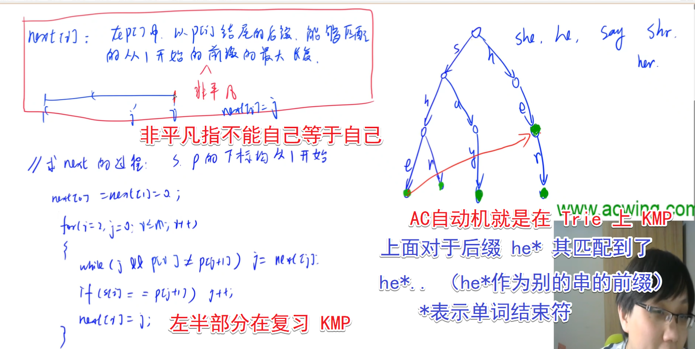
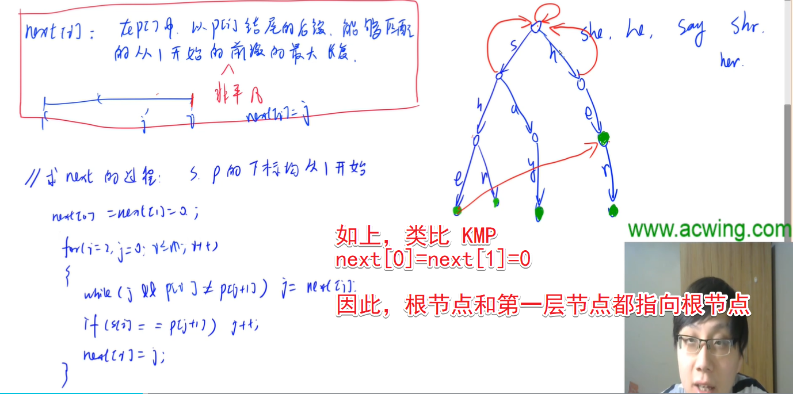
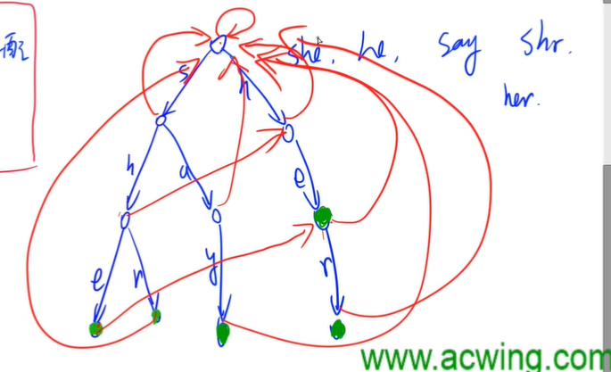
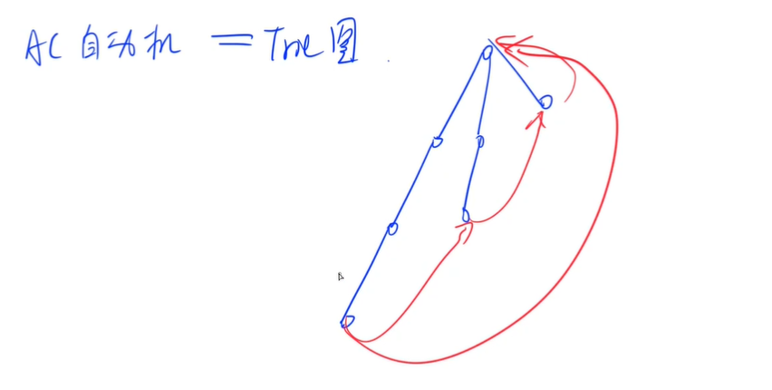
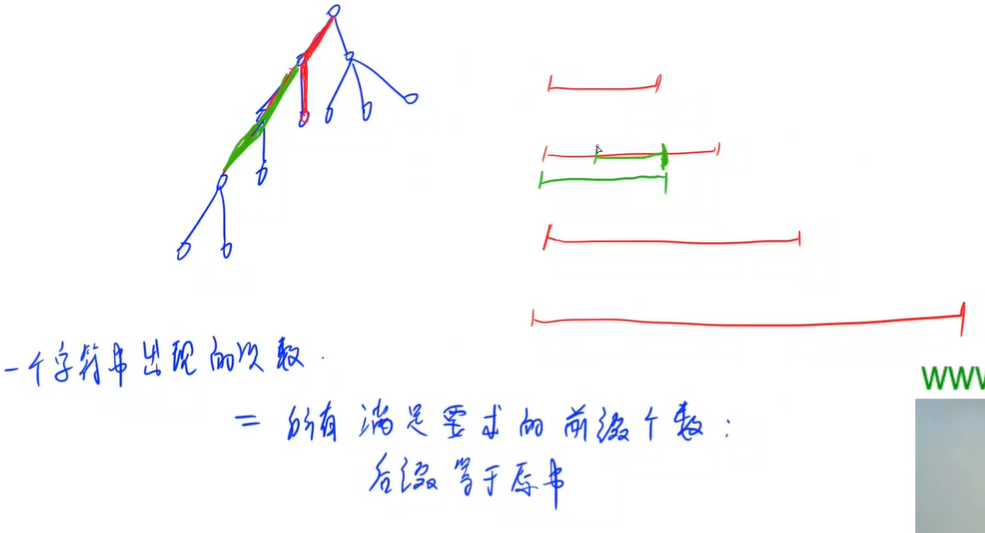
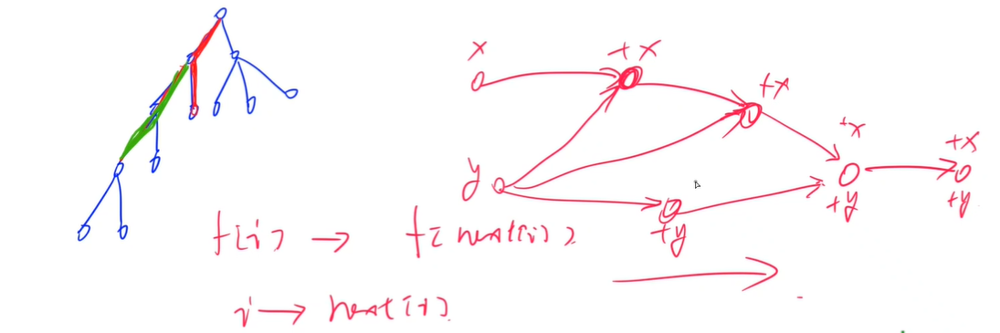

<!-- @import "[TOC]" {cmd="toc" depthFrom=1 depthTo=6 orderedList=false} -->

<!-- code_chunk_output -->

- [AC自动机](#ac自动机)
  - [搜索关键词](#搜索关键词)
  - [优化为 Trie 图](#优化为-trie-图)
  - [单词](#单词)
- [状态机模型](#状态机模型)
  - [修复DNA（Trie图+状态机DP）](#修复dnatrie图状态机dp)

<!-- /code_chunk_output -->

### AC自动机

AC自动机（多模式匹配算法）大概是 Trie + KMP

可以扩展为 Trie 图。

AC自动机是线性的， Trie 图也是。

具体看例题。

#### 搜索关键词

给定 $n$ 个长度不超过 $50$ 的由小写英文字母组成的单词，以及一篇长为 $m$ 的文章。

请问，有多少个单词在文章中出现了。

<h4>输入格式</h4>

第一行包含整数 $T$，表示共有 $T$ 组测试数据。

对于每组数据，第一行一个整数 $n$，接下去 $n$ 行表示 $n$ 个单词，最后一行输入一个字符串，表示文章。

<h4>输出格式</h4>

对于每组数据，输出一个占一行的整数，表示有多少个单词在文章中出现。

<h4>数据范围</h4>

- $1 \le n \le 10^4$,
- $1 \le m \le 10^6$

<h4>输入样例：</h4>

```
1
5
she
he
say
shr
her
yasherhs
```

<h4>输出样例：</h4>

```
3
```



如上，对于本题样例，一次有意义的匹配如上。





如上，最终的匹配如上。

```cpp
#include <cstdio>
#include <cstring>
#include <iostream>
#include <algorithm>

using namespace std;

const int N = 10010, S = 55, M = 1000010;

int n;
int tr[N * S][26], cnt[N * S], idx;
char str[M];
int q[N * S], ne[N * S];

// 建立 Trie 树，插入一个单词
void insert()
{
    int p = 0;
    for (int i = 0; str[i]; i ++ )
    {
        int t = str[i] - 'a';
        if (!tr[p][t]) tr[p][t] = ++ idx;
        p = tr[p][t];
    }
    cnt[p] ++ ;
}

// 构建 AC自动机，即 next 数组
void build()
{
    int hh = 0, tt = -1;
    // 把第1层的都放到队列里来
    // 用队列是为了保证层序遍历
    for (int i = 0; i < 26; i ++ )
        if (tr[0][i])
            q[ ++ tt] = tr[0][i];

    while (hh <= tt)
    {
        int t = q[hh ++ ];
        // 对于一个 Trie 节点
        // 遍历其子节点p
        // 如果该子节点不存在，不用看
        // 否则，继续沿着 ne[] 走，找到匹配的前缀 j
        // 如果 j 这个点也有 i 这个字符的儿子，j再前进一步
        // 否则 ne[子节点p] 就是 0
        for (int i = 0; i < 26; i ++ )
        {
            int p = tr[t][i];
            if (!p) continue;

            int j = ne[t];
            while (j && !tr[j][i]) j = ne[j];
            if (tr[j][i]) j = tr[j][i];
            ne[p] = j;
            q[ ++ tt ] = p;
        }
    }
}

int main()
{
    int T;
    scanf("%d", &T);
    while (T -- )
    {
        memset(tr, 0, sizeof tr);
        memset(cnt, 0, sizeof cnt);
        memset(ne, 0, sizeof ne);
        idx = 0;

        scanf("%d", &n);
        for (int i = 0; i < n; i ++ )
        {
            scanf("%s", str);
            insert();
        }

        build();

        scanf("%s", str);

        int res = 0;
        for (int i = 0, j = 0; str[i]; i ++ )
        {
            int t = str[i] - 'a';
            while (j && !tr[j][t]) j = ne[j];
            if (tr[j][t]) j = tr[j][t];

            // she 能匹配到，则 he 也一定能匹配到
            // 因此也要看看 he* 的 cnt 是多少
            // 因此，要把 ne 全部遍历一遍
            // 遍历后别忘了 cnt 清零，防止重复加
            // 其实，AC自动机应该是线性的，只往前跳一次
            // 但是这里跳了多次，O(n^2)了，所以其实不适合这么做
            // 但是这里是模板题，就不计较了
            int p = j;
            while (p)
            {
                res += cnt[p];
                cnt[p] = 0;
                p = ne[p];
            }
        }

        printf("%d\n", res);
    }

    return 0;
}
```

#### 优化为 Trie 图

承接上题。

如下，我们发现下一字符串不匹配后，会让 `j` 跳回 `ne[j]` 看看更短的前缀下一字符串是否匹配。直到匹配了。



是否可以让 `j` 不要这么连续地跳着查找呢。

```cpp
// 重新定义了 Trie 树，变为了 Trie 图
#include <cstdio>
#include <cstring>
#include <iostream>
#include <algorithm>

using namespace std;

const int N = 10010, S = 55, M = 1000010;

int n;
int tr[N * S][26], cnt[N * S], idx;
char str[M];
int q[N * S], ne[N * S];

void insert()
{
    int p = 0;
    for (int i = 0; str[i]; i ++ )
    {
        int t = str[i] - 'a';
        if (!tr[p][t]) tr[p][t] = ++ idx;
        p = tr[p][t];
    }
    cnt[p] ++ ;
}

void build()
{
    int hh = 0, tt = -1;
    for (int i = 0; i < 26; i ++ )
        if (tr[0][i])
            q[ ++ tt] = tr[0][i];

    while (hh <= tt)
    {
        int t = q[hh ++ ];
        for (int i = 0; i < 26; i ++ )
        {
            int p = tr[t][i];  // 如果不存在，则指向父节点的 ne 指针这里
            // 这个父节点的 ne 指针是之前层就处理好的，指向的地方一定是有效的、匹配的
            if (!p) tr[t][i] = tr[ne[t]][i];
            else
            {
                // 这样在给存在的 p 赋 ne 值时，也不需要重复往上跳来找
                ne[p] = tr[ne[t]][i];
                q[ ++ tt] = p;
            }
        }
    }
}

int main()
{
    int T;
    scanf("%d", &T);
    while (T -- )
    {
        memset(tr, 0, sizeof tr);
        memset(cnt, 0, sizeof cnt);
        memset(ne, 0, sizeof ne);
        idx = 0;

        scanf("%d", &n);
        for (int i = 0; i < n; i ++ )
        {
            scanf("%s", str);
            insert();
        }

        build();

        scanf("%s", str);

        int res = 0;
        for (int i = 0, j = 0; str[i]; i ++ )
        {
            // 注意这里也需要优化，直接检查 trie 树就行
            int t = str[i] - 'a';
            j = tr[j][t];

            int p = j;
            while (p)
            {
                res += cnt[p];
                cnt[p] = 0;
                p = ne[p];
            }
        }

        printf("%d\n", res);
    }

    return 0;
}
```

#### 单词

某人读论文，一篇论文是由许多单词组成的。

但他发现一个单词会在论文中出现很多次，现在他想知道每个单词分别在论文中出现多少次。

<h4>输入格式</h4>

第一行一个整数 $N$，表示有多少个单词。

接下来 $N$ 行每行一个单词，单词中只包含小写字母。

<h4>输出格式</h4>

输出 $N$ 个整数，每个整数占一行，第 $i$ 行的数字表示第 $i$ 个单词在文章中出现了多少次。

<h4>数据范围</h4>

- $1 \le N \le 200$,
- 所有单词长度的总和不超过 $10^6$。

<h4>输入样例：</h4>

```
3
a
aa
aaa
```

<h4>输出样例：</h4>

```
6
3
1
```



如上，一个字符串的出现次数，为所有满足要求的前缀的个数。满足什么要求呢？这个前缀的后缀等于原串。

肯定不能遍历所有节点，对于前缀，我们从大往小走：
```
next[i]
next[next[i]]
next[next[next[i]]]
...
```

这样肯定能不漏掉满足要求的前缀。



如上，我们可以想象成图，对于方案数，累加就行（按照拓扑序枚举）。

```cpp
#include <cstdio>
#include <cstring>
#include <iostream>
#include <algorithm>

using namespace std;

const int N = 1000010;

int n;
int tr[N][26], f[N], idx;
int q[N], ne[N];
char str[N];
int id[210];  // 第 i 个单词的 id

void insert(int x)
{
    int p = 0;
    for (int i = 0; str[i]; i ++ )
    {
        int t = str[i] - 'a';
        if (!tr[p][t]) tr[p][t] = ++ idx;
        p = tr[p][t];
        f[p] ++ ;  // 每个节点都算一个单词的结尾
    }
    id[x] = p;
}

void build()
{
    int hh = 0, tt = -1;
    for (int i = 0; i < 26; i ++ )
        if (tr[0][i])
            q[ ++ tt] = tr[0][i];

    while (hh <= tt)
    {
        int t = q[hh ++ ];
        for (int i = 0; i < 26; i ++ )
        {
            int &p = tr[t][i];
            if (!p) p = tr[ne[t]][i];
            else
            {
                ne[p] = tr[ne[t]][i];
                q[ ++ tt] = p;
            }
        }
    }
}

int main()
{
    scanf("%d", &n);

    for (int i = 0; i < n; i ++ )
    {
        scanf("%s", str);
        insert(i);
    }

    build();

    // 队列里，倒着遍历是拓扑序
    // 对于字符串 q[i] （这里q[i]是其编号），其出现次数也就是其最长公共后缀ne[q[i]]出现次数
    // 所以要把其累加到前面去
    for (int i = idx - 1; i >= 0; i -- ) f[ne[q[i]]] += f[q[i]];

    for (int i = 0; i < n; i ++ ) printf("%d\n", f[id[i]]);

    return 0;
}
```

### 状态机模型

#### 修复DNA（Trie图+状态机DP）

生物学家终于发明了修复DNA的技术，能够将包含各种遗传疾病的DNA片段进行修复。

为了简单起见，DNA看作是一个由'A', 'G' , 'C' , 'T'构成的字符串。

修复技术就是通过改变字符串中的一些字符，从而消除字符串中包含的致病片段。

例如，我们可以通过改变两个字符，将DNA片段'AAGCAG'变为'AGGCAC'，从而使得DNA片段中不再包含致病片段'AAG'，'AGC'，'CAG'，以达到修复该DNA片段的目的。

需注意，被修复的DNA片段中，仍然只能包含字符'A', 'G' , 'C' , 'T'。

请你帮助生物学家修复给定的DNA片段，并且修复过程中改变的字符数量要尽可能的少。

<h4>输入格式</h4>

输入包含多组测试数据。

每组数据第一行包含整数N，表示致病DNA片段的数量。

接下来N行，每行包含一个长度不超过20的非空字符串，字符串中仅包含字符'A', 'G' , 'C' , 'T'，用以表示致病DNA片段。

再一行，包含一个长度不超过1000的非空字符串，字符串中仅包含字符'A', 'G' , 'C' , 'T'，用以表示待修复DNA片段。

最后一组测试数据后面跟一行，包含一个0，表示输入结束。

<h4>输出格式</h4>

每组数据输出一个结果，每个结果占一行。

输入形如'Case x: y'，其中x为测试数据编号（从1开始），y为修复过程中所需改变的字符数量的最小值，如果无法修复给定DNA片段，则y为'-1'。

<h4>数据范围</h4>

$1 \le N \le 50$

<h4>输入样例：</h4>

```
2
AAA
AAG
AAAG    
2
A
TG
TGAATG
4
A
G
C
T
AGT
0
```

<h4>输出样例：</h4>

```
Case 1: 1
Case 2: 4
Case 3: -1
```

`f(i, j)` 前 `i` 个字母，当前走到了 AC自动机中的第 `j` 个位置的所有操作方案中，最少修改的字母数量。

这题就是[设计密码](./ypro.1.4.md#设计密码kmp多个状态自动机)的扩展。

```cpp
#include <cstdio>
#include <cstring>
#include <iostream>
#include <algorithm>

using namespace std;

const int N = 1010;

int n, m;
int tr[N][4], dar[N], idx;  // dar 为 1 则是致病片段
int q[N], ne[N];
char str[N];

int f[N][N];

int get(char c)
{
    if (c == 'A') return 0;
    if (c == 'T') return 1;
    if (c == 'G') return 2;
    return 3;
}

void insert()
{
    int p = 0;
    for (int i = 0; str[i]; i ++ )
    {
        int t = get(str[i]);
        if (tr[p][t] == 0) tr[p][t] = ++ idx;
        p = tr[p][t];
    }
    dar[p] = 1;
}

void build()
{
    int hh = 0, tt = -1;
    for (int i = 0; i < 4; i ++ )
        if (tr[0][i])
            q[ ++ tt] = tr[0][i];

    while (hh <= tt)
    {
        int t = q[hh ++ ];
        for (int i = 0; i < 4; i ++ )
        {
            int p = tr[t][i];
            if (!p) tr[t][i] = tr[ne[t]][i];
            else
            {
                ne[p] = tr[ne[t]][i];
                q[ ++ tt] = p;
                dar[p] |= dar[ne[p]];
            }
        }
    }
}

int main()
{
    int T = 1;
    while (scanf("%d", &n), n)
    {
        memset(tr, 0, sizeof tr);
        memset(dar, 0, sizeof dar);
        memset(ne, 0, sizeof ne);
        idx = 0;

        for (int i = 0; i < n; i ++ )
        {
            scanf("%s", str);
            insert();
        }

        build();

        scanf("%s", str + 1);
        m = strlen(str + 1);

        memset(f, 0x3f, sizeof f);  // 除了 (0, 0) 其他方案都不合法，为正无穷
        f[0][0] = 0;
        for (int i = 0; i < m; i ++ )
            for (int j = 0; j <= idx; j ++ )
                for (int k = 0; k < 4; k ++ )
                {
                    int t = get(str[i + 1]) != k;  // 第 i+1 个位置是否需要修改
                    int p = tr[j][k];  // trie 图得到对于图上状态 j ，i+1改为 k 的话， Trie 图哪里匹配（到哪个图上状态）
                    if (!dar[p]) f[i + 1][p] = min(f[i + 1][p], f[i][j] + t);  // 修改为 k 后，不是致病基因，则要把方案记录
                }

        int res = 0x3f3f3f3f;
        for (int i = 0; i <= idx; i ++ ) res = min(res, f[m][i]);

        if (res == 0x3f3f3f3f) res = -1;
        printf("Case %d: %d\n", T ++, res);
    }

    return 0;
}s
```
