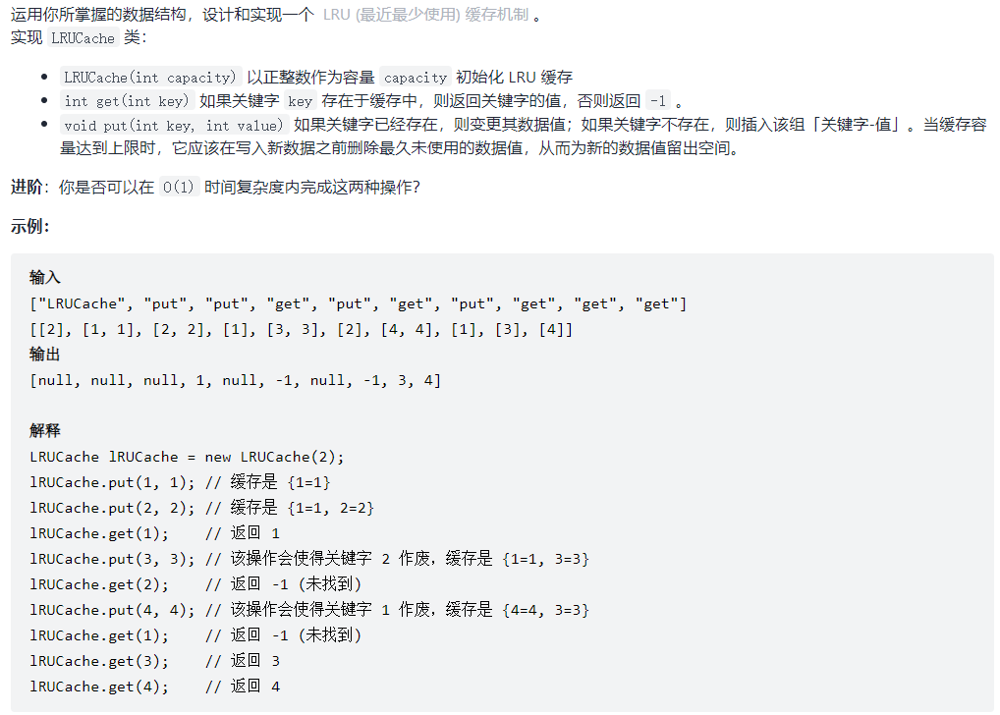

https://leetcode-cn.com/problemset/all/?topicSlugs=linked-list&page=1


<!-- @import "[TOC]" {cmd="toc" depthFrom=1 depthTo=6 orderedList=false} -->

<!-- code_chunk_output -->

- [114. 二叉树展开为链表（前序遍历树转链表）](#114-二叉树展开为链表前序遍历树转链表)
- [146. LRU 缓存机制（哈希表+双向链表）](#146-lru-缓存机制哈希表双向链表)
- [简单题不详记](#简单题不详记)

<!-- /code_chunk_output -->

### 114. 二叉树展开为链表（前序遍历树转链表）


就是一道普通的递归，但本题难点在于，左子树的最后一个节点指向右子树的第一个节点，因此让 dfs 返回本树的最后一个节点。

还应该注意一点，本题中 `treeNode->left` 最终没用了，需要赋值 `nullptr` ，否则报错 `AddressSanitizer: heap-use-after-free on address` 。

```cpp
/**
 * Definition for a binary tree node.
 * struct TreeNode {
 *     int val;
 *     TreeNode *left;
 *     TreeNode *right;
 *     TreeNode() : val(0), left(nullptr), right(nullptr) {}
 *     TreeNode(int x) : val(x), left(nullptr), right(nullptr) {}
 *     TreeNode(int x, TreeNode *left, TreeNode *right) : val(x), left(left), right(right) {}
 * };
 */

 // 进阶：你可以使用原地算法（O(1) 额外空间）展开这棵树吗？
class Solution {
public:
    void flatten(TreeNode* root) {
        // 难点在于，左子树的最后一个节点指向右子树的第一个节点
        // 让 dfs 返回本树的最后一个节点
        function<TreeNode*(TreeNode*)> dfs = [&](TreeNode* u) -> TreeNode*
        {
            TreeNode *left = u, *right = u, *leftRes = u, *rightRes = u;
            if (u->left)  // 左子树存在
            {
                left = u->left;
                leftRes = dfs(u->left);
                rightRes = leftRes;  // rightRes 是树 u 的最后一个节点
            }
            if (u->right)  // 右子树存在
            {
                right = u->right;
                rightRes = dfs(u->right);
            }

            if (u != left) u->right = left;  // 左子树存在
            if (u != right) leftRes->right = right;

            u->left = nullptr;  // 一定要有这句
            // 否则 AddressSanitizer: heap-use-after-free on address

            return rightRes;
        };

        if (root) dfs(root);  // 可能是空树
    }
};
```

**经验：**
- C++ 中如果类似 `treeNode->left` 的指针最终没用了，需要赋值 `nullptr` ，否则报错 `AddressSanitizer: heap-use-after-free on address`


执行用时：
- `0 ms`, 在所有 C++ 提交中击败了 $100.00\%$的用户

内存消耗：
- `12.2 MB`, 在所有 C++ 提交中击败了 $98.35\%$ 的用户

### 146. LRU 缓存机制（哈希表+双向链表）



提示：
- $1 <= capacity <= 3000$
- $0 <= key <= 10000$
- $0 <= value <= 10^5$
- 最多调用 $2 * 10^5$ 次 `get` 和 `put`

```cpp
struct DLinkedNode
{
    int key, value;
    DLinkedNode* prev;
    DLinkedNode* next;
    DLinkedNode(): key(0), value(0), prev(nullptr), next(nullptr) {}
    DLinkedNode(int _key, int _value): key(_key), value(_value), prev(nullptr), next(nullptr) {}
};

class LRUCache {
private:  // 定义私有变量，习惯很好
    unordered_map<int, DLinkedNode*> cache;
    DLinkedNode* head;
    DLinkedNode* tail;
    int size;
    int capacity;

public:
    LRUCache(int _capacity): capacity(_capacity), size(0) {  // 这种初始化方式要学会
        head = new DLinkedNode();
        tail = new DLinkedNode();  // 私有变量在初始化时赋值
        head->next = tail;
        tail->prev = head;
    }

    int get(int key) {
        // 如果存在，就将节点移动到头部
        if (!cache.count(key)) // 不存在就返回 -1
            return -1;
        auto node = cache[key];
        moveToHead(node);
        return node->value;
    }

    void put(int key, int value) {
        // 先插，再看空间够不够，不够删除尾节点
        if (cache.count(key))
        {   // 改动现有键值对同时别忘了 move to head
            DLinkedNode* node = cache[key];
            node->value = value;
            moveToHead(node);
        }
        else
        {
            DLinkedNode* node = new DLinkedNode(key, value);
            addToHead(node);
            cache[key] = node;
            ++ size;
            if (size > capacity)
            {
                node = tail->prev;
                removeNode(node);
                cache.erase(node->key);
                delete node;
                -- size;
            }
        }
    }

    void moveToHead(DLinkedNode* node)
    {
        removeNode(node);
        addToHead(node);
    }

    void removeNode(DLinkedNode* node)
    {   // 双向链表删除操作要容易很多
        node->prev->next = node->next;
        node->next->prev = node->prev;
    }

    void addToHead(DLinkedNode* node)
    {   // 双向链表插入操作也不需要临时变量
        node->prev = head;
        node->next = head->next;
        head->next->prev = node;
        head->next = node;
    }
};

/**
 * Your LRUCache object will be instantiated and called as such:
 * LRUCache* obj = new LRUCache(capacity);
 * int param_1 = obj->get(key);
 * obj->put(key,value);
 */
```

使用 STL list 如下。

```cpp
class LRUCache {
private:
  list<pair<int, int>> cache;   ////< @note pair[key]=value
  unordered_map<int, list<pair<int, int>>::iterator> key2node;
  int cap;                      ////< @note 最大容量

public:
  LRUCache(int capacity) : cap(capacity) {}

  int get(int key) {
    if (key2node.find(key) == key2node.end()) {
      return -1;
    }
    pair<int, int> node = *key2node[key];
    cache.erase(key2node[key]); ////< @note 将节点移到链表头部并更新map
    cache.push_front(node);
    key2node[key] = cache.begin();
    return node.second;
  }

  void put(int key, int val) {
    auto newNode = std::make_pair(key, val);

    if (key2node.count(key)) {  ////< @note 若该节点已存在，则删除旧的节点
      cache.erase(key2node[key]);
    } else {
      if (cap == cache.size()) {
        key2node.erase(cache.back().first);
        cache.pop_back();       ////< @note 删除链表最后一个数据
      }
    }

    cache.push_front(newNode);  ////< @node 插入新的节点到头部
    key2node[key] = cache.begin();
  }
};

/**
 * Your LRUCache object will be instantiated and called as such:
 * LRUCache* obj = new LRUCache(capacity);
 * int param_1 = obj->get(key);
 * obj->put(key,value);
 */

// 作者：zhu-que-3
// 链接：https://leetcode.cn/problems/lru-cache/solution/cshuang-xiang-lian-biao-he-ha-xi-biao-by-l476/
// 来源：力扣（LeetCode）
// 著作权归作者所有。商业转载请联系作者获得授权，非商业转载请注明出处。
```

### 简单题不详记
- 138. 复制带随机指针的链表 https://leetcode-cn.com/problems/copy-list-with-random-pointer/ 和 [48. 复杂链表的复刻（不用哈希表可以节省空间）](../../acwings/offers/drafts/20211115.md#48-复杂链表的复刻不用哈希表可以节省空间) 一样的
- 141. 环形链表 https://leetcode-cn.com/problems/linked-list-cycle/ 注意只有在跳出循环后还能保证快慢指针相同的，才是有环
- 142. 环形链表 II https://leetcode-cn.com/problems/linked-list-cycle-ii/ 同 [剑指 offer 的 34. 链表中环的入口结点（快慢指针）](../../acwings/offers/drafts/20211114.md#34-链表中环的入口结点快慢指针)
- 143. 重排链表 https://leetcode-cn.com/problems/reorder-list/ 是三个基础操作的综合：求中点，反转链表，合并链表
