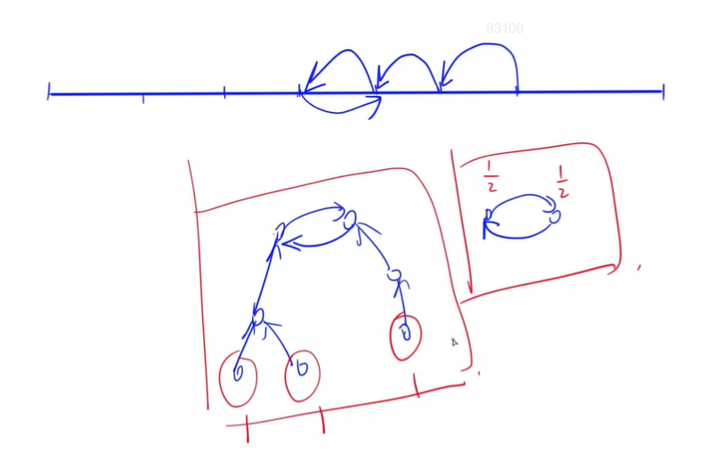

<!-- @import "[TOC]" {cmd="toc" depthFrom=1 depthTo=6 orderedList=false} -->

<!-- code_chunk_output -->

- [1789. 牛为什么过马路 II（枚举在圈的同一侧）](#1789-牛为什么过马路-ii枚举在圈的同一侧)
- [1738. 蹄球（基环图+思维题）](#1738-蹄球基环图思维题)
- [简单题不详记](#简单题不详记)

<!-- /code_chunk_output -->

### 1789. 牛为什么过马路 II（枚举在圈的同一侧）

农夫约翰的农场布局十分奇特，一条大型的环形道路将奶牛吃草的田地围了起来。

每天早晨，奶牛们穿过这条道路，进入到田地吃草；每天晚上，奶牛们穿过这条道路，离开田地，返回牛棚休息。

众所周知，奶牛是有习性的动物，每头奶牛每天通过道路的方式都相同。

每头奶牛每天固定地从道路的某一位置进入田地，从道路的另一不同位置离开田地。

所有奶牛的所有进出位置之间互不相同。

约翰共有 $26$ 头奶牛，依次命名为 $A \sim Z$。

因此，道路上共有 $52$ 个不同的进出位置。

约翰沿着环形道路按顺时针方向扫描了每个位置，并记录了每个位置处经过的奶牛的名字，最终形成了一个包含 $52$ 个字母的序列，$A \sim Z$ 中的每个字母恰好出现两次。

他并没有记录哪些位置是入口，哪些位置是出口。

看着地图上记录的这些位置，约翰想要知道一天当中，有多少对奶牛之间的从入口穿过田地到达出口的路径可能会存在交叉。

如果奶牛 $A$ 从入口穿过田地到达出口的路径必须穿过奶牛 $B$ 从入口穿过田地到达出口的路径，那么称这对牛 $(A, B)$ 是“交叉”对。

请帮助约翰计算“交叉”对（<strong>不考虑顺序，即 $(A, B)$ 与 $(B, A)$ 视为同一对 </strong>）的总数。

<h4>输入格式</h4>

共一行，包含一个长度为 $52$ 的只包含大写字母的字符串，其中每个字母恰好出现两次。

<h4>输出格式</h4>

输出交叉对的总数。

<h4>输入样例：</h4>

```
ABCCABDDEEFFGGHHIIJJKKLLMMNNOOPPQQRRSSTTUUVVWWXXYYZZ
```

<h4>输出样例：</h4>

```
1
```

<h4>样例解释</h4>

在此样例中，只有 $A$ 和 $B$ 一对交叉对。

```cpp
#include <iostream>
#include <cstring>
#include <algorithm>
using namespace std;

vector<int> p[26];

int main()
{
    for (int i = 0; i < 52; ++ i)
    {
        char x;
        cin >> x;
        p[x - 'A'].push_back(i);
    }
    
    int res = 0;
    for (int i = 0; i < 25; ++ i)
        for (int j = i + 1; j < 26; ++ j)
        {
            int cnt = 0;
            if (p[j][0] > p[i][0] && p[j][0] < p[i][1])
                ++ cnt;
            if (p[j][1] > p[i][0] && p[j][1] < p[i][1])
                ++ cnt;
            if (cnt == 1) res ++ ;  // 如果两个点不在同一侧
        }

    cout << res;
}
```

### 1738. 蹄球（基环图+思维题）

为了准备即将到来的蹄球锦标赛，Farmer John 正在训练他的 $N$ 头奶牛（方便起见，编号为 $1…N$）进行传球。

这些奶牛在牛棚一侧沿直线排列，第 $i$ 号奶牛位于距离牛棚 $x_i$ 的地方。

每头奶牛都在不同的位置上。

在训练开始的时候，Farmer John 会将若干个球传给不同的奶牛。

当第 $i$ 号奶牛接到球时，无论是从 Farmer John 或是从另一头奶牛传来的，她会将球传给最近的奶牛（如果有多头奶牛与她距离相同，她会将球传给这些奶牛中最左边的那头奶牛。）。

为了使所有奶牛都有机会练习到传球，Farmer John 想要确保每头奶牛都持球至少一次。

帮助他求出为了达到这一目的他开始时至少要传出的球的数量。

假设他在开始的时候能将球传给最适当的一组奶牛。

<h4>输入格式</h4>

输入的第一行包含 $N$。

第二行包含 $N$ 个用空格分隔的整数，其中第 $i$ 个整数为 $x_i$。

<h4>输出格式</h4>

输出 Farmer John 开始的时候最少需要传出的球的数量，使得所有奶牛至少持球一次。

<h4>数据范围</h4>

- $1 \le N \le 100$,
- $1 \le x_i \le 1000$

<h4>输入样例：</h4>

```
5
7 1 3 11 4
```

<h4>输出样例：</h4>

```
2
```

<h4>样例解释</h4>

在上面的样例中，Farmer John 应该将球传给位于 $x=1$ 的奶牛和位于 $x=11$ 的奶牛。

位于 $x=1$ 的奶牛会将她的球传给位于 $x=3$ 的奶牛，在此之后这个球会在位于 $x=3$ 的奶牛和位于 $x=4$ 的奶牛之间来回传递。

位于 $x=11$ 的奶牛会将她的球传给位于 $x=7$ 的奶牛，然后球会被传给位于 $x=4$ 的奶牛，在此之后这个球也会在位于 $x=3$ 的奶牛和位于 $x=4$ 的奶牛之间来回传递。

这样的话，所有的奶牛都会至少一次接到球（可能从 Farmer John，也可能从另一头奶牛）。

可以看出，不存在这样一头奶牛，Farmer John 可以将球传给她之后所有奶牛最终都能被传到球。



首先，每个点出度等于1，想到基环图。然后考虑这里基环图的特殊性：环一定会存在，且环上只能是两个点。因此本题统计入度为 0 的点以及单独成环的点就行：
- 入度为 0 的点，加一
- 入度为 1 的点，检查其是不是在环上（`p[p[x]] == x`），如果在环上且其下一个点也是入度为 1 说明这个是单独成环，答案加二分之一

```cpp
#include <iostream>
#include <cstring>
#include <algorithm>
using namespace std;

const int N = 110, INF = 2e9;
int q[N], p[N], d[N];

int main()
{
    int n;
    cin >> n;
    for (int i = 1; i <= n; ++ i) cin >> q[i];
    q[0] = -INF, q[n + 1] = INF;
    sort(q + 1, q + n + 1);  // 这里使用的建图技巧，值得注意
    
    // 建图
    for (int i = 1; i <= n; ++ i)
        if (q[i] - q[i - 1] > q[i + 1] - q[i])
        {
            p[i] = i + 1;
            d[i + 1] ++ ;
        }
        else
        {
            p[i] = i - 1;
            d[i - 1] ++ ;
        }
    
    double res = 0;
    for (int i = 1; i <= n; ++ i)
        if (d[i] == 0) res += 1 ;
        else if (d[i] == 1 && d[p[i]] == 1 && p[p[i]] == i) res += .5;
    
    cout << (int) res << endl;
}
```

### 简单题不详记

- 1776. 牛的基因组学（状态压缩+位运算+枚举） https://www.acwing.com/problem/content/1778/
- 1762. 牛的洗牌（置换/模拟） https://www.acwing.com/problem/content/1764/
- 1750. 救生员（枚举+区间合并） https://www.acwing.com/problem/content/1752/
