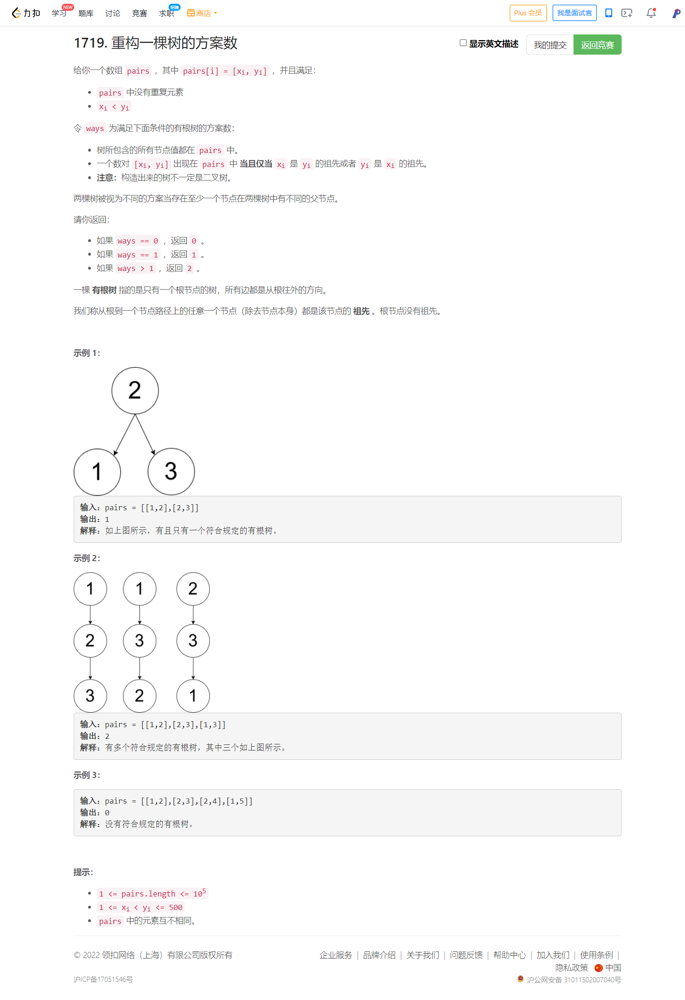
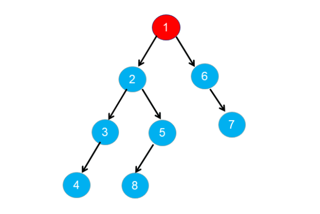
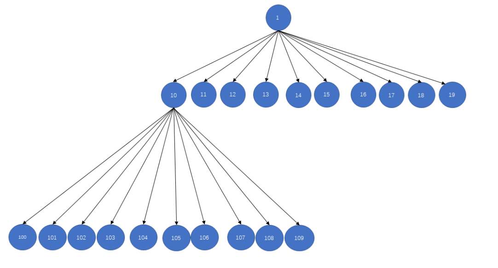

<!-- @import "[TOC]" {cmd="toc" depthFrom=1 depthTo=6 orderedList=false} -->

<!-- code_chunk_output -->

- [1719. 重构一棵树的方案数（思维题发现规律）](#1719-重构一棵树的方案数思维题发现规律)
- [688. 骑士在棋盘上的概率（记忆化搜索DP）](#688-骑士在棋盘上的概率记忆化搜索dp)
- [432. 全 O(1) 的数据结构（双向链表list的使用）](#432-全-o1-的数据结构双向链表list的使用)
- [440. 字典序的第K小数字（构造字典序树并且前序遍历）](#440-字典序的第k小数字构造字典序树并且前序遍历)
- [1606. 找到处理最多请求的服务器（模拟+set的iterator）](#1606-找到处理最多请求的服务器模拟set的iterator)
- [310. 最小高度树（重要：树的性质，到各点距离最短的点存在于图上最长路径上，距离任一结点最远的点一定在树的最长路径上/拓扑排序）](#310-最小高度树重要树的性质到各点距离最短的点存在于图上最长路径上距离任一结点最远的点一定在树的最长路径上拓扑排序)
- [796. 旋转字符串（妙用 string find 与 string::npos）](#796-旋转字符串妙用-string-find-与-stringnpos)

<!-- /code_chunk_output -->

### 1719. 重构一棵树的方案数（思维题发现规律）



参考：https://leetcode-cn.com/problems/number-of-ways-to-reconstruct-a-tree/solution/zhong-gou-yi-ke-shu-de-fang-an-shu-by-le-36e1/

题目给定的数对 $\textit{pairs}[i] = [x_{i},y_{i}]$ ，且满足 $x_{i}$ 是 $y_{i}$ 的祖先或者 $y_{i}$ 是 $x_{i}$ 的祖先；树中所包含的所有节点值都在 $\textit{pairs}$ 中，即 $\textit{pairs}$ 包含树中所有可能构成祖先的数对。

设树中节点数目为 $n$，$\textit{pairs}$ 中包含节点 $x$ 的数对的数目为 $\textit{degree}[x]$ ，节点 $x$ 的祖先和后代的节点集合为 $\textit{adj}[x]$ 。

下面来研究 $\textit{degree}$ 的性质。

根节点为树中其余所有节点的祖先，根节点与其余所有节点都能构成数对。设根节点为 $\textit{root}$ ，由于 $\textit{pairs}$ 包含树中所有可能构成祖先的数对，因此 $\textit{degree}[\textit{root}] = n - 1$ 。如下图所示，根节点 1 为其余节点的祖先，蓝色节点组成了 $\textit{adj}[1]$ 。



对于 $\textit{pairs}$ 中的数对 $[x_{i},y_{i}]$ ，如果 $x_{i}$ 为 $y_{i}$ 的祖先，则一定满足 $\textit{degree}[x_{i}] \ge \textit{degree}[y_{i}]$ 。如果节点 $y_j$ 为节点 $y_{i}$ 的后代节点，则节点 $y_j$ 一定同时也是节点 $x_{i}$ 的后代节点；如果节点 $y_j$ 为节点 $y_{i}$ 的祖先节点，则节点 $y_j$ 要么是节点 $x_{i}$ 的祖先节点，要么是节点 $x_{i}$ 的后代节点，所以一定满足 $\textit{degree}[x_{i}] \ge \textit{degree}[y_{i}]$ 。此外，如果 $x_{i}$ 为 $y_{i}$ 的祖先，则一定满足 $\textit{adj}[y_{i}] \in \textit{adj}[x_{i}]$ 。如下图所示，含有节点 2 的数对数目一定大于含有节点 3 的数对数目。


对于 $\textit{pairs}$ 中的数对 $[x_{i},y_{i}]$，如果 $x_{i}$ 为 $y_{i}$ 的祖先，且满足 $\textit{degree}[x_{i}] = \textit{degree}[y_{i}]$ 和 $adj[x_{i}] = adj[y_{i}]$ ，则 $x_{i}$ 到 $y_{i}$ 途径的所有节点均只有一个孩子节点。此时 $x_{i}$ 到 $y_{i}$ 之间的节点包含的数对关系是一样的，$x_{i}$ 到 $y_{i}$ 之间的节点是可以进行互相交换而不影响树的结构，则此时构成树的方案数一定不是唯一的。如下图所示，节点 6,7,9 满足上述要求：


综上所述，对于 $\textit{pairs}$ 中的数对 $[x_{i},y_{i}]$：

- 若 $\textit{degree}[x_{i}] > \textit{degree}[y_{i}]$ ，则 $x_{i}$ 为 $y_{i}$ 的祖先节点；
- 若 $\textit{degree}[x_{i}] < \textit{degree}[y_{i}]$ ，则 $y_{i}$ 为 $x_{i}$ 的祖先节点；
- 若 $\textit{degree}[x_{i}] = \textit{degree}[y_{i}]$ ，则可能存在多种构造方法，$y_{i}$ 为 $x_{i}$ 的祖先或者 $x_{i}$ 为 $y_{i}$ 的祖先。

通过以上分析结论，我们可以尝试进行重新建树，并检查建成的树是否合法。

首先我们需要找到根节点 $\textit{root}$ ，通过上述结论，我们找到满足 $\textit{degree}[\textit{root}] = n - 1$ 的节点，如果不存在根节点，则认为其不能构成合法的树，返回 0。

我们需要利用上述的结论检测是构建的树是否合法，遍历每个节点 $\textit{node}_i$ ，找到 $\textit{node}_i$ 的祖先 $\textit{parent}_{i}$ ，检测集合 $\textit{adj}[\textit{node}_i]$ 是否为 $\textit{adj}[\textit{\textit{parent}}_i]$ 的子集。可以利用 $\textit{degree}[\textit{node}_i] \le \textit{degree}[\textit{parent}_{i}]$ 找到所有属于 $\textit{node}_i$ 的祖先节点，然后依次检测是否满足 $\textit{adj}[\textit{node}_i] \in \textit{adj}[\textit{\textit{parent}}_i]$ ，如果不满足要求，则认为构建的树为非法，返回 0。

实际检测过程中不必检测节点 $\textit{node}_i$ 的所有祖先节点，只需要检测节点 $\textit{node}_i$ 的父节点是否满足子集包含的要求即可。根据上述推论找到节点 $x$ 满足 $\textit{degree}[x]$ 最小且 $\textit{degree}[x] \ge \textit{degree}[\textit{node}_i]$ ，则此时找到的节点为节点 $\textit{node}_i$ 的父亲节点，此时只需检测父亲节点是否满足上述要求即可。

设 $\textit{node}_i$ 的父节点为 $\textit{parent}$ ，若满足 $\textit{degree}[\textit{node}_i] = \textit{degree}[\textit{parent}]$ 则树的构造方式可以有多个，返回 2。

```cpp
class Solution {
public:
    int checkWays(vector<vector<int>>& pairs) {
        unordered_map<int, unordered_set<int>> adj;
        for (auto &p : pairs) {
            adj[p[0]].emplace(p[1]);
            adj[p[1]].emplace(p[0]);
        }
        /* 检测是否存在根节点*/
        int root = -1;
        for (auto &[node, neighbours] : adj) {
            if (neighbours.size() == adj.size() - 1) {
                root = node;
                break;
            }
        }
        if (root == -1) {
            return 0;
        }

        int res = 1;
        for (auto &[node, neighbours] : adj) {
            if (node == root) {
                continue;
            }
            int currDegree = neighbours.size();
            int parent = -1;
            int parentDegree = INT_MAX;

            /* 根据 degree 的大小找到 node 的父节点 parent */
            for (auto &neighbour : neighbours) {
                if (adj[neighbour].size() < parentDegree && adj[neighbour].size() >= currDegree) {
                    parent = neighbour;
                    parentDegree = adj[neighbour].size();
                }
            }
            if (parent == -1) {
                return 0;
            }

            /* 检测 neighbours 是否是 adj[parent] 的子集 */
            for (auto &neighbour : neighbours) {
                if (neighbour == parent) {
                    continue;
                }
                if (!adj[parent].count(neighbour)) {
                    return 0;
                }
            }
            if (parentDegree == currDegree) {
                res = 2;
            }
        }
        return res;
    }
};
```

### 688. 骑士在棋盘上的概率（记忆化搜索DP）

在一个 n x n 的国际象棋棋盘上，一个骑士从单元格 (row, column) 开始，并尝试进行 k 次移动。行和列是 从 0 开始 的，所以左上单元格是 (0,0) ，右下单元格是 (n - 1, n - 1) 。

象棋骑士有8种可能的走法，如下图所示。每次移动在基本方向上是两个单元格，然后在正交方向上是一个单元格。


每次骑士要移动时，它都会随机从8种可能的移动中选择一种(即使棋子会离开棋盘)，然后移动到那里。

骑士继续移动，直到它走了 k 步或离开了棋盘。

返回 骑士在棋盘停止移动后仍留在棋盘上的概率 。

示例 1：
```
输入: n = 3, k = 2, row = 0, column = 0
输出: 0.0625
解释: 有两步(到(1,2)，(2,1))可以让骑士留在棋盘上。
在每一个位置上，也有两种移动可以让骑士留在棋盘上。
骑士留在棋盘上的总概率是0.0625。
```

示例 2：
```
输入: n = 1, k = 0, row = 0, column = 0
输出: 1.00000
``` 

提示:
- 1 <= n <= 25
- 0 <= k <= 100
- 0 <= row, column <= n

```cpp
class Solution {
    int dx[8] = {-2, -1, 1, 2, 2, 1, -1, -2};
    int dy[8] = {1, 2, 2, 1, -1, -2, -2, -1};
public:
    double knightProbability(int n, int k, int row, int column) {
        // 记忆化搜索 f[s][i][j] 从 i j 出发走 s 步时，留在板子上的概率
        // f[0] 都是 1 ； 不合法的 i j 其 f 都是 0 ，默认 f 也都是 0
        // 状态转移： f[s] = f[s-1][之前的位置] / 8
        double f[k + 1][n][n];
        memset(f, 0, sizeof f);
        for (int s = 0; s <= k; ++ s)
            for (int i = 0; i < n; ++ i)
                for (int j = 0; j < n; ++ j)
                    if (s == 0) f[s][i][j] = 1;
                    else for (int x = 0; x < 8; ++ x)
                    {
                        int a = dx[x] + i, b = dy[x] + j;
                        if (a >= 0 && a < n && b >= 0 && b < n)
                            f[s][i][j] += f[s - 1][a][b] / 8;
                    }
        return f[k][row][column];
    }
};
```

### 432. 全 O(1) 的数据结构（双向链表list的使用）

请你设计一个用于存储字符串计数的数据结构，并能够返回计数最小和最大的字符串。

实现 AllOne 类：
- AllOne() 初始化数据结构的对象。
- inc(String key) 字符串 key 的计数增加 1 。如果数据结构中尚不存在 key ，那么插入计数为 1 的 key 。
- dec(String key) 字符串 key 的计数减少 1 。如果 key 的计数在减少后为 0 ，那么需要将这个 key 从数据结构中删除。测试用例保证：在减少计数前，key 存在于数据结构中。
- getMaxKey() 返回任意一个计数最大的字符串。如果没有元素存在，返回一个空字符串 `""` 。
- getMinKey() 返回任意一个计数最小的字符串。如果没有元素存在，返回一个空字符串 `""` 。

示例：
```
输入
["AllOne", "inc", "inc", "getMaxKey", "getMinKey", "inc", "getMaxKey", "getMinKey"]
[[], ["hello"], ["hello"], [], [], ["leet"], [], []]
输出
[null, null, null, "hello", "hello", null, "hello", "leet"]

解释
AllOne allOne = new AllOne();
allOne.inc("hello");
allOne.inc("hello");
allOne.getMaxKey(); // 返回 "hello"
allOne.getMinKey(); // 返回 "hello"
allOne.inc("leet");
allOne.getMaxKey(); // 返回 "hello"
allOne.getMinKey(); // 返回 "leet"
```

提示：
- 1 <= key.length <= 10
- key 由小写英文字母组成
- 测试用例保证：在每次调用 dec 时，数据结构中总存在 key
- 最多调用 inc、dec、getMaxKey 和 getMinKey 方法 $5 * 10^4$ 次

```cpp
class AllOne {
    // list 容器的底层是以双向链表的形式实现的
    list<pair<unordered_set<string>, int>> lst;  // keys 与 count
    // 这里用 list<T>::iterator
    unordered_map<string, list<pair<unordered_set<string>, int>>::iterator> nodes;

public:
    AllOne() {}

    void inc(string key) {
        if (nodes.count(key)) {
            auto cur = nodes[key], nxt = next(cur);  // next 用法要注意
            if (nxt == lst.end() || nxt->second > cur->second + 1) {
                unordered_set<string> s({key});  // 插入新节点
                nodes[key] = lst.emplace(nxt, s, cur->second + 1);  // emplace(position, ele)
            } else {  // 下一个 count 就是 key
                nxt->first.emplace(key);
                nodes[key] = nxt;
            }
            cur->first.erase(key);  // 把 key 原来在的节点从中抹除
            if (cur->first.empty()) {
                lst.erase(cur);  // list 的 erase 用法
            }
        } else { // key 不在链表中
            if (lst.empty() || lst.begin()->second > 1) {
                unordered_set<string> s({key});
                lst.emplace_front(s, 1);
            } else {  // 如果链表头节点 count = 1
                lst.begin()->first.emplace(key);
            }
            nodes[key] = lst.begin();
        }
    }

    void dec(string key) {
        auto cur = nodes[key];
        if (cur->second == 1) {  // key 仅出现一次，将其移出 nodes
            nodes.erase(key);
        } else {
            auto pre = prev(cur);  // 注意 prev 用法
            if (cur == lst.begin() || pre->second < cur->second - 1) {
                unordered_set<string> s({key});
                nodes[key] = lst.emplace(cur, s, cur->second - 1);
            } else {  // 将 key 合并入 prev
                pre->first.emplace(key);
                nodes[key] = pre;
            }
        }
        cur->first.erase(key);  // 把老的 key 所在的位置删除
        if (cur->first.empty()) {
            lst.erase(cur);
        }
    }

    string getMaxKey() {
        return lst.empty() ? "" : *lst.rbegin()->first.begin();
    }

    string getMinKey() {
        return lst.empty() ? "" : *lst.begin()->first.begin();
    }
};
```

**经验：**
- C++ STL 中自带双向链表数据结构 `list` ，其中对于 `list<T>::iterator cur` ，用 `prev(cur)` 取其前一个节点，用 `next(prev)` 获取下一个节点；因为是双向链表，可以有 `emplace_front` 和 `emplace_back` ；此外，如果你想把新节点 `T node` 插入到节点 `cur` 前面，你可以 `lst.emplace(cur, node)` 。

对于 JavaScript 的写法：

```js
var AllOne = function() {
    this.root = new Node();
    this.root.prev = this.root;
    this.root.next = this.root; // 初始化链表哨兵，下面判断节点的 next 若为 root，则表示 next 为空（prev 同理）
    this.nodes = new Map();
};

AllOne.prototype.inc = function(key) {
    if (this.nodes.has(key)) {
        const cur = this.nodes.get(key);
        const nxt = cur.next;
        if (nxt === this.root || nxt.count > cur.count + 1) {
            this.nodes.set(key, cur.insert(new Node(key, cur.count + 1)));
        } else {
            nxt.keys.add(key);
            this.nodes.set(key, nxt);
        }
        cur.keys.delete(key);
        if (cur.keys.size === 0) {
            cur.remove();
        }
    } else {  // key 不在链表中
        if (this.root.next === this.root || this.root.next.count > 1) {
            this.nodes.set(key, this.root.insert(new Node(key, 1)));
        } else {
            this.root.next.keys.add(key);
            this.nodes.set(key, this.root.next);
        }
    }    
};

AllOne.prototype.dec = function(key) {
    const cur = this.nodes.get(key);
    if (cur.count === 1) {  // key 仅出现一次，将其移出 nodes
        this.nodes.delete(key);
    } else {
        const pre = cur.prev;
        if (pre === this.root || pre.count < cur.count - 1) {
            this.nodes.set(key, cur.prev.insert(new Node(key, cur.count - 1)));
        } else {
            pre.keys.add(key);
            this.nodes.set(key, pre);
        }
    }
    cur.keys.delete(key);
    if (cur.keys.size === 0) {
        cur.remove();
    }
};

AllOne.prototype.getMaxKey = function() {
    if (!this.root.prev) {
        return "";
    }
    let maxKey = "";
    for (const key of this.root.prev.keys) {
        maxKey = key;
        break;
    }
    return maxKey;
};

AllOne.prototype.getMinKey = function() {
    if (!this.root.next) {
        return "";
    }
    let minKey = "";
    for (const key of this.root.next.keys) {
        minKey = key;
        break;
    }
    return minKey;
};

class Node {
    constructor(key, count) {
        count ? this.count = count : 0;
        this.keys = new Set();
        key ? this.keys.add(key) : this.keys.add("");
    }

    insert(node) {  // 在 this 后插入 node
        node.prev = this;
        node.next = this.next;
        node.prev.next = node;
        node.next.prev = node;
        return node;
    }

    remove() {
        this.prev.next = this.next;
        this.next.prev = this.prev;
    }
}
```

### 440. 字典序的第K小数字（构造字典序树并且前序遍历）

给定整数 n 和 k，返回  [1, n] 中字典序第 k 小的数字。

示例 1:
```
输入: n = 13, k = 2
输出: 10
解释: 字典序的排列是 [1, 10, 11, 12, 13, 2, 3, 4, 5, 6, 7, 8, 9]，所以第二小的数字是 10。
```

示例 2:

```
输入: n = 1, k = 1
输出: 1
```

提示:
- $1 <= k <= n <= 109$



```cpp
class Solution {
    int getStep(int k, int n)
    {
        long l = k, r = k;  // 本层：最左节点，最右节点
        int res = 0;
        while (l <= n)
        {
            res += min(r, (long)n) - l + 1;  // 从左到右包含多少个节点
            l = l * 10, r = r * 10 + 9;  // 进入下一层
        }
        return res;
    }
public:
    int findKthNumber(int n, int k) {
        int res = 1;
        -- k;  // k 表示还剩多少名额（从小到大，先用小的名额）
        while (k > 0)
        {
            int step = getStep(res, n);  // 以 k 为根的子树多大
            if (step <= k)  // 当前子树不够
            {
                k -= step;
                ++ res;
            }
            else  // 进入下一子树
            {
                res *= 10;
                -- k;
            }
        }
        return res;
    }
};
```

```ts
function getStep(curr: number, n: number): number {
    let l = curr, r = curr, step = 0
    while (l <= n) {
        step += Math.min(r, n) - l + 1
        l *= 10
        r = r * 10 + 9
    }
    return step
}

function findKthNumber(n: number, k: number): number {
    let curr = 1
    k -= 1
    while (k > 0) {
        let step = getStep(curr, n)
        if (step <= k) {
            k -= step
            curr += 1
        } else {
            k -= 1
            curr *= 10
        }
    }
    return curr
};
```

### 1606. 找到处理最多请求的服务器（模拟+set的iterator）

你有 k 个服务器，编号为 0 到 k-1 ，它们可以同时处理多个请求组。每个服务器有无穷的计算能力但是 不能同时处理超过一个请求 。请求分配到服务器的规则如下：
- 第 i （序号从 0 开始）个请求到达。
- 如果所有服务器都已被占据，那么该请求被舍弃（完全不处理）。
- 如果第 `(i % k)` 个服务器空闲，那么对应服务器会处理该请求。
- 否则，将请求安排给下一个空闲的服务器（服务器构成一个环，必要的话可能从第 0 个服务器开始继续找下一个空闲的服务器）。比方说，如果第 i 个服务器在忙，那么会查看第 (i+1) 个服务器，第 (i+2) 个服务器等等。

给你一个 严格递增 的正整数数组 arrival ，表示第 i 个任务的到达时间，和另一个数组 load ，其中 load[i] 表示第 i 个请求的工作量（也就是服务器完成它所需要的时间）。你的任务是找到 最繁忙的服务器 。最繁忙定义为一个服务器处理的请求数是所有服务器里最多的。

请你返回包含所有 最繁忙服务器 序号的列表，你可以以任意顺序返回这个列表。

示例 1：


```
输入：k = 3, arrival = [1,2,3,4,5], load = [5,2,3,3,3] 
输出：[1] 
解释：
所有服务器一开始都是空闲的。
前 3 个请求分别由前 3 台服务器依次处理。
请求 3 进来的时候，服务器 0 被占据，所以它被安排到下一台空闲的服务器，也就是服务器 1 。
请求 4 进来的时候，由于所有服务器都被占据，该请求被舍弃。
服务器 0 和 2 分别都处理了一个请求，服务器 1 处理了两个请求。所以服务器 1 是最忙的服务器。
```

示例 2：
```
输入：k = 3, arrival = [1,2,3,4], load = [1,2,1,2]
输出：[0]
解释：
前 3 个请求分别被前 3 个服务器处理。
请求 3 进来，由于服务器 0 空闲，它被服务器 0 处理。
服务器 0 处理了两个请求，服务器 1 和 2 分别处理了一个请求。所以服务器 0 是最忙的服务器。
```

示例 3：
```
输入：k = 3, arrival = [1,2,3], load = [10,12,11]
输出：[0,1,2]
解释：每个服务器分别处理了一个请求，所以它们都是最忙的服务器。
```

示例 4：
```
输入：k = 3, arrival = [1,2,3,4,8,9,10], load = [5,2,10,3,1,2,2]
输出：[1]
```

示例 5：
```
输入：k = 1, arrival = [1], load = [1]
输出：[0]
```

提示：
- 1 <= k <= 10e5
- 1 <= arrival.length, load.length <= 10e5
- arrival.length == load.length
- 1 <= arrival[i], load[i] <= 10e9
- arrival 保证 严格递增 。

```cpp
class Solution {
public:
    vector<int> busiestServers(int k, vector<int> &arrival, vector<int> &load) {
        set<int> available;
        for (int i = 0; i < k; i++) {
            available.insert(i);
        }
        priority_queue<pair<int, int>, vector<pair<int, int>>, greater<>> busy;
        vector<int> requests(k);
        for (int i = 0; i < arrival.size(); i++) {
            while (!busy.empty() && busy.top().first <= arrival[i]) {
                available.insert(busy.top().second);
                busy.pop();
            }
            if (available.empty()) {
                continue;
            }
            auto p = available.lower_bound(i % k);  // 注意 set 使用自带的 lower_bound 才是 O(logn)
            if (p == available.end()) {
                p = available.begin();
            }
            requests[*p]++;
            busy.emplace(arrival[i] + load[i], *p);
            available.erase(p);  // 这里 set 的 iterator 用的非常精彩
        }
        int maxRequest = *max_element(requests.begin(), requests.end());
        vector<int> ret;
        for (int i = 0; i < k; i++) {
            if (requests[i] == maxRequest) {
                ret.push_back(i);
            }
        }
        return ret;
    }
};
```

### 310. 最小高度树（重要：树的性质，到各点距离最短的点存在于图上最长路径上，距离任一结点最远的点一定在树的最长路径上/拓扑排序）

树是一个无向图，其中任何两个顶点只通过一条路径连接。 换句话说，一个任何没有简单环路的连通图都是一棵树。

给你一棵包含 n 个节点的树，标记为 0 到 n - 1 。给定数字 n 和一个有 n - 1 条无向边的 edges 列表（每一个边都是一对标签），其中 edges[i] = [ai, bi] 表示树中节点 ai 和 bi 之间存在一条无向边。

可选择树中任何一个节点作为根。当选择节点 x 作为根节点时，设结果树的高度为 h 。在所有可能的树中，具有最小高度的树（即，min(h)）被称为 最小高度树 。

请你找到所有的 最小高度树 并按 任意顺序 返回它们的根节点标签列表。

树的 高度 是指根节点和叶子节点之间最长向下路径上边的数量。


具体的证明我就不摘抄了，[官方的解法](https://leetcode-cn.com/problems/minimum-height-trees/solution/zui-xiao-gao-du-shu-by-leetcode-solution-6v6f/)其实很符合直觉。

假设树中距离最长的两个节点为 $(x,y)$，它们之间的距离为 $\textit{maxdist} = \textit{dist}[x][y]$ ：
- 首先证明树的高度一定为 $\textit{minheight} = \Big \lceil \dfrac{\textit{maxdist}}{2} \Big \rceil$ ，可以用反证法得出。
- 其次证明最小高度树的根节点一定存在于 $x$ 到 $y$ 的路径上，也可以用反证法得出。

因此我们只需要求出路径最长的两个叶子节点即可，并求出其路径的最中间的节点即为最小高度树的根节点。可以利用以下算法找到图中距离最远的两个节点与它们之间的路径：
- 以任意节点 p 出现，利用广度优先搜索或者深度优先搜索找到以 p 为起点的最长路径的终点 x；
- 以节点 x 出发，找到以 x 为起点的最长路径的终点 y；
- x 到 y 之间的路径即为图中的最长路径，找到路径的中间节点即为根节点。

bfs ：

```cpp
class Solution {
public:
    int findLongestNode(int u, vector<int> & parent, vector<vector<int>>& adj) {
        int n = adj.size();
        queue<int> qu;
        vector<bool> visit(n);
        qu.emplace(u);
        visit[u] = true;
        int node = -1;
  
        while (!qu.empty()) {
            int curr = qu.front();
            qu.pop();
            node = curr;
            for (auto & v : adj[curr]) {
                if (!visit[v]) {
                    visit[v] = true;
                    parent[v] = curr;
                    qu.emplace(v);
                }
            }
        }
        return node;
    }

    vector<int> findMinHeightTrees(int n, vector<vector<int>>& edges) {
        if (n == 1) {
            return {0};
        }
        vector<vector<int>> adj(n);
        for (auto & edge : edges) {
            adj[edge[0]].emplace_back(edge[1]);
            adj[edge[1]].emplace_back(edge[0]);
        }
        
        vector<int> parent(n, -1);
        /* 找到与节点 0 最远的节点 x */
        int x = findLongestNode(0, parent, adj);
        /* 找到与节点 x 最远的节点 y */
        int y = findLongestNode(x, parent, adj);
        /* 求出节点 x 到节点 y 的路径 */
        vector<int> path;
        parent[x] = -1;
        while (y != -1) {
            path.emplace_back(y);
            y = parent[y];
        }
        int m = path.size();
        if (m % 2 == 0) {
            return {path[m / 2 - 1], path[m / 2]};
        } else {
            return {path[m / 2]};
        }
    }
};
```

dfs ：

```cpp
class Solution {
public:
    void dfs(int u, vector<int> & dist, vector<int> & parent, const vector<vector<int>> & adj) {
        for (auto & v : adj[u]) {
            if (dist[v] < 0) {
                dist[v] = dist[u] + 1;
                parent[v] = u;
                dfs(v, dist, parent, adj); 
            }
        }
    }

    int findLongestNode(int u, vector<int> & parent, const vector<vector<int>> & adj) {
        int n = adj.size();
        vector<int> dist(n, -1);
        dist[u] = 0;
        dfs(u, dist, parent, adj);
        int maxdist = 0;
        int node = -1;
        for (int i = 0; i < n; i++) {
            if (dist[i] > maxdist) {
                maxdist = dist[i];
                node = i;
            }
        }
        return node;
    }

    vector<int> findMinHeightTrees(int n, vector<vector<int>>& edges) {
        if (n == 1) {
            return {0};
        }
        vector<vector<int>> adj(n);
        for (auto & edge : edges) {
            adj[edge[0]].emplace_back(edge[1]);
            adj[edge[1]].emplace_back(edge[0]);
        }
        vector<int> parent(n, -1);
        /* 找到距离节点 0 最远的节点  x */
        int x = findLongestNode(0, parent, adj);
        /* 找到距离节点 x 最远的节点  y */
        int y = findLongestNode(x, parent, adj);
        /* 找到节点 x 到节点 y 的路径 */
        vector<int> path;
        parent[x] = -1;
        while (y != -1) {
            path.emplace_back(y);
            y = parent[y];
        }
        int m = path.size();
        if (m % 2 == 0) {
            return {path[m / 2 - 1], path[m / 2]};
        } else {
            return {path[m / 2]};
        }
    }
};
```

此外还可以用拓扑排序做，我理解为一层一层蜕皮：

```cpp
class Solution {
public:
    vector<int> findMinHeightTrees(int n, vector<vector<int>>& edges) {
        if (n == 1) {
            return {0};
        }
        vector<int> degree(n);
        vector<vector<int>> adj(n);
        for (auto & edge : edges){
            adj[edge[0]].emplace_back(edge[1]);
            adj[edge[1]].emplace_back(edge[0]);
            degree[edge[0]]++;
            degree[edge[1]]++;
        }
        queue<int> qu;
        vector<int> ans;
        for (int i = 0; i < n; i++) {
            if (degree[i] == 1) {
                qu.emplace(i);
            }
        }
        int remainNodes = n;
        while (remainNodes > 2) {
            int sz = qu.size();
            remainNodes -= sz;
            for (int i = 0; i < sz; i++) {
                int curr = qu.front();
                qu.pop();
                for (auto & v : adj[curr]) {
                    if (--degree[v] == 1) {
                        qu.emplace(v);
                    }
                }
            }
        }
        while (!qu.empty()) {
            ans.emplace_back(qu.front());
            qu.pop();
        }
        return ans;
    }
};
```

### 796. 旋转字符串（妙用 string find 与 string::npos）

给定两个字符串, s 和 goal。如果在若干次旋转操作之后，s 能变成 goal ，那么返回 true 。

s 的 旋转操作 就是将 s 最左边的字符移动到最右边。 

例如, 若 s = 'abcde'，在旋转一次之后结果就是'bcdea' 。


示例 1:
```
输入: s = "abcde", goal = "cdeab"
输出: true
```

示例 2:
```
输入: s = "abcde", goal = "abced"
输出: false
```

提示:
- 1 <= s.length, goal.length <= 100
- s 和 goal 由小写英文字母组成

如果手写 KMP 则有些慢。直接用 find 很香。

```cpp
class Solution {
public:
    bool rotateString(string s, string goal) {
        return s.size() == goal.size() && (s + s).find(goal) != string::npos;
    }
};
```

**经验：**
- C++ 中使用 `find` 是 string 的成员方法，如果没有子串，则返回 `string::npos`
- 注意 string 的 find 返回的是 string::size_type ，不能直接与 begin() 运算，如果想要与 int 运算，需要先将 string::size_type 转换为 int 如 `int dist = (int)s.find(sub) - 2`
