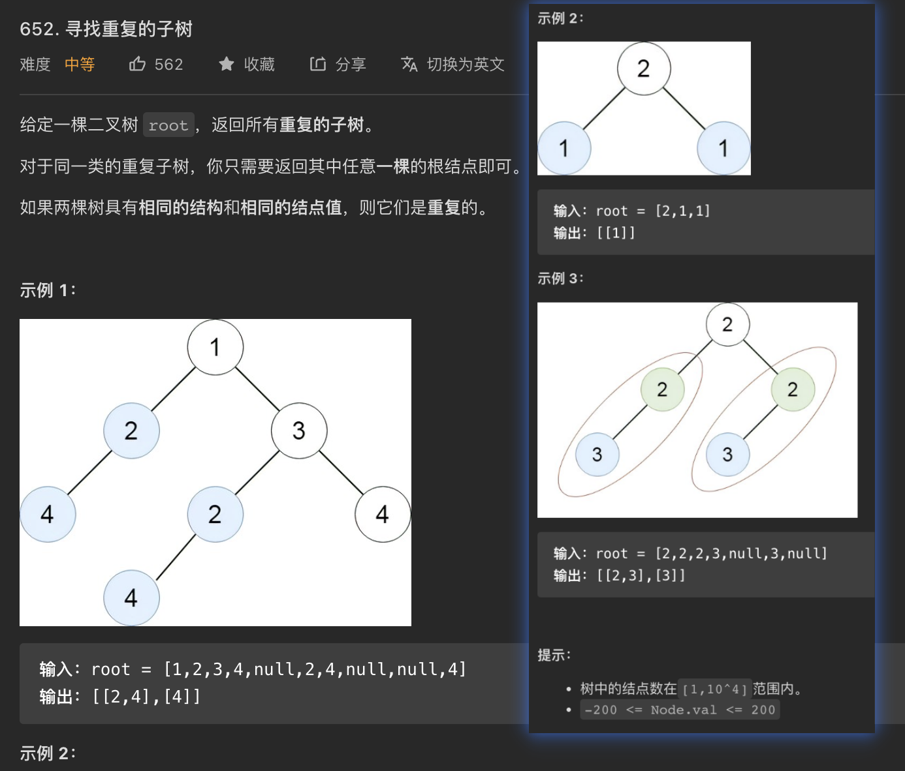

<!-- @import "[TOC]" {cmd="toc" depthFrom=1 depthTo=6 orderedList=false} -->

<!-- code_chunk_output -->

- [652. 寻找重复的子树（递归哈希/编码/C++ tuple/重载 unordered_map哈希函数）](#652-寻找重复的子树递归哈希编码c-tuple重载-unordered_map哈希函数)
- [850. 矩形面积 II（不错的扫描线模板+离散化）](#850-矩形面积-ii不错的扫描线模板离散化)

<!-- /code_chunk_output -->

### 652. 寻找重复的子树（递归哈希/编码/C++ tuple/重载 unordered_map哈希函数）



```cpp
// 第一个思路是直接对根据树的结构得出 string 编码
// 最坏情况下，树是链式的，这样编码会是 1 + 2 + ... + n 的
// 因此时空复杂度是 n^2
/**
 * Definition for a binary tree node.
 * struct TreeNode {
 *     int val;
 *     TreeNode *left;
 *     TreeNode *right;
 *     TreeNode() : val(0), left(nullptr), right(nullptr) {}
 *     TreeNode(int x) : val(x), left(nullptr), right(nullptr) {}
 *     TreeNode(int x, TreeNode *left, TreeNode *right) : val(x), left(left), right(right) {}
 * };
 */
class Solution {
public:
    vector<TreeNode*> findDuplicateSubtrees(TreeNode* root) {
        dfs(root);
        return {repeat.begin(), repeat.end()};
    }

    string dfs(TreeNode* node) {
        if (!node) {
            return "";
        }
        string serial = to_string(node->val) + "(" + dfs(node->left) + ")(" + dfs(node->right) + ")";
        if (auto it = seen.find(serial); it != seen.end()) {
            repeat.insert(it->second);
        }
        else {
            seen[serial] = node;
        }
        return serial;
    }

private:
    unordered_map<string, TreeNode*> seen;
    unordered_set<TreeNode*> repeat;
};
```

下面的方法则更巧妙，时空复杂度是 O(n) 。对每个“见过的”结构进行编码，哈希的键就是 `节点值, 左子树结构编码, 右子树结构编码` 。

```cpp
/**
 * Definition for a binary tree node.
 * struct TreeNode {
 *     int val;
 *     TreeNode *left;
 *     TreeNode *right;
 *     TreeNode() : val(0), left(nullptr), right(nullptr) {}
 *     TreeNode(int x) : val(x), left(nullptr), right(nullptr) {}
 *     TreeNode(int x, TreeNode *left, TreeNode *right) : val(x), left(left), right(right) {}
 * };
 */
class Solution {
public:
    vector<TreeNode*> findDuplicateSubtrees(TreeNode* root) {
        dfs(root);
        return {repeat.begin(), repeat.end()};
    }

    int dfs(TreeNode* node) {
        if (!node) {
            return 0;
        }
        auto tri = tuple{node->val, dfs(node->left), dfs(node->right)};
        if (auto it = seen.find(tri); it != seen.end()) {
            repeat.insert(it->second.first);
            return it->second.second;
        }
        else {
            seen[tri] = {node, ++idx};
            return idx;
        }
    }

private:
    static constexpr auto tri_hash = [fn = hash<int>()](const tuple<int, int, int>& o) -> size_t {
        auto&& [x, y, z] = o;
        return (fn(x) << 24) ^ (fn(y) << 8) ^ fn(z);
    };

    unordered_map<tuple<int, int, int>, pair<TreeNode*, int>, decltype(tri_hash)> seen{0, tri_hash};
    unordered_set<TreeNode*> repeat;
    int idx = 0;
};
```

### 850. 矩形面积 II（不错的扫描线模板+离散化）

https://leetcode.cn/problems/rectangle-area-ii/

```cpp
class Solution {
public:
    int rectangleArea(vector<vector<int>>& rectangles) {
        int n = rectangles.size();
        vector<int> hbound;
        for (const auto& rect: rectangles) {
            // 下边界
            hbound.push_back(rect[1]);
            // 上边界
            hbound.push_back(rect[3]);
        }
        sort(hbound.begin(), hbound.end());
        hbound.erase(unique(hbound.begin(), hbound.end()), hbound.end());
        int m = hbound.size();
        // 「思路与算法部分」的 length 数组并不需要显式地存储下来
        // length[i] 可以通过 hbound[i+1] - hbound[i] 得到
        vector<int> seg(m - 1);

        vector<tuple<int, int, int>> sweep;
        for (int i = 0; i < n; ++i) {
            // 左边界
            sweep.emplace_back(rectangles[i][0], i, 1);
            // 右边界
            sweep.emplace_back(rectangles[i][2], i, -1);
        }
        sort(sweep.begin(), sweep.end());

        long long ans = 0;
        for (int i = 0; i < sweep.size(); ++i) {
            int j = i;
            while (j + 1 < sweep.size() && get<0>(sweep[i]) == get<0>(sweep[j + 1])) {
                ++j;
            }
            if (j + 1 == sweep.size()) {
                break;
            }
            // 一次性地处理掉一批横坐标相同的左右边界
            for (int k = i; k <= j; ++k) {
                auto&& [_, idx, diff] = sweep[k];
                int left = rectangles[idx][1], right = rectangles[idx][3];
                for (int x = 0; x < m - 1; ++x) {
                    if (left <= hbound[x] && hbound[x + 1] <= right) {
                        seg[x] += diff;
                    }
                }
            }
            int cover = 0;
            for (int k = 0; k < m - 1; ++k) {
                if (seg[k] > 0) {
                    cover += (hbound[k + 1] - hbound[k]);
                }
            }
            ans += static_cast<long long>(cover) * (get<0>(sweep[j + 1]) - get<0>(sweep[j]));
            i = j;
        }
        return ans % static_cast<int>(1e9 + 7);
    }
};

// 作者：LeetCode-Solution
// 链接：https://leetcode.cn/problems/rectangle-area-ii/solution/ju-xing-mian-ji-ii-by-leetcode-solution-ulqz/
// 来源：力扣（LeetCode）
// 著作权归作者所有。商业转载请联系作者获得授权，非商业转载请注明出处。
```

上面的方法实际上瓶颈在于 $O(n^2)$ ，当判断扫描线上哪些范围 `seg` 被覆盖，用的是遍历，实际上还可以通过线段树来维护。

```cpp
struct Segtree {
    int cover;
    int length;
    int max_length;
};

class Solution {
public:
    int rectangleArea(vector<vector<int>>& rectangles) {
        int n = rectangles.size();
        for (const auto& rect: rectangles) {
            // 下边界
            hbound.push_back(rect[1]);
            // 上边界
            hbound.push_back(rect[3]);
        }
        sort(hbound.begin(), hbound.end());
        hbound.erase(unique(hbound.begin(), hbound.end()), hbound.end());
        int m = hbound.size();
        // 线段树有 m-1 个叶子节点，对应着 m-1 个会被完整覆盖的线段，需要开辟 ~4m 大小的空间
        tree.resize(m * 4 + 1);
        init(1, 1, m - 1);

        vector<tuple<int, int, int>> sweep;
        for (int i = 0; i < n; ++i) {
            // 左边界
            sweep.emplace_back(rectangles[i][0], i, 1);
            // 右边界
            sweep.emplace_back(rectangles[i][2], i, -1);
        }
        sort(sweep.begin(), sweep.end());

        long long ans = 0;
        for (int i = 0; i < sweep.size(); ++i) {
            int j = i;
            while (j + 1 < sweep.size() && get<0>(sweep[i]) == get<0>(sweep[j + 1])) {
                ++j;
            }
            if (j + 1 == sweep.size()) {
                break;
            }
            // 一次性地处理掉一批横坐标相同的左右边界
            for (int k = i; k <= j; ++k) {
                auto&& [_, idx, diff] = sweep[k];
                // 使用二分查找得到完整覆盖的线段的编号范围
                int left = lower_bound(hbound.begin(), hbound.end(), rectangles[idx][1]) - hbound.begin() + 1;
                int right = lower_bound(hbound.begin(), hbound.end(), rectangles[idx][3]) - hbound.begin();
                update(1, 1, m - 1, left, right, diff);
            }
            ans += static_cast<long long>(tree[1].length) * (get<0>(sweep[j + 1]) - get<0>(sweep[j]));
            i = j;
        }
        return ans % static_cast<int>(1e9 + 7);
    }

    void init(int idx, int l, int r) {
        tree[idx].cover = tree[idx].length = 0;
        if (l == r) {
            tree[idx].max_length = hbound[l] - hbound[l - 1];
            return;
        }
        int mid = (l + r) / 2;
        init(idx * 2, l, mid);
        init(idx * 2 + 1, mid + 1, r);
        tree[idx].max_length = tree[idx * 2].max_length + tree[idx * 2 + 1].max_length;
    }

    void update(int idx, int l, int r, int ul, int ur, int diff) {
        if (l > ur || r < ul) {
            return;
        }
        if (ul <= l && r <= ur) {
            tree[idx].cover += diff;
            pushup(idx, l, r);
            return;
        }
        int mid = (l + r) / 2;
        update(idx * 2, l, mid, ul, ur, diff);
        update(idx * 2 + 1, mid + 1, r, ul, ur, diff);
        pushup(idx, l, r);
    }

    void pushup(int idx, int l, int r) {
        if (tree[idx].cover > 0) {
            tree[idx].length = tree[idx].max_length;
        }
        else if (l == r) {
            tree[idx].length = 0;
        }
        else {
            tree[idx].length = tree[idx * 2].length + tree[idx * 2 + 1].length;
        }
    }

private:
    vector<Segtree> tree;
    vector<int> hbound;
};

// 作者：LeetCode-Solution
// 链接：https://leetcode.cn/problems/rectangle-area-ii/solution/ju-xing-mian-ji-ii-by-leetcode-solution-ulqz/
// 来源：力扣（LeetCode）
// 著作权归作者所有。商业转载请联系作者获得授权，非商业转载请注明出处。
```
