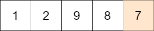

<!-- @import "[TOC]" {cmd="toc" depthFrom=1 depthTo=6 orderedList=false} -->

<!-- code_chunk_output -->

- [找出数组的最大公约数](#找出数组的最大公约数)
- [找出不同的二进制字符串（观察特点：二进制且n*n长度）](#找出不同的二进制字符串观察特点二进制且nn长度)
- [最小化目标值与所选元素的差](#最小化目标值与所选元素的差)
- [从子集的和还原数组](#从子集的和还原数组)

<!-- /code_chunk_output -->

没参加。

### 找出数组的最大公约数

给你一个整数数组 nums ，返回数组中最大数和最小数的 最大公约数 。

两个数的 最大公约数 是能够被两个数整除的最大正整数。

示例 1：
```
输入：nums = [2,5,6,9,10]
输出：2
解释：
nums 中最小的数是 2
nums 中最大的数是 10
2 和 10 的最大公约数是 2
```

示例 2：
```
输入：nums = [7,5,6,8,3]
输出：1
解释：
nums 中最小的数是 3
nums 中最大的数是 8
3 和 8 的最大公约数是 1
```

示例 3：
```
输入：nums = [3,3]
输出：3
解释：
nums 中最小的数是 3
nums 中最大的数是 3
3 和 3 的最大公约数是 3
```

提示：
- 2 <= nums.length <= 1000
- 1 <= nums[i] <= 1000

```cpp
class Solution {
private:
    int gcd(int a, int b)
    {
        return b ? gcd(b, a % b) : a;
    }
public:
    int findGCD(vector<int>& nums) {
        int minv = 1e9;
        int maxv = -1e9;
        for (auto&& t: nums)
        {
            if (t > maxv) maxv = t;
            if (t < minv) minv = t;
        }
        int t = gcd(maxv, minv);
        return t;
    }
};
```

官方题解为：
```cpp
class Solution {
public:
    int findGCD(vector<int>& nums) {
        int mx = *max_element(nums.begin(), nums.end());
        int mn = *min_element(nums.begin(), nums.end());
        return gcd(mx, mn);
    }
};
```

**经验：**
- C++ 中对于 `vector<int>& nums` ，求最大最小值为 `int mx = *max_element(nums.begin(), nums.end());` 和 `int mn = *min_element(nums.begin(), nums.end());`
- C++ `gcd` 其实是标准库函数

### 找出不同的二进制字符串（观察特点：二进制且n*n长度）

给你一个字符串数组 nums ，该数组由 n 个 互不相同 的二进制字符串组成，且每个字符串长度都是 n 。请你找出并返回一个长度为 n 且 没有出现 在 nums 中的二进制字符串。如果存在多种答案，只需返回 任意一个 即可。

示例 1：
```
输入：nums = ["01","10"]
输出："11"
解释："11" 没有出现在 nums 中。"00" 也是正确答案。
```

示例 2：
```
输入：nums = ["00","01"]
输出："11"
解释："11" 没有出现在 nums 中。"10" 也是正确答案。
```

示例 3：
```
输入：nums = ["111","011","001"]
输出："101"
解释："101" 没有出现在 nums 中。"000"、"010"、"100"、"110" 也是正确答案。
```

提示：
- n == nums.length
- 1 <= n <= 16
- nums[i].length == n
- nums[i] 为 `'0'` 或 `'1'`

```cpp
// 官方解法：哈希，转换为数值并且保存
class Solution {
public:
    string findDifferentBinaryString(vector<string>& nums) {
        int n = nums.size();
        // 预处理对应整数的哈希集合
        unordered_set<int> vals;
        for (const string& num : nums){
            vals.insert(stoi(num, nullptr, 2));
        }
        // 寻找第一个不在哈希集合中的整数
        int val = 0;
        while (vals.count(val)){
            ++val;
        }
        // 将整数转化为二进制字符串返回
        return bitset<16>(val).to_string().substr(16 - n, 16);
    }
};

// 作者：LeetCode-Solution
// 链接：https://leetcode-cn.com/problems/find-unique-binary-string/solution/zhao-chu-bu-tong-de-er-jin-zhi-zi-fu-chu-0t10/
```

**经验：**
- C++ `stoi(num, nullptr, 2)` 将 `string` 转为二进制的数字：https://www.cplusplus.com/reference/string/stoi/
- C++ 将整数转化为二进制字符串：`bitset<16>(val).to_string().substr(16 - n, 16);` 为什么这里是 16 ？因为本题中 n 最长为 16 。

```cpp
// 更有趣的解法：康托对角线
/*
- 只要和第i个串下标i的字符nums[i][i]不同，构造出来的串就和所有的串都不同。
- 只限于串数不超过串长的情况。
- 时间复杂度O(n)。

证明：
- 构造串的第i个字符和nums[i][i]不同，这个串就和所有的串都不同
- 假设构造出来的串res和nums其中一个串相同，即res == nums[j]
- 因为res[j]的字符和nums[j][j]不同，与假设矛盾
*/
class Solution {
public:
    string findDifferentBinaryString(vector<string>& nums) {
        string ans;
        int n = nums.size();
        for (int i = 0; i < n; i++) {
            if (nums[i][i] == '0') {
                ans += '1';
            } else {
                ans += '0';
            }
        }
        return ans;
    }
};

// 作者：seedjyh
// 链接：https://leetcode-cn.com/problems/find-unique-binary-string/solution/kang-tuo-dui-jiao-xian-by-seedjyh-wr2s/
```

### 最小化目标值与所选元素的差

给你一个大小为 m x n 的整数矩阵 mat 和一个整数 target 。

从矩阵的 每一行 中选择一个整数，你的目标是 最小化 所有选中元素之 和 与目标值 target 的 绝对差 。

返回 最小的绝对差 。

a 和 b 两数字的 绝对差 是 a - b 的绝对值。

示例 1：


```
输入：mat = [[1,2,3],[4,5,6],[7,8,9]], target = 13
输出：0
解释：一种可能的最优选择方案是：
- 第一行选出 1
- 第二行选出 5
- 第三行选出 7
所选元素的和是 13 ，等于目标值，所以绝对差是 0 。
```

示例 2：


```
输入：mat = [[1],[2],[3]], target = 100
输出：94
解释：唯一一种选择方案是：
- 第一行选出 1
- 第二行选出 2
- 第三行选出 3
所选元素的和是 6 ，绝对差是 94 。
```

示例 3：



```
输入：mat = [[1,2,9,8,7]], target = 6
输出：1
解释：最优的选择方案是选出第一行的 7 。
绝对差是 1 。
```

提示：
- m == mat.length
- n == mat[i].length
- 1 <= m, n <= 70
- 1 <= mat[i][j] <= 70
- 1 <= target <= 800

```cpp
// 分组背包问题
// f[i][j] 即第 i 行总和为 j 的方案是否存在
class Solution {
public:
    int minimizeTheDifference(vector<vector<int>>& mat, int target) {
        int m = mat.size(), n = mat[0].size();
        int maxsum = 0; // 什么都不选时和为 0
        vector<int> f = {1};  // 因此，初始方案只有和为0一种情况，且为真（true）即 f[0] = 1
        for (int i = 0; i < m; ++i) {
            int best = *max_element(mat[i].begin(), mat[i].end());
            vector<int> g(maxsum + best + 1);  // 这里+1是因为数组下标从 0 开始，最大总和为 m+b ，则应该有m+b+1个情况
            // 注意 g 初始都是 0 （不存在 g[j] 即总和为 j 的情况）
            for (int x: mat[i]) {
                for (int j = x; j <= maxsum + x; ++j) {
                    g[j] |= f[j - x];  // 存在 f[j - x] 才存在 g[j] ，否则 g[j] 保持不变
                }
            }
            f = move(g);  // 右值引用 https://blog.csdn.net/chengjian168/article/details/107809308 g 为空，f 为 g
            maxsum += best;
        }
        int ans = INT_MAX;
        for (int i = 0; i <= maxsum; ++i) {
            if (f[i] && abs(i - target) < ans) {
                ans = abs(i - target);
            }
        }
        return ans;
    }
};
```

**经验：**
- C++ 中 `move` 是 `<utility>` 中的右值引用函数，让复制效率更高
  - C++ move()函数： https://blog.csdn.net/chengjian168/article/details/107809308
  - “右值引用”是什么？ https://www.bilibili.com/video/BV1uK4y1b7p5
  - `string bar = move(str);` 相当于 `string bar = (string&&) str;` ， `str` 会为空，而 `bar` 内值会为 `str` 的
  - 右值引用的目的之一是允许修改实质化得到的临时对象（以及被 move 之类的功能标记成右值的非临时对象），以夺取其资源，二是在重载上区别左值和右值

接着优化，如下。

方法一没有很好地利用题目中 target 范围的限制。target 的最大值为 800，而全部的 m 行的最大值之和最大为 4900，远远大于前者。这样就造成了许多不必要的状态转移。

由于我们的目标是最小化「和」与 target 的差值的「绝对值」，因此当「和」已经大于等于 target 时，我们再增大「和」显然是没有必要的。

因此，在状态转移的过程中，我们只需要使用长度为 target 的数组存储所有小于 target 的和，此外再使用一个变量 large 存储最小的大于等于 target 的和。这样一来，我们就可以更快速地进行状态转移。

```cpp
class Solution {
public:
    int minimizeTheDifference(vector<vector<int>>& mat, int target) {
        int m = mat.size(), n = mat[0].size();
        vector<int> f(target, 0);
        // 什么都不选时和为 0
        f[0] = true;
        // 最小的大于等于 target 的和
        int large = INT_MAX;
        for (int i = 0; i < m; ++i) {
            vector<int> g(target);
            int next_large = INT_MAX;
            for (int x: mat[i]) {
                for (int j = 0; j < target; ++j) {
                    if (f[j]) {
                        if (j + x >= target) {
                            next_large = min(next_large, j + x);
                        }
                        else {
                            g[j + x] = true;
                        }
                    }
                }
                if (large != INT_MAX) {
                    next_large = min(next_large, large + x);
                }
            }
            f = move(g);
            large = next_large;
        }

        int ans = abs(large - target);
        for (int i = target - 1; i >= 0; --i) {
            if (f[i]) {
                ans = min(ans, target - i);
                break;
            }
        }
        return ans;
    }
};

// 作者：LeetCode-Solution
// 链接：https://leetcode-cn.com/problems/minimize-the-difference-between-target-and-chosen-elements/solution/zui-xiao-hua-mu-biao-zhi-yu-suo-xuan-yua-mlym/
```

### 从子集的和还原数组

存在一个未知数组需要你进行还原，给你一个整数 n 表示该数组的长度。另给你一个数组 sums ，由未知数组中全部 $2^n$ 个 子集的和 组成（子集中的元素没有特定的顺序）。

返回一个长度为 n 的数组 ans 表示还原得到的未知数组。如果存在 多种 答案，只需返回其中 任意一个 。

如果可以由数组 arr 删除部分元素（也可能不删除或全删除）得到数组 sub ，那么数组 sub 就是数组 arr 的一个 子集 。sub 的元素之和就是 arr 的一个 子集的和 。一个空数组的元素之和为 0 。

注意：生成的测试用例将保证至少存在一个正确答案。

示例 1：
```
输入：n = 3, sums = [-3,-2,-1,0,0,1,2,3]
输出：[1,2,-3]
解释：[1,2,-3] 能够满足给出的子集的和：
- []：和是 0
- [1]：和是 1
- [2]：和是 2
- [1,2]：和是 3
- [-3]：和是 -3
- [1,-3]：和是 -2
- [2,-3]：和是 -1
- [1,2,-3]：和是 0
注意，[1,2,-3] 的任何排列和 [-1,-2,3] 的任何排列都会被视作正确答案。
```

示例 2：
```
输入：n = 2, sums = [0,0,0,0]
输出：[0,0]
解释：唯一的正确答案是 [0,0] 。
```

示例 3：
```
输入：n = 4, sums = [0,0,5,5,4,-1,4,9,9,-1,4,3,4,8,3,8]
输出：[0,-1,4,5]
解释：[0,-1,4,5] 能够满足给出的子集的和。
```

提示：
- 1 <= n <= 15
- sums.length == 2n
- $-10^4 <= sums[i] <= 10^4$

递归来做，我们知道原数组序列一定就在 `sum` 里，但是不知道是哪 n 个数。因此我们试着取出来一个数，递归地来做。

[LeetCode-Solution](https://leetcode-cn.com/problems/find-array-given-subset-sums/solution/cong-zi-ji-de-he-huan-yuan-shu-zu-by-lee-aj8o/)：

提示 1：
- 对于 n 个数构成的长度为 $2^n$ 的子集和数组 sums，设 sums 中的最小值为 x，次小值为 y（x 和 y 可以相等），那么 x-y 和 y-x 二者中至少有一个数出现在这 nn 个数中。

解释：显然， sums 中的最小值 x 等于这 n 个数中所有负数之和。如果没有负数，x = 0。

那么次小值 y 应该等于哪些数之和呢？我们可以知道次小值应该是下面两种情况中的一种：
- 在最小值的基础上，额外选择了一个最小的非负数；
- 在最小值的基础上，移除了一个最大的负数。

其正确性可以使用反证法证明：
- 假设次小值的构成选择了 p 个负数，以及 q 个非负数。如果 q=0，说明我们只选择了负数，由于最小值时选择了所有负数，那么次小值一定是移除一个最大的负数。如果 q>0，那么 p 一定等于 n 个数中负数的个数（因为选择的负数越多，总和越小），此时 q 一定等于 1（因为选择的非负数越多，总和越大），并且选择的这个非负数是 n 个数中最小的非负数。

对于第一种「选择非负数」的情况，这个数的值即为 y-x；对于第二种「移除负数」的情况，这个数的值即为 x-y。因此 x-y 和 y-x 二者中至少有一个数出现在这 n 个数中。

提示 2：
- 记 d = y - x。
- 我们可以将这 $2^n$ 个子集和分成两部分 S 和 T，每一部分的长度均为 $2^{n-1}$，并且对于任意一个在 S 中出现的子集和 $x_0$，在 T 中一定出现了 $x_0 + d$；同时对于任意一个在 T 中出现的子集和 $y_0$，在 S 中一定出现了 $y_0 - d$ 。

解释：

对于第一种「选择非负数」的情况，这个数的值即为 d。我们考虑两种不同类型的子集和：

第一种类型的子集和不包含 d，那么我们需要在剩余的 n-1 个数中进行选择，一共有 $2^{n-1}$ 种选择方法，对应的 $2^{n-1}$ 个子集和的集合记为 S；

第二种类型的子集和包含 d，除了 d 以外，我们同样需要在剩余的 n-1 个数中进行选择，一共有 $2^{n-1}$ 种选择方法，对应 $2^{n-1}$ 个子集和的集合记为 T。由于 TT 中的每个子集和相当于在 S 中选择了一个子集和再加上 d，因此是满足提示 2 的。

对于第二种「移除负数」的情况，这个数的值即为 -d，讨论是类似的：
- 第一种类型的子集和包含 -d，对应的 $2^{n-1}$ 个子集和的集合记为 S；
- 第二种类型的子集和不包含 -d，对应的 $2^{n-1}$ 个子集和的集合记为 T。由于 T 中的每个子集和相当于在 SS 中选择了一个子集和再减去 -d，因此同样是满足提示 2 的。

对于给定的 $2^n$ 个子集和，要想在实际的代码中得到 S 和 T，我们可以将子集和进行升序排序，随后选择最小的子集和 $x_0$ 放入 S，那么 T 中就对应着有一个子集和 $x_0 + d$。我们使用双指针或哈希表等数据结构将这两个子集和移除，总计进行 $2^{n-1}$ 次选择即可得到 S 和 T。

```cpp
class Solution {
private:
    // n 个数构成程度为 2^n 的子集和数组 sums
    // 返回值为空表示无解，否则表示有解
    vector<int> dfs(int n, vector<int>& sums) {
        // 递归到 n=1 时，数组中必然一个为 0，另一个为剩下的最后一个数
        // 如果满足该要求，返回剩下的最后一个数，否则返回表示无解的空数组
        if (n == 1) {
            if (sums[0] == 0) {
                return {sums[1]};
            }
            if (sums[1] == 0) {
                return {sums[0]};
            }
            return {};
        }

        int d = sums[1] - sums[0];
        // 双指针构造 s 和 t
        int left = 0, right = 0;
        vector<int> s, t;
        // 记录每个子集和是否选过
        vector<int> used(1 << n);
        while (true) {
            // left 指针找到最小的未被选择过的子集和
            while (left < (1 << n) && used[left]) {
                ++left;
            }
            if (left == (1 << n)) {
                break;
            }
            s.push_back(sums[left]);
            used[left] = true;
            // right 指针找到 sums[left] + d
            while (used[right] || sums[right] != sums[left] + d) {
                ++right;
            }
            t.push_back(sums[right]);
            used[right] = true;
        }

        // 尝试包含 d 并递归求解 (n-1, s)
        vector<int> ans = dfs(n - 1, s);
        if (!ans.empty()) {
            ans.push_back(d);
            return ans;
        }
        // 尝试包含 -d 并递归求解 (n-1, t)
        ans = dfs(n - 1, t);
        if (!ans.empty()) {
            ans.push_back(-d);
            return ans;
        }
        // 无解返回空数组
        return {};
    }

public:
    vector<int> recoverArray(int n, vector<int>& sums) {
        // 提前将数组排好序
        sort(sums.begin(), sums.end());
        return dfs(n, sums);
    }
};
```
