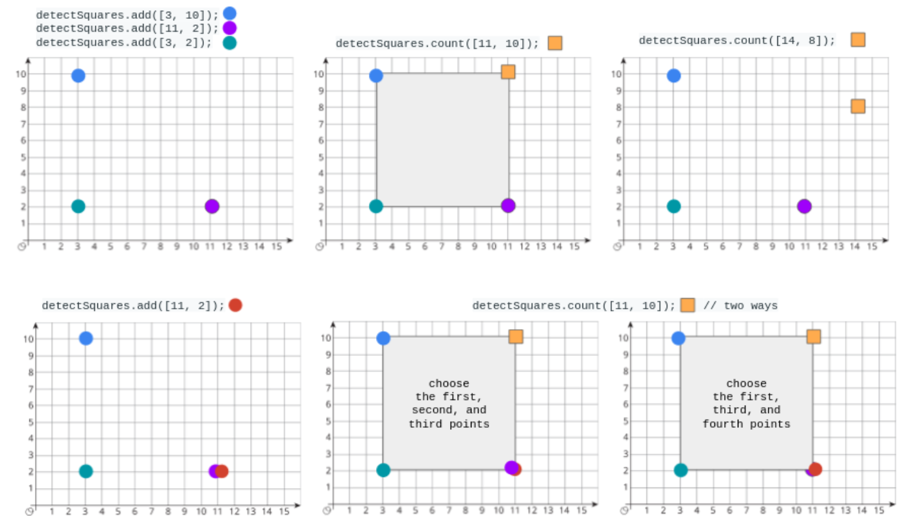
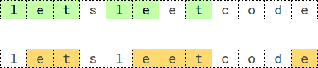

<!-- @import "[TOC]" {cmd="toc" depthFrom=1 depthTo=6 orderedList=false} -->

<!-- code_chunk_output -->

- [执行操作后的变量值](#执行操作后的变量值)
- [数组美丽值求和](#数组美丽值求和)
- [检测正方形](#检测正方形)
- [重复 K 次的最长子序列（分析+递推暴力）](#重复-k-次的最长子序列分析递推暴力)

<!-- /code_chunk_output -->

T3 思维不够严谨，没有想到面积为 0 要跳过的情况。很可惜。很简单的题目，自己思路也很明确，很可惜。

T4 太难了... （我想难了）

### 执行操作后的变量值

存在一种仅支持 4 种操作和 1 个变量 X 的编程语言：

- `++X` 和 `X++` 使变量 X 的值 加 1
- `--X` 和 `X--` 使变量 X 的值 减 1

最初，X 的值是 0

给你一个字符串数组 `operations` ，这是由操作组成的一个列表，返回执行所有操作后， X 的 最终值 。

示例 1：
```
输入：operations = ["--X","X++","X++"]
输出：1
解释：操作按下述步骤执行：
最初，X = 0
--X：X 减 1 ，X =  0 - 1 = -1
X++：X 加 1 ，X = -1 + 1 =  0
X++：X 加 1 ，X =  0 + 1 =  1
```

示例 2：
```
输入：operations = ["++X","++X","X++"]
输出：3
解释：操作按下述步骤执行： 
最初，X = 0
++X：X 加 1 ，X = 0 + 1 = 1
++X：X 加 1 ，X = 1 + 1 = 2
X++：X 加 1 ，X = 2 + 1 = 3
```

示例 3：
```
输入：operations = ["X++","++X","--X","X--"]
输出：0
解释：操作按下述步骤执行：
最初，X = 0
X++：X 加 1 ，X = 0 + 1 = 1
++X：X 加 1 ，X = 1 + 1 = 2
--X：X 减 1 ，X = 2 - 1 = 1
X--：X 减 1 ，X = 1 - 1 = 0
```

提示：
- 1 <= operations.length <= 100
- operations[i] 将会是 "++X"、"X++"、"--X" 或 "X--"

```cpp
class Solution {
public:
    int finalValueAfterOperations(vector<string>& operations) {
        int ans = 0;
        for (auto t: operations)
        {
            if (t == "++X" || t == "X++") ans += 1;
            else ans -= 1;
        }
        return ans;
    }
};
```

### 数组美丽值求和

给你一个下标从 0 开始的整数数组 nums 。对于每个下标 `i（1 <= i <= nums.length - 2），nums[i]` 的 美丽值 等于：

- 2，对于所有 `0 <= j < i` 且 `i < k <= nums.length - 1` ，满足 `nums[j] < nums[i] < nums[k]`
- 1，如果满足 `nums[i - 1] < nums[i] < nums[i + 1]` ，且不满足前面的条件
- 0，如果上述条件全部不满足
返回符合 `1 <= i <= nums.length - 2` 的所有 nums[i] 的 美丽值的总和 。

示例 1：
```
输入：nums = [1,2,3]
输出：2
解释：对于每个符合范围 1 <= i <= 1 的下标 i :
- nums[1] 的美丽值等于 2
```

示例 2：
```
输入：nums = [2,4,6,4]
输出：1
解释：对于每个符合范围 1 <= i <= 2 的下标 i :
- nums[1] 的美丽值等于 1
- nums[2] 的美丽值等于 0
```

示例 3：
```
输入：nums = [3,2,1]
输出：0
解释：对于每个符合范围 1 <= i <= 1 的下标 i :
- nums[1] 的美丽值等于 0
```

提示：
- 3 <= nums.length <= $10^5$
- 1 <= nums[i] <= $10^5$

```cpp
class Solution {
public:
    int sumOfBeauties(vector<int>& nums) {
        int n = nums.size();
        int ans = 0;
        
        vector<int> maxl(n, nums[0]);
        vector<int> minr(n, nums[n - 1]);
        
        for (int i = 1; i < n; ++ i) maxl[i] = max(maxl[i - 1], nums[i]);
        for (int i = n - 2; i >= 0; -- i) minr[i] = min(minr[i + 1], nums[i]);
        
        for (int i = 1; i < n - 1; ++ i)
        {
            int t = nums[i];
            if (t > maxl[i - 1] && t < minr[i + 1]) ans += 2;
            else if (t > nums[i - 1] && t < nums[i + 1]) ans += 1;
        }
        return ans;
    }
};
```

### 检测正方形

给你一个在 X-Y 平面上的点构成的数据流。设计一个满足下述要求的算法：

- 添加 一个在数据流中的新点到某个数据结构中。可以添加 重复 的点，并会视作不同的点进行处理。
- 给你一个查询点，请你从数据结构中选出三个点，使这三个点和查询点一同构成一个 面积为正 的 轴对齐正方形 ，统计 满足该要求的方案数目。

轴对齐正方形 是一个正方形，除四条边长度相同外，还满足每条边都与 x-轴 或 y-轴 平行或垂直。

实现 `DetectSquares` 类：
- `DetectSquares()` 使用空数据结构初始化对象
- `void add(int[] point)` 向数据结构添加一个新的点 `point = [x, y]`
- `int count(int[] point)` 统计按上述方式与点 `point = [x, y]` 共同构造 轴对齐正方形 的方案数。

示例：



```
输入：
["DetectSquares", "add", "add", "add", "count", "count", "add", "count"]
[[], [[3, 10]], [[11, 2]], [[3, 2]], [[11, 10]], [[14, 8]], [[11, 2]], [[11, 10]]]
输出：
[null, null, null, null, 1, 0, null, 2]

解释：
DetectSquares detectSquares = new DetectSquares();
detectSquares.add([3, 10]);
detectSquares.add([11, 2]);
detectSquares.add([3, 2]);
detectSquares.count([11, 10]); // 返回 1 。你可以选择：
                               //   - 第一个，第二个，和第三个点
detectSquares.count([14, 8]);  // 返回 0 。查询点无法与数据结构中的这些点构成正方形。
detectSquares.add([11, 2]);    // 允许添加重复的点。
detectSquares.count([11, 10]); // 返回 2 。你可以选择：
                               //   - 第一个，第二个，和第三个点
                               //   - 第一个，第三个，和第四个点
```

提示：
- point.length == 2
- 0 <= x, y <= 1000
- 调用 add 和 count 的 总次数 最多为 5000

```cpp
class DetectSquares {
public:
    vector<int> xs;
    vector<int> ys;
    unordered_map<int, vector<int>> x2yis;
    unordered_map<int, vector<int>> y2xis;
    int idx = 0;

    DetectSquares() {
        xs.clear();
        ys.clear();
        x2yis.clear();
        y2xis.clear();
        idx = 0;
    }

    void add(vector<int> point) {
        int x = point[0], y = point[1];
        xs.push_back(x), ys.push_back(y);
        x2yis[x].push_back( idx );
        y2xis[y].push_back( idx );
        idx ++ ;
    }
    
    int count(vector<int> point) {
        int ans = 0;
        int x = point[0], y = point[1];
        for (auto&& y1i : x2yis[x])
        {
            auto y1 = ys[y1i];
            int d = abs(y1 - y);
            if (d == 0) continue;  // 这句话很重要
            for (auto&& x2i : y2xis[y1])
            {
                auto x2 = xs[x2i];
                if (d == abs(x2 - x))
                {
                    for (auto&& y3i : x2yis[x2])
                    {
                        auto y3 = ys[y3i];
                        if (y3 == y) ans ++ ;
                    }
                }
            }
        }
        
        return ans;
    }
};

/**
 * Your DetectSquares object will be instantiated and called as such:
 * DetectSquares* obj = new DetectSquares();
 * obj->add(point);
 * int param_2 = obj->count(point);
 */
```

### 重复 K 次的最长子序列（分析+递推暴力）

给你一个长度为 n 的字符串 s ，和一个整数 k 。请你找出字符串 s 中 重复 k 次的 最长子序列 。

子序列 是由其他字符串删除某些（或不删除）字符派生而来的一个字符串。

如果 seq * k 是 s 的一个子序列，其中 seq * k 表示一个由 seq 串联 k 次构造的字符串，那么就称 seq 是字符串 s 中一个 重复 k 次 的子序列。
- 举个例子，"bba" 是字符串 "bababcba" 中的一个重复 2 次的子序列，因为字符串 "bbabba" 是由 "bba" 串联 2 次构造的，而 "bbabba" 是字符串 "bababcba" 的一个子序列。

返回字符串 s 中 重复 k 次的最长子序列  。如果存在多个满足的子序列，则返回 字典序最大 的那个。如果不存在这样的子序列，返回一个 空 字符串。

示例 1：



```
输入：s = "letsleetcode", k = 2
输出："let"
解释：存在两个最长子序列重复 2 次：let" 和 "ete" 。
"let" 是其中字典序最大的一个。
```

示例 2：
```
输入：s = "bb", k = 2
输出："b"
解释：重复 2 次的最长子序列是 "b" 。
```

示例 3：
```
输入：s = "ab", k = 2
输出：""
解释：不存在重复 2 次的最长子序列。返回空字符串。
```

示例 4：
```
输入：s = "bbabbabbbbabaababab", k = 3
输出："bbbb"
解释：在 "bbabbabbbbabaababab" 中重复 3 次的最长子序列是 "bbbb" 。
```

提示：
- n == s.length
- 2 <= k <= 2000
- 2 <= n < k * 8
- s 由小写英文字母组成

```cpp
// n < k * 8 所以可以枚举子序列长度 [0, 7]
// 暴力搜索（递推所以可以）

vector<string> savAns[8];  // 长度为 0 ... 7 的 seq
class Solution {
public:
    bool check(const string &c, const string &s, int k){
        int n = s.length();
        int m = c.length();
        int j = 0, target = m * k;
        for (int i = 0; i < n && j < target; i++)
            if (c[j % m] == s[i]) j += 1;
        return j == target;
    }
    string longestSubsequenceRepeatedK(string s, int k) {
        int n = s.length();
        for (int i = 0; i < 8; i++) savAns[i].clear();
        savAns[0].push_back("");
        for (int l = 1; l < 8; l++){
            for (string &cur: savAns[l - 1]){  // 把长度为 l - 1 的 seq 加上一个字符看看行不行（不会超市）
                for (char c = 'z'; c >= 'a'; c--){  // 保证字典序最大的在前
                    string nxt = cur + c;
                    if (check(nxt, s, k)) {
                        savAns[l].push_back(nxt);
                    }
                }    
            }
        }
        
        for (int l = 7; l >= 0; l--)
            if (savAns[l].size() > 0) return savAns[l][0];
        return "";
    }
};
```
