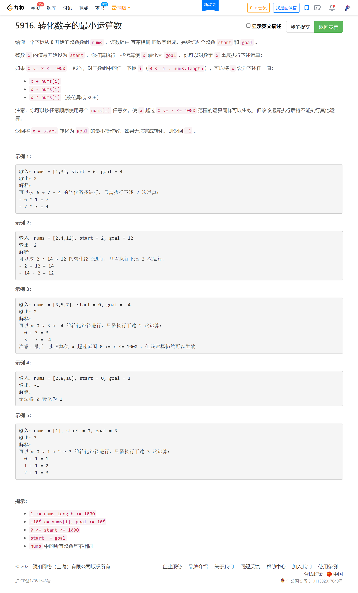
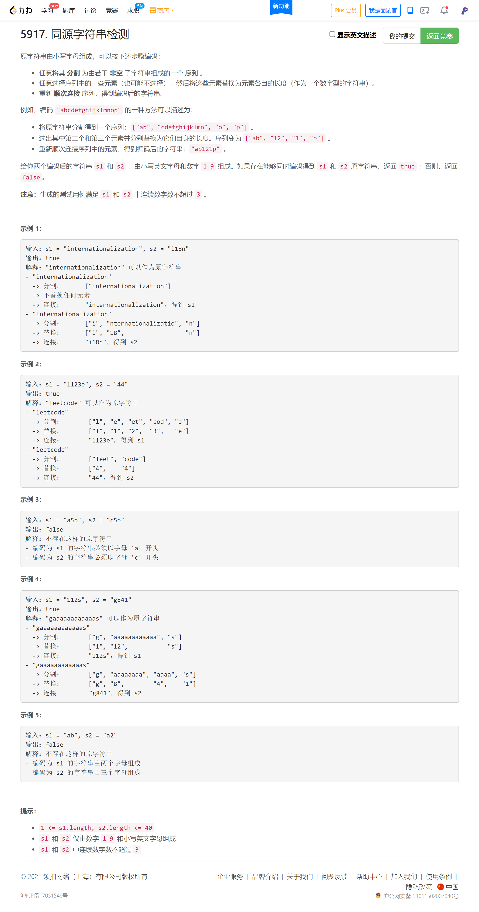
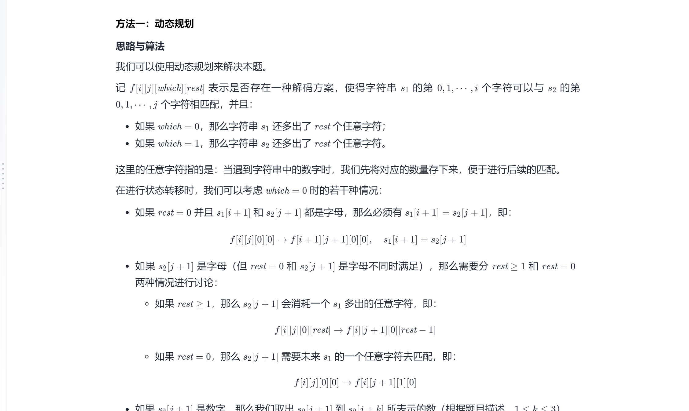
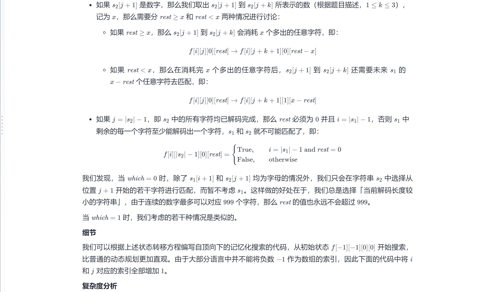
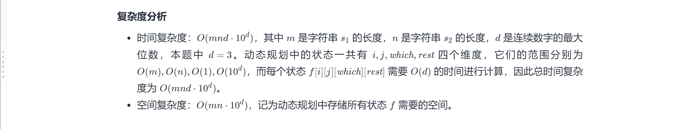
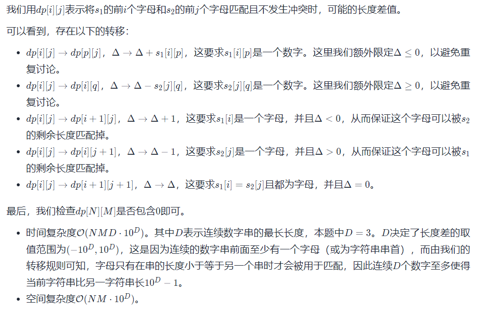

<!-- @import "[TOC]" {cmd="toc" depthFrom=1 depthTo=6 orderedList=false} -->

<!-- code_chunk_output -->

- [转化数字的最小运算数（转化为bfs问题）](#转化数字的最小运算数转化为bfs问题)
- [同源字符串检测（记忆化搜索/更优雅的动规）](#同源字符串检测记忆化搜索更优雅的动规)

<!-- /code_chunk_output -->

T3 完全没思路，赛后看了大佬的代码，估计用 BFS ？毕竟允许的当作中介的数在 1000 以内。这都可以想到 BFS + 多终点最短路？

T4 有那么难吗？只有 45 个人做出来。我是有思路的，递归+剪枝。但是不知道哪里超时了。估计是 `string(i, '*')` 用得太多？还是 `equal` 没优化？

不管了，电脑快没电了。学校停电一天，来电了再复盘这周末三场比赛。

### 转化数字的最小运算数（转化为bfs问题）



```cpp
// bfs 因为一共只有 1000 个状态

class Solution {
public:
    int minimumOperations(vector<int>& nums, int start, int goal) {
        int ans = -1;
        queue<int> q;
        int d[1001];
        memset(d, 0x3f, sizeof d);

        q.push(start);
        d[start] = 0;
        while (q.size())
        {
            int t = q.front();
            q.pop();
            
            for (auto&& num: nums)
            {
                int x;
                for (int i = 0; i < 3; ++ i)
                {
                    if (i == 0) x = t + num;
                    else if (i == 1) x = t - num;
                    else x = t ^ num;
                    if (x == goal && ans == -1 || d[t] + 1 < ans) ans = d[t] + 1;
                    if (x < 0 || x > 1000) continue;
                    if (d[x] > d[t] + 1)
                    {
                        d[x] = d[t] + 1;
                        q.push(x);
                    }
                }
            }
        }
        return ans;
    }
};
```

### 同源字符串检测（记忆化搜索/更优雅的动规）



**我的做法，超时了：**

```cpp
// 86 / 211 个通过测试用例
class Solution {
public:
    bool equal(string s1, string s2)
    {
        for (int i = 0; i < s1.size(); ++ i)
            if (s1[i] != s2[i] && s1[i] != '*' && s2[i] != '*')
                return false;
        return true;
    }
    
    bool flag;

    void dfs(string s1, string s2, int m1, int m2, string pre1, string pre2)
    {
        if (m1 == m2 && m1 != 0)
            if (!equal(pre1, pre2)) return ;
        
        if (s1.size() == 0 && s2.size() == 0)
        {
            if (m1 == m2)
                flag = true;
            return ;
        }
        
        int n1 = s1.size(), n2 = s2.size();
        int i1 = 0, i2 = 0;
        while (i1 < n1 && s1[i1] < '0' || s1[i1] > '9') ++ i1;
        while (i2 < n2 && s2[i2] < '0' || s2[i2] > '9') ++ i2;
        pre1 += s1.substr(0, i1);
        pre2 += s2.substr(0, i2);
        s1 = s1.substr(i1);
        s2 = s2.substr(i2);
        
        i1 = 0, i2 = 0;
        while (i1 < n1 && s1[i1] >= '0' && s1[i1] <= '9') ++ i1;
        while (i2 < n2 && s2[i2] >= '0' && s2[i2] <= '9') ++ i2;
        for (int i = 0; i < i1; ++ i)
            for (int j = 0; j < i2; ++ j)
            {
                string pre1_ = pre1;
                string pre2_ = pre2;
                pre1_ += string(atoi(s1.substr(0, i+1).c_str()), '*');
                pre2_ += string(atoi(s2.substr(0, j+1).c_str()), '*');
                dfs(s1.substr(i + 1), s2.substr(j + 1), pre1_.size(), pre2_.size(), pre1_, pre2_);
            }
        
        if (i1 == 0 && i2 != 0)
            for (int i = 0; i < i2; ++ i)
            {
                string pre2_ = pre2;
                pre2_ += string(atoi(s2.substr(0, i+1).c_str()), '*');
                dfs(s1, s2.substr(i + 1), pre1.size(), pre2_.size(), pre1, pre2_);
            }
        
        if (i2 == 0 && i1 != 0)
            for (int i = 0; i < i1; ++ i)
            {
                string pre1_ = pre1;
                pre1_ += string(atoi(s1.substr(0, i+1).c_str()), '*');
                dfs(s1.substr(i + 1), s2, pre1_.size(), pre2.size(), pre1_, pre2);
            }
        
        if (i1 == 0 && i2 == 0)
            dfs("", "", pre1.size(), pre2.size(), pre1, pre2);
        
        return ;
    }
    
    bool possiblyEquals(string s1, string s2) {
        flag = false;
        
        dfs(s1, s2, 0, 0, "", "");
        
        return flag;
    }
};
```

沮丧。我又写了一个小时，越写越乱。我原以为我的方法是 leetcode 对 `string` 支持不力造成的超时，因此开了 `char*` 没想到越改越乱。

还是看看高手怎么写的吧。啊！我码力还是不够啊！

参考[LeetCode-Solution](https://leetcode-cn.com/problems/check-if-an-original-string-exists-given-two-encoded-strings/solution/tong-yuan-zi-fu-chuan-jian-ce-by-leetcod-mwva/)：







```cpp
class Solution {
private:
    int f[41][41][2][1000];

public:
    bool possiblyEquals(string s1, string s2) {
        memset(f, -1, sizeof(f));
        int m = s1.size(), n = s2.size();

        function<bool(int, int, int, int)> dfs = [&](int i, int j, int which, int rest) -> bool {
            // 记忆化
            if (f[i][j][which][rest] != -1) {
                return f[i][j][which][rest];
            }

            if (which == 0) {
                if (j == n) {
                    return f[i][j][which][rest] = (i == m && !rest);
                }
                else if (isalpha(s2[j])) {
                    if (!rest && i != m && isalpha(s1[i])) {
                        return f[i][j][which][rest] = (s1[i] == s2[j] ? dfs(i + 1, j + 1, 0, 0) : false);
                    }
                    else {
                        return f[i][j][which][rest] = (rest >= 1 ? dfs(i, j + 1, 0, rest - 1) : dfs(i, j + 1, 1, 1));
                    }
                }
                else {
                    int x = 0, k = j;
                    while (k < n && isdigit(s2[k])) {
                        x = x * 10 + (s2[k] - '0');
                        if ((rest >= x && dfs(i, k + 1, 0, rest - x)) || (rest < x && dfs(i, k + 1, 1, x - rest))) {
                            return f[i][j][which][rest] = true;
                        }
                        ++k;
                    }
                    return f[i][j][which][rest] = false;
                }
            }
            else {
                if (i == m) {
                    return f[i][j][which][rest] = (j == n && !rest);
                }
                else if (isalpha(s1[i])) {
                    if (!rest && j != n && isalpha(s2[j])) {
                        return f[i][j][which][rest] = (s1[i] == s2[j] ? dfs(i + 1, j + 1, 0, 0) : false);
                    }
                    else {
                        return f[i][j][which][rest] = (rest >= 1 ? dfs(i + 1, j, 1, rest - 1) : dfs(i + 1, j, 0, 1));
                    }
                }
                else {
                    int x = 0, k = i;
                    while (k < m && isdigit(s1[k])) {
                        x = x * 10 + (s1[k] - '0');
                        if ((rest >= x && dfs(k + 1, j, 1, rest - x)) || (rest < x && dfs(k + 1, j, 0, x - rest))) {
                            return f[i][j][which][rest] = true;
                        }
                        ++k;
                    }
                    return f[i][j][which][rest] = false;
                }
            }
        };

        return dfs(0, 0, 0, 0);
    }
};
```

**经验：**
- C++11 中 `lambda` 函数的类型举例： `function<bool(int, int, int, int)> dfs = [&](int i, int j, int which, int rest) -> bool {}` ，其中 `[&]` 表示外部作用域变量按引用捕获
- 在 C++ `<ctype.h>` 中有 `isalpha()` 函数和 `isdigit()` 函数判断是字母还是数字，要善于使用

巨佬[吴自华](https://leetcode-cn.com/u/lucifer1004/)提供了一个 **更优雅的思路** ：



```cpp
class Solution {
    bool isdigit(char ch) {
        return ch >= '0' && ch <= '9';
    }
public:
    bool possiblyEquals(string s1, string s2) {
        int n = s1.size(), m = s2.size();
        vector<vector<unordered_set<int>>> dp(n + 1, vector<unordered_set<int>>(m + 1));
        dp[0][0].emplace(0);
                
        for (int i = 0; i <= n; ++i) {
            for (int j = 0; j <= m; ++j) {
                for (int delta : dp[i][j]) {
                    int num = 0;
                    if (delta <= 0) {
                        for (int p = i; p < min(i + 3, n); ++p) {
                            if (isdigit(s1[p])) {
                                num = num * 10 + s1[p] - '0';
                                dp[p + 1][j].emplace(delta + num);
                            } else {
                                break;
                            }
                        }
                    }
                    
                    num = 0;
                    if (delta >= 0) {
                        for (int q = j; q < min(j + 3, m); ++q) {
                            if (isdigit(s2[q])) {
                                num = num * 10 + s2[q] - '0';
                                dp[i][q + 1].emplace(delta - num);
                            } else {
                                break;
                            }
                        }
                    }
                    
                    if (i < n && delta < 0 && !isdigit(s1[i])) 
                        dp[i + 1][j].emplace(delta + 1);
                            
                    if (j < m && delta > 0 && !isdigit(s2[j])) 
                        dp[i][j + 1].emplace(delta - 1);
                            
                    if (i < n && j < m && delta == 0 && s1[i] == s2[j])
                        dp[i + 1][j + 1].emplace(0);
                }
            }
        }
        
        return dp[n][m].count(0);
    }
};
```
