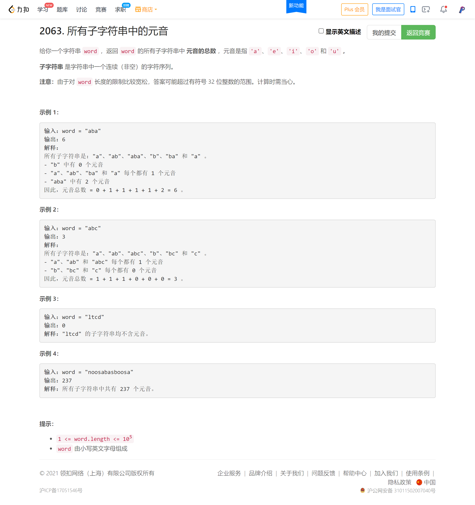
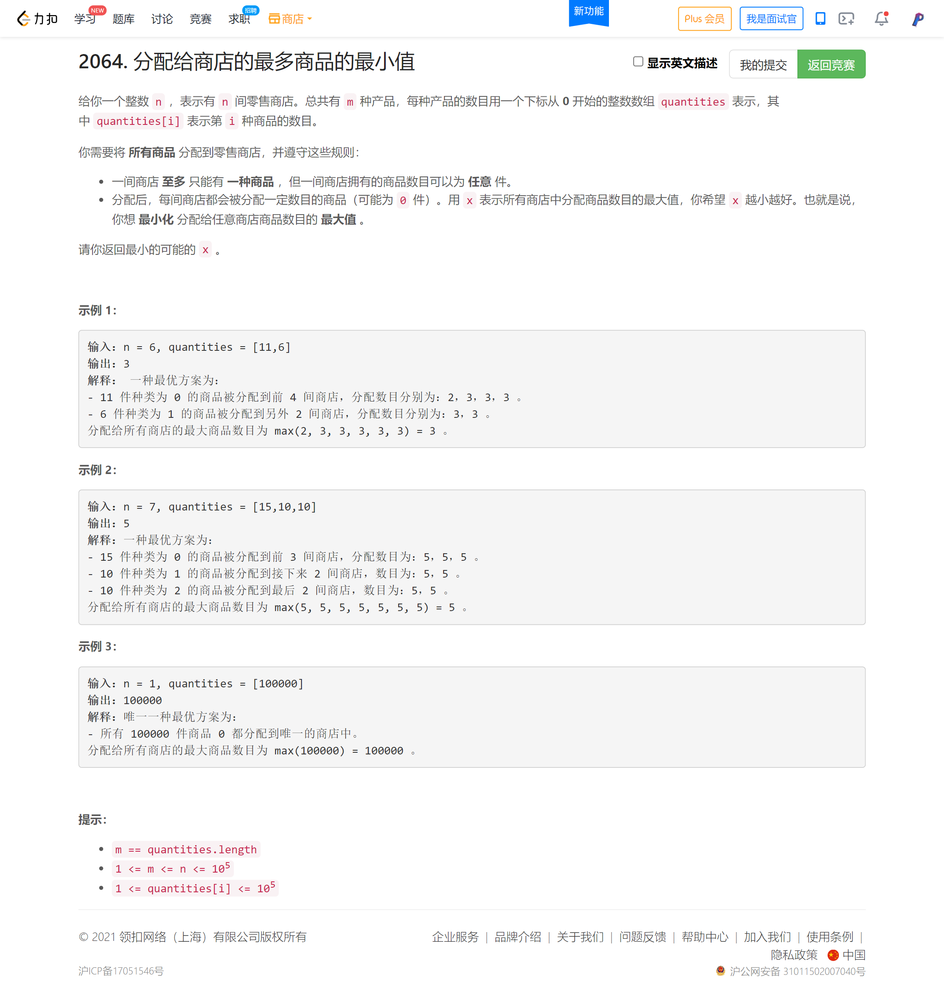
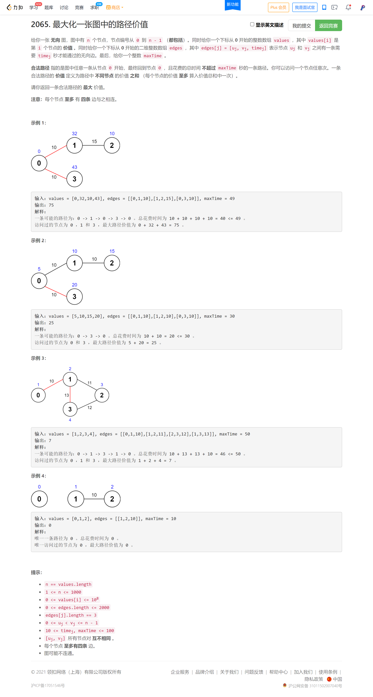

<!-- @import "[TOC]" {cmd="toc" depthFrom=1 depthTo=6 orderedList=false} -->

<!-- code_chunk_output -->

- [所有子字符串中的元音（数学找规律）](#所有子字符串中的元音数学找规律)
- [分配给商店的最多商品的最小值（二分）](#分配给商店的最多商品的最小值二分)
- [最大化一张图中的路径价值（数据范围可暴搜+dfs剪枝）](#最大化一张图中的路径价值数据范围可暴搜dfs剪枝)

<!-- /code_chunk_output -->

被唬住了，其实题目很常规。基础不牢导致成绩不好。

T2 实际上，就是让我枚举各个子字符串，然后看各个位置出现次数，我当场找的规律，用数学推导推不出来，咱看看高手怎么做的。

T3 写了个动态规划，超时了，过了一些测试用例吧。

T4 没来得及做。

### 所有子字符串中的元音（数学找规律）



比赛时现推导的过程如下：

```cpp
// 求各个位置在子字符串中出现次数
typedef long long ll;

class Solution {
public:
    long long countVowels(string word) {
        int n = word.size();
        vector<ll> a(n, 0);
        a[0] = n;
        int base = n - 2;
        for (int i = 1; i < n; ++ i)
        {
            a[i] = a[i - 1] + base;
            base -= 2;
        }

        ll res = 0;
        for (int i = 0; i < n; ++ i)
        {
            char c = word[i];
            if (c == 'a' || c == 'e' || c == 'i' || c == 'o' || c == 'u')
                res += a[i];
        }
        return res;
    }
};

/*
a
a b
a b a
  b
  b a
    a
3 4 3
+1, n=3

a
a b
a b c
a b c d
  b
  b c
  b c d
    c
    c d
      d
4 6 6 4
+2, n=4

a
a b
a b c
a b c d
a b c d e
  4 6 6 4
5 8 9 8 5
+3 +1, n=5

a
a b
a b c
a b c d
a b c d e
a b c d e f
  5 8 9 8 5
6 10 12 12 10 6
+4 +2, n=6

a
a b
a b c
a b c d
a b c d e
a b c d e f
a b c d e f g
  6 10 12 12 10 6
7 12 15 16 15 12 7
+5 +3 +1, n=7
*/
```

服了，说明我高中数学实在是没学好。

对于第 $i$ 个字符，其在子串中出现的次数为：

$$(i+1)(n-i)$$

怎么推的？对于第 $i$ 个字符，包含它的子串的左端点可以有 $0,1,...,i$ 共 $(i+1)$ 种，右端点可以有 $i,i+1,...,n-1$ 共 $n-i$ 种。

无语。因此本题就是：

```cpp
class Solution {
public:
    long long countVowels(string word) {
        long long n = word.size();
        long long res = 0;
        for (long long i = 0; i < n; ++ i)
        {
            char c = word[i];
            if (c == 'a' || c == 'e' || c == 'i' || c == 'o' || c == 'u')
                res += (i + 1) * (n - i);
        }
        return res;
    }
};
```

### 分配给商店的最多商品的最小值（二分）



考试时写的动态规划如下（没过，TLE）：

```cpp
// dp[i][j] 把前 i 个数分成 j 份的最小值

class Solution {
public:
    int get(int a, int b)
    {
        int res = a / b;
        if (res * b == a)
            return res;
        else return res + 1;
    }
    
    int minimizedMaximum(int n, vector<int>& q) {
        int m = q.size();
        
        int dp[m + 1][n + 1];
        memset(dp, 0x3f, sizeof dp);
        
        for (int i = 1; i <= min(q[0], n - m + 1); ++ i)
            dp[0][i] = get(q[0], i);

        for (int i = 1; i < m; ++ i)  // 零食下标从 0 开始，因此这里是 1 开始
            for (int j = i; j <= n; ++ j)  // 前 i - 1 至少已经分了 i 份
            {
                if (dp[i-1][j] == 0x3f3f3f3f) break;  // 没有前置状态
                for (int k = 1; k <= min(q[i], n - j); ++ k)
                {
                    if (n - (k + j) < m - i - 1) break;  // 没给后面的商品留够位置
                    int tmp = max(get(q[i], k), dp[i - 1][j]);
                    dp[i][j + k] = min(tmp, dp[i][j + k]);
                }
            }

        int res = 0x3f3f3f3f;
        for (int i = 0; i <= n; ++ i)
            res = min(dp[m - 1][i], res);

        return res;
    }
};
```

上面起码自己敢于写复杂动态规划了。

但是思维陷入误区，还是刷题太少。

如下，一个二分就解决了。

```cpp
// 注意可以取 0 件分配给商店
// 所以越小越难，因为容易分成过多份
// 二分答案 mid ，看是否是合法解决方案
// 怎么看合法？ auto q: quantities
//     (q + mid - 1) / mid （上取整）
//     求和，看是否超了 n ，没超就合法

class Solution {
public:
    int minimizedMaximum(int n, vector<int>& quantities) {
        auto check = [&](int mid) -> bool
        {
            long long cnt = 0;
            for (auto&& q: quantities)
                cnt += (q + mid - 1) / mid;
            return cnt <= n;  // 合法
        };

        int l = 1, r = 1e5, mid;
        while (l < r)
        {
            mid = l + r >> 1;
            if (check(mid)) r = mid;
            else l = mid + 1;
        }

        return l;
    }
};
```

**经验：**
- 看到`最大化最小值`类似内容，首先想到二分法。

### 最大化一张图中的路径价值（数据范围可暴搜+dfs剪枝）



```cpp
// 仔细读数据范围 time >= 10 而 maxTime <= 100
// 因此经过结点不超过 10 个
// 而结点度小于等于 4 ，因此暴搜 4^10 = 2^20 = 10^6
// 可以暴搜
// 还可以用最短路加个剪枝，要是回不来了就剪掉
const int N = 1010, M = 1e5;
int h[M], e[M], ne[M], w[M], idx;
int d[N], st[N], used[N];

void add(int a, int b, int c)
{
    e[idx] = b, w[idx] = c, ne[idx] = h[a], h[a] = idx ++ ;
}

class Solution {
public:
    int ans;

    void dfs(int u, int len, vector<int>& values, int v)  // len 还剩多少时间可以用
    {
        if (d[u] > len) return ;  // 回不去了
        if (u == 0 && v > ans) ans = v;
        for (int i = h[u]; ~i; i = ne[i])
        {
            int j = e[i];
            if (w[i] <= len)
            {
                if (used[j]) dfs(j, len - w[i], values, v);
                else
                {
                    used[j] = true;
                    dfs(j, len - w[i], values, v + values[j]);
                    used[j] = false;  // 恢复现场！！
                }
            }
        }
    }

    int maximalPathQuality(vector<int>& values, vector<vector<int>>& edges, int maxTime) {
        memset(d, 0x3f, sizeof d);
        memset(st, 0, sizeof st);
        memset(h, -1, sizeof h);
        memset(used, 0, sizeof used);
        ans = 0, idx = 0;
        int n = values.size();

        for (auto&& e: edges)
        {
            add(e[0], e[1], e[2]);
            add(e[1], e[0], e[2]);
        }

        d[0] = 0;
        for (int i = 0; i < n; ++ i)
        {
            int t = -1;
            for (int j = 0; j < n; ++ j)
                if (!st[j] &&(t == -1 || d[t] > d[j]))
                    t = j;

            for (int k = h[t]; ~k; k = ne[k])
            {
                int l = e[k];
                if (d[l] > d[t] + w[k])
                    d[l] = d[t] + w[k];
            }

            st[t] = true;
        }

        used[0] = values[0];  // 思维一定要严谨，样例中 0 点都没有价值...
        dfs(0, maxTime, values, values[0]);

        return ans;
    }
};
```
