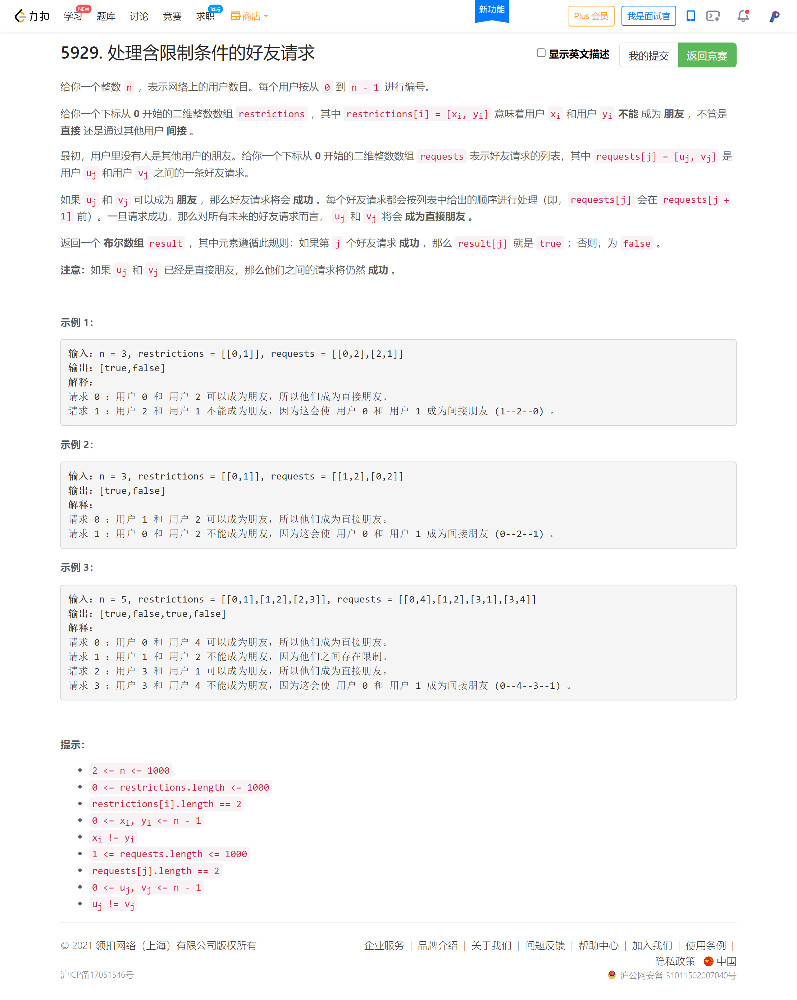

<!-- @import "[TOC]" {cmd="toc" depthFrom=1 depthTo=6 orderedList=false} -->

<!-- code_chunk_output -->

- [反转偶数长度组的节点（反转链表）](#反转偶数长度组的节点反转链表)
- [解码斜向换位密码（简单题）](#解码斜向换位密码简单题)
- [处理含限制条件的好友请求（并查集+暴力）](#处理含限制条件的好友请求并查集暴力)

<!-- /code_chunk_output -->

我是傻逼。

链表心中完全没有章法，不会做。做了一个半小时，不对。

四道题都极其简单。

### 反转偶数长度组的节点（反转链表）


```cpp
/**
 * Definition for singly-linked list.
 * struct ListNode {
 *     int val;
 *     ListNode *next;
 *     ListNode() : val(0), next(nullptr) {}
 *     ListNode(int x) : val(x), next(nullptr) {}
 *     ListNode(int x, ListNode *next) : val(x), next(next) {}
 * };
 */
class Solution {
public:
    ListNode* reverseEvenLengthGroups(ListNode* head) {
        auto reverse = [&](ListNode* sta, ListNode* end) -> ListNode*
        {   // 将 sta 到 end->prev 翻转后连接到 end 上
            auto prev = end;
            auto curr = sta;
            while (curr != end)
            {
                auto next = curr->next;
                curr->next = prev;
                prev = curr;
                curr = next;
            }
            return prev;  // 返回新的头节点
        };

        ListNode* dummy = new ListNode(-1, head);
        auto p = dummy, q = dummy;
        int cnt = 0, base = 1;
        while (q->next)
        {
            if (cnt == base)
            {
                if (cnt % 2 == 0)
                {
                    auto tmp = reverse(p->next, q->next);
                    q = p->next;
                    p->next = tmp;
                    // cout << tmp->val << " ";
                }
                p = q;
                cnt = 0;
                base ++ ;
            }
            q = q->next;
            ++ cnt;
        }

        if (cnt % 2 == 0)
        {
            auto tmp = reverse(p->next, nullptr);
            p->next = tmp;
            // cout << tmp->val << " ";
        }
        // puts("");

        return dummy->next;
    }
};
```

### 解码斜向换位密码（简单题）


```cpp
class Solution {
public:
    string decodeCiphertext(string encodedText, int rows) {
        int cols = encodedText.size() / rows;
        int i = 0, j = 0;

        string res;
        while (i * cols + j < rows * cols)
        {
            res += encodedText[i * cols + j];
            ++ i, ++ j;
            if (i == rows) i = 0, j -= (rows - 1);
        }

        while (res.back() == ' ')
            res.pop_back();
        return res;
    }
};
```

### 处理含限制条件的好友请求（并查集+暴力）



```cpp
class Solution {
public:
    vector<bool> friendRequests(int n, vector<vector<int>>& restrictions, vector<vector<int>>& requests) {
        int p[n];
        for (int i = 0; i < n; ++ i) p[i] = i;
        function<int(int)> find = [&](int x) -> int
        {
            if (p[x] != x) p[x] = find(p[x]);
            return p[x];
        };

        vector<bool> ans;
        for (auto&& req: requests)
        {
            int pa = find(req[0]), pb = find(req[1]);
            
            if (pa == pb) ans.push_back(true);
            else
            {
                bool flag = false;
                for (auto&& res: restrictions)
                {
                    int u = find(res[0]), v = find(res[1]);
                    if (u == pa && v == pb || u == pb && v == pa)
                    {
                        ans.push_back(false);
                        flag = true;
                        break;
                    }
                }
                if (!flag)
                {
                    ans.push_back(true);
                    p[find(req[0])] = find(req[1]);
                }
            }
        }

        return ans;
    }
};
```

用哈希表优化一下，动态记录一下各个集合集合头部的仇恨映射。

```cpp
class Solution {
public:
    vector<bool> friendRequests(int n, vector<vector<int>>& restrictions, vector<vector<int>>& requests) {
        int p[n];
        int cnt[n];
        for (int i = 0; i < n; ++ i) p[i] = i;
        for (int i = 0; i < n; ++ i) cnt[i] = 1;
        function<int(int)> find = [&](int x) -> int
        {
            if (p[x] != x) p[x] = find(p[x]);
            return p[x];
        };

        // hash[i][j] = false 不是敌人
        unordered_map<int, unordered_map<int, bool>> hash;
        for (auto&& res: restrictions)
        {
            hash[res[0]][res[1]] = true;
            hash[res[1]][res[0]] = true;
        }

        vector<bool> ans;
        for (auto&& req: requests)
        {
            int pa = find(req[0]), pb = find(req[1]);

            if (pa == pb) ans.push_back(true);
            else if (hash[pa][pb] || hash[pb][pa])
                ans.push_back(false);
            else
            {
                ans.push_back(true);
                if (cnt[pa] > cnt[pb])
                    swap(pa, pb);  // 总是将小集合合并到大集合
                cnt[pb] += cnt[pa];
                p[pa] = pb;
                for (auto&& item: hash[pa])
                {
                    hash[item.first][pb] = true;
                    hash[pb][item.first] = true;
                }
            }
        }

        return ans;
    }
};
```

效果对比：

|提交结果|执行用时|内存消耗|语言|提交时间|
|---|---|---|---|---|
|通过|100 ms|35.7 MB|C++|2021/11/17 22:38|
|通过|536 ms|21.2 MB|C++|2021/11/17 22:28|
