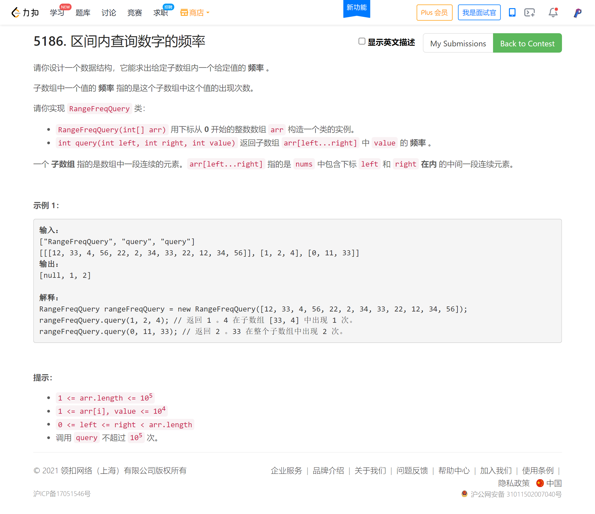
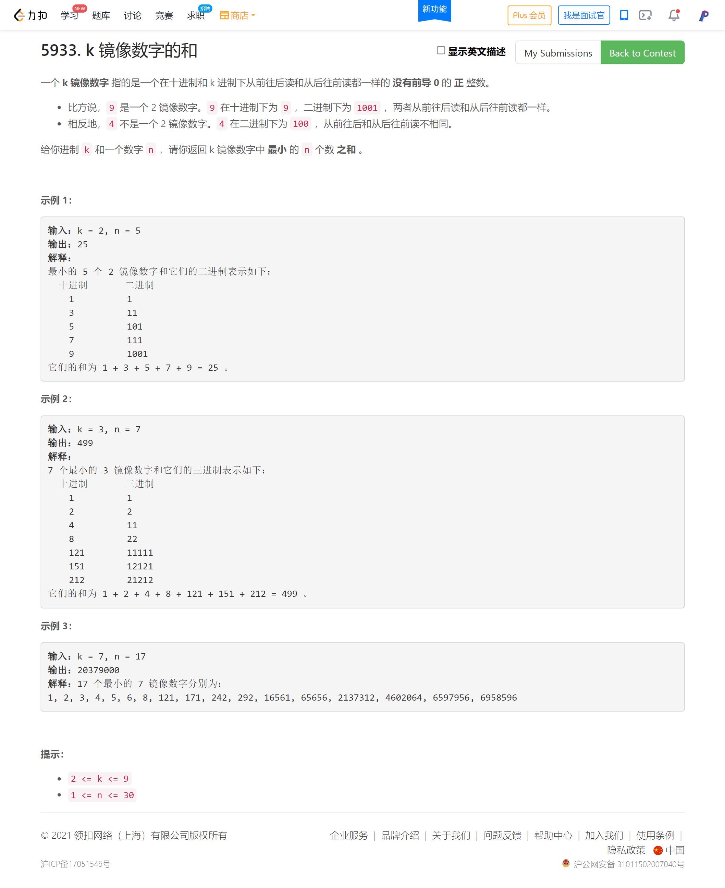

<!-- @import "[TOC]" {cmd="toc" depthFrom=1 depthTo=6 orderedList=false} -->

<!-- code_chunk_output -->

- [区间内查询数字的频率（保存索引/二分）](#区间内查询数字的频率保存索引二分)
- [k 镜像数字的和（找规律从小到大生成镜像数字）](#k-镜像数字的和找规律从小到大生成镜像数字)

<!-- /code_chunk_output -->

T4 有点难度？

T3 挺有趣的，空间换时间，记录一下。罚时了一次，错在审题不认真，把 10000 的空间开成 1000 了。

T4 想复杂了，其实求下一个回文数字很简单。

### 区间内查询数字的频率（保存索引/二分）



```cpp
class RangeFreqQuery {
public:
    vector<int> hash[10001];
    RangeFreqQuery(vector<int>& arr) {
        for (int i = 0; i < arr.size(); ++ i)
        {
            int a = arr[i];
            hash[a].push_back(i);
        }
    }
    
    int query(int left, int right, int value) {
        auto lt = lower_bound(hash[value].begin(), hash[value].end(), left);
        auto rt = upper_bound(hash[value].begin(), hash[value].end(), right);
        return rt - lt;
    }
};

/**
 * Your RangeFreqQuery object will be instantiated and called as such:
 * RangeFreqQuery* obj = new RangeFreqQuery(arr);
 * int param_1 = obj->query(left,right,value);
 */
```

### k 镜像数字的和（找规律从小到大生成镜像数字）



```cpp
typedef long long LL;

class Solution {
public:
    long long kMirror(int k, int n) {
        auto nextNum = [&](LL a) -> LL
        {
            string s = to_string(a);
            int len = s.size();
            // 除非全是 9
            // 否则从中间开始找一位不是 9 的 +1
            // 然后将该位到中间的位赋值为 1
            for (int i = len / 2; i >= 0; -- i)
            {
                if (s[i] != '9')
                {
                    s[i] += 1;
                    if (len - 1 - i != i)
                        s[len - 1 - i] += 1;  // 对称位
                    for (int j = i + 1; j <= len / 2; ++ j)
                        s[len - 1 - j] = s[j] = '0';
                    return stoll(s);  // string to long long
                }
            }
            // 全都是 9
            LL res = 1;
            for (int i = 0; i < len; ++ i)
                res *= 10;
            return ++ res ;
        };

        auto check = [&](LL a) -> bool
        {
            string s = "";
            while (a)
            {
                s += char(a % k + '0');
                a /= k;
            }
            int i = 0, j = s.size() - 1;
            while (i < j)
            {
                if (s[i] != s[j])
                    return false;
                ++ i, -- j;
            }
            return true;
        };
        
        LL num = 1;
        LL res = 0;
        int cnt = 0;
        while (cnt < n)
        {
            // cout << "nextNum" << endl;
            if (check(num))
            {
                // cout << "check" << endl;
                cnt ++ ;
                res += num;
            }
            num = nextNum(num);
        }
        return res;
    }
};
```
