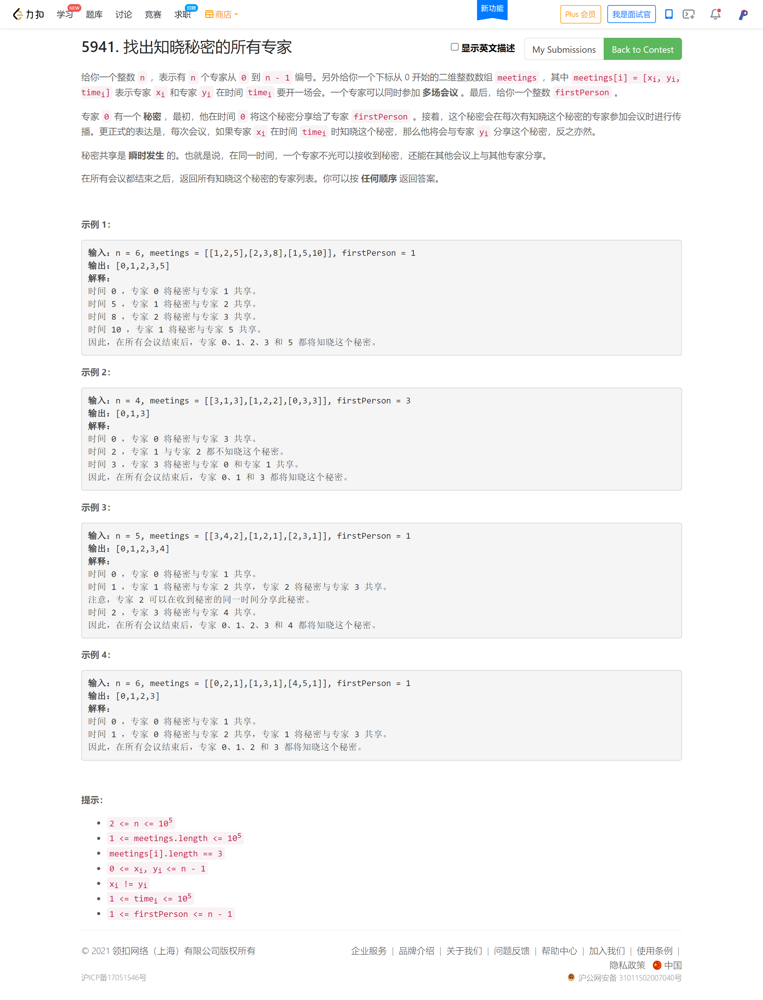

<!-- @import "[TOC]" {cmd="toc" depthFrom=1 depthTo=6 orderedList=false} -->

<!-- code_chunk_output -->

- [找出知晓秘密的所有专家（优先队列）](#找出知晓秘密的所有专家优先队列)

<!-- /code_chunk_output -->

都很简单。

T2 涨了个大经验：如果有求和，那记得开 `long long` ！！！

T4 很简单，思维和码力都还不太成熟，才做了挺久。

### 找出知晓秘密的所有专家（优先队列）



```cpp
#define fi first
#define se second

const int N = 1e5 + 10;

class Solution {
public:
    vector<int> findAllPeople(int n, vector<vector<int>>& meetings, int firstPerson) {
        unordered_map<int, vector<pair<int, int>>> friends;

        for (auto&& t: meetings)
        {
            friends[t[0]].push_back({t[1], t[2]});  // 专家，开会时间
            friends[t[1]].push_back({t[0], t[2]});
        }

        int st[n];
        int earliest[n];
        memset(st, 0, sizeof st);
        memset(earliest, 0x3f, sizeof earliest);
        vector<int> res;
        priority_queue<pair<int, int>, vector<pair<int, int>>, greater<pair<int, int>>> q;  // {最早时间，专家}
        q.push({0, 0});
        q.push({0, firstPerson});
        earliest[0] = 0;
        earliest[firstPerson] = 0;

        while (q.size())
        {
            // t.fi 专家 t.se 最早知晓时间
            auto t = q.top();
            q.pop();

            if (st[t.se]) continue;
            res.push_back(t.se);
            st[t.se] = 1;

            priority_queue<pair<int, int>, vector<pair<int, int>>> ms;  // {开会时间，专家}
            for (auto&& fr: friends[t.se])
            {
                if (fr.se < t.fi) continue;
                ms.push({fr.se, fr.fi});  // fr.fi 在 fr.se 来开会
            }

            while (ms.size())
            {
                auto mp = ms.top();  // mp.se 在 mp.fi 来开会
                ms.pop();

                if (mp.fi < earliest[mp.se])
                {
                    earliest[mp.se] = mp.fi;
                    q.push({mp.fi, mp.se});
                }
            }
        }
        return res;
    }
};
```