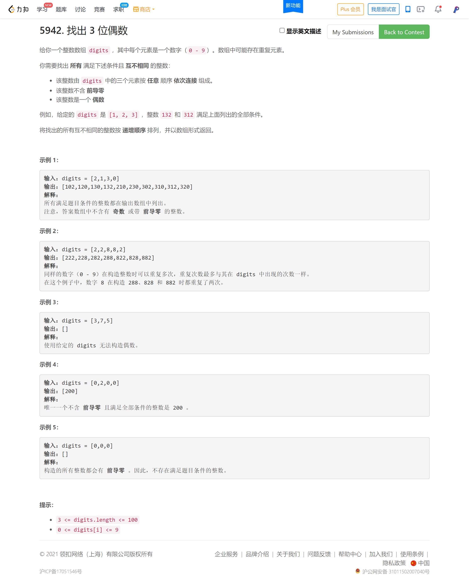
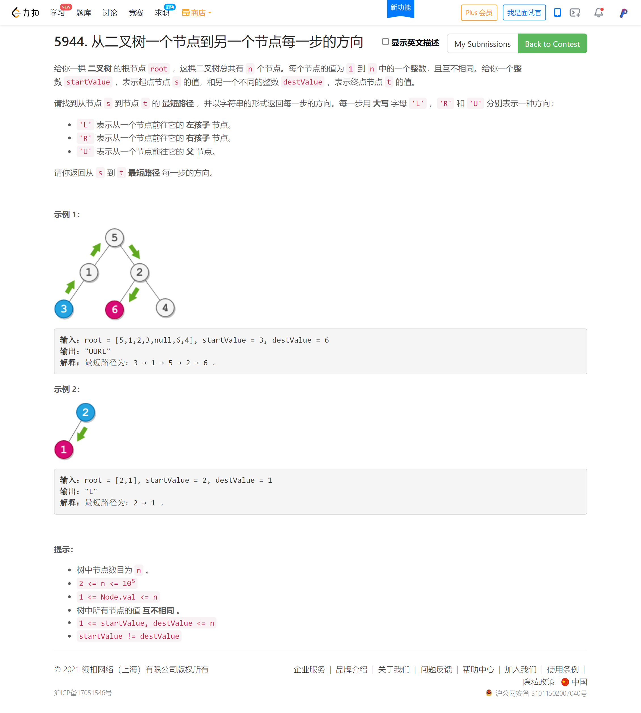
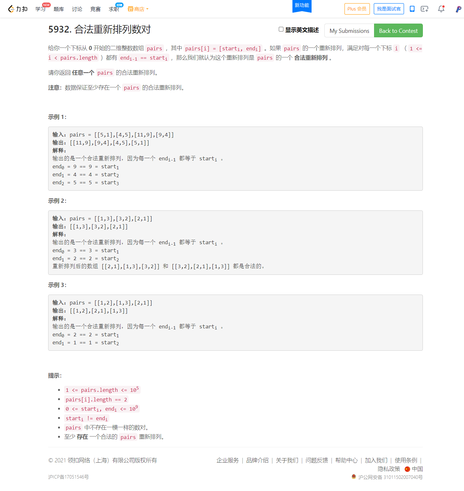

<!-- @import "[TOC]" {cmd="toc" depthFrom=1 depthTo=6 orderedList=false} -->

<!-- code_chunk_output -->

- [找出 3 位偶数（思维严谨）](#找出-3-位偶数思维严谨)
- [从二叉树一个节点到另一个节点每一步的方向（思维题/反套路）](#从二叉树一个节点到另一个节点每一步的方向思维题反套路)
- [合法重新排列数对（一笔画/欧拉路径）](#合法重新排列数对一笔画欧拉路径)

<!-- /code_chunk_output -->

T1 就因为思维不严谨调了18分钟？经验不足。因此好好记录一下。

T3 给我提了个大醒，别陷入模板套路！我最先想到 `dfs + dijkstra` ，实际上根本不用，稍微对着样例思考下过程就能发现规律...罚时完全是因为自己傻了，非常低级的失误。

### 找出 3 位偶数（思维严谨）



```cpp
class Solution {
public:
    vector<int> findEvenNumbers(vector<int>& digits) {
        sort(digits.begin(), digits.end());
        int n = digits.size();
        
        int lasti = -1, lastj = -1, lastk = -1;
        
        vector<int> res;
        for (int i = 0; i < n; ++ i)
        {
            if (digits[i] == lasti)
                continue;
            if (digits[i] == 0) continue;
            lasti = digits[i];
            lastj = -1;
            for (int j = 0; j < n; ++ j)
            {
                // if (digits[j] == 2) cout << i << " " << j << " " << endl;
                if (digits[j] == lastj)
                    continue;
                if (j == i) continue;
                lastj = digits[j];
                lastk = -1;
                for (int k = 0; k < n; ++ k)
                {
                    // cout << i << " " << j << " " << k << endl;
                    if (digits[k] == lastk)
                        continue;
                    if (j == k || i == k) continue;
                    if (digits[k] % 2) continue;
                    lastk = digits[k];
                    res.push_back(digits[i] * 100 + digits[j] * 10 + digits[k]);
                }
            }
        }
        
        return res;
    }
};
```

### 从二叉树一个节点到另一个节点每一步的方向（思维题/反套路）



**首先来看 TLE 的解法：**

```cpp
// 287 / 332 个通过测试用例
/**
 * Definition for a binary tree node.
 * struct TreeNode {
 *     int val;
 *     TreeNode *left;
 *     TreeNode *right;
 *     TreeNode() : val(0), left(nullptr), right(nullptr) {}
 *     TreeNode(int x) : val(x), left(nullptr), right(nullptr) {}
 *     TreeNode(int x, TreeNode *left, TreeNode *right) : val(x), left(left), right(right) {}
 * };
 */

#define fi first
#define se second

const int N = 1e5 + 10, M = 1e6 + 10;
int d[N], last[N], st[N];
char path[N];
int h[N], e[M], ne[M], idx;
char w[M];
void add(int a, int b, char c)
{
    e[idx] = b, w[idx] = c, ne[idx] = h[a], h[a] = idx ++ ;
}

class Solution {
public:
    string getDirections(TreeNode* root, int startValue, int destValue) {
        memset(h, -1, sizeof h);
        memset(d, 0x3f, sizeof d);
        memset(st, 0, sizeof st);
        idx = 0;
        
        function<void(TreeNode*)> dfs = [&](TreeNode* u)
        {
            if (!u) return ;
            TreeNode* l = u->left;
            TreeNode* r = u->right;
            
            if (l)
            {
                add(u->val, l->val, 'L');
                add(l->val, u->val, 'U');
                dfs(l);
            }
            
            if (r)
            {
                add(u->val, r->val, 'R');
                add(r->val, u->val, 'U');
                dfs(r);
            }
        };
        
        dfs(root);
        
        priority_queue<pair<int, int>, vector<pair<int, int>>, greater<pair<int, int>>> q;
        d[startValue] = 0;
        st[startValue] = 1;
        q.push({0, startValue});
        while (true)
        {
            auto t = q.top();
            q.pop();
            if (t.se == destValue) break;
            
            for (int i = h[t.se]; ~i; i = ne[i])
            {
                int j = e[i];
                if (st[j]) continue;
                if (d[j] > d[t.se] + 1)
                {
                    d[j] = d[t.se] + 1;
                    last[j] = t.se;
                    path[j] = w[i];
                    q.push({d[j], j});
                }
            }
            
            st[t.se] = 1;
        }
        
        string res;
        for (int i = destValue; i != startValue; i = last[i])
        {
            res = path[i] + res;
        }
        
        return res;
    }
};
```

事实证明，别着急动笔，先思考。别陷入套路了。

```cpp
/**
 * Definition for a binary tree node.
 * struct TreeNode {
 *     int val;
 *     TreeNode *left;
 *     TreeNode *right;
 *     TreeNode() : val(0), left(nullptr), right(nullptr) {}
 *     TreeNode(int x) : val(x), left(nullptr), right(nullptr) {}
 *     TreeNode(int x, TreeNode *left, TreeNode *right) : val(x), left(left), right(right) {}
 * };
 */

class Solution {
public:
    string getDirections(TreeNode* root, int startValue, int destValue) {
        
        string staPath, desPath, path;

        function<void(TreeNode*)> dfs = [&](TreeNode* u)
        {
            if (!u) return ;
            if (u->val == startValue) staPath = path;
            if (u->val == destValue) desPath = path;

            TreeNode* l = u->left;
            TreeNode* r = u->right;

            if (l)
            {
                path += 'L';
                dfs(l);
                path.pop_back();
            }
            
            if (r)
            {
                path += 'R';
                dfs(r);
                path.pop_back();
            }
        };

        dfs(root);
        
        int i = 0;
        for (; i < staPath.size() && i < desPath.size() && staPath[i] == desPath[i]; ++ i);
        
        staPath = staPath.substr(i);
        desPath = desPath.substr(i);

        string front(staPath.size(), 'U');
        string res = front + desPath;
        return res;
    }
};
```

### 合法重新排列数对（一笔画/欧拉路径）



参考[newhar](https://leetcode-cn.com/problems/valid-arrangement-of-pairs/solution/zhuan-hua-wei-ou-la-lu-jing-wen-ti-tu-ji-aqmu/)：

将 $start_i$, $end_i$ 视为点，$pair$ 视为边，则该题可以转为 “欧拉路径问题”：遍历图，每条边只能走一次（“一笔画问题”）。

首先我们需要寻找“一笔画” 的起点。
- 如果找到一个点的 出度（从该点出发的边的数量）比 入度（进入该点的边的数量） 大 11，那么该点毫无疑问是起点；（如果该点不是起点，那么这个点的边无论如何也遍历不完，因为只有进去一次才能出去一次）;
- 如果没找到这样的一个点，那么任何一个点都可以作为起点。（因为题目保证该图存在合法路径，那么这张图一定是欧拉图或半欧拉图，而对于欧拉图或半欧拉图，有以下结论：要么恰好有两个点的入度和出度差 $1$，要么所有点的 `入度 = 出度`。排除了前一种情况，那么只剩下所有节点的入度出度都相同的情况，那么从任何一个节点出发都是可以的。）

然后我们需要求“一笔画” 路径的算法：通用的算法是 Hierholzer 算法。

首先我们从起点出发，遍历任意边，然后把边删除。**只有我们发现当前点已经是“死胡同”， 没有任何边连出，需要往回走** 时，我们才在结果中加入该点。这样，我们得到了 “一笔画” 路径的 逆序。最后把路径翻转即可得到最终结果。

```cpp
#define fi first
#define se second

class Solution {
public:
    vector<vector<int>> validArrangement(vector<vector<int>>& pairs) {
        unordered_map<int, vector<int>> nes;  // 临边（包含了出度信息）
        unordered_map<int, int> ins;  // 入度

        for (auto&& p: pairs)
        {
            nes[p[0]].push_back(p[1]);
            ins[p[1]] ++ ;
        }

        int sta = pairs[0][0];
        for (auto&& t: nes)
            if (t.se.size() == ins[t.fi] + 1)
            {
                sta = t.fi;
                break;
            }
        
        vector<int> res;
        function<void(int)> dfs = [&](int u)
        {
            auto& ne = nes[u];
            while (ne.size())
            {
                auto v = ne.back();
                ne.pop_back();
                dfs(v);
            }
            res.push_back(u);
        };

        dfs(sta);

        reverse(res.begin(), res.end());
        vector<vector<int>> ans;
        for (int i = 1; i < res.size(); ++ i)
            ans.push_back({res[i - 1], res[i]});
        
        return ans;
    }
};
```

确实也不难。
