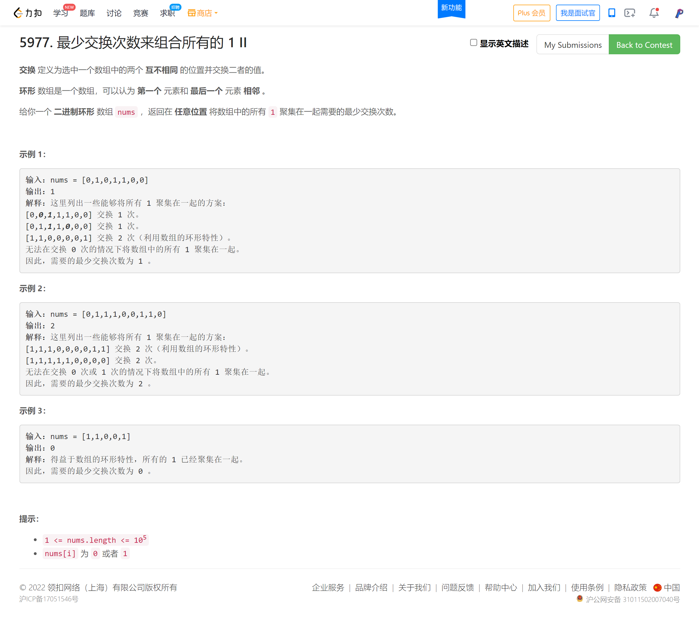
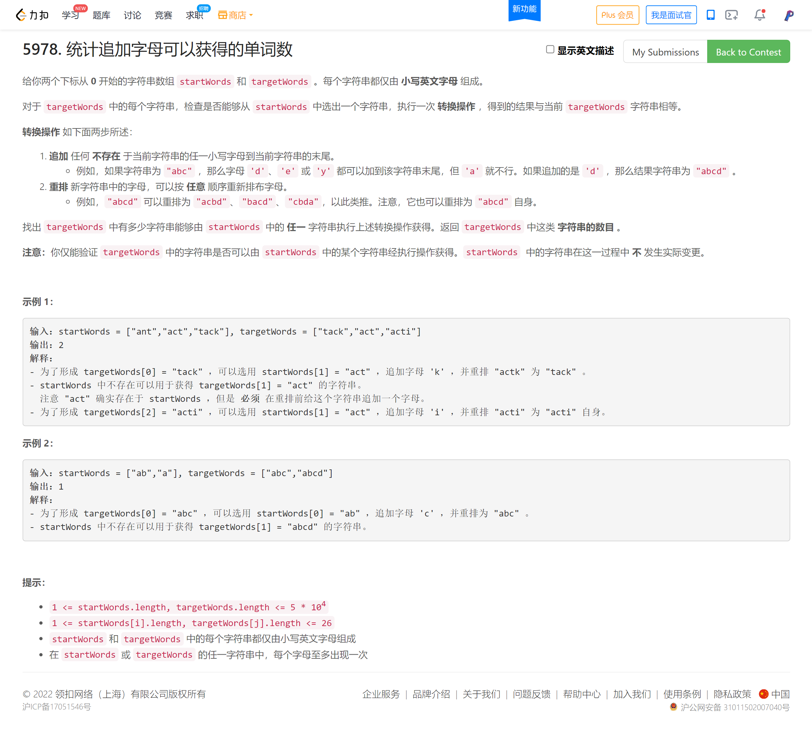
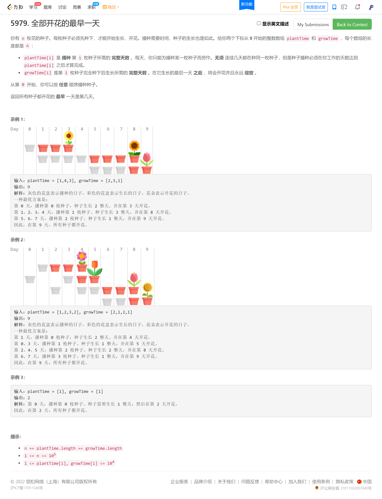

<!-- @import "[TOC]" {cmd="toc" depthFrom=1 depthTo=6 orderedList=false} -->

<!-- code_chunk_output -->

- [5977. 最少交换次数来组合所有的 1 II（断链重连+滑动窗口）](#5977-最少交换次数来组合所有的-1-ii断链重连滑动窗口)
- [5978. 统计追加字母可以获得的单词数（位运算/分析）](#5978-统计追加字母可以获得的单词数位运算分析)
- [5979. 全部开花的最早一天（贪心及其证明+iota函数的使用）](#5979-全部开花的最早一天贪心及其证明iota函数的使用)

<!-- /code_chunk_output -->

很奇怪， T2 T3 毫无思路？

T3 用 Trie 树？

### 5977. 最少交换次数来组合所有的 1 II（断链重连+滑动窗口）



我是木讷了，我一直想着怎么把哪些空消除，完全没有从 **全局** 观察规律。

实际上真不复杂。就是先统计 $1$ 的数量，假设为 $n$ ，然后做长度为 $n$ 的滑窗，找 $1$ 最多的，其中的 $0$ 的数量就是答案。

对于环形数组，就是将其断链重连，这个是基本技巧。

```cpp
class Solution {
public:
    int minSwaps(vector<int>& nums) {
        int k = 0;
        for (auto&& i: nums)
            if (i == 1) ++ k;

        if (k == 0) return 0;  // 特判全 0 情况

        vector<int> ring = nums;
        ring.insert(ring.end(), nums.begin(), nums.end());
        int cnt = 0;  // 1 数量
        int ans = INT_MAX;
        for (int i = 0; i < ring.size(); ++ i)
        {
            if (ring[i] == 1) ++ cnt;
            if (i >= k - 1)  // 已经达到一个滑窗长度
            {
                ans = min(ans, k - cnt);
                if (ring[i - k + 1] == 1) -- cnt;
            }
        }

        return ans;
    }
};
```

### 5978. 统计追加字母可以获得的单词数（位运算/分析）



其实真不难...

```cpp
class Solution {
public:
    // 并不需要排序，直接用位运算就好
    int wordCount(vector<string>& startWords, vector<string>& targetWords) {
        unordered_set<int> S;

        // 将 startWords 记录到集合
        for (auto&& s: startWords)
        {
            int mask = 0;
            for (auto&& c: s)
                mask |= 1 << (c - 'a');
            S.insert(mask);
        }

        // 将 targetWords 中每个字符
        int ans = 0;
        for (auto&& s: targetWords)
        {
            int mask = 0;
            for (auto&& c: s)
                mask |= 1 << (c - 'a');
            // 枚举 targetWords 之前状态的所有可能，顶多 26 种
            for (auto&& c: s)
                if (S.count(mask ^ (1 << (c - 'a'))))
                {
                    ++ ans;
                    break;
                }
        }

        return ans;
    }
};
```

### 5979. 全部开花的最早一天（贪心及其证明+iota函数的使用）



依旧是参考[灵佬](https://leetcode-cn.com/problems/earliest-possible-day-of-full-bloom/solution/tan-xin-ji-qi-zheng-ming-by-endlesscheng-hfwe/)：

对于两枚种子，设其播种所需天数为 $p_1$ 和 $p_2$ ，生长所需天数为 $g_1$ 和 $g_2$ 。

不妨设 $g_1\ge g_2$ 。我们来比较哪种播种顺序更优：

- 先 $1$ 后 $2$ 时的最晚开花时间：

$$\max(p_1+g_1,p_1+p_2+g_2)
$$

- 先 $2$ 后 $1$ 时的最晚开花时间：

$$
\max(p_1+p_2+g_1,p_2+g_2)
$$

由于 $g_1\ge g_2$ 且 $p_1>0$ ，所以 $p_1+p_2+g_1>p_2+g_2$ ，因此上式即为 $p_1+p_2+g_1$ 。

由于 $p_1+g_1 < p_1+p_2+g_1$ 且 $p_1+p_2+g_2 \le p_1+p_2+g_1$ ，因此我们有

$$
\max(p_1+g_1,p_1+p_2+g_2) \le p_1+p_2+g_1 = \max(p_1+p_2+g_1,p_2+g_2)
$$

上式表明，按照先 $1$ 后 $2$ 的顺序播种，最晚开花时间不会晚于按照先 $2$ 后 $1$ 播种时的最晚开花时间。

**这意味着按照生长天数从大到小排序后，交换任意两枚种子的播种顺序，不会让最晚开花时间提前。**

因此，我们可以按照生长天数从大到小的顺序播种。对于两枚生长天数相同的种子，由于无论按照何种顺序播种，这两枚种子的最晚开花时间都是相同的，因此无需考虑生长天数相同的种子的播种顺序，所以在排序时，仅需对生长天数从大到小排序。

```cpp
class Solution {
public:
    int earliestFullBloom(vector<int>& plantTime, vector<int>& growTime) {
        vector<int> ids(plantTime.size());
        iota(ids.begin(), ids.end(), 0);  // 0 1 2 3 ...
        sort(ids.begin(), ids.end(), [&](int a, int b){ return growTime[a] > growTime[b]; });
        int ans = 0, day = 0;
        for (auto&& i: ids)
        {
            day += plantTime[i];
            ans = max(day + growTime[i], ans);
        }

        return ans;
    }
};
```
