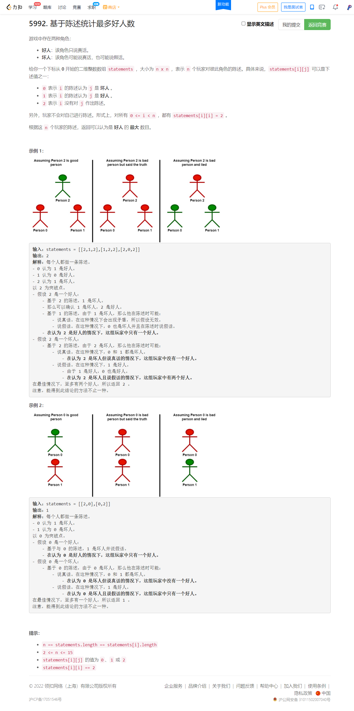

<!-- @import "[TOC]" {cmd="toc" depthFrom=1 depthTo=6 orderedList=false} -->

<!-- code_chunk_output -->

- [5992. 基于陈述统计最多好人数（递归dfs+假设）](#5992-基于陈述统计最多好人数递归dfs假设)

<!-- /code_chunk_output -->

还有一分钟时候 AK ，一个很可惜的笔误。

记录一下 T4 ，虽然也很简单，但是有两条 dfs 的经验：
- 恢复现场，别拿全局变量做容器，你 `memcpy` 之前声明个容器就行
- 捋清楚状态转移树是怎样的，由此进行检查、更新状态、决策

### 5992. 基于陈述统计最多好人数（递归dfs+假设）



```cpp
class Solution {
private:
    int ans;
    int n;
    int st[16];

    void dfs(int p, int s, vector<vector<int>>& statements)
    {
        if (p == n)
        {
            // for (int i = 0; i < n; ++ i)
            //     cout << st[i] << " ";
            // cout << endl;
            int cnt = 0;
            for (int i = 0; i < n; ++ i)
                if (st[i] != 0) ++ cnt;
            ans = max(ans, cnt);
            return ;
        }

        // 坏人的话，检查本身是不是已经被判定为好人
        int tmp[16];
        memcpy(tmp, st, sizeof st);
        if (s == 0)
        {
            if (st[p] == 1) return ;
            st[p] = s;
        }
        else
        {
            st[p] = s;
            for (int i = 0; i < n; ++ i)
                if (statements[p][i] == 0 && st[i] == 1 || statements[p][i] == 1 && st[i] == 0) return ;
            for (int i = 0; i < n; ++ i)
                if (statements[p][i] != 2) st[i] = statements[p][i];
        }

        if (st[p + 1] == 1 || st[p + 1] == 0)
        {
            dfs(p + 1, st[p + 1], statements);
        }
        else
        {
            // for (int i = 0; i < n; ++ i)
            //     cout << st[i] << " ";
            // cout << endl;
            dfs(p + 1, 0, statements);
            dfs(p + 1, 1, statements);
        }
        memcpy(st, tmp, sizeof st);
    }

public:
    int maximumGood(vector<vector<int>>& statements) {
        n = statements.size();
        memset(st, -1, sizeof st);
        ans = 0;

        dfs(0, 0, statements);  // 0 是坏人
        dfs(0, 1, statements);  // 0 是好人

        return ans;
    }
};
```
