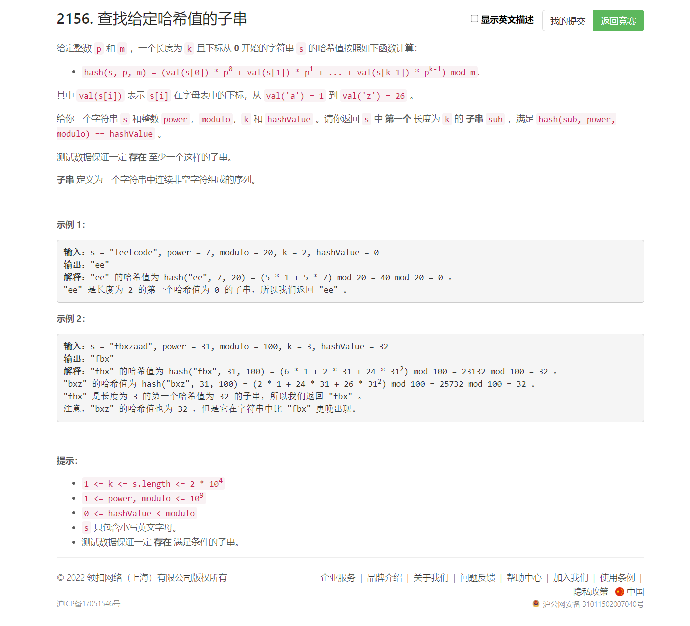
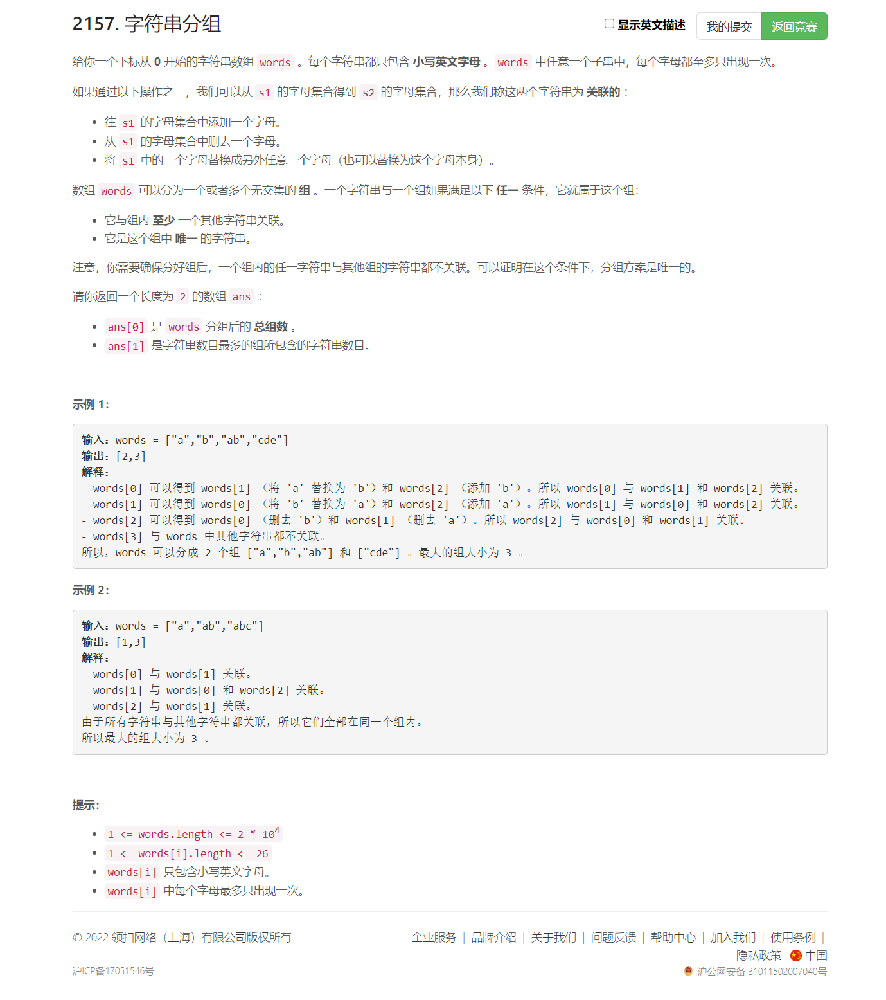

<!-- @import "[TOC]" {cmd="toc" depthFrom=1 depthTo=6 orderedList=false} -->

<!-- code_chunk_output -->

- [2156. 查找给定哈希值的子串（滑窗/除法不能与取余联用）](#2156-查找给定哈希值的子串滑窗除法不能与取余联用)
- [2157. 字符串分组（状态压缩+很赞的哈希并查集+枚举搜索）](#2157-字符串分组状态压缩很赞的哈希并查集枚举搜索)

<!-- /code_chunk_output -->

过年，没参加。

### 2156. 查找给定哈希值的子串（滑窗/除法不能与取余联用）



错误的做法（从前往后遍历，导致需要用到除法）：

```cpp
class Solution {
public:
    string subStrHash(string s, int power, int modulo, int k, int hashValue) {
        int st = 0, ed = k - 1;
        long long hs = 0, p = 1;
        for (int i = 0; i <= ed; ++ i)
        {
            hs = (hs + (s[i] - 'a' + 1) * p) % modulo;
            if (i != ed) p = p * power % modulo;
        }
        while (hs != (long long) hashValue && ed < s.size())
        {
            hs = (hs - (s[st] - 'a' + 1) + modulo) % modulo;
            ++ st, ++ ed;
            hs = hs / power;  // 错误！取余运算不能与除法自由组合
            hs = (hs + (s[ed] - 'a' + 1) * p) % modulo;
        }
        return s.substr(st, ed - st + 1);
    }
};
```

正确的做法（转换出发为乘法，从后往前遍历）：

```cpp
class Solution {
public:
    string subStrHash(string s, int power, int modulo, int k, int hashValue) {
        int n = s.size();
        int st = n - k, ed = n - 1;
        long long hs = 0, p = 1;
        for (int i = st; i <= ed; ++ i)
        {
            hs = (hs + (s[i] - 'a' + 1) * p) % modulo;
            if (i != ed) p = p * power % modulo;
        }
        string res = s.substr(st, k);
        while (st > 0)
        {
            hs = (hs - (s[ed] - 'a' + 1) * p % modulo + modulo) % modulo;  // 防止负数取余错误，先加上 mod
            -- st, -- ed;
            hs = hs * power % modulo;
            hs = (hs + (s[st] - 'a' + 1)) % modulo;
            // cout << st << " ";
            // cout << hs << endl;
            if (hs == (long long) hashValue)
                res = s.substr(st, k);
        }
        return res;
    }
};
```

### 2157. 字符串分组（状态压缩+很赞的哈希并查集+枚举搜索）



```cpp
/**
 * 状态压缩表示字符串
 * 枚举每个字符串的变换，如果是另一个字符串，合并这两个字符串所属的组（利用并查集）
 */
class Solution {
    // 哈希实现并查集，size 记录规模
    unordered_map<int, int> p, size;
    int groups, maxSize = 0;

    int find(int x)
    {
        if (p[x] != x) p[x] = find(p[x]);
        return p[x];
    }

    void merge(int x, int y)
    {
        if (!p.count(y)) return ;  // y 不是 words 中的字符串
        x = find(x);
        y = find(y);
        if (x == y) return ;  // x 与 y 早已是一组
        // 开始合并
        p[x] = y;
        size[y] += size[x];
        maxSize = max(maxSize, size[y]);  // 维护答案
        -- groups;
    }

public:
    vector<int> groupStrings(vector<string>& words) {
        groups = words.size();
        for (auto&& word: words)  // 压缩为二进制，保存为并查集
        {
            int x = 0;
            for (char& ch: word)
                x |= 1 << (ch - 'a');
            p[x] = x;
            ++ size[x];
            maxSize = max(maxSize, size[x]);
            if (size[x] > 1) -- groups;
        }

        // 枚举每个字符串的变换
        for (auto&& [x, _]: p)
            for (int i = 0; i < 26; ++ i)
            {
                // 添加或者删除字符 i
                merge(x, x ^ (1 << i));
                if ((x >> i) & 1)  // 如果 i 存在于 x 中，尝试将 i 替换为 j
                    for (int j = 0; j < 26; ++ j)
                        if (((x >> j) & 1) == 0)  // 注意这里的位运算优先级，要用括号括起来
                            merge(x, x ^ (1 << i) | (1 << j));
            }

        return {groups, maxSize};
    }
};
```
