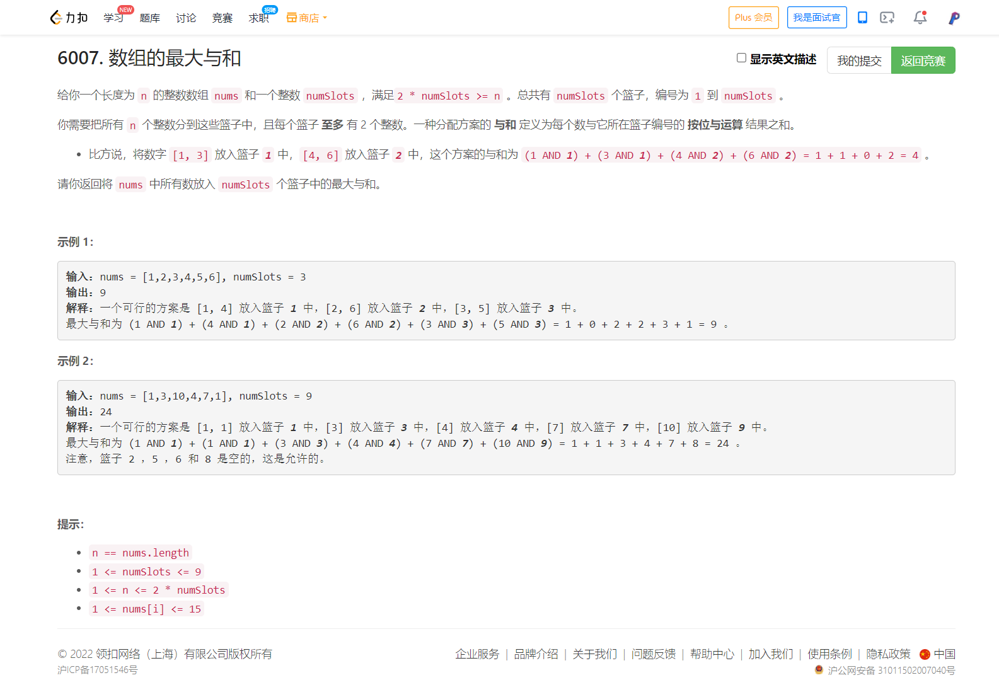

<!-- @import "[TOC]" {cmd="toc" depthFrom=1 depthTo=6 orderedList=false} -->

<!-- code_chunk_output -->

- [6007. 数组的最大与和（二分图带权匹配/状态压缩DP）](#6007-数组的最大与和二分图带权匹配状态压缩dp)

<!-- /code_chunk_output -->

T2 笔误，慢了不少； T3 没注意到力扣全局变量 memset 以及忘了在乘法前转为 long long ，都不是大问题。

最后一道题想到了用最大流，但实际上不是个最大流问题。

找个“带权二分图匹配”的板子就好了。

灵佬是用动态规划做的，太牛了，赶快学习一下。

### 6007. 数组的最大与和（二分图带权匹配/状态压缩DP）



```cpp
// 动态规划
// 状态用状态压缩表示，即第 i 个容器里有没有元素
// 枚举顺序为囊库前 i 个元素
class Solution {
public:
    int maximumANDSum(vector<int>& nums, int numSlots) {
        int n = nums.size();
        vector<int> f(1 << (numSlots * 2));
        // 位0和1 对应篮子1；位2和3对应篮子2
        int res = 0;
        for (int i = 0; i < (1 << numSlots * 2); ++ i)
        {
            int c = __builtin_popcount(i);
            if (c >= nums.size()) continue;
            for (int j = 0; j < 2 * numSlots; ++ j)  // 枚举填哪一位
                if ((i & (1 << j)) == 0)
                {
                    int s = i | (1 << j);
                    f[s] = max(f[s], f[i] + ((j / 2 + 1) & nums[c]));
                    res = max(res, f[s]);
                }
        }
        return res;
    }
};
```
