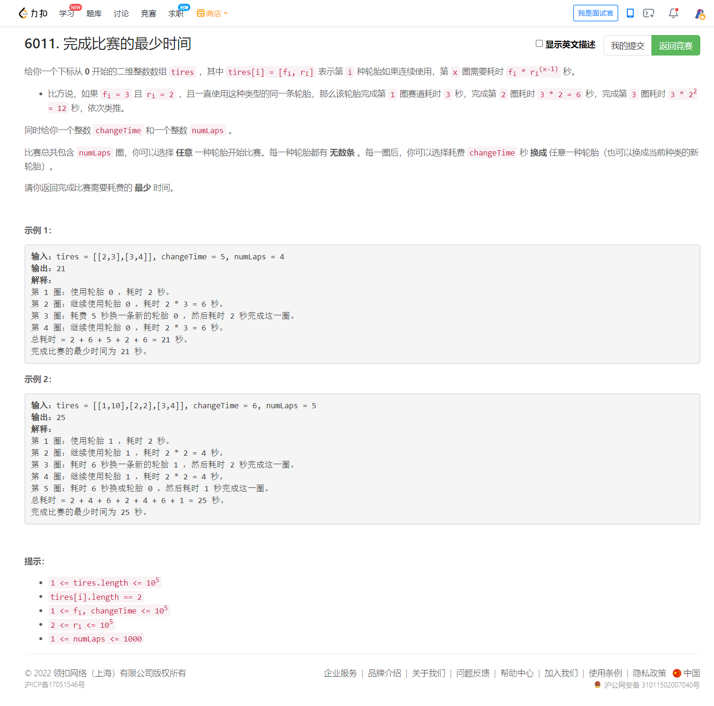

<!-- @import "[TOC]" {cmd="toc" depthFrom=1 depthTo=6 orderedList=false} -->

<!-- code_chunk_output -->

- [6011. 完成比赛的最少时间（预处理+线性DP）](#6011-完成比赛的最少时间预处理线性dp)

<!-- /code_chunk_output -->

T3 没考虑到二分的 check 可能会爆 long long 。 check 改得更谨慎一些，就过了。

T4 贪心肯定不对。想到了 DP ，但是又不知如何建模。

T4 我又理解错题意了！每一条轮胎有无数条！

### 6011. 完成比赛的最少时间（预处理+线性DP）



连续使用同一个轮胎 $i$ 跑 $x$ 圈，第 $x$ 圈的耗时不应超过 $\textit{changeTime} + f_i$ ，否则直接更换轮胎会更优。连续使用同一个轮胎的次数不会很大。

上界分析：连续使用同一个轮胎 $i$ 跑 $x$ 圈，第 $x$ 圈的耗时不应超过 $\textit{changeTime} + f_i$ ，即

$$f_i\cdot r_i^{x-1} \le \textit{changeTime} + f_i$$

考虑 $x$ 至多能是多少。取 $f_i=1,r_i=2$，则有 $2^{x-1}\le \textit{changeTime} + 1$

解得

$$x\le \log_2(\textit{changeTime}+1)+1$$

由于 $x$ 是个整数，因此 $x$ 的上界为 $\lfloor \log_2(\textit{changeTime}+1)+1 \rfloor$ 。

代码实现时可取 $x=17$。

```cpp
class Solution {
public:
    int minimumFinishTime(vector<vector<int>> &tires, int changeTime, int numLaps) {
        vector<int> minSec(18, INT_MAX / 2); // 除二是防止下面计算状态转移时溢出
        // 预处理每个轮胎连续跑 x 所需的时间
        // 记录其中 x 圈所需的最小时间
        for (auto &tire : tires) {
            long time = tire[0];
            for (int x = 1, sum = 0; time <= changeTime + tire[0]; ++x) {
                sum += time;
                minSec[x] = min(minSec[x], sum);
                time *= tire[1];
            }
        }

        // f[i] 为跑 i 圈所需要的最短时间
        // 转移为 f[i] = min(f[i - j], minSec[j])
        // minSec[j] 为跑 j 圈所需要的最短时间
        vector<int> f(numLaps + 1, INT_MAX);
        f[0] = -changeTime;
        for (int i = 1; i <= numLaps; ++i) {
            for (int j = 1; j <= min(17, i); ++j)
                f[i] = min(f[i], f[i - j] + minSec[j]);
            f[i] += changeTime;
        }
        return f[numLaps];
    }
};
```
