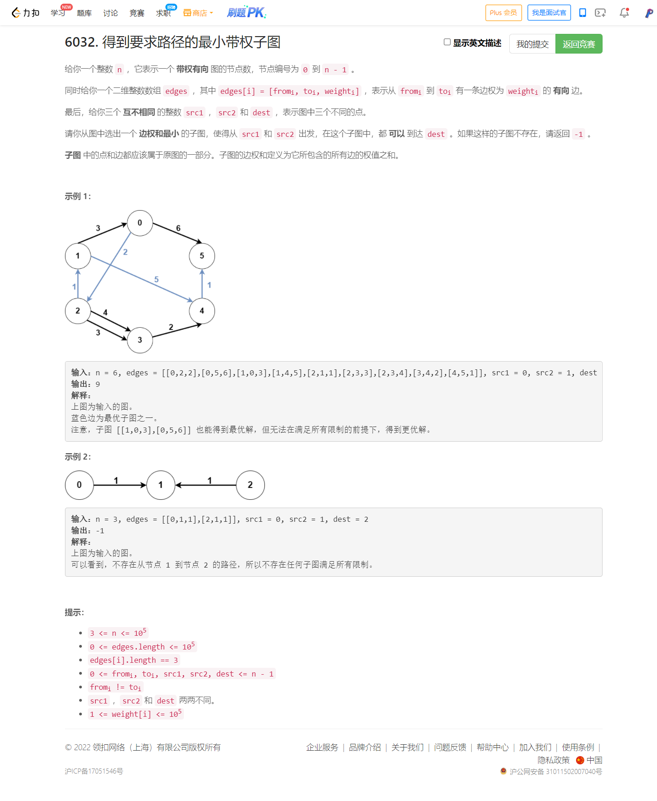

<!-- @import "[TOC]" {cmd="toc" depthFrom=1 depthTo=6 orderedList=false} -->

<!-- code_chunk_output -->

- [6032. 得到要求路径的最小带权子图（三次dijsktra）](#6032-得到要求路径的最小带权子图三次dijsktra)

<!-- /code_chunk_output -->


前三题挺考验严谨性的，我没有 WA 。 T4 很简单，但是临场思路乱了。实际就是最终要枚举汇点。还有，周赛里能用 vector 就用 vector ，非要用数组处理临界边，容易导致乱掉（因为这里既要记录正向，又要记录逆向）。

### 6032. 得到要求路径的最小带权子图（三次dijsktra）



```cpp
// 一次逆向，两次正向
// 遍历每个点为汇点时 ans

typedef pair<int, int> PII;

const int N = 1e5 + 10;
long ddist[N], scr1dist[N], scr2dist[N];
int st[N];

class Solution {
public:
    long long minimumWeight(int n, vector<vector<int>>& edges, int src1, int src2, int dest) {
        // 逆向遍历 dest 到各个点的距离
        memset(ddist, -1, sizeof ddist);
        // 正向遍历 src 到各个点的距离
        memset(scr1dist, -1, sizeof scr1dist);
        memset(scr2dist, -1, sizeof scr2dist);

        // 逆向邻接
        unordered_map<int, vector<PII>> eds1;
        // 正向邻接
        unordered_map<int, vector<PII>> eds0;

        for (auto&& ed: edges)
        {
            eds1[ed[1]].push_back({ed[0], ed[2]});
            eds0[ed[0]].push_back({ed[1], ed[2]});
        }

        // dijkstra
        auto dijkstra = [&](int sta, long dist[], unordered_map<int, vector<PII>> eds) -> void
        {
            memset(st, 0, sizeof st);
            dist[sta] = 0;
            priority_queue<PII, vector<PII>, greater<PII>> heap;
            heap.push({0, sta});
            while (heap.size())
            {
                auto t = heap.top();
                heap.pop();

                int ver = t.second, distance = t.first;

                if (st[ver]) continue;
                st[ver] = true;

                for (auto&& ed: eds[ver])
                {
                    int j = ed.first;
                    long w = ed.second;
                    if (dist[j] == -1 || dist[j] > dist[ver] + w)
                    {
                        dist[j] = dist[ver] + w;
                        heap.push({dist[j], j});
                    }
                }
            }
        };

        dijkstra(dest, ddist, eds1);
        dijkstra(src1, scr1dist, eds0);
        dijkstra(src2, scr2dist, eds0);

        long ans = -1;
        for (int i = 0; i < n; ++ i)
        {
            if (ddist[i] == -1 || scr1dist[i] == -1 || scr2dist[i] == -1) continue;
            if (ans == -1) ans = ddist[i] + scr1dist[i] + scr2dist[i];
            else ans = min(ans, ddist[i] + scr1dist[i] + scr2dist[i]);
        }
        return ans;
    }
};
```
