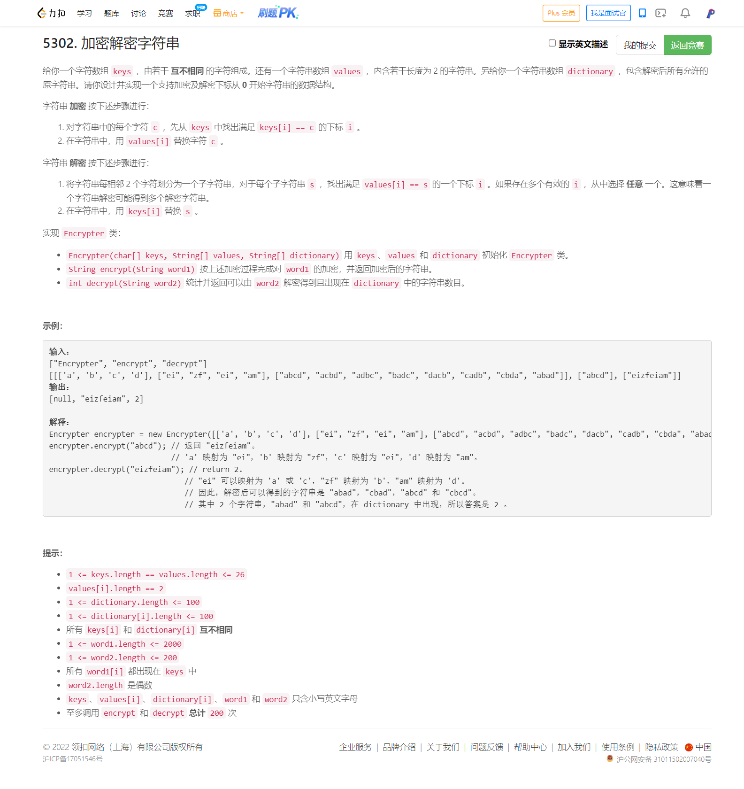

<!-- @import "[TOC]" {cmd="toc" depthFrom=1 depthTo=6 orderedList=false} -->

<!-- code_chunk_output -->

- [5302. 加密解密字符串（trie树/逆向思维题）](#5302-加密解密字符串trie树逆向思维题)

<!-- /code_chunk_output -->


T4 挺简单，自己开始时没用 trie 树，这代表着大使用大量的字符串 dfs ，此外不能剪枝，最后超时。

用 trie 树做出来了。后来发现自己完全想复杂了，看了大佬的做法。此外，大佬的做法有个样例过不了， rejudge 时候可能被 hack 掉，我做了一点修改。

### 5302. 加密解密字符串（trie树/逆向思维题）



我的代码如下。

```cpp
class Encrypter {
    unordered_map<char, int> keys;
    vector<string> values;
    unordered_map<string, vector<char>> values2keys;
    int son[100 * 100][26];
    int cnt[100 * 100];
    int idx;

    void dfs(const string& word, int l, int& ans, int i)
    {
        if (l * 2 == word.size() && cnt[i] != 0)
        {
            ++ ans;
            return ;
        }

        string wo = word.substr(l * 2, 2);
        for (auto&& k: values2keys[wo])
        {
            int j = i;
            if (!son[j][k - 'a']) continue;
            j = son[j][k - 'a'];
            dfs(word, l + 1, ans, j);
        }
        return ;
    }

    void insert(string s) {
        int p = 0;
        for (int i = 0; i < s.size(); ++ i)
        {
            int u = s[i] - 'a';
            if (!son[p][u]) son[p][u] = ++ idx;
            p = son[p][u];
        }
        ++ cnt[p];
    }
    
public:
    Encrypter(vector<char>& keys, vector<string>& values, vector<string>& dictionary): values(values),
        idx(0) {
        for (int i = 0; i < keys.size(); ++ i)
        {
            this->keys[keys[i]] = i;
            this->values2keys[values[i]].push_back(keys[i]);
        }
        memset(son, 0, sizeof son);
        memset(cnt, 0, sizeof cnt);
        for (auto&& d: dictionary)
        {
            insert(d);
        }
    }

    string encrypt(string word1) {
        string res;
        for (auto&& w: word1)
            res += values[keys[w]];
        return res;
    }

    int decrypt(string word2) {
        int ans = 0;
        dfs(word2, 0, ans, 0);
        return ans;
    }
};

/**
 * Your Encrypter object will be instantiated and called as such:
 * Encrypter* obj = new Encrypter(keys, values, dictionary);
 * string param_1 = obj->encrypt(word1);
 * int param_2 = obj->decrypt(word2);
 */
```

大佬的代码如下：

```cpp
class Encrypter {
    std::map<char, std::string> en;
    std::map<std::string, int> cnt;
public:
    Encrypter(vector<char>& keys, vector<string>& values, vector<string>& dictionary) {
        for (int i = 0; i < int(keys.size()); i++) {
            en[keys[i]] = values[i];
        }
        for (auto s : dictionary) {
            cnt[encrypt(s)]++;
        }
    }
    
    string encrypt(string word1) {
        std::string s;
        for (auto c : word1) {
            /**
             * 这里应该加一个判断，否则构造函数里 cnt[encrypt(s)]++; 不对
             * hack 样例
             ["Encrypter","decrypt"]
             [[["a"],["pq"],["a","ax"]],["pq"]]
             */
            if (!en.count(c)) return "";
            s += en[c];
        }
        return s;
    }
    
    int decrypt(string word2) {
        return cnt[word2];
    }
};

/**
 * Your Encrypter object will be instantiated and called as such:
 * Encrypter* obj = new Encrypter(keys, values, dictionary);
 * string param_1 = obj->encrypt(word1);
 * int param_2 = obj->decrypt(word2);
 */
```
