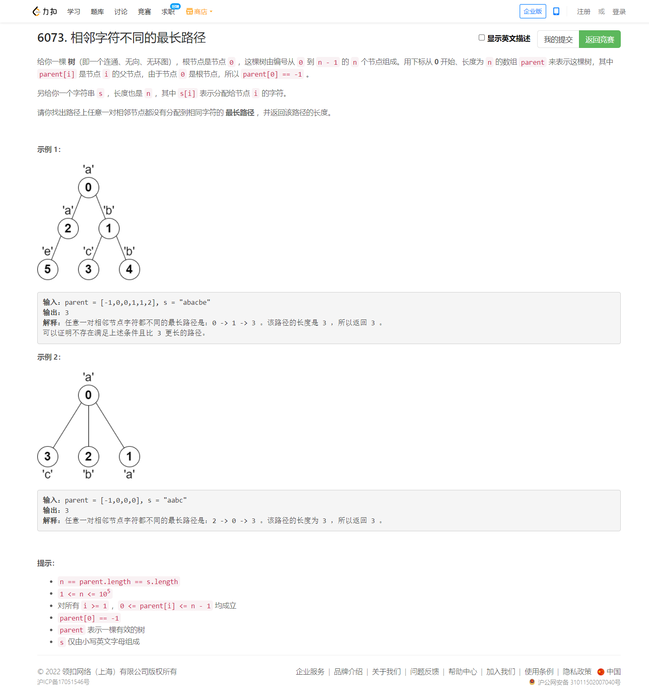

<!-- @import "[TOC]" {cmd="toc" depthFrom=1 depthTo=6 orderedList=false} -->

<!-- code_chunk_output -->

- [6073. 相邻字符不同的最长路径（有点妙处的dfs）](#6073-相邻字符不同的最长路径有点妙处的dfs)

<!-- /code_chunk_output -->


T3 自己想的不完整，花了很长时间调试。 T4 是什么玩意！又把题读错了。看到大佬的代码很妙，这里记录一下。

### 6073. 相邻字符不同的最长路径（有点妙处的dfs）



参考[wwwwodddd](https://leetcode-cn.com/u/wwwwodddd/)。

```cpp
class Solution {
public:
    vector<vector<int> > g;
    string s;
    int ans = 0;
    int dfs(int u)
    {
        vector<int> b;
        b.push_back(0);  // 这里 push 两个 0 省去了很多讨论
        b.push_back(0);
        for (int i: g[u])
        {
            int d = dfs(i);
            if (s[i] != s[u])
                b.push_back(d);
        }
        sort(b.begin(), b.end(), [&](const int& x, const int& y) { return x > y; } );
        ans = max(ans, 1 + b[0] + b[1]);
        return b[0] + 1;
    }
    int longestPath(vector<int>& p, string s) {
        this->s = s;
        int n = s.size();
        g.resize(n);
        for (int i = 1; i < n; i++)
            g[p[i]].push_back(i);
        ans = 0;
        dfs(0);
        return ans;
    }
};
```
