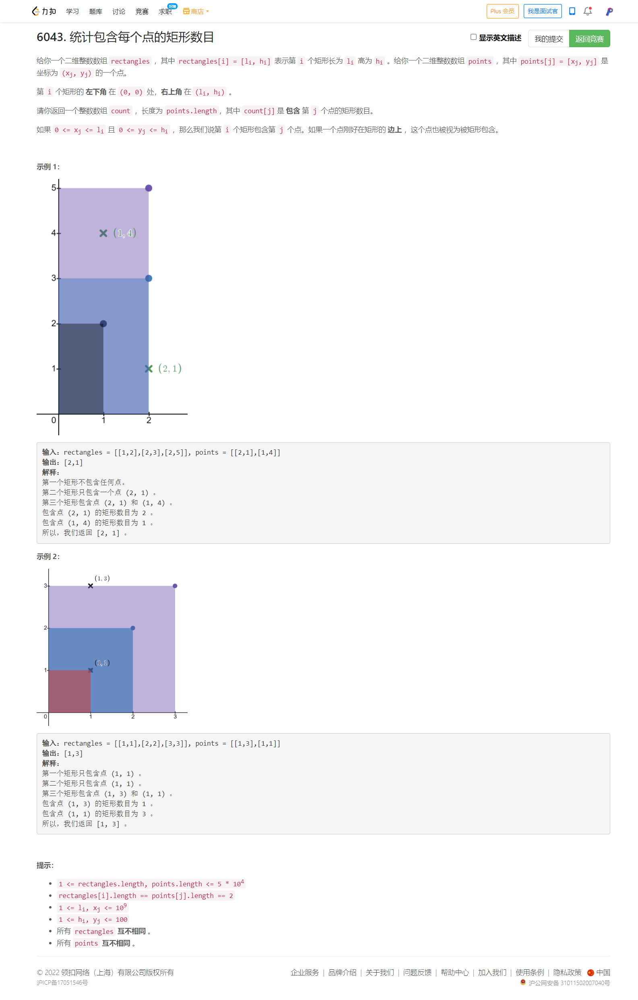
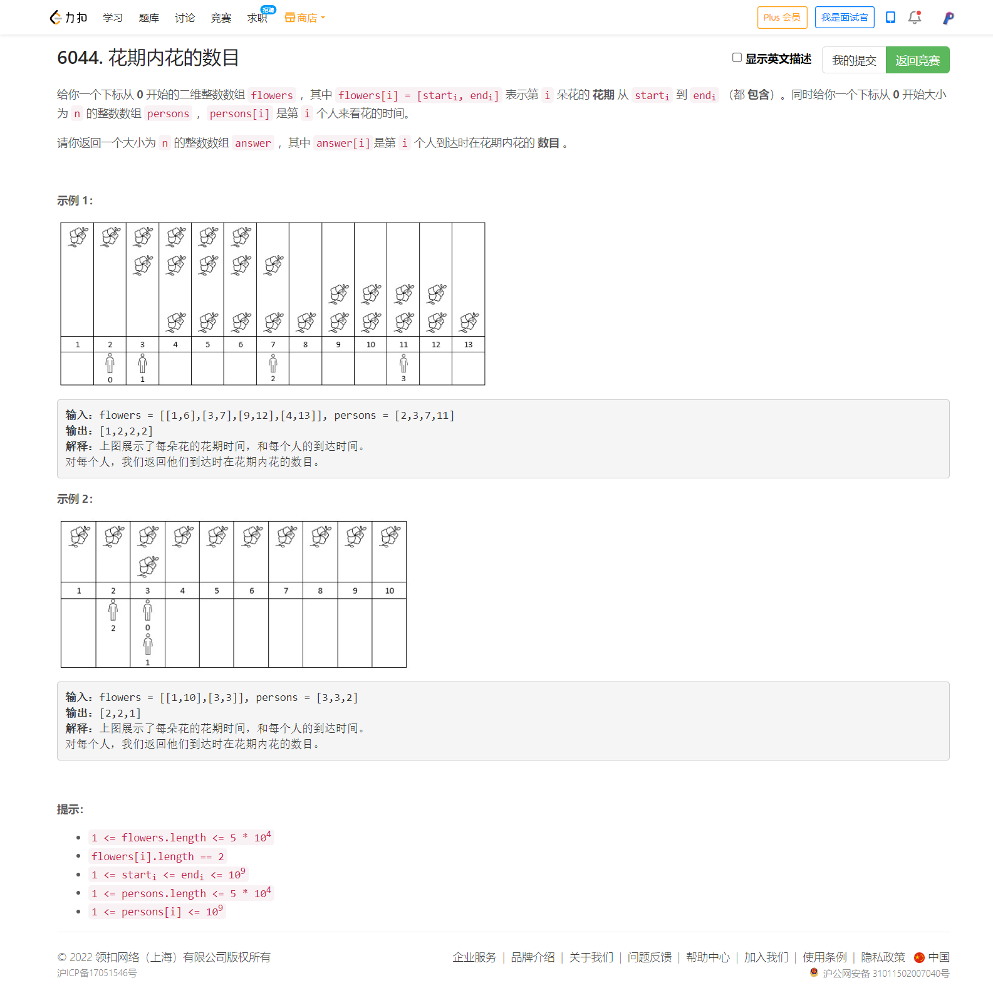

<!-- @import "[TOC]" {cmd="toc" depthFrom=1 depthTo=6 orderedList=false} -->

<!-- code_chunk_output -->

- [6043. 统计包含每个点的矩形数目（二维偏序问题：离散化+反向差分/倒着排序+排序/名次树SortedList/树状数组）](#6043-统计包含每个点的矩形数目二维偏序问题离散化反向差分倒着排序排序名次树sortedlist树状数组)
- [6044. 花期内花的数目（map做差分，并且边求答案边积分）](#6044-花期内花的数目map做差分并且边求答案边积分)

<!-- /code_chunk_output -->

T3 写得很慢，没有热血了。按理说应该很快拼出来的，然后 T4 应该也很简单。

T4 即便做出来也掉分，今天前两题做得很快， T3 压哨做出来后排名也没有怎么提升。说明我在两题选手中速度已经是第一梯队了；另外 T3 T4 真的太简单了...今天 T3 算是自己先失去斗志了，拿到 offer 没有气魄了，不该不该，战斗远未结束。

### 6043. 统计包含每个点的矩形数目（二维偏序问题：离散化+反向差分/倒着排序+排序/名次树SortedList/树状数组）



我本来想用树状数组做的，奈何没搞定。于是用离散化+反向差分做的。

```cpp
class Solution {
public:
    vector<int> countRectangles(vector<vector<int>>& rectangles, vector<vector<int>>& points) {
        int n = rectangles.size();
        int m = points.size();

        int i2x[n + m + 1], i2y[n + m + 1];
        memset(i2x, 0, sizeof i2x);
        memset(i2y, 0, sizeof i2y);
        
        for (int i = 0; i < n; ++ i)
        {
            i2x[i] = rectangles[i][0];
            i2y[i] = rectangles[i][1];
        }
        for (int i = 0; i < m; ++ i)
        {
            i2x[i + n] = points[i][0];
            i2y[i + n] = points[i][1];
        }
        
        // 把 0 带上
        sort(i2x, i2x + n + m + 1);
        sort(i2y, i2y + n + m + 1);
        int nx = unique(i2x, i2x + n + m + 1) - i2x;
        int ny = unique(i2y, i2y + n + m + 1) - i2y;

        unordered_map<int, int> x2i, y2i;
        for (int i = 0; i < nx; ++ i) x2i[i2x[i]] = i;
        for (int i = 0; i < ny; ++ i) y2i[i2y[i]] = i;
        
        int dif[nx + 2][ny + 2];
        memset(dif, 0, sizeof dif);
        for (auto&& rec: rectangles)
        {
            int x = x2i[rec[0]], y = y2i[rec[1]];
            ++ dif[x][y];
        }

        for (int i = nx; i >= 0; -- i)
            for (int j = ny; j >= 0; -- j)
                dif[i][j] += dif[i + 1][j] + dif[i][j + 1] - dif[i + 1][j + 1];
        
        vector<int> res;
        for (auto&& p: points)
        {
            int x = x2i[p[0]], y = y2i[p[1]];
            res.push_back(dif[x][y]);
        }
        return res;
    }
};
```

这里我的代码不好，应该对 point 中纵轴超过了 100 的点都做统一，否则差分求和时容易 TLE 。

[灵佬](https://leetcode-cn.com/problems/count-number-of-rectangles-containing-each-point/solution/pai-xu-pai-xu-pai-xu-pythonjavacgo-by-en-ou4k/)介绍了三种方法：按照纵坐标排序、按照横坐标排序、名次树（这个可以忽略高度100的限制，更强大）。

```cpp
class Solution {
public:
    vector<int> countRectangles(vector<vector<int>> &rectangles, vector<vector<int>> &points) {
        sort(rectangles.begin(), rectangles.end(), [](auto &a, auto &b) { return a[1] > b[1]; });

        int n = points.size();
        vector<int> ids(n);
        iota(ids.begin(), ids.end(), 0);
        sort(ids.begin(), ids.end(), [&](int i, int j) { return points[i][1] > points[j][1]; });

        vector<int> ans(n), xs;
        int i = 0;
        for (int id : ids) {
            int start = i;
            while (i < rectangles.size() && rectangles[i][1] >= points[id][1])
                xs.push_back(rectangles[i++][0]);
            if (start < i) sort(xs.begin(), xs.end()); // 只有在 xs 插入了新元素时才排序
            ans[id] = i - (lower_bound(xs.begin(), xs.end(), points[id][0]) - xs.begin());
        }
        return ans;
    }
};
```

横坐标排序：

```cpp
class Solution {
public:
    vector<int> countRectangles(vector<vector<int>> &rectangles, vector<vector<int>> &points) {
        sort(rectangles.begin(), rectangles.end(), [](auto &a, auto &b) { return a[0] > b[0]; });

        int n = points.size();
        vector<int> ids(n);
        iota(ids.begin(), ids.end(), 0);
        sort(ids.begin(), ids.end(), [&](int i, int j) { return points[i][0] > points[j][0]; });

        vector<int> ans(n), cnt(101);
        int i = 0;
        for (int id : ids) {
            while (i < rectangles.size() && rectangles[i][0] >= points[id][0])
                ++cnt[rectangles[i++][1]];
            // 下面求和可以用树状数组优化
            ans[id] = accumulate(cnt.begin() + points[id][1], cnt.end(), 0);
        }
        return ans;
    }
};
```

此外，还有与值域无关的名次树做法。

```python
from sortedcontainers import SortedList

class Solution:
    def countRectangles(self, rectangles: List[List[int]], points: List[List[int]]) -> List[int]:
        rectangles.sort(key=lambda r: -r[1])
        n = len(points)
        ans = [0] * n
        i, xs = 0, SortedList()
        for (x, y), id in sorted(zip(points, range(n)), key=lambda x: -x[0][1]):
            while i < len(rectangles) and rectangles[i][1] >= y:
                xs.add(rectangles[i][0])
                i += 1
            ans[id] = i - xs.bisect_left(x)
        return ans
```

这道题属于二维偏序问题：https://zhuanlan.zhihu.com/p/112504092

### 6044. 花期内花的数目（map做差分，并且边求答案边积分）



不得不承认[灵佬的优化思路](https://leetcode-cn.com/problems/number-of-flowers-in-full-bloom/solution/chai-fen-pythonjavacgo-by-endlesscheng-wz35/)炉火纯青啊。

```cpp
class Solution {
public:
    vector<int> fullBloomFlowers(vector<vector<int>> &flowers, vector<int> &persons) {
        map<int, int> diff;
        for (auto &f : flowers) {
            ++diff[f[0]];
            --diff[f[1] + 1];
        }

        int n = persons.size();
        vector<int> id(n);
        iota(id.begin(), id.end(), 0);
        sort(id.begin(), id.end(), [&](int i, int j) { return persons[i] < persons[j]; });

        vector<int> ans(n);
        auto it = diff.begin();
        int sum = 0;
        for (int i : id) {
            while (it != diff.end() && it->first <= persons[i])
                sum += it++->second; // 累加变化量
            ans[i] = sum;
        }
        return ans;
    }
};
```
